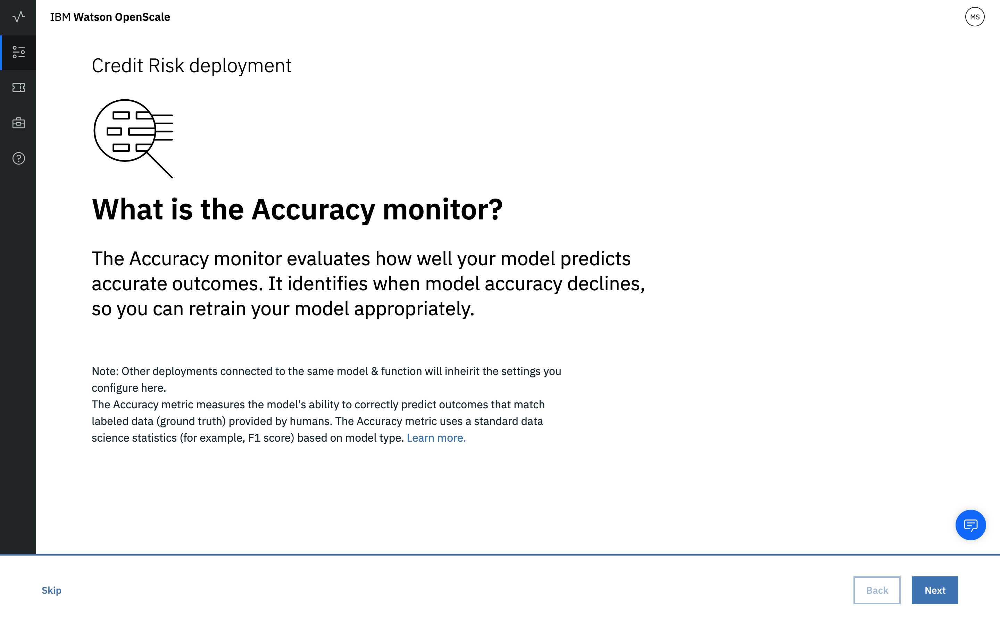

---

copyright:
  years: 2018, 2019
lastupdated: "2019-03-28"

keywords: accuracy, 

subcollection: ai-openscale

---

{:shortdesc: .shortdesc}
{:new_window: target="_blank"}
{:tip: .tip}
{:important: .important}
{:note: .note}
{:pre: .pre}
{:codeblock: .codeblock}
{:screen: .screen}

# 正確度
{: #acc-monitor}

正確度は、モデルがどの程度正確な結果を予測するかを示す指標です。
{: shortdesc}

## 正確度について
{: #acc-understand}

正確度は、アルゴリズムのタイプに応じてその意味が異なります。

- *マルチクラス分類*: 正確度は、クラスが全体として正確に予測された回数を測定してから、その値をデータ・ポイント数で正規化することによって求められます。詳しくは、Apache Spark 資料の [Multi-class classification ](https://spark.apache.org/docs/2.1.0/mllib-evaluation-metrics.html#multiclass-classification){: new_window} を参照してください。

- *2 項分類*: 2 項分類アルゴリズムでは、正確度は ROC 曲線の下側の面積として測定されます。詳しくは、Apache Spark 資料の [Binary classification ](https://spark.apache.org/docs/2.1.0/mllib-evaluation-metrics.html#binary-classification){: new_window} を参照してください。

- *回帰*: 回帰アルゴリズムは、決定係数 (R2) を使用して測定されます。詳しくは、Apache Spark 資料の [Regression model evaluation ](https://spark.apache.org/docs/2.1.0/mllib-evaluation-metrics.html#regression-model-evaluation){: new_window} を参照してください。

### 処理の流れ
{: #acc-works}

手動ラベル付けフィードバック・データを、{{site.data.keyword.aios_short}} UI (以下の説明を参照)、[Python クライアント ](http://ai-openscale-python-client.mybluemix.net/#feedbacklogging){: new_window}、または [Rest API ](https://cloud.ibm.com/apidocs/ai-openscale#post-feedback-payload){: new_window} を使用して追加する必要があります。

正確度モニタリングの制約事項については、[サポートされるモデル・タイプ](/docs/services/ai-openscale?topic=ai-openscale-in-ov#in-mod)と[サポートされるフレームワーク](/docs/services/ai-openscale?topic=ai-openscale-in-ov#in-fram)を参照してください。

<!---
You need to add manually-labelled data into your feedback table for the accuracy computation to trigger. The feedback table is in the posgres schema with the name <model_id>_feedback.

You can create a performance monitoring system for your predictive models by creating an evaluation instance, and then defining the metrics and triggers for the automatic retraining and deploying of the new model. Spark, Keras and TensorFlow models are supported at this stage, with the following requirements:

- A training definition must be stored in the repository
- `training_data_reference` - must be defined as a part of the stored model's metadata
- `training_definition_url` - must be defined as a part of the stored model's metadata

Use the available [REST API ](https://watson-ml-api.mybluemix.net/){: new_window} end-points directly to provide feedback data and kick off evaluation activities. For more information, see the [WML documentation ](https://dataplatform.cloud.ibm.com/docs/content/analyze-data/ml-continuous-learning.html?audience=wdp&context=wdp){: new_window}.
--->

## 正確度モニターの構成
{: #acc-config}

1.  *「正確度モニターの説明」*ページで**「次へ」**をクリックして、構成プロセスを開始します。

    

1.  *「正確度アラートしきい値の設定」*ページで、受け入れ可能な正確度レベルを表す値を選択します。

    正確度とは、それぞれの特定のモデル・タイプに関連付けられている関連データ・サイエンス・メトリックから合成された値です。スコアは正規化されているので、この指標を使用してさまざまなモデル・タイプの正確度を容易に比較できます。標準的なモデルでは、正確度スコア 80 で十分です。
    {: note}

    

    **「次へ」**をクリックして先に進みます。

1.  次に、最大と最小のサンプル・サイズを設定します。最小サイズを設定することにより、評価データ・セットで最小限の数のレコードを得られなければ、正確度の測定が行われなくなります。これにより、サンプル・サイズが小さすぎて結果にゆがみが生じることがなくなります。最大サンプル・サイズを設定することにより、データ・セットの評価にかかる時間と労力の管理が楽になります。このサイズを超えた場合は最新のレコードだけが評価されます。

     

1.  **「次へ」**ボタンをクリックします。

    選択内容の要約が確認のために表示されます。変更が必要な場合は、該当するセクションの**「編集」**リンクをクリックします。

1.  **「保存」**をクリックして構成を完了します。

正確度を評価するため、フィードバック・データをモデルに直接入力するオプションが表示されます。

  

*「フィードバック・データの追加」*ボタンを選択し、CSV 形式のデータ・ファイルをアップロードします。データに合わせて区切り文字を設定してください。

フィードバック CSV ファイルには、すべてのフィーチャー値と、手動で割り当てられたターゲット/ラベル値が含まれている必要があります。例えば、フィーチャー値 `AGE`、`SEX`、`BP`、`CHOLESTEROL`、`NA`、`K`、およびターゲット/ラベル値 `DRUG` が含まれるドラッグ・モデルのトレーニング・データがあるとします。フィードバック CSV ファイルには、これらのフィールドの値 (例えば、`[43, M, HIGH, NORMAL, 0.6345, 1.4587, DrugX]`) が含まれている必要があります。フィードバック CSV ファイルのヘッダーが指定されている場合、フィールド名はこのヘッダーを使用してマップされます。指定されていない場合は、フィールドの順序はトレーニング・スキーマと厳密に同一である**必要があります**。
{: important}

モデルから返される予測タイプと、フィードバック・データのラベル/ターゲット列が一致している必要があることに注意してください。
{: note}

  

現在、ファイルのサイズは 8MB に制限されています。
{: note}

別の方法として、提供されているコード・スニペット `cURL` または `Python` を使用してフィードバック・データを公開することもできます。

提供されている値は単なる例であるため、コード・スニペット内のフィールドと値を、実際の値に置換する必要があります。
{: important}

**「終了」**を選択してこのオプションのステップをスキップすることもできます。スキップしても、後で評価するために CSV ファイルをアップロードできます。

### 次のステップ
{: #acc-next}

*「モニターの構成」*ページで、別のモニタリング・カテゴリーを選択できます。
