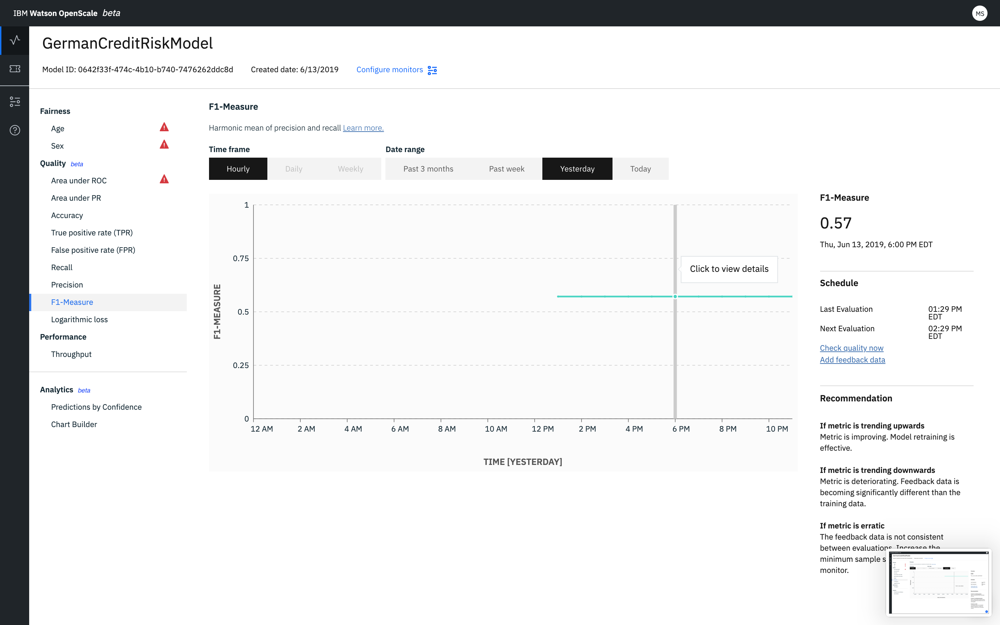

---

copyright:
  years: 2018, 2019
lastupdated: "2019-06-11"

keywords: metrics, monitoring, custom metrics, thresholds, Weighted F1-Measure

subcollection: ai-openscale

---

{:shortdesc: .shortdesc}
{:external: target="_blank" .external}
{:tip: .tip}
{:important: .important}
{:note: .note}
{:pre: .pre}
{:codeblock: .codeblock}
{:download: .download}
{:screen: .screen}
{:javascript: .ph data-hd-programlang='javascript'}
{:java: .ph data-hd-programlang='java'}
{:python: .ph data-hd-programlang='python'}
{:swift: .ph data-hd-programlang='swift'}
{:faq: data-hd-content-type='faq'}

# 加重 F1 値 
{: #quality_wght_f1-measure}

加重 F1 値は、クラス確率に相当する値で重みづけした F1 値の平均です。
{: shortdesc}

## 一目でわかる加重 F1 値
{: #quality_wght_f1-measure-glance}

- **説明**: 加重 F1 値の加重平均は、クラス確率と同等です
- **デフォルトのしきい値**: 下限 = 80%
- **デフォルトの推奨**:
   - **上昇傾向**: 上昇傾向は、指標が向上していることを示します。 これは、モデルの再訓練の効果が出ていることを意味します。
   - **下降傾向**: 下降傾向は、指標が悪化していることを示します。 フィードバック・データと訓練データの差異が明らかに広がっています。
   - **不規則または不定期変化**: 不規則変化または不定期変化は、フィードバック・データが各評価で一貫性がないことを示します。 モデル性能モニタリングの最小サンプル・サイズを増やしてください。
- **問題タイプ**: 多項分類
- **グラフ値**: 時間フレーム内の最後の値
- **使用可能な指標の詳細**: 混同行列

## 表示内容についての解釈
{: #quality_wght_f1-measure-display}



## 計算
{: #quality_wght_f1-measure-math}

加重 F1 値は、重みづけデータを使用して算出されます。

```
          (適合率 * 再現率)
F1 = 2 *  ____________________

          (適合率 + 再現率)
```
