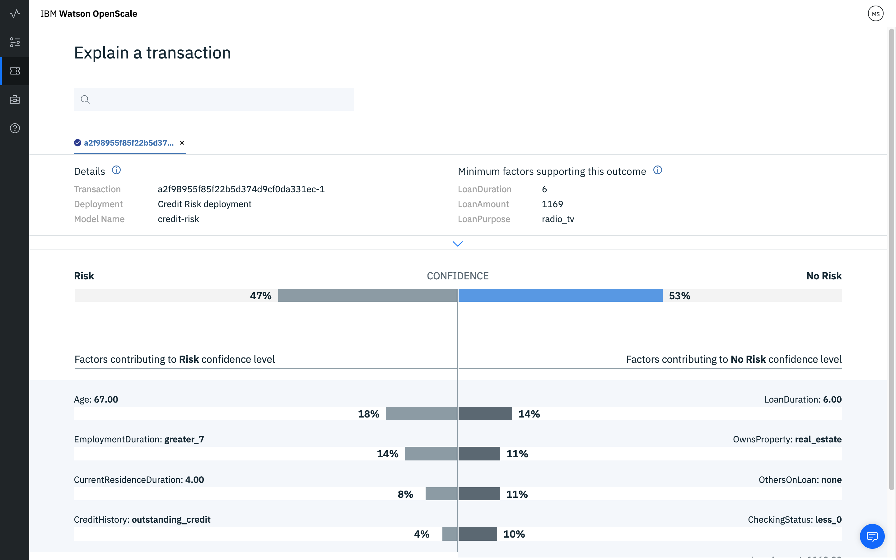

---

title: {{site.data.keyword.aios_short}} を使用した機械学習モデルの信頼性と透明性
description: Monitor your machine learning deployments for bias, accuracy, and explainability
duration: 120
intro: In this extended tutorial, you will provision IBM Cloud machine learning and data services, create and deploy machine learning models in Watson studio, and configure the new IBM {{site.data.keyword.aios_full}} product to monitor your models for trust and transparency.
takeaways:
- See how {{site.data.keyword.aios_short}} provides trust and transparency for AI models
- Understand how IBM Cloud services and Watson Studio technologies can provide a seamless, AI-driven customer experience

copyright:
  years: 2018, 2019
lastupdated: "2019-02-05"

---

{:shortdesc: .shortdesc}
{:new_window: target="_blank"}
{:tip: .tip}
{:important: .important}
{:note: .note}
{:pre: .pre}
{:codeblock: .codeblock}
{:screen: .screen}
{:javascript: .ph data-hd-programlang='javascript'}
{:java: .ph data-hd-programlang='java'}
{:python: .ph data-hd-programlang='python'}
{:swift: .ph data-hd-programlang='swift'}

# チュートリアル (上級)
{: #tadv-tutorial-advanced}

## シナリオ
{: #tadv-scenario}

レンタカー会社が顧客満足度に関するフィードバック・データを収集しました。 提示されるモデルはこのデータを使用して、顧客に対するフォローアップのための一連のアクション (次回利用時のためのバウチャーの配布など) を予測します。

このモデルでは、顧客データ・フィールドとして、ID (ID 番号)、GENDER、STATUS (single または married)、CHILDREN (数値)、AGE、CUSTOMER STATUS (active または inactive)、CAR OWNER (yes または no)、CUSTOMER SERVICE (顧客のコメント)、SATISFACTION (satisfied または unsatisfied)、および BUSINESS AREA (product または service related) を使用して、ACTION データ・フィールドに 4 つの値 (NA、voucher、free upgrade、on-demand pickup) のいずれかを予測します。

## 前提条件
{: #tadv-prereqs}

このチュートリアルを実行するには、以下のアカウントが必要です。

- [Watson Studio ](https://dataplatform.ibm.com/){: new_window} アカウント。
- [{{site.data.keyword.cloud_notm}} ](https://{DomainName}){: new_window} アカウント。

チュートリアルの実行中に、以下のライト (無料) {{site.data.keyword.cloud_notm}} サービスをプロビジョンします。

- Machine Learning
- Apache Spark
- Object Storage

また、以下の**有料** {{site.data.keyword.cloud_notm}} サービスもプロビジョンします。

- PostgreSQL

  クレジット・カードで有料アカウントに変更すると、$200 の {{site.data.keyword.cloud_notm}} クレジットを取得できます。 既に有料アカウントをお持ちの場合は、1 カ月のストレージの最初の 1 GB のコストである $16 が一回限りで返金されます。
  {: tip}

PostgreSQL データベースと {{site.data.keyword.pm_full}} インスタンスは、同じ {{site.data.keyword.cloud_notm}} アカウントにデプロイする必要があります。
{: important}

既に必要なサービスをプロビジョンしている場合、例えば他のチュートリアルを完了している場合は、以下の [Watson Studio プロジェクトのセットアップ](#tadv-setup-ws)に進みます。

## 概要
{: #tadv-intro}

このチュートリアルでは以下の作業を行います。

- {{site.data.keyword.cloud_notm}} の機械学習サービスとストレージ・サービスをプロビジョンします
- 機械学習モデルを作成、トレーニング、およびデプロイするために、Watson Studio プロジェクトをセットアップして Python ノートブックを実行します
- Python ノートブックを実行することによって、データマートを作成し、パフォーマンス・モニター、正解率モニター、および公平性モニターを構成し、モニター対象データを作成します
- {{site.data.keyword.aios_short}} の「インサイト」タブで結果を表示します

## {{site.data.keyword.cloud_notm}} サービスのプロビジョン
{: #tadv-svcs}

IBM ID で [{{site.data.keyword.cloud_notm}} アカウント ](https://{DomainName}){: new_window} にログインします。 サービスをプロビジョンするときに (特に Apache Spark、Object Storage、および Db2 Warehouse の場合)、選択した組織とスペースがすべてのサービスで同じであることを確認してください。

### Watson Studio アカウントの作成
{: #tadv-stac}

- [Watson Studio インスタンスを作成します ](https://{DomainName}/catalog/services/watson-studio){: new_window} (アカウントに関連付けられているものがまだない場合)。

  

- サービスに名前を付け、「Lite」(無料) プランを選択し、**「作成」**ボタンをクリックします。

### Machine Learning サービスのプロビジョン
{: #tadv-pml}

- [Watson Machine Learning インスタンスをプロビジョンします ](https://{DomainName}/catalog/services/machine-learning){: new_window} (アカウントに関連付けられているものがまだない場合)。

  

- サービスに名前を付け、「Lite」(無料) プランを選択し、**「作成」**ボタンをクリックします。

- Machine Learning サービスの資格情報をメモします。 機械学習インスタンスで、ページの左側にある**「Service credentials」**リンクをクリックします。 資格情報に名前を付け、**「Add」**をクリックします。 次に資格情報のリストで**「View credential」**をクリックし、資格情報を後で使用するためにコピーします。

### Spark サービスのプロビジョン
{: #tadv-ps}

- [Spark サービスをプロビジョンします ](https://{DomainName}/catalog/services/apache-spark){: new_window} (アカウントに関連付けられているものがまだない場合)。

  

- サービスに名前を割り当て、「Lite」(無料) プランを選択し、**「作成」**ボタンをクリックします。

- Spark インスタンスのサービス資格情報をメモします。 Spark インスタンスを開き、左側のメニューにある**「Service credentials」**をクリックします。 **「New credential」**ボタンをクリックし、資格情報に名前を付け、**「Add」**をクリックします。 次に、作成したセットの横にある**「View credentials」**リンクをクリックし、これらの資格情報を後で使用するためにコピーします。

### Object Storage サービスのプロビジョン
{: #tadv-pos}

- [Object Storage サービスをプロビジョンします ](https://{DomainName}/catalog/services/cloud-object-storage){: new_window} (アカウントに関連付けられているものがまだない場合)。

  

- サービスに名前を付け、「Lite」(無料) プランを選択し、**「作成」**ボタンをクリックします。

### 有料 PostgreSQL サービスのプロビジョン
{: #tadv-ppgs}

- [有料 PostgreSQL サービスをプロビジョンします ](https://{DomainName}/catalog/services/compose-for-postgresql){: new_window} (アカウントに関連付けられているものがまだない場合)。

  

- サービスに名前を付け、「Standard」プランを選択し、**「作成」**ボタンをクリックします。

  クレジット・カードで有料アカウントに変更すると、$200 の {{site.data.keyword.cloud_notm}} クレジットを取得できます。 既に有料アカウントをお持ちの場合は、1 カ月のストレージの最初の 1 GB のコストである $16 が一回限りで返金されます。
  {: tip}

- PostgreSQL インスタンスのサービス資格情報をメモします。 既存の (または新規作成された) PostgreSQL インスタンスを開き、左側のメニューにある**「Service credentials」**をクリックします。 **「New credential」**ボタンをクリックし、資格情報に名前を付け、**「Add」**をクリックします。 次に、作成したセットの横にある**「View credentials」**リンクをクリックし、これらの資格情報を後で使用するためにコピーします。

<!---

### Provision a Db2 Warehouse service
{: #tadv-pdb2}

- [Provision a Db2 Warehouse service ](https://{DomainName}/catalog/services/db2-warehouse){: new_window} if you do not already have one associated with your account:

  

- Give your service a name, choose the Entry plan, and click the **Create** button.

- Make note of the service credentials for your Db2 Warehouse instance. Open your existing (or newly-created) Db2 Warehouse instance and click on **Service credentials** in the left-hand menu. Click the **New credential** button, name your credentials, and click **Add**. Then, click the **View credentials** link next to the set you just created, and copy these credentials for later use.

### Upload training and feedback data to Db2 Warehouse
{: #tadv-uptf}

- Download the [car_rental_training_data.csv](https://github.com/watson-developer-cloud/doc-tutorial-downloads/blob/master/ai-openscale/car_rental_training_data.csv){: new_window} file.

- Open your existing (or newly-created) Db2 Warehouse from the [IBM Cloud console ](https://{DomainName}){: new_window}, click **Manage** from the left side panel, and then click the green **Open** button.

- If necessary, use your Db2 credentials `username` and `password` to log in to Db2 Warehouse.

- Once Db2 Warehouse has opened, click the **Menu** button and select **Load** from the dropdown:

  

- Browse to the training data file, or drag and drop it into the appropriate area on the form. Click **Next**. Select a Schema from the list of load targets; this is usually in a format like `DASH12345`. Then click **New Table** on the right:

  

- Name your table CAR\_RENTAL\_TRAINING, and click the **Create** button:

  

- Click **Next** to preview the data. On the preview screen, set the **Separator** field to a semicolon (;) and make sure the **Header in first row** option is checked:

  

  **NOTE**: By default, the **Detect data types** option is selected.

  

  When selected, for columns set with the `VARCHAR` data type, the maximum number of characters allowed for that column is automatically determined by the largest data point uploaded for that column. If you expect that future data for a table column may exceed the automatically-determined maximum, simply unselect the **Detect data types** option, and edit the maximum column value manually.

  

- これで、訓練データが各列に正しく表示されるようになったはずです。 「Next」をクリックして先に進み、「Begin Load」をクリックしてデータをロードします。

--->

## Watson Studio プロジェクトのセットアップ
{: #tadv-setup-ws}

- [Watson Studio アカウント ](https://dataplatform.ibm.com/){: new_window} にログインします。 右上にあるアカウント・アバター・アイコンをクリックし、使用しているアカウントが {{site.data.keyword.cloud_notm}} サービスの作成に使用したアカウントと同じであることを確認します。

  

- Watson Studio で最初に新規プロジェクトを作成します。 「Create a project」を選択します。

  

- プロジェクトを作成するため、**「Standard」**タイルを選択します。

  

- プロジェクトに名前と説明を入力します。**「Storage」**ドロップダウンで、前のステップで作成した Object Storage サービスが選択されていることを確認し、**「Create」**をクリックします。

### {{site.data.keyword.cloud_notm}} サービスを Watson プロジェクトに関連付ける
{: #tadv-acsw}

- Watson Studio プロジェクトを開き、**「Settings」**タブを選択します。 **「Associated Services」**セクションで、**「Add service」**ドロップダウンをクリックして**「Watson」**を選択します。

  

- **「Machine Learning」**タイルの**「Add」**リンクをクリックし、**「Existing」**タブを選択します。 前のセクションで作成したサービスを**「Existing Service Instance」**ドロップダウンから選択し、**「Select」**をクリックします。

- プロジェクト設定タブから再度**「Add service」**を選択し、ドロップダウンから**「Spark」**を選択します。 **「Existing」**タブから、作成した Spark サービスを選択し、**「Select」**をクリックします。

## 機械学習モデルの作成とデプロイ
{: #tadv-deploy-ml}

### Watson Studio プロジェクトへの `CARS4U Action Recommendation - model` ノートブックの追加

- 以下のファイルをダウンロードします。

    - [CARS4U Action Recommendation - model ](https://github.com/pmservice/ai-openscale-tutorials/blob/master/notebooks/CARS4U%20action%20recommendation%20-%20model.ipynb){: new_window}

- Watson Studio プロジェクトの**「Assets」**タブで**「Add to project」**ボタンをクリックし、ドロップダウンから**「Notebook」**を選択します。

  

- **「From file」**を選択します。

  

- 次に**「Choose file」**ボタンをクリックし、ダウンロードした「CARS4U Action Recommendation - model」を選択します。

  

- **「Select runtime」**セクションのドロップダウン・リストから、以前に作成した Spark インスタンスを選択します。

  

- **「Create Notebook」**をクリックします。

### `CARS4U Action Recommendation - model` ノートブックの編集と実行
{: #tadv-ern}

`CARS4U Action Recommendation - model` ノートブックには、実行する Python コードの各ステップの詳細な説明が記載されています。 ノートブックを進めるにあたり、時間をとって各コマンドの実行内容を理解してください。
{: tip}

- Watson Studio プロジェクトの**「Assets」**タブで `CARS4U Action Recommendation - model` ノートブックの横にある**「Edit」**アイコンをクリックし、このノートブックを編集します。

- セクション 2.2 の「Upload data to PostgreSQL database」で、Postgres サービス資格情報を、以前のセクションで作成したサービス資格情報に置き換えます。

- セクション 4 の「Store the model in the repository」の**「TIP」**の下で、Watson Machine Learning 資格情報を以前のセクションで作成した資格情報に置き換えます。

- 資格情報を入力したら、ノートブックを実行できる状態になります。 **「Kernel」**メニュー項目をクリックし、メニューから**「Restart and Run All」**を選択します。

  

  これにより、プロジェクトで **CARS4U - Action Recommendation Model** が作成、トレーニング、およびデプロイされます。 このモデルがデプロイされていることを確認するには、Watson Studio プロジェクトの**「Deployments」**タブを選択し、**「CARS4U - Area and Action Model Deployment」**リンクをクリックします。

## {{site.data.keyword.aios_short}} の構成
{: #tadv-config-aios}

### {{site.data.keyword.aios_short}} のプロビジョン
{: #tadv-paios}

- {{site.data.keyword.aios_short}} のインスタンスをまだプロビジョンしていない場合は、{{site.data.keyword.cloud_notm}} アカウントから**「カタログ」**リンクをクリックし、「OpenScale」でフィルタリングします。 {{site.data.keyword.aios_short}} のタイルを選択します。

<!---
  
--->

- サービスに名前を付け、「Lite」プランを選択し、**「作成」**をクリックします。

### {{site.data.keyword.aios_short}} を機械学習モデルに接続する
{: #tadv-cmlm}

機械学習モデルがデプロイされたので、モデルの信頼性と透過性を確保するために {{site.data.keyword.aios_short}} を構成できます。 {{site.data.keyword.aios_short}} インスタンスの**「管理」**タブを選択し、**「アプリケーションの起動 (Launch application)」**ボタンをクリックします。 「{{site.data.keyword.aios_full}} 入門」ページが開きます。**「開始」**をクリックします。

- 「Watson Machine Learning」タイルを選択し、**「次へ」**をクリックします。

  

- ドロップダウンから Watson Machine Learning インスタンスを選択し、**「次へ」**をクリックします。

  

- これで、{{site.data.keyword.aios_short}} によってモニターされるデプロイ済みモデルを選択できるようになりました。 作成したデプロイ済みモデルにチェック・マークを付け、**「次へ」**をクリックしてこれを受け入れます。

  

- 次に、PostgreSQL データベースを選択する必要があります。 無料の Lite プラン・データベースと、既存または新規のデータベースという 2 つのオプションがあります。 このチュートリアルでは、**「既存のデータベースを使用するか新しいデータベースを購入する」**タイルを選択します。

    

  これらの各オプションについて詳しくは、[データベースの指定](/docs/services/ai-openscale?topic=ai-openscale-connect-db)のトピックを参照してください。
  {: note}

- 「既存のデータベースを使用するか新しいデータベースを購入する」オプションを選択すると、{{site.data.keyword.aios_short}} によって {{site.data.keyword.cloud_notm}} アカウントが検査され、既存の Compose for PostgreSQL データベースが検索されます。

 **「スキーマ」**ドロップダウン・メニューから「data_mart」スキーマを選択します。

  

- データベースとスキーマを選択したら、**「次へ」**をクリックして要約データを確認し、**「保存」**をクリックします。

  

 **「終了してダッシュボードを表示する」**が表示されたら、これをクリックします。

## データマートの作成と、パフォーマンス・モニター、正解率モニター、公平性モニターの構成
{: #tadv-config-monitors}

### `{{site.data.keyword.aios_short}} and Watson ML engine` ノートブックを Watson Studio プロジェクトに追加する
{: #tadv-aomn}

`{{site.data.keyword.aios_short}} and Watson ML engine` ノートブックには、実行する Python コードの各ステップの詳細な説明が記載されています。 ノートブックを進めるにあたり、時間をとって各コマンドの実行内容を理解してください。
{: tip}

- 以下のファイルをダウンロードします。

    - [{{site.data.keyword.aios_short}} and Watson ML engine ](https://github.com/pmservice/ai-openscale-tutorials/blob/master/notebooks/AI%20OpenScale%20and%20Watson%20ML%20Engine.ipynb){: new_window}

- Watson Studio プロジェクトの**「Assets」**タブで**「Add to project」**ボタンをクリックし、ドロップダウンから**「Notebook」**を選択します。

  

- **「From file」**を選択します。

  

- 次に**「Choose file」**ボタンをクリックし、ダウンロードした「{{site.data.keyword.aios_short}} and Watson ML engine」を選択します。

  

- **「Select runtime」**セクションのドロップダウン・リストから、以前に作成した Spark インスタンスを選択します。

  

- **「Create Notebook」**をクリックします。

### `{{site.data.keyword.aios_short}} and Watson ML engine` ノートブックの編集と実行
{: #tadv-eromn}

- Watson Studio プロジェクトの**「Assets」**タブで `{{site.data.keyword.aios_short}} and Watson ML engine` ノートブックの横にある**「Edit」**アイコンをクリックし、このノートブックを編集します。

- セクション 1.1 の「Installation and authentication」で次の操作を行います。

    - **「ACTION: Get instance_id (GUID) and apikey」**の下にある説明に従い、資格情報を取得します。 `aios_credentials` を各自の資格情報に置き換えます。

    - 次に、**「ACTION: Add your Watson Machine Learning credentials here」**で、Watson Machine Learning 資格情報を以前に作成した資格情報に置き換えます。

    - 最後に、**「ACTION: Add your PostgreSQL credentials here」**で、Postgres 資格情報を以前に作成した資格情報に置き換えます。

- 資格情報を入力したら、ノートブックを実行できる状態になります。 **「Kernel」**メニュー項目をクリックし、メニューから**「Restart and Run All」**を選択します。

  

  これでデータマートがセットアップされ、ペイロード・ロギングが有効になり、パフォーマンス・モニター、正解率モニター、および公平性モニターが構成されて評価され、{{site.data.keyword.aios_short}} インスタンスにこれらの指標が提供されるようになります。

## 結果の表示
{: #tadv-results}

### デプロイメントのインサイトの表示
{: #tadv-vide}

[{{site.data.keyword.aios_short}} ダッシュボード ](https://aiopenscale.cloud.ibm.com/aiopenscale/){: new_window} を使用して**「Insights」**タブをクリックします。

  

「インサイト」ページには、デプロイ済みモデルの指標の概要が表示されます。 ノートブックの実行時に設定したしきい値を下回っている公平性または正解率の指標の警告 (70%) を簡単に確認できます。 このチュートリアルで使用するデータと設定により、以下のような正解率と公平性の指標が作成されます。

  

### デプロイメントのモニタリング・データの表示
{: #tadv-vmdd}

「インサイト」ページのタイルをクリックして、デプロイメントを選択します。 そのデプロイメントのモニタリング・データが表示されます。 グラフの上でマーカーをスライドさせ、このノートブックを実行した時間フレームのデータを選択します。 次に、**「詳細を表示します」**リンクを選択します。

  

これで、モニターしたデータのグラフを確認できます。 この例では、モニターしたデータに関する詳細を表示するために、**「特徴量」**ドロップダウンを使用して Children または Gender のいずれかを選択します。

  

<!---

### モデル・トランザクションの説明性の表示
{: #tadv-vemt}

モニターしたデータのグラフから「トランザクションの表示」ボタンを選択します。

  

  過去 1 時間のトランザクションのリストが表示されます。 いずれかのトランザクション ID をコピーします。

  

[{{site.data.keyword.aios_short}} ダッシュボード ](https://aiopenscale.cloud.ibm.com/aiopenscale/){: new_window} を使用して「説明性」タブをクリックします。

  

コピーしたトランザクション ID 値を検索ボックスに貼り付け、キーボードの Return キーを押します。 モデルがこの結論に達した理由の説明 (モデルの確信度、確信度レベルに貢献した要因、モデルに取り込まれた属性など) が表示されます。

  

--->

## 次のステップ
{: #tadv-next}

- 詳しくは、[データの表示と解釈](/docs/services/ai-openscale?topic=ai-openscale-it-ov)および[説明性のモニター](/docs/services/ai-openscale?topic=ai-openscale-ie-ov)を参照してください。
