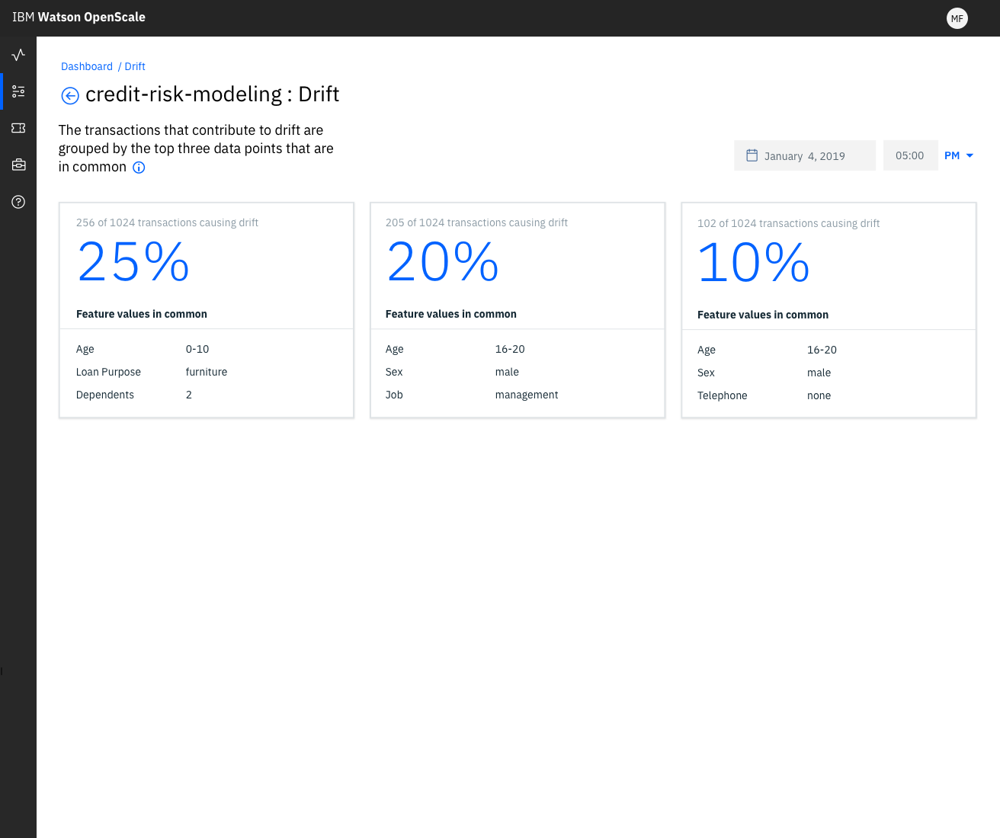

---

copyright:
  years: 2018, 2019
lastupdated: "2019-06-28"

keywords: drift, behavior, metrics

subcollection: ai-openscale

---

{:shortdesc: .shortdesc}
{:external: target="_blank" .external}
{:tip: .tip}
{:important: .important}
{:note: .note}
{:pre: .pre}
{:codeblock: .codeblock}
{:download: .download}
{:screen: .screen}
{:javascript: .ph data-hd-programlang='javascript'}
{:java: .ph data-hd-programlang='java'}
{:python: .ph data-hd-programlang='python'}
{:swift: .ph data-hd-programlang='swift'}
{:faq: data-hd-content-type='faq'}

# ドリフト絶対値
{: #behavior-drift-ovr}

モデルの特徴量の中には、時間とともにその重要性や影響が変化するものがあります。 その結果、関連するアプリケーションが影響を受け、ビジネスの結果にも影響が及びます。 ドリフト検出により、{{site.data.keyword.aios_short}} は、モデル指標、モデル・パフォーマンス、時間の経過に伴う特徴量の加重の変化を追跡できます。 データが変化すると、正確な予測を行うモデルの能力が低下する可能性があります。ドリフト絶対値は、時間の経過に伴う予測パフォーマンスの低下の程度です。ドリフトに関するこの情報に基づいて修正措置を行います。
{: shortdesc}

## ドリフトの検出について
{: #behavior-drift-understand}

ドリフトとは、隠れたコンテキストのために、予測パフォーマンスが時間とともに低下することです。 時間とともにデータが変化すると、正確な予測を行うモデルの能力が低下する可能性があります。 {{site.data.keyword.aios_short}} は、ユーザーが修正措置を取れるように、ドリフトを検出して強調表示します。

### 処理の流れ
{: #behavior-drift-works}

{{site.data.keyword.aios_short}} は、すべてのトランザクションを分析して、ドリフトの原因になっているものを見つけます。 その後、ドリフトの大きな原因になっていた属性値に基づいてレコードをグループ化します。

### 計算
{: #behavior-drift-math}

3 時間ごとに、{{site.data.keyword.aios_short}} は、予測モデルによって既に分析されたものと同じ訓練データを分析してドリフトを計算します。 次にその結果をモデルの予測と比較します。 変化や矛盾がある場合、{{site.data.keyword.aios_short}} はドリフトの程度を計算し、設定されたしきい値に基づいて、ドリフトの出現に関する警告を出します。 

### ドリフトの視覚化
{: #behavior-drift-display}

ドリフトの視覚化には、図形データと数値統計データの両方が表示されます。

グラフをクリックすると、ドリフトの原因になっている特定のトランザクションを表示できます。 検出されたドリフトの原因として上位の原因が表示され、観測結果についての自然言語による説明および予期されない値のリストが示されます。

ドリフトのトランザクションは、トランザクションの詳細画面で表示されます。この画面で**「説明」**をクリックすると、特定のトランザクションがドリフトに分類された理由を理解できます。

## 次のステップ

- ドリフト検出のセットアップ方法については、[ドリフト検出モニターの構成](/docs/services/ai-openscale?topic=ai-openscale-behavior-drift-config)を参照してください。
- Watson OpenScale によってドリフトが検出された後、ドリフトを軽減するには、その問題を修正する新しいバージョンのモデルを作成する必要があります。そのための良い足掛かりとなるのが、ドリフトの理由として強調表示されているデータ・ポイントです。ドリフトのあるトランザクションに手動でラベルを付けた後、新しいデータを予測モデルに導入し、それらを使用してモデルを再訓練します。

