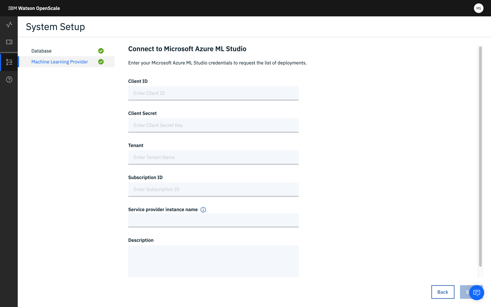

---

copyright:
  years: 2018, 2019
lastupdated: "2019-06-28"

keywords: Microsoft Azure studio, ml, machine learning, services, studio

subcollection: ai-openscale

---

{:shortdesc: .shortdesc}
{:external: target="_blank" .external}
{:tip: .tip}
{:important: .important}
{:note: .note}
{:pre: .pre}
{:codeblock: .codeblock}
{:download: .download}
{:screen: .screen}
{:javascript: .ph data-hd-programlang='javascript'}
{:java: .ph data-hd-programlang='java'}
{:python: .ph data-hd-programlang='python'}
{:swift: .ph data-hd-programlang='swift'}
{:faq: data-hd-content-type='faq'}

# Microsoft Azure ML Studio インスタンスの指定
{: #connect-azure}

{{site.data.keyword.aios_short}} ツールで最初に実行するステップは、Microsoft Azure ML Studio インスタンスの指定です。 Azure ML Studio インスタンスは、AI モデルとデプロイメントの格納場所となります。
{: shortdesc}

Python SDK を使用して、機械学習プロバイダーを追加することもできます。 この操作をプログラムで実行する方法については、[Microsoft Azure 機械学習エンジンのバインド](/docs/services/ai-openscale?topic=ai-openscale-cml-connect#cml-azbind)を参照してください。

## Azure ML Studio Studio インスタンスの接続
{: #ca-connect}

{{site.data.keyword.aios_short}} を、Azure ML Studio インスタンスの AI モデルとデプロイメントに接続します。

1.  **「構成」**タブで、**「機械学習プロバイダー (Machine learning provider)」**をクリックします。

    

1.  **「Microsoft Azure ML Studio」**タイルをクリックします。

    

1.  資格情報を入力して保存します。

    - クライアント ID: クライアント ID の実際の文字列値。これにより、本人確認を行い、Azure Studio に対する呼び出しを認証および許可します。
    - クライアント・シークレット: シークレットの実際の文字列値。これにより、本人確認を行い、Azure Studio に対する呼び出しを認証および許可します。
    - テナント: テナント ID は、組織に対応する Azure AD の専用インスタンスです。 テナント ID を確認するには、アカウント名の上にカーソルを置いてディレクトリー/テナント ID を表示するか、Azure ポータルで「Azure Active Directory」>「プロパティ」>「ディレクトリ ID」の順に選択します。
    - サブスクリプション ID: Microsoft Azure サブスクリプションを一意に識別するサブスクリプション資格情報。 すべてのサービス呼び出しの URI に、このサブスクリプション ID が含まれます。

    Microsoft Azure 資格情報の取得方法の手順に関しては、[How to: Use the portal to create an Azure AD application and service principal that can access resources](https://docs.microsoft.com/en-us/azure/active-directory/develop/howto-create-service-principal-portal){: external} を参照してください。
    {: note}

1.  デプロイされているモデルのリストが {{site.data.keyword.aios_short}} に表示されるので、モニターするモデルを選択して**「構成」**をクリックします。

デプロイメントが正常に選択されました。

### 次のステップ
{: #ca-next}

{{site.data.keyword.aios_short}} で、[モニターを構成](/docs/services/ai-openscale?topic=ai-openscale-mo-config)する準備が整いました。
