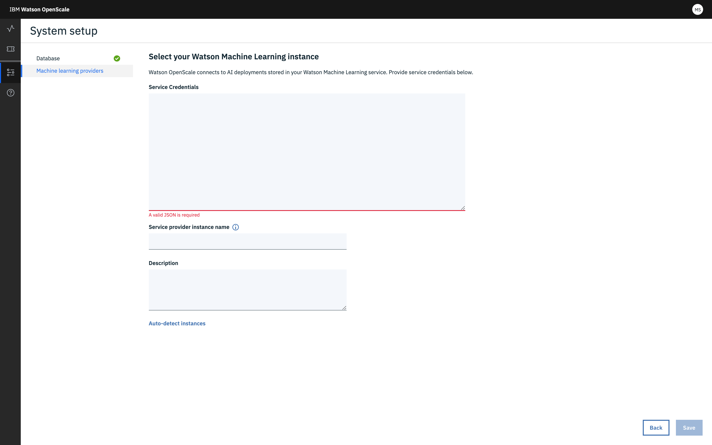

---

copyright:
  years: 2018, 2019
lastupdated: "2019-06-28"

keywords: Watson Studio, Watson Machine Learning, wml, machine learning, services

subcollection: ai-openscale

---

{:shortdesc: .shortdesc}
{:external: target="_blank" .external}
{:tip: .tip}
{:important: .important}
{:note: .note}
{:pre: .pre}
{:codeblock: .codeblock}
{:download: .download}
{:screen: .screen}
{:javascript: .ph data-hd-programlang='javascript'}
{:java: .ph data-hd-programlang='java'}
{:python: .ph data-hd-programlang='python'}
{:swift: .ph data-hd-programlang='swift'}
{:faq: data-hd-content-type='faq'}

# {{site.data.keyword.ibmwatson_notm}} {{site.data.keyword.pm_short}} サービス・インスタンスの指定
{: #wml-connect}

{{site.data.keyword.aios_short}} ツールで最初に実行するステップは、{{site.data.keyword.pm_full}} インスタンスの指定です。 {{site.data.keyword.pm_short}} インスタンスは、AI モデルとデプロイメントの格納場所となります。
{: shortdesc}

## 前提条件
{: #wml-prereq}

{{site.data.keyword.pm_full}} インスタンスを、{{site.data.keyword.aios_short}} サービス・インスタンスが配置されている {{site.data.keyword.Bluemix_notm}} アカウントと同じアカウントでプロビジョンしておく必要があります。 他のアカウントで {{site.data.keyword.pm_full}} インスタンスをプロビジョンした場合、そのインスタンスには {{site.data.keyword.aios_short}} の自動ペイロード・ロギングは構成できません。

## {{site.data.keyword.pm_short}} サービス・インスタンスの接続
{: #wml-config}

{{site.data.keyword.aios_short}} は、{{site.data.keyword.pm_full}} インスタンス内の AI モデルとデプロイメントに接続します。

1.  **「構成」**タブで、**「機械学習プロバイダー (Machine learning provider)」**をクリックします。

    

2.  {{site.data.keyword.pm_full}} タイルを選択します。 {{site.data.keyword.aios_short}} によって {{site.data.keyword.Bluemix_notm}} アカウントが調べられ、既存の {{site.data.keyword.pm_full}} インスタンスが検出されます。 
3. **「Watson Machine Learning service」**ドロップダウン・メニューからインスタンスを選択します。

    

4.  (オプション)**「別の場所を選択」**を選択し、ご使用の {{site.data.keyword.Bluemix_notm}} アカウント以外の機械学習の場所を指定することもできます。 ご使用の場所の資格情報を有効な JSON として指定します。

    

    **「保存」**をクリックします。

1.  デプロイされているモデルのリストが {{site.data.keyword.aios_short}} に表示されるので、モニターするモデルを選択して**「構成」**をクリックします。

### 次のステップ
{: #wml-next}

{{site.data.keyword.aios_short}} で、[モニターを構成](/docs/services/ai-openscale?topic=ai-openscale-mo-config)する準備が整いました。
