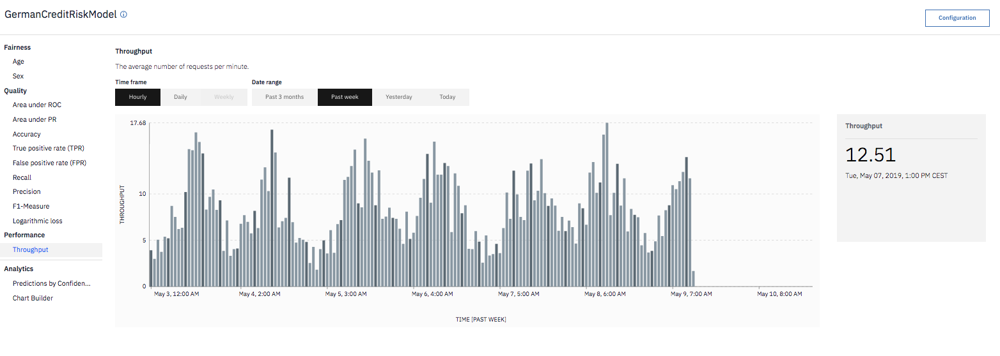

---

copyright:
  years: 2018, 2019
lastupdated: "2019-05-29"

keywords: metrics, monitoring, custom metrics, thresholds

subcollection: ai-openscale

---

{:shortdesc: .shortdesc}
{:new_window: target="_blank"}
{:tip: .tip}
{:important: .important}
{:note: .note}
{:pre: .pre}
{:codeblock: .codeblock}
{:screen: .screen}

# 메트릭 및 트랜잭션 분석 
{: #anlz_metrics}

{{site.data.keyword.aios_full}}을 사용하여 다양한 방법으로 메트릭과 트랜잭션을 분석할 수 있습니다.
{: shortdesc}

## 공정성 메트릭
{: #anlz_metrics_fairness}

공정성 모니터링을 사용하여 모델에서 생성하는 결과가 모니터 대상 그룹에 공정한지 여부를 판별하십시오. 공정성 모니터링이 사용으로 설정된 경우 기본적으로 1시간마다 메트릭 세트를 생성합니다. 필요한 경우 **품질 지금 확인** 단추를 클릭하거나 Python 클라이언트를 사용하여 이러한 메트릭을 생성할 수 있습니다.

공정성 메트릭은 다음 정보를 기반으로 계산됩니다.

- 스코어링 페이로드 데이터

적합한 모니터링을 위해 모든 스코어링 요청을 {{site.data.keyword.aios_short}}에도 기록해야 합니다. 페이로드 데이터 로깅은 {{site.data.keyword.pm_full}} 엔진에 대해 자동으로 설정되어 있습니다.

다른 기계 학습 엔진의 경우 페이로드 데이터를 Python 클라이언트 또는 REST API를 사용하여 제공할 수 있습니다.

{{site.data.keyword.pm_full}} 이외의 기계 학습 엔진의 경우 공정성 모니터링이 모니터링되는 배치에 대해 추가 스코어링 요청을 작성합니다.
{: note}

{{site.data.keyword.aios_short}} 대시보드에서 시간이 경과함에 따른 모든 메트릭 값을 검토할 수 있습니다.

선호 및 비선호 결과와 같은 관련된 세부사항을 검토할 수 있습니다.

트랜잭션 세부사항을 볼 수 있습니다.

권장되는 편향성 제거된 스코어링 엔드포인트를 볼 수 있습니다.

### 지원되는 공정성 메트릭
{: #anlz_metrics_supfairmets}

다음 공정성 메트릭이 {{site.data.keyword.aios_short}}에서 지원됩니다.

#### 그룹에 대한 공정성
{: #anlz_metrics_supfairmets_group}

- **설명**: 모델이 다른 그룹보다 한 그룹의 선호 결과를 더 많이 제공하는 경향입니다.
- **기본 임계값**: 하한값 = 80%
- **기본 권장사항**: 배치된 모델에서 편향성 제거된 응답을 수신하기 위해 비즈니스 애플리케이션에서 사용할 수 있는 편향성 제거된 스코어링 엔드포인트입니다.
- **문제점 유형**: 모두
- **데이터 유형**: 정형
- **차트 값**: 시간 범위의 마지막 값
- **메트릭 세부사항 사용 가능**: 예

### 지원되는 공정성 세부사항
{: #anlz_metrics_supfairdets}

공정성 메트릭의 다음 세부사항이 {{site.data.keyword.aios_short}}에서 지원됩니다.

- 각 그룹에 대한 선호 백분율
- 모든 공정성 그룹에 대한 공정성 평균

  차별적 효과 비율 = (모니터링되는 그룹의 선호 결과 비율) / (참조 그룹의 선호 결과 비율)

- 모니터링된 각 그룹에 대한 데이터의 분포
- 페이로드 데이터의 분포

<!---
BTW, I propose to use screenshots with data from FastPath.
Source monitored group or referenced group
Source of bias is also in fairness metrics
--->

## 품질 메트릭
{: #anlz_metrics_quality}

품질 모니터링을 사용하여 모델이 결과를 얼마나 잘 예측하는지 판별할 수 있습니다. 품질 모니터링이 사용으로 설정된 경우 기본적으로 1시간마다 메트릭 세트를 생성합니다. 필요한 경우 **품질 지금 확인** 단추를 클릭하거나 Python 클라이언트를 사용하여 이러한 메트릭을 생성할 수 있습니다.

품질 메트릭스는 다음 정보를 기반으로 계산됩니다.

- 수동으로 레이블이 지정된 피드백 데이터
- 이러한 데이터에 대한 모니터링된 배치 응답

적합한 모니터링을 위해 피드백 데이터를 정기적으로 {{site.data.keyword.aios_short}}에 기록해야 합니다. "피드백 데이터 추가" 옵션을 사용하거나 Python 클라이언트 또는 REST API를 사용하여 피드백 데이터를 제공할 수 있습니다.

Microsoft Azure ML Studio 또는 Amazon Sagemaker ML과 같은 {{site.data.keyword.aios_short}} 이외의 기계 학습 엔진의 경우 품질 모니터링은 모니터링된 배치에 대해 추가적인 스코어링 요청을 작성합니다.
{: note}

{{site.data.keyword.aios_short}} 대시보드에서 시간이 경과함에 따른 모든 메트릭 값을 검토할 수 있습니다.

일부 메트릭에 사용 가능한 2진 및 다중 클래스 분류에 대한 오차 행렬과 같은 관련 세부사항을 검토하려면, 차트를 클릭하십시오.

### 지원되는 품질 메트릭
{: #anlz_metrics_supqualdets}

다음 품질 메트릭이 {{site.data.keyword.aios_short}}에서 지원됩니다.

#### ROC 아래 영역
{: #anlz_metrics_supqualdets_roc}

- **설명**: 재현율 및 거짓 양성 비율 곡선 아래의 영역입니다.
- **기본 임계값**: 하한값 = 80%
- **기본 권장사항**:
   - **상승세**: 상승세는 메트릭이 개선되고 있음을 표시합니다. 모델 재훈련이 효과적임을 의미합니다.
   - **하락세**: 하락세는 메트릭이 나빠지고 있음을 표시합니다. 피드백 데이터가 훈련 데이터와 크게 달라집니다.
   - **불규칙하거나 일정하지 않은 변화**: 불규칙하거나 일정하지 않은 변화는 피드백 데이터가 평가 간에 일관되지 않음을 표시합니다. 품질 모니터에 대한 최소 샘플 크기를 늘리십시오.
- **문제점 유형**: 2진 분류
- **차트 값**: 시간 범위의 마지막 값
- **메트릭 세부사항 사용 가능**: 오차 행렬

#### PR 아래 영역
{: #anlz_metrics_supqualdets_pr}

- **설명**: 정밀도 및 재현율 곡선 아래의 영역입니다.
- **기본 임계값**: 하한값 = 80%
- **기본 권장사항**:
   - **상승세**: 상승세는 메트릭이 개선되고 있음을 표시합니다. 모델 재훈련이 효과적임을 의미합니다.
   - **하락세**: 하락세는 메트릭이 나빠지고 있음을 표시합니다. 피드백 데이터가 훈련 데이터와 크게 달라집니다.
   - **불규칙하거나 일정하지 않은 변화**: 불규칙하거나 일정하지 않은 변화는 피드백 데이터가 평가 간에 일관되지 않음을 표시합니다. 품질 모니터에 대한 최소 샘플 크기를 늘리십시오.
- **문제점 유형**: 2진 분류
- **차트 값**: 시간 범위의 마지막 값
- **메트릭 세부사항 사용 가능**: 오차 행렬

#### 설명 분산의 비율
{: #anlz_metrics_supqualdets_var}

- **설명**: 설명 분산의 비율은 설명 분산과 대상 분산의 비율입니다. 설명 분산은 대상 분산과 예측 오차 분산 간의 차이입니다.
- **기본 임계값**: 하한값 = 80%
- **기본 권장사항**:
   - **상승세**: 상승세는 메트릭이 개선되고 있음을 표시합니다. 모델 재훈련이 효과적임을 의미합니다.
   - **하락세**: 하락세는 메트릭이 나빠지고 있음을 표시합니다. 피드백 데이터가 훈련 데이터와 크게 달라집니다.
   - **불규칙하거나 일정하지 않은 변화**: 불규칙하거나 일정하지 않은 변화는 피드백 데이터가 평가 간에 일관되지 않음을 표시합니다. 품질 모니터에 대한 최소 샘플 크기를 늘리십시오.
- **문제점 유형**: 회귀
- **차트 값**: 시간 범위의 마지막 값
- **메트릭 세부사항 사용 가능**: 없음

#### 평균 절대 오차
{: #anlz_metrics_supqualdets_abserror}

- **설명**: 모델 예측과 대상 값 간의 절대 오차의 평균입니다.
- **기본 임계값**: 상한값 = 80%
- **기본 권장사항**:
   - **상승세**: 상승세는 메트릭이 나빠지고 있음을 표시합니다. 피드백 데이터가 훈련 데이터와 크게 달라집니다.
   - **하락세**: 하락세는 메트릭이 개선되고 있음을 표시합니다. 모델 재훈련이 효과적임을 의미합니다.
   - **불규칙하거나 일정하지 않은 변화**: 불규칙하거나 일정하지 않은 변화는 피드백 데이터가 평가 간에 일관되지 않음을 표시합니다. 품질 모니터에 대한 최소 샘플 크기를 늘리십시오.
- **문제점 유형**: 회귀
- **차트 값**: 시간 범위의 마지막 값
- **메트릭 세부사항 사용 가능**: 없음

#### 평균 제곱 오차
{: #anlz_metrics_supqualdets_squerror}

- **설명**: 모델 예측과 대상 값 간의 제곱 오차의 평균입니다.
- **기본 임계값**: 상한값 = 80%
- **기본 권장사항**:
   - **상승세**: 상승세는 메트릭이 나빠지고 있음을 표시합니다. 피드백 데이터가 훈련 데이터와 크게 달라집니다.
   - **하락세**: 하락세는 메트릭이 개선되고 있음을 표시합니다. 모델 재훈련이 효과적임을 의미합니다.
   - **불규칙하거나 일정하지 않은 변화**: 불규칙하거나 일정하지 않은 변화는 피드백 데이터가 평가 간에 일관되지 않음을 표시합니다. 품질 모니터에 대한 최소 샘플 크기를 늘리십시오.
- **문제점 유형**: 회귀
- **차트 값**: 시간 범위의 마지막 값
- **메트릭 세부사항 사용 가능**: 없음

#### R 제곱
{: #anlz_metrics_supqualdets_r_squared}

- **설명**: 대상 분산과 대상 분산에 대한 예측 오차의 분산 간 차이의 비율입니다.
- **기본 임계값**: 하한값 = 80%
- **기본 권장사항**:
   - **상승세**: 상승세는 메트릭이 개선되고 있음을 표시합니다. 모델 재훈련이 효과적임을 의미합니다.
   - **하락세**: 하락세는 메트릭이 나빠지고 있음을 표시합니다. 피드백 데이터가 훈련 데이터와 크게 달라집니다.
   - **불규칙하거나 일정하지 않은 변화**: 불규칙하거나 일정하지 않은 변화는 피드백 데이터가 평가 간에 일관되지 않음을 표시합니다. 품질 모니터에 대한 최소 샘플 크기를 늘리십시오.
- **문제점 유형**: 회귀
- **차트 값**: 시간 범위의 마지막 값
- **메트릭 세부사항 사용 가능**: 없음

#### 평균 제곱근 오차
{: #anlz_metrics_supqualdets_squ_errors_mean}

- **설명**: 모델 예측과 대상 값 간의 제곱 오차 평균의 제곱근입니다.
- **기본 임계값**: 상한값 = 80%
- **기본 권장사항**:
   - **상승세**: 상승세는 메트릭이 나빠지고 있음을 표시합니다. 피드백 데이터가 훈련 데이터와 크게 달라집니다.
   - **하락세**: 하락세는 메트릭이 개선되고 있음을 표시합니다. 모델 재훈련이 효과적임을 의미합니다.
   - **불규칙하거나 일정하지 않은 변화**: 불규칙하거나 일정하지 않은 변화는 피드백 데이터가 평가 간에 일관되지 않음을 표시합니다. 품질 모니터에 대한 최소 샘플 크기를 늘리십시오.
- **문제점 유형**: 회귀
- **차트 값**: 시간 범위의 마지막 값
- **메트릭 세부사항 사용 가능**: 없음

#### 정확성
{: #anlz_metrics_supqualdets_acc}

- **설명**: 정확한 예측 비율
- **기본 임계값**: 하한값 = 80%
- **기본 권장사항**:
   - **상승세**: 상승세는 메트릭이 개선되고 있음을 표시합니다. 모델 재훈련이 효과적임을 의미합니다.
   - **하락세**: 하락세는 메트릭이 나빠지고 있음을 표시합니다. 피드백 데이터가 훈련 데이터와 크게 달라집니다.
   - **불규칙하거나 일정하지 않은 변화**: 불규칙하거나 일정하지 않은 변화는 피드백 데이터가 평가 간에 일관되지 않음을 표시합니다. 품질 모니터에 대한 최소 샘플 크기를 늘리십시오.
- **문제점 유형**: 2진 분류 및 다중 클래스 분류
- **차트 값**: 시간 범위의 마지막 값
- **메트릭 세부사항 사용 가능**: 오차 행렬

#### 가중된 참 양성 비율(wTPR)
{: #anlz_metrics_supqualdets_wtpr}

- **설명**: 클래스 가능성과 동일한 가중치로 가중된 클래스 TPR의 평균입니다.
- **기본 임계값**: 하한값 = 80%
- **기본 권장사항**:
   - **상승세**: 상승세는 메트릭이 개선되고 있음을 표시합니다. 모델 재훈련이 효과적임을 의미합니다.
   - **하락세**: 하락세는 메트릭이 나빠지고 있음을 표시합니다. 피드백 데이터가 훈련 데이터와 크게 달라집니다.
   - **불규칙하거나 일정하지 않은 변화**: 불규칙하거나 일정하지 않은 변화는 피드백 데이터가 평가 간에 일관되지 않음을 표시합니다. 품질 모니터에 대한 최소 샘플 크기를 늘리십시오.
- **문제점 유형**: 다중 클래스 분류
- **차트 값**: 시간 범위의 마지막 값
- **메트릭 세부사항 사용 가능**: 오차 행렬

#### 참 양성 비율(TPR)
{: #anlz_metrics_supqualdets_tpr}

- **설명**: 양성 클래스에 대한 예측에서의 올바른 예측의 비율입니다.
- **기본 임계값**: 하한값 = 80%
- **기본 권장사항**:
   - **상승세**: 상승세는 메트릭이 개선되고 있음을 표시합니다. 모델 재훈련이 효과적임을 의미합니다.
   - **하락세**: 하락세는 메트릭이 나빠지고 있음을 표시합니다. 피드백 데이터가 훈련 데이터와 크게 달라집니다.
   - **불규칙하거나 일정하지 않은 변화**: 불규칙하거나 일정하지 않은 변화는 피드백 데이터가 평가 간에 일관되지 않음을 표시합니다. 품질 모니터에 대한 최소 샘플 크기를 늘리십시오.
- **문제점 유형**: 2진 분류
- **차트 값**: 시간 범위의 마지막 값
- **메트릭 세부사항 사용 가능**: 오차 행렬

#### 가중된 거짓 양성 비율(wFPR)
{: #anlz_metrics_supqualdets_wfpr_weighted}

- **설명**: 클래스 가능성과 동일한 가중치로 가중된 클래스 FPR의 평균입니다.
- **기본 임계값**: 하한값 = 80%
- **기본 권장사항**:
   - **상승세**: 상승세는 메트릭이 개선되고 있음을 표시합니다. 모델 재훈련이 효과적임을 의미합니다.
   - **하락세**: 하락세는 메트릭이 나빠지고 있음을 표시합니다. 피드백 데이터가 훈련 데이터와 크게 달라집니다.
   - **불규칙하거나 일정하지 않은 변화**: 불규칙하거나 일정하지 않은 변화는 피드백 데이터가 평가 간에 일관되지 않음을 표시합니다. 품질 모니터에 대한 최소 샘플 크기를 늘리십시오.
- **문제점 유형**: 다중 클래스 분류
- **차트 값**: 시간 범위의 마지막 값
- **메트릭 세부사항 사용 가능**: 오차 행렬

#### 거짓 양성 비율(FPR)
{: #anlz_metrics_supqualdets_fpr_false}

- **설명**: 양성 클래스에 대한 잘못된 예측의 비율입니다.
- **기본 임계값**: 하한값 = 80%
- **기본 권장사항**:
   - **상승세**: 상승세는 메트릭이 개선되고 있음을 표시합니다. 모델 재훈련이 효과적임을 의미합니다.
   - **하락세**: 하락세는 메트릭이 나빠지고 있음을 표시합니다. 피드백 데이터가 훈련 데이터와 크게 달라집니다.
   - **불규칙하거나 일정하지 않은 변화**: 불규칙하거나 일정하지 않은 변화는 피드백 데이터가 평가 간에 일관되지 않음을 표시합니다. 품질 모니터에 대한 최소 샘플 크기를 늘리십시오.
- **문제점 유형**: 2진 분류
- **차트 값**: 시간 범위의 마지막 값
- **메트릭 세부사항 사용 가능**: 오차 행렬

#### 가중된 재현율
{: #anlz_metrics_supqualdets_weighted_recall}

- **설명**: 클래스 가능성과 동일한 가중치로 가중된 재현율의 평균입니다.
- **기본 임계값**: 하한값 = 80%
- **기본 권장사항**:
   - **상승세**: 상승세는 메트릭이 개선되고 있음을 표시합니다. 모델 재훈련이 효과적임을 의미합니다.
   - **하락세**: 하락세는 메트릭이 나빠지고 있음을 표시합니다. 피드백 데이터가 훈련 데이터와 크게 달라집니다.
   - **불규칙하거나 일정하지 않은 변화**: 불규칙하거나 일정하지 않은 변화는 피드백 데이터가 평가 간에 일관되지 않음을 표시합니다. 품질 모니터에 대한 최소 샘플 크기를 늘리십시오.
- **문제점 유형**: 다중 클래스 분류
- **차트 값**: 시간 범위의 마지막 값
- **메트릭 세부사항 사용 가능**: 오차 행렬

#### 재현율
{: #anlz_metrics_supqualdets_recall}

- **설명**: 양성 클래스에 대한 올바른 예측의 비율입니다.
- **기본 임계값**: 하한값 = 80%
- **기본 권장사항**:
   - **상승세**: 상승세는 메트릭이 개선되고 있음을 표시합니다. 모델 재훈련이 효과적임을 의미합니다.
   - **하락세**: 하락세는 메트릭이 나빠지고 있음을 표시합니다. 피드백 데이터가 훈련 데이터와 크게 달라집니다.
   - **불규칙하거나 일정하지 않은 변화**: 불규칙하거나 일정하지 않은 변화는 피드백 데이터가 평가 간에 일관되지 않음을 표시합니다. 품질 모니터에 대한 최소 샘플 크기를 늘리십시오.
- **문제점 유형**: 2진 분류
- **차트 값**: 시간 범위의 마지막 값
- **메트릭 세부사항 사용 가능**: 오차 행렬

#### 가중된 정밀도
{: #anlz_metrics_supqualdets_wgth_prec}

- **설명**: 클래스 가능성과 동일한 가중치로 가중된 정밀도의 평균입니다.
- **기본 임계값**: 하한값 = 80%
- **기본 권장사항**:
   - **상승세**: 상승세는 메트릭이 개선되고 있음을 표시합니다. 모델 재훈련이 효과적임을 의미합니다.
   - **하락세**: 하락세는 메트릭이 나빠지고 있음을 표시합니다. 피드백 데이터가 훈련 데이터와 크게 달라집니다.
   - **불규칙하거나 일정하지 않은 변화**: 불규칙하거나 일정하지 않은 변화는 피드백 데이터가 평가 간에 일관되지 않음을 표시합니다. 품질 모니터에 대한 최소 샘플 크기를 늘리십시오.
- **문제점 유형**: 다중 클래스 분류
- **차트 값**: 시간 범위의 마지막 값
- **메트릭 세부사항 사용 가능**: 오차 행렬

#### 정밀도
{: #anlz_metrics_supqualdets_precision}

- **설명**: 양성 클래스에 대한 예측에서의 올바른 예측의 비율입니다.
- **기본 임계값**: 하한값 = 80%
- **기본 권장사항**:
   - **상승세**: 상승세는 메트릭이 개선되고 있음을 표시합니다. 모델 재훈련이 효과적임을 의미합니다.
   - **하락세**: 하락세는 메트릭이 나빠지고 있음을 표시합니다. 피드백 데이터가 훈련 데이터와 크게 달라집니다.
   - **불규칙하거나 일정하지 않은 변화**: 불규칙하거나 일정하지 않은 변화는 피드백 데이터가 평가 간에 일관되지 않음을 표시합니다. 품질 모니터에 대한 최소 샘플 크기를 늘리십시오.
- **문제점 유형**: 2진 분류
- **차트 값**: 시간 범위의 마지막 값
- **메트릭 세부사항 사용 가능**: 오차 행렬

#### 가중된 F1 수치
{: #anlz_metrics_supqualdets_wght_f1-measure}

- **설명**: 클래스 가능성과 동일한 가중치로 가중된 F1 수치의 평균입니다.
- **기본 임계값**: 하한값 = 80%
- **기본 권장사항**:
   - **상승세**: 상승세는 메트릭이 개선되고 있음을 표시합니다. 모델 재훈련이 효과적임을 의미합니다.
   - **하락세**: 하락세는 메트릭이 나빠지고 있음을 표시합니다. 피드백 데이터가 훈련 데이터와 크게 달라집니다.
   - **불규칙하거나 일정하지 않은 변화**: 불규칙하거나 일정하지 않은 변화는 피드백 데이터가 평가 간에 일관되지 않음을 표시합니다. 품질 모니터에 대한 최소 샘플 크기를 늘리십시오.
- **문제점 유형**: 다중 클래스 분류
- **차트 값**: 시간 범위의 마지막 값
- **메트릭 세부사항 사용 가능**: 오차 행렬

#### F1 수치
{: #anlz_metrics_supqualdets_f1-measr}

- **설명**: 정밀도와 재현율의 조화 평균입니다.
- **기본 임계값**: 하한값 = 80%
- **기본 권장사항**:
   - **상승세**: 상승세는 메트릭이 개선되고 있음을 표시합니다. 모델 재훈련이 효과적임을 의미합니다.
   - **하락세**: 하락세는 메트릭이 나빠지고 있음을 표시합니다. 피드백 데이터가 훈련 데이터와 크게 달라집니다.
   - **불규칙하거나 일정하지 않은 변화**: 불규칙하거나 일정하지 않은 변화는 피드백 데이터가 평가 간에 일관되지 않음을 표시합니다. 품질 모니터에 대한 최소 샘플 크기를 늘리십시오.
- **문제점 유형**: 2진 분류
- **차트 값**: 시간 범위의 마지막 값
- **메트릭 세부사항 사용 가능**: 오차 행렬

#### 로그 손실
{: #anlz_metrics_supqualdets_log_loss}

- **설명**: 대상 클래스 가능성(신뢰도)의 로그 평균입니다. 기대 로그 우도라고도 합니다.
- **기본 임계값**: 하한값 = 80%
- **기본 권장사항**:
   - **상승세**: 상승세는 메트릭이 개선되고 있음을 표시합니다. 모델 재훈련이 효과적임을 의미합니다.
   - **하락세**: 하락세는 메트릭이 나빠지고 있음을 표시합니다. 피드백 데이터가 훈련 데이터와 크게 달라집니다.
   - **불규칙하거나 일정하지 않은 변화**: 불규칙하거나 일정하지 않은 변화는 피드백 데이터가 평가 간에 일관되지 않음을 표시합니다. 품질 모니터에 대한 최소 샘플 크기를 늘리십시오.
- **문제점 유형**: 2진 분류 및 다중 클래스 분류
- **차트 값**: 시간 범위의 마지막 값
- **메트릭 세부사항 사용 가능**: 없음

### 지원되는 품질 세부사항
{: #anlz_metrics_supqualdets_suppr_dets}

품질 메트릭에 대한 다음 세부사항이 {{site.data.keyword.aios_short}}에서 지원됩니다.

#### 오차 행렬
{: #anlz_metrics_supqualdets_confusion}

오차 행렬은 모니터링된 배치 응답에 대한 어느 피드백 데이터가 올바른지 또는 올바르지 않은지를 이해하는 데 도움을 줍니다.

## 성능 메트릭
{: #anlz_metrics_performance}

성능 모니터링을 사용하여 배치에서 처리하는 데이터 레코드의 속도를 알 수 있습니다. {{site.data.keyword.aios_short}}에서 추적하고 모니터링할 배치를 선택하는 경우 성능 모니터링을 사용으로 설정합니다.

성능 메트릭은 다음 정보를 기반으로 계산됩니다.

- 스코어링 페이로드 데이터

적합한 모니터링을 위해 모든 스코어링 요청을 {{site.data.keyword.aios_short}}에도 기록해야 합니다. 페이로드 데이터 로깅은 {{site.data.keyword.pm_full}} 엔진에 대해 자동으로 설정되어 있습니다. 다른 기계 학습 엔진의 경우 Python 클라이언트 또는 REST API를 사용하여 페이로드 데이터를 제공할 수 있습니다. 성능 모니터링은 모니터링된 배치에 대한 추가 스코어링 요청을 작성하지 않습니다.

{{site.data.keyword.aios_short}} 대시보드에서 시간이 경과함에 따른 성능 메트릭 값을 검토할 수 있습니다.

### 지원되는 성능 메트릭
{: #anlz_metrics_performance_supp_quality_mets}

다음 성능 메트릭이 {{site.data.keyword.aios_short}}에서 지원됩니다.

#### 처리량
{: #anlz_metrics_performance_supp_quality_mets_through}

- **설명**: 특정 시간 범위의 분당 평균 스코어링 요청입니다.
- **기본 임계값**: 해당 사항 없음
- **기본 권장사항**: 해당 사항 없음
- **문제점 유형**: 모두
- **차트 값**: 시간 범위의 평균 값
- **메트릭 세부사항 사용 가능**: 없음

## 페이로드 데이터 분석
{: #anlz_metrics_payload}

다음 방법 중 하나를 사용하여 선택한 데이터 범위의 배치로 전송되는 스코어링 페이로드를 분석할 수 있습니다.

- 각 클래스의 예측 클래스 및 신뢰도 분포를 검토하는 방법
   
   
   
- 사용자 정의 차트(기능, 예측 클래스 및 신뢰도 간에 선택)를 사용하는 방법
   
   

