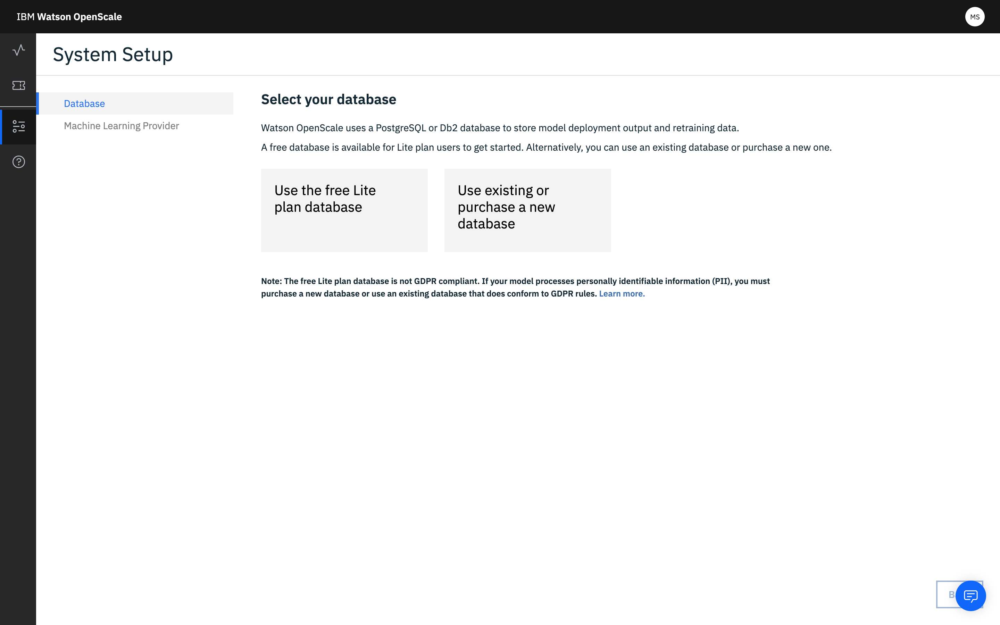

---

copyright:
  years: 2018, 2019
lastupdated: "2019-05-29"

keywords: databases, connections, scoring, requests

subcollection: ai-openscale

---

{:shortdesc: .shortdesc}
{:new_window: target="_blank"}
{:tip: .tip}
{:important: .important}
{:note: .note}
{:pre: .pre}
{:codeblock: .codeblock}
{:screen: .screen}

# 데이터베이스 지정
{: #connect-db}

사용할 {{site.data.keyword.aios_short}} 인스턴스에 대한 데이터베이스를 지정하십시오.
{: shortdesc}

## 데이터베이스에 연결
{: #cdb-connect}

{{site.data.keyword.aios_short}}은 데이터베이스를 사용하여 페이로드, 피드백 및 측정치 데이터를 저장합니다. 데이터베이스 선택 외에 데이터베이스에 대한 스키마도 선택할 수 있습니다. 스키마란 데이터베이스 내에 있는 테이블의 이름 지정된 콜렉션입니다.

1.  데이터베이스를 선택하십시오. 무료 데이터베이스 또는 기존/신규 데이터베이스의 두 가지 옵션이 있습니다.

    

    유료 {{site.data.keyword.cloud_notm}} 계정이 있는 경우, `Databases for PostgreSQL` 또는 `Db2 Warehouse` 서비스를 프로비저닝하여 Watson Studio 및 연속 학습 서비스와의 통합을 활용할 수 있습니다. 유료 서비스를 프로비저닝하지 않기로 선택하는 경우 무료 내부 PostgreSQL 스토리지를 {{site.data.keyword.aios_short}}과 함께 사용할 수 있으나 모델에 대한 연속 학습을 구성할 수 없습니다.
    {: note}

### 무료 Lite 플랜 데이터베이스
{: #cdb-lite}

**참고**: 무료 데이터베이스에는 몇 가지 중요한 제한사항이 있습니다.

- 무료 데이터베이스가 호스팅되며 사용자에 직접 액세스할 수 없습니다.
- {{site.data.keyword.aios_full}}는 데이터베이스에 대한 전체 액세스 권한을 갖고 있으므로 데이터에 대한 전체 액세스 권한을 가집니다.
- 무료 데이터베이스는 GDPR을 준수하지 않습니다. 모델이 PII(Personally-Identifiable Information)를 처리하는 경우 무료 데이터베이스를 사용할 수 없습니다. 새 데이터베이스를 구매하거나 GDPR 규칙을 준수하는 기존 데이터베이스를 사용해야 합니다. 자세한 내용은 [정보 보안](/docs/services/ai-openscale?topic=ai-openscale-is-ov)을 참조하십시오.

무료 데이터베이스를 사용하여 진행하려면 **{{site.data.keyword.aios_short}}에서 호스팅하는 무료 데이터베이스 사용** 타일을 클릭한 후 요약 데이터를 검토하고 **저장**을 클릭하십시오.

  
  
무료 데이터베이스에서 다른 데이터베이스로 업그레이드할 수 있지만 Compose for Postgres, Database for Postgres 또는 Db2 인스턴스를 무료 데이터베이스에 대해 재구성할 수는 없습니다. 업그레이드한 후에는 무료 데이터베이스를 사용하도록 돌아갈 수 없습니다. 구성, 스코어링 결과 및 설명과 같은 모든 최신 데이터를 재사용할 수 없습니다. 다른 스키마 또는 데이터베이스를 선택하면 {{site.data.keyword.aios_short}} 환경이 전체 다시 설정됩니다.

### 기존 또는 신규 데이터베이스
{: #cdb-exn}

1.  일단 "기존 데이터베이스 사용 또는 신규 데이터베이스 구매" 옵션을 선택하면 {{site.data.keyword.aios_short}}이 사용자의 {{site.data.keyword.Bluemix_notm}} 계정을 확인하여 기존 데이터베이스를 찾습니다.

1.  기존 데이터베이스 유형(Compose for Postgres, Database for Postgres 또는 Db2)을 선택한 다음 **데이터베이스** 드롭 다운 메뉴에서 데이터베이스를 선택하고 **스키마**를 선택하십시오.

    {{site.data.keyword.aios_short}}은 PostgreSQL 또는 Db2 데이터베이스를 사용하여 모델 배치 출력 및 재훈련 데이터를 저장합니다. Lite Db2 플랜은 현재 지원되지 않습니다. 훈련 데이터에 대한 자세한 정보는 [{{site.data.keyword.aios_short}}에서 내 훈련 데이터에 액세스해야 하는 이유는 무엇입니까?](/docs/services/ai-openscale?topic=ai-openscale-trainingdata#trainingdata)를 참조하십시오.
    {: note}

    

1.  또한 **다른 위치 선택**을 클릭하여 {{site.data.keyword.Bluemix_notm}} 계정 외부의 데이터베이스 위치를 지정할 수 있습니다.

    {{site.data.keyword.aios_short}}은 PostgreSQL 또는 Db2 데이터베이스를 사용하여 모델 배치 출력 및 재훈련 데이터를 저장합니다. Lite Db2 플랜은 현재 지원되지 않습니다.
    {: note}

    - **데이터베이스 유형**(`Compose for PostgreSQL`, `Database for PostgreSQL` 또는 `Db2`)를 선택한 다음 연결 정보를 제공하십시오.

        - `Compose for PostgreSQL` 데이터베이스의 경우, 다음을 완료하십시오.

            - 호스트 이름 또는 IP 주소
            - 포트
            - 데이터베이스(이름)
            - 사용자 이름
            - 비밀번호

            

        - `Database for PostgreSQL` 데이터베이스의 경우, 다음을 완료하십시오.

            - 호스트 이름 또는 IP 주소
            - SSL 포트
            - Base-64 인코딩 인증서
            - 데이터베이스(이름)
            - 사용자 이름
            - 비밀번호

            

        - `Db2` 데이터베이스의 경우, 다음을 완료하십시오.

            - 호스트 이름 또는 IP 주소
            - SSL 포트
            - 데이터베이스(이름)
            - 사용자 이름
            - 비밀번호

            

    - 일단 연결되면, 스키마를 선택할 수 있습니다.

      액세스가 제한된 Db2 인스턴스를 제공하는 경우 스키마 이름이 명시적으로 제공되어야 하며 이로 인해 스키마 이름을 자동으로 생성하도록 허용되지 않습니다. 이는 Entry Db2 Warehouse 플랜에 적용됩니다.
      {: important}

      

1.  **다음**을 클릭하여 요약 데이터를 검토한 다음 **저장**을 클릭하십시오.

## 스코어링 요청 전송
{: #cdb-score}

{{site.data.keyword.aios_short}}은 모니터를 구성하기 위해 사용자에게 모니터될 데이터 로그를 시작하는 데 필요한 스코어링 요청을 전송하도록 요청합니다.

Watson Machine Learning에 배치되는 모델은 {{site.data.keyword.aios_short}}에 의해 자동으로 스코어링됩니다.
{: note:}

배치(이 경우, "Fraud Detector")를 선택한 다음 제공된 `cURL` 또는 `Python` 코드 스니펫을 사용하여 모델 배치 요청 및 응답 데이터를 로그하십시오. 자세한 내용은 [비Watson Machine Learning 서비스 인스턴스에 대한 페이로드 로깅](/docs/services/ai-openscale?topic=ai-openscale-cml-connect)을 참조하십시오.

코드 스니펫에 제공되는 필드 및 값은 예이므로 이를 사용자의 실제 값으로 대체해야 합니다.
{: important}

일단 사용자의 페이로드 로깅을 실행했으면, 선택된 배치에 대한 "모니터 준비" 열에 체크표시가 나타납니다. 계속하려면 **모니터 구성**을 클릭하십시오.

## 다음 단계
{: #cdb-next}

{{site.data.keyword.aios_short}}이 [배치에 대한 모니터를 구성](/docs/services/ai-openscale?topic=ai-openscale-mo-config)할 준비가 되었습니다.
