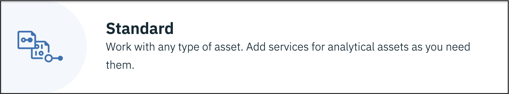
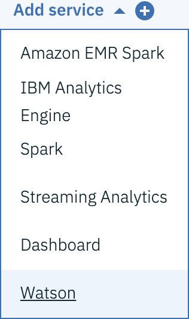
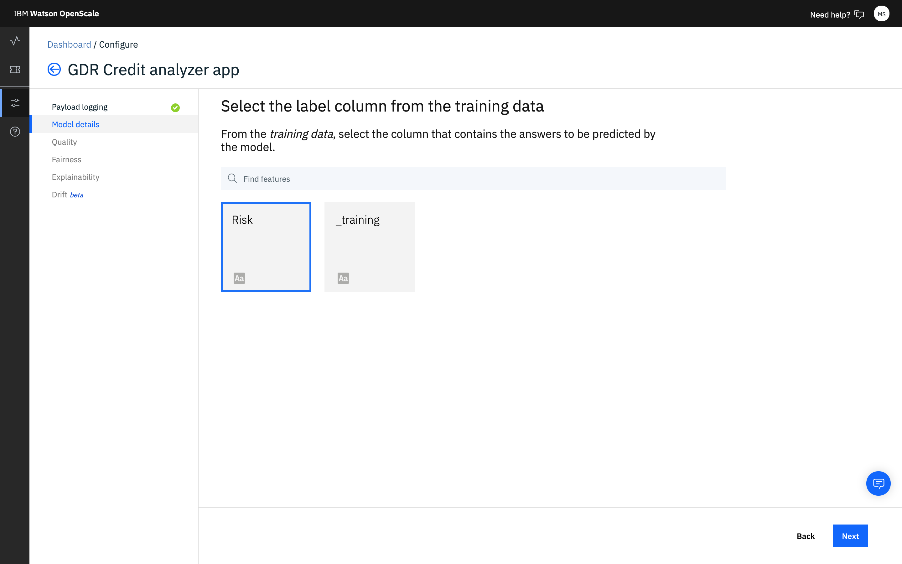

---

title: Trust and transparency for your machine learning models with {{site.data.keyword.aios_short}}
description: Monitor your machine learning deployments for bias, accuracy, and explainability
duration: 120
intro: In this tutorial, you will provision IBM Cloud machine learning and data services, create and deploy machine learning models in Watson studio, and configure the new IBM {{site.data.keyword.aios_full}} product to monitor your models for trust and transparency.
takeaways:
- See how {{site.data.keyword.aios_short}} provides trust and transparency for AI models
- Understand how IBM Cloud services and Watson Studio technologies can provide a seamless, AI-driven customer experience

copyright:
  years: 2018, 2019
lastupdated: "2019-06-28"

keywords: ai, getting started, tutorial, understanding, video

subcollection: ai-openscale

---

{:shortdesc: .shortdesc}
{:new_window: target="_blank"}
{:hide-dashboard: .hide-dashboard}
{:tip: .tip}
{:important: .important}
{:note: .note}
{:pre: .pre}
{:codeblock: .codeblock}
{:screen: .screen}
{:javascript: .ph data-hd-programlang='javascript'}
{:java: .ph data-hd-programlang='java'}
{:python: .ph data-hd-programlang='python'}
{:swift: .ph data-hd-programlang='swift'}

# 시작하기 - 튜토리얼(기본)
{: #gettingstarted}

{{site.data.keyword.aios_full}}을 사용하면 엔터프라이즈가 비즈니스 애플리케이션 내에서 AI 라이프사이클을 자동화하고 조작 가능하도록 할 수 있으며 AI 모델에서 편향성을 제거하여 비즈니스 사용자들이 쉽게 설명하고 이해할 수 있도록 하며 비즈니스 트랜잭션에서 감사받을 수 있습니다. {{site.data.keyword.aios_short}}은 사용자가 선택한 도구 및 모델 서버 프레임워크에서 빌드되고 실행되는 AI 모델을 지원합니다.
{: shortdesc}

## 개요
{: #gs-view-demo}

이 동영상을 보면 {{site.data.keyword.aios_short}}의 간단한 개요를 알 수 있습니다.

  

    <iframe class="embed-responsive-item" id="youtubeplayer" title="AI에서의 신뢰성 및 투명성" type="text/html" width="640" height="390" src="https://www.youtube.com/embed/6Ei8rPVtCf8" frameborder="0" webkitallowfullscreen mozallowfullscreen allowfullscreen> </iframe>
  

## {{site.data.keyword.aios_short}}의 유스 케이스
{: #gs-use}

일반적인 대출자는 더 다양한 대상에 대해 재무 서비스의 디지털 포트폴리오를 확장해야 한다는 압박을 받으며 이로 인해 신용 위험 모델화에 대한 새로운 접근법을 필요로 합니다. 데이터 과학 팀은 현재 의사결정 트리 및 로지스틱 회귀 등의 표준 모델화 기술에 의존하고 있으며 이는 적절한 데이터 세트에 대해서는 잘 작동하며 쉽게 설명할 수 있는 추천을 작성합니다. 이는 신용 대출 결정이 투명하고 설명 가능해야 한다는 규제 요구사항을 충족합니다.

더 광범위하고 위험도가 높은 인구에 대해 신용 액세스를 제공하려면 신청자의 신용 히스토리가 담보 대출 및 자동차 대출 등의 일반적인 신용을 넘어 공과금 및 휴대전화 플랜 지불 히스토리 및 교육 및 직업 상의 직위와 같은 대체 신용 소스로 확장되어야 합니다. 이러한 새 데이터 소스는 약속을 제공하나 신청자의 연령, 성별 또는 기타 개인 특성을 기반으로 하는 편향성을 도입하는 예상치 못한 상관의 우도를 증가시켜 위험도 또한 도입할 수 있습니다.

그래디언트 부스티드 트리(gradient boosted tree) 및 신경망 등의 다양한 데이터세트에 가장 적합한 데이터 과학 기술은 매우 정확한 위험 모델을 생성할 수 있으나 비용을 감수해야 합니다. "블랙 박스" 모델은 GDPR(General Data Protection Regulation)의 22항 또는 소비자 금융 보호국에서 관리하는 연방 FCRA(Fair Credit Reporting Act) 등의 규제 승인을 보장하기 위해 어느정도 투명해질 필요가 있는 불투명한 예측을 생성합니다.

이 튜토리얼에서 제공된 신용 위험 모델은 각 대출 신청자에 대한 20가지 속성을 포함하는 훈련 데이터 세트를 사용합니다. 이러한 속성 중 두 가지인 연령 및 성별에 대해 편향성 테스트를 수행할 수 있습니다. 이 튜토리얼에서는 성별과 연령에 대한 편견에 중점을 둡니다. 훈련 데이터에 대한 자세한 정보는 [{{site.data.keyword.aios_short}}에서 내 훈련 데이터에 액세스해야 하는 이유는 무엇입니까?](/docs/services/ai-openscale?topic=ai-openscale-trainingdata#trainingdata)를 참조하십시오.

{{site.data.keyword.aios_short}}이 배치된 모델의, 다른 그룹(모니터되는 그룹)보다 한 그룹(참조 그룹)의 선호 결과("위험 없음")를 우선하는 경향을 모니터합니다. 이 튜토리얼에서 성별에 대해 모니터되는 그룹은 `female`이며 나이에 대해 모니터되는 그룹은 `19 - 25`입니다.

<!---
### How {{site.data.keyword.aios_short}} can help
{: #gs-how}

- *Identify run-time bias in the model*: The company has established evidence that shows the key factors that should influence which drug is predicted are BP, CHOLESTEROL, K and NA. AGE and SEX do play a role, but they're not as significant when compared to the other indicators. The company suspects that the data coming from patient trials might have suffered from biases of the practitioners for prescribing medications based on SEX and BP. The company wants to constantly monitor for such biases being learned from the data, and flag a suspected bias.

- *Constantly validate the accuracy of the model*: The company routinely evaluates the model prediction by having experts provide their own drug recommendations based on the patient data. The goal is to integrate these manual evaluations as feedback, to tell the model in real time where it might be wrong, and improve it over time.

- *Make the model more trustworthy*: To achieve a successful adoption of its AI assistant, the company received feedback from its customer base of medical practitioners and doctors who said they would not trust the AI model recommendations without understanding the logic behind them.

Each of these issues will be addressed in this tutorial, through the use of {{site.data.keyword.aios_short}}:

- The Fairness monitor will flag SEX and BP biases the model may have
- The Accuracy monitor uses feedback generated by your experts to test the performance of the deployed model, to detect model drift
--->

## Setup options
{: #gs-module}

There are several setup options, depending on your preference and level of expertise.

- [The automated setup](/docs/services/ai-openscale?topic=ai-openscale-wos-fast-start) guides you through the process by performing tasks for you in the background.

   Use of a tour means that you can watch and click through to the next part of the tour.
   
- [The following getting started tutorial](/docs/services/ai-openscale?topic=ai-openscale-gs-obj#gs-obj) lets you take control with an easy-to-follow script.

   Use the interface to perform common tasks with a sample model and injected data.
   
- [The advanced tutorial](/docs/services/ai-openscale?topic=ai-openscale-crt-ov) enables more technical users to install a Python module that automates the provisioning and configuration of prerequisite services. This advanced tutorial is for data scientists or users who are comfortable with coding, Python and Notebooks. It's an example of how the {{site.data.keyword.aios_short}} client can be used to perform functionality programatically. The notebook that is used in this tutorial results in the same place as following the [automated setup](/docs/services/ai-openscale?topic=ai-openscale-wos-fast-start).

   This module requires that Python 3 is installed, which includes the pip package management system. For instructions, see, [Installing a Python module to set up {{site.data.keyword.aios_short}}](/docs/services/ai-openscale?topic=ai-openscale-as-module).

추가 학습서 링크는 [추가 리소스](/docs/services/ai-openscale?topic=ai-openscale-arsc-ov) 주제에서 찾을 수 있습니다.

## 튜토리얼 목표
{: #gs-obj}

이 튜토리얼에서 다음을 수행합니다.

- {{site.data.keyword.Bluemix_notm}} 기계 학습 및 스토리지 서비스 프로비저닝
- Watson Studio 프로젝트 설정 및 기계 학습 모델 작성, 훈련 및 배치
- 모델에 대한 신뢰, 투명성 및 설명 가능성 구성 및 탐색

## 전제조건 {{site.data.keyword.Bluemix_notm}} 서비스 프로비저닝
{: #gs-prps}

{{site.data.keyword.aios_short}} 외에 이 튜토리얼을 완료하려면 다음 계정과 서비스가 필요합니다.

<!---

For the {{site.data.keyword.composeForPostgreSQL}} service, a **paid** Standard plan is needed. A $200 {{site.data.keyword.Bluemix_notm}} credit can be obtained by converting to a paid account with a credit card. If you already have a paid account, you will receive a one-time $16 refund of the cost for your first GB of storage, for one month.
{: tip}

--->

**중요**: 최고의 성능을 위해 전제조건 서비스를 {{site.data.keyword.aios_short}}과 동일한 지역에 작성하는 것이 좋습니다. {{site.data.keyword.aios_short}}의 사용 가능한 위치를 확인하려면 [서비스 가용성](/docs/resources?topic=resources-services_region)을 참조하십시오.

1.  [{{site.data.keyword.Bluemix_notm}} 계정 ](https://{DomainName}){: new_window}에 {{site.data.keyword.ibmid}}를 사용하여 로그인하십시오.
1.  계정과 아직 연관되지 않은 다음의 각 서비스는 링크를 클릭하고, 서비스 이름을 입력하고, **Lite**(무료) 플랜을 선택한 후 **작성** 단추를 클릭하여 인스턴스를 작성하십시오.

    - [Watson Studio ](https://{DomainName}/catalog/services/watson-studio){: new_window}

      

    - [Watson Machine Learning ](https://{DomainName}/catalog/services/machine-learning){: new_window}

      

    - [Object Storage ](https://{DomainName}/catalog/services/cloud-object-storage){: new_window}

      

<!---

### Db2 Warehouse 서비스 프로비저닝
{: #gs-provdb2}

- 아직 계정과 연관된 서비스가 없다면 [Db2 Warehouse 서비스 ](https://{DomainName}/catalog/services/db2-warehouse){: new_window}를 프로비저닝하십시오.

  

- 서비스 이름을 입력하고 Entry 플랜을 선택한 후 **작성** 단추를 클릭하십시오.

### Db2 Warehouse에 훈련 데이터 업로드
{: #gs-traindb2}

- Download the [drug_train_data_updated.csv ](https://raw.githubusercontent.com/watson-developer-cloud/doc-tutorial-downloads/master/ai-openscale/drug_train_data_updated.csv) file. Be sure to save the file download as a .CSV file.

- Open your existing (or newly-created) Db2 Warehouse from the [IBM Cloud console ](https://{DomainName}){: new_window}, click **Manage** from the left side panel, and then click the **Open** button.

- If necessary, use your Db2 credentials `username` and `password` to log in to Db2 Warehouse.

- Once Db2 Warehouse has opened, click the **Menu** button and select **Load** from the menu:

  

- 훈련 데이터 파일을 찾거나 이를 양식의 적절한 영역에 끌어다 놓으십시오. **다음**을 클릭하십시오. 로드 대상 목록에서 스키마를 선택하십시오. 이는 일반적으로 `DASH12345`와 같은 형식입니다. 그런 다음 오른쪽에서 **새 테이블**을 클릭하십시오.

  

- 테이블 이름을 HEART\_DRUG\_TRAINING으로 지정하고 **작성** 단추를 클릭하십시오.

  

- **다음**을 클릭하여 데이터를 미리 보십시오. 미리보기 화면에서 **구분 기호** 필드를 세미콜론(;)으로 설정하고 **첫 번째 행의 헤더** 옵션이 선택되었는지 확인하십시오.

  

- 훈련 데이터가 열에 올바르게 표시되어야 합니다. 계속하려면 **다음**을 클릭한 다음 **로드 시작**을 클릭하여 데이터를 로드하십시오.

--->

## Watson Studio 프로젝트 설정
{: #gs-setup}

1.  [Watson Studio 계정 ](https://dataplatform.ibm.com/){: new_window}에 로그인하여 새 프로젝트 작성을 시작하십시오. **프로젝트 작성**을 선택하십시오.

    

1.  **표준** 타일을 선택하십시오.

    

1.  프로젝트에 이름과 설명을 지정하고 이전 단계에서 작성한 Object Storage 서비스가 **스토리지** 메뉴에서 선택되어 있는지 확인하고 **작성**을 클릭하십시오.

### {{site.data.keyword.Bluemix_notm}} 서비스와 Watson 프로젝트 연관시키기
{: #gs-assoc}

1.  Watson Studio 프로젝트를 열고 **설정** 탭을 선택하십시오. **연관된 서비스** 섹션으로 스크롤하여 **서비스 추가** 메뉴를 클릭하고 **Watson**을 선택하십시오.

    

1.  **기계 학습** 타일에서 **추가** 링크를 클릭하고 **기존** 탭을 선택하십시오. **기존 서비스 인스턴스** 메뉴에서 이전 섹션에서 작성한 서비스를 선택하고 **선택**을 클릭하십시오.

<!---

- 프로젝트 설정 탭에서 **서비스 추가**를 다시 선택하고 메뉴에서 **Spark**를 선택하십시오. **기존** 탭에서 사용자가 작성한 Spark 서비스를 선택하고 **선택**을 클릭하십시오.

--->

### `신용 위험` 모델 추가
{: #gs-addmod}

1.  Watson Studio에서 프로젝트의 **자산** 탭을 선택하고 **Watson Machine Learning** 섹션으로 스크롤한 다음 **새 Watson Machine Learning 모델** 단추를 클릭하십시오.

1.  **모델 유형 선택** 섹션에서 **샘플** 및 `신용 위험` 모델을 선택한 다음 **작성**을 클릭하십시오.

    

### `신용 위험도` 모델 배치
{: #gs-depmod}

1.  Watson Studio 프로젝트에서 **자산** 탭을 클릭하고 **Watson Machine Learning 모델** 섹션으로 스크롤하여 방금 작성한 신용 위험도 모델을 클릭하십시오.
2.  **ACTIONS** 열에서 **조치**  메뉴를 클릭한 다음 **배치**를 클릭하십시오.
3. Watson Studio 프로젝트의 **자산** 탭에서 **Watson Machine Learning 모델** 섹션으로 스크롤하여 방금 작성한 `credit-risk` 모델을 클릭하십시오.
1.  **배치** 탭을 클릭한 다음 **배치 추가**를 클릭하십시오.
1.  배치의 이름으로 `credit-risk-deploy`를 입력하고 **웹 서비스** 배치 유형을 선택하십시오.
1.  **저장**을 클릭하십시오.

## {{site.data.keyword.aios_short}} 구성
{: #gs-confaios}

### {{site.data.keyword.aios_short}} 프로비저닝
{: hide-dashboard}
{: #gs-provaios}

1.  [새 {{site.data.keyword.aios_short}} 서비스 인스턴스 프로비저닝 ](https://{DomainName}/catalog/services/watson-openscale){: new_window}

<!---
    
--->

2.  서비스에 이름을 지정하고 Lite 플랜을 선택한 다음 **작성**을 클릭하십시오.

### {{site.data.keyword.aios_short}}을 기계 학습 모델에 연결
{: #gs-ctmod}

이제 기계 학습 모델이 배치되었으므로 모델의 신뢰성 및 투명성을 보장하도록 {{site.data.keyword.aios_short}}을 구성할 수 있습니다.

1.  {{site.data.keyword.aios_short}} 인스턴스의 **관리** 탭을 선택하고 **애플리케이션 시작** 단추를 클릭하십시오. {{site.data.keyword.aios_full}} 시작하기 페이지가 열립니다. **시작**을 클릭하십시오.

1.  **Watson Machine Learning** 타일을 클릭하십시오.

1.  이 튜토리얼의 경우, 메뉴에서 Watson Machine Learning 인스턴스를 선택하고 **다음**을 클릭하십시오.

    또한 다른 기계 학습 위치를 선택할 수도 있습니다. 추가 정보에 대해서는 [Watson Machine Learning 서비스 인스턴스 지정](/docs/services/ai-openscale?topic=ai-openscale-wml-connect)을 참조하십시오.
    {: note}

    

1.  이제 {{site.data.keyword.aios_short}}이 모니터할 배치된 모델을 선택할 수 있습니다. 작성하여 배치한 모델을 선택하고 **다음**을 클릭하십시오.

    

1.  이제 데이터베이스를 선택해야 합니다. 무료 데이터베이스 또는 기존/신규 데이터베이스의 두 가지 옵션이 있습니다. 이 튜토리얼의 경우 **{{site.data.keyword.aios_short}}에서 호스팅하는 무료 데이터베이스 사용** 타일을 선택하십시오.

    무료 데이터베이스에 몇 가지 중요한 제한사항이 있습니다. 호스팅하는 데이터베이스에 대한 별도의 액세스 권한이 제공되지 않습니다. 데이터베이스 및 데이터에 대한 {{site.data.keyword.aios_short}} 액세스를 제공합니다. GDPR을 준수하지 않습니다. 이러한 각 옵션에 대한 전체 세부사항은 [데이터베이스 지정](/docs/services/ai-openscale?topic=ai-openscale-connect-db) 주제를 참조하십시오. 기존 데이터베이스는 PostgreSQL 데이터베이스 또는 Db2 데이터베이스일 수 있습니다. 
    {: tip}

    

1.  요약 데이터를 검토하고 **저장**을 클릭하십시오. 프롬프트가 표시되면 확인하고 **계속 구성** 단추를 클릭하십시오.

    {{site.data.keyword.aios_short}} 인스턴스 ID와 동일한 데이터 마트 ID도 나열됩니다.
    {: tip}

    

1.  화면은 다음 화면 캡처와 유사합니다. GUI 메소드를 사용하여 데이터를 스코어링할 것이므로 **모니터 구성** 단추를 선택하여 설정을 완료하십시오.

    

### 모델에 샘플 데이터 세트 제공
{: #gs-samp}

모니터를 구성할 수 있으려면 모니터가 이용할 수 있는 페이로드 로깅을 생성하기 위해 모델에 대한 하나 이상의 스코어링 요청을 생성해야 합니다. 이 섹션에서 스코어링 요청을 생성하기 위해 JSON 파일 형식으로 샘플 데이터를 제공합니다.

1.  [credit_payload_data.json ](https://raw.githubusercontent.com/watson-developer-cloud/doc-tutorial-downloads/master/ai-openscale/credit_payload_data.json) 파일을 다운로드하십시오.

1.  Watson Studio 프로젝트의 **배치** 탭에서 **credit-risk-deploy** 링크를 클릭하고 **테스트** 탭을 클릭한 후 JSON 입력 아이콘을 선택하십시오.

    

1.  이제 다운로드한 `credit_payload_data.json` 파일을 열고 **테스트** 탭의 JSON 필드에 컨텐츠를 복사하십시오. **예측** 단추를 클릭하여 모델에 대한 교육 페이로드를 전송하고 스코어링하십시오.

    

### 모니터링 준비
{: #gs-prepmon}

1.  이제 {{site.data.keyword.aios_short}} 인스턴스에서 배치를 선택하고 **시작**을 클릭하십시오.

    

1.  모델이 예측하는 답변이 있는 기능을 지정하십시오. (데이터베이스에서 테이블의 어떤 열에 예측 값 또는 레이블이 포함되어 있습니까?) 이 경우 모델이 신용 위험을 예측하므로 **위험** 열을 선택하고 **다음**을 클릭하십시오.

    

1.  다음으로 모델 및 훈련 데이터에 대한 정보를 제공합니다. **다음**을 클릭하십시오.

    

1.  **데이터 유형** 메뉴에서 배치가 분석할 데이터 유형으로 **숫자/카테고리**를 선택하고 **다음**을 클릭하십시오.

    

1.  숫자 또는 카테고리 데이터의 경우, 모니터를 구성하려면 모델에 대한 훈련 데이터에 대한 정보를 제공해야 합니다. **수동으로 모니터 구성**을 선택하여 훈련 데이터에 대한 연결 정보를 제공하십시오.

    

1.  알고리즘 유형은 정확성과 같은 모델 메트릭 모니터링에 중요합니다. 모델이 작성할 수 있는 예측이 "위험" 또는 "위험 없음"이므로 **2진 분류** [알고리즘 유형](/docs/services/ai-openscale?topic=ai-openscale-acc-monitor#acc-understand)을 선택하고 **다음**을 클릭하십시오.

    

1.  샘플 데이터에 대한 위치 정보는 다음 화면에서 미리 채워져 있습니다. **다음**을 선택하여 계속하십시오.

    

1.  스키마와 테이블 또한 미리 채워져 있습니다. **다음**을 클릭하여 진행하십시오.

    

1.  이제 모델이 예측할 응답을 포함하는 특성(즉, 데이터베이스에서 예측 값(레이블)을 포함하는 테이블의 컬럼)를 지정해야 합니다. 이 경우, 모델이 신용 위험을 예측하므로 **위험** 열을 선택하고 **다음**을 클릭하십시오.

    훈련 데이터베이스에는 모델을 교육하기 위해 제공한 값이 있습니다.
    {: note}

    

1.  모델을 교육시키는 데 사용되는 열을 선택하십시오. 이는 모델 배치가 요청에서 예상하는 데이터입니다. `_training`을 제외하는 모든 데이터 열이 모델에 대한 입력입니다. 모든 기타 입력을 선택하고 **다음**을 클릭하십시오.

    

1.  카테고리 데이터의 경우, 원래 포함된 텍스트 값이 아니라 정수를 포함하는 열을 식별해야 합니다. 아래에 표시된 대로 값을 선택하십시오.

    

1.  선택 요약을 검토하고 **저장**을 클릭한 다음 **확인**을 클릭하십시오.

### 공정성 모니터링 구성
{: #gs-cfgfair}

1.  **공정성**을 클릭하십시오.

1.  공정성에 대해 읽고 **다음**을 클릭하십시오. 자세한 정보는 [공정성](/docs/services/ai-openscale?topic=ai-openscale-mf-monitor)을 참조하십시오.

1.  이제 공정성을 모니터할 특성을 선택하십시오. 선택한 각 특성에 대해 {{site.data.keyword.aios_short}}이 배치된 모델의, 다른 그룹보다 한 그룹의 선호 결과를 우선하는 경향을 모니터합니다. 이 예에서는 **성별** 및 **연령** 특성을 모니터할 것입니다.

    기능은 개별적으로 모니터되지만, 임의의 편향 제거는 모든 기능의 문제를 함께 정정합니다. **성별** 및 **연령** 타일을 클릭하고 **다음**을 클릭하십시오.

1.  {{site.data.keyword.aios_short}}은 참조 그룹과 비교하여 모니터되는 그룹에 대한 편향성을 발견합니다. **성별** 특성의 경우, **참조 그룹**에 `male` 값을 추가하고 **모니터되는 그룹**에 `female` 값을 추가한 후에 **다음**을 클릭하십시오.

    모니터되는 그룹에 대한 위험 예측 비율이 참조 그룹에 대한 비율과 다르면 모델이 **성별**에 대한 편향성이 있는 것으로 플래그를 지정합니다. 따라서 모델이 당시의 남자 고객 60% 및 여자 고객 20% 대상으로 위험을 예측하면 편향배치됩니다.

    

1.  이제 **성별**에 대한 공정성 임계값을 지정할 수 있습니다. 공정성 등급이 이 임계값 아래로 떨어지면 사용자의 운영 대시보드에 경보가 표시됩니다. 90% 임계값을 설정하고 **다음**을 클릭하십시오.

1.  **연령** 특성의 경우, **참조 그룹**에 `26-74` 값을 추가하고 **모니터되는 그룹**에 `19-25` 값을 추가한 후에 **다음**을 클릭하십시오.

    **성별**에서와 같이, 모니터되는 그룹에 대한 위험 예측 비율이 참조 그룹에 대한 비율과 다르면 모델이 **연령**에 대한 편향성이 있는 것으로 플래그를 지정합니다. 따라서 26살에서 74살 사이의 고객이 19살에서 25살 사이의 고객과 다른 비율로 위험 예측을 수신하면 모델이 편향배치됩니다.

    

1.  **연령**에 대해 90% 임계값을 설정하고 **다음**을 클릭하십시오.

1.  **훈련 데이터의 값** 필드에서 **선호 값** 및 **비선호 값** 필드로 값을 끌어다 놓으십시오. 이 튜토리얼의 경우, 선호 값이 **위험 없음**이며 비선호 값이 **위험**입니다. **다음**을 클릭하십시오.

    {{site.data.keyword.aios_short}}이 자동으로 페이로드 로깅 데이터베이스의 어느 열이 예측 값을 포함하는지 발견하고 **훈련 데이터의 값** 필드에 이를 제시합니다. 훈련 데이터베이스에 모델을 교육하기 위해 제공한 값이 있는 반면 페이로드 로깅 데이터베이스에는 모델 런타임 시에 수집하여 모델을 다시 교육하거나 다시 배치하기 위해 선택적으로 사용할 수 있는 피드백 데이터가 있습니다.
    {: note}

    

1.  슬라이더를 사용하여 최소 샘플 크기를 100으로 조정하고 **다음**을 클릭하십시오.

    

    이 튜토리얼의 경우 최소 샘플 크기는 100으로 설정됩니다. 일반적으로 샘플 크기가 너무 작아서 결과를 왜곡하지 않도록 더 큰 샘플 크기를 권장합니다.
    {: note}

1.  사용자의 선택을 검토하고 **저장**을 클릭한 다음 **확인**을 클릭하십시오.

    

    편향성을 제거한 스코어링 엔드포인트를 제공하는 창이 표시됩니다. 이 튜토리얼에서 CLI가 아니라 GUI 메소드를 사용하여 데이터를 스코어링하므로 계속하려면 **확인**을 클릭하십시오.

    

### 정확성 모니터링 구성
{: #gs-cfgac}

1.  **정확성**을 클릭하십시오.

1.  정확성에 대해 읽고 **다음**을 클릭하십시오. 자세한 정보는 [정확성](/docs/services/ai-openscale?topic=ai-openscale-acc-monitor)을 참조하십시오.

1.  정확성 경보 임계값을 90% 로 설정하고 **다음**을 클릭하십시오.

1.  다음 화면에서 슬라이더를 사용하여 최소 샘플 크기를 10으로 조정하고 **다음**을 클릭하십시오.

    이 튜토리얼의 경우 최소 샘플 크기는 10으로 설정되어 있습니다. 일반적으로 샘플 크기가 너무 작아서 결과를 왜곡하지 않도록 더 큰 샘플 크기를 권장합니다.
    {: note}

1.  최대 샘플 크기로는 10000을 사용하십시오. **다음**을 클릭하십시오.

1.  사용자의 선택을 검토하고 **저장**을 클릭한 다음 **확인**을 클릭하십시오.

1.  마지막으로 피드백 데이터를 추가할 수 있는 옵션이 제공됩니다. 이에 대해서는 다음 절에서 설명합니다. 이제 **피드백 데이터 추가** 단추를 클리하지 않고 **확인**을 클릭하여 창을 닫으십시오.

    자세한 정보는 [정확성 모니터 구성](/docs/services/ai-openscale?topic=ai-openscale-acc-monitor#acc-config)을 참조하십시오.

## 모델에 샘플 피드백 데이터 세트 제공
{: #gs-smpfeed}

정확성에 대한 모니터링을 사용으로 설정하려면 모델에 피드백 데이터를 제공해야 합니다. 그전에는 대시보드에 정확성 데이터가 표시되지 않습니다. 샘플 피드백 데이터를 스코어링 모델에 추가하여 한 번에 요청을 모두 생성할 수 있습니다. 이 작업의 경우 샘플 피드백 데이터를 포함하는 CSV 파일을 다운로드할 것입니다.

1.  [credit_feedback_data.csv ](https://raw.githubusercontent.com/watson-developer-cloud/doc-tutorial-downloads/master/ai-openscale/credit_feedback_data.csv) 파일을 다운로드하십시오.

1.  {{site.data.keyword.aios_short}}에서 **인사이트** 탭을 클릭하십시오.

    

1.  배치된 모델에 대한 타일을 클릭하십시오.

    

1.  그런 다음 편집 아이콘을 클릭하여 배치 구성을 편집하십시오.

    

1.  요약 사이드 패널에서 **피드백 데이터 추가** 단추를 클릭하고 다운로드한 `credit_feedback_data.csv` 파일을 선택하십시오. 구분 기호로 **쉼표(,)**를 선택하고 **확인**을 클릭하십시오.

    파일 크기가 현재 8MB로 제한됩니다.
    {: note}

    

    CSV 파일을 추가하면 모델에 피드백 데이터가 제공됩니다.

    

## 결과 보기
{: #gs-viewres}

정확성 모니터링을 구성한 후 한 시간 후에 정확성 확인이 실행됩니다. 프로덕션 시스템에서 대시보드가 피드백 데이터를 누적하는 데 시간이 필요합니다. 이 튜토리얼의 경우, **인사이트** 대시보드에서 결과를 볼 수 있도록 피드백 데이터를 추가한 후에 수동으로 정확성 확인을 트리거하고자 할 것입니다.

결과를 즉시 확인하려면 **인사이트** 페이지에서 배치를 선택한 다음 **공정성 지금 확인** 또는 **품질 지금 확인** 단추를 클릭하십시오.

### 배치에 대한 인사이트 보기
{: #gs-viewin}

1. [{{site.data.keyword.aios_short}} 대시보드 ](https://aiopenscale.cloud.ibm.com/aiopenscale/){: new_window}에서 **인사이트** 탭을 클릭하십시오.

  

1. 인사이트 페이지에서 배치된 모델에 대한 메트릭 개요를 볼 수 있습니다. 90% 임계값 아래로 떨어진 공정성 또는 정확성 메트릭에 대한 경보를 쉽게 볼 수 있습니다.

  공정성 및 정확성 메트릭 표시에 최대 한 시간까지 소요될 수 있습니다. 
  {: tip}

  

### 배치에 대한 모니터링 데이터 보기
{: #gs-viewmon}

1.  인사이트 페이지에서 타일을 클릭하여 배치를 선택하십시오. 배치에 대한 모니터링 데이터가 표시됩니다. 참고: 피드백 .csv 파일을 업로드한 후에 공정성 또는 정확성 데이터가 업데이트되지 않았음을 발견할 수도 있습니다. 결과를 즉시 확인하려면 **공정성 지금 확인** 또는 **품질 지금 확인** 단추를 클릭하십시오.
1.  마커를 차트를 가로질러 밀어서 샘플 데이터 및 샘플 피드백 데이터를 실행한 동안의 시간 프레임에 대한 데이터를 선택하십시오. 그런 다음 **세부사항 보기**를 클릭하십시오.

    

1.  다음으로, 모니터한 데이터에 대한 차트를 검토하십시오. 이 예에서는 **특성** 메뉴를 사용하여 `Age` 또는 `Sex`를 선택하여 모니터되는 데이터에 대한 세부사항을 확인하십시오.

    이러한 차트를 읽는 방법에 대한 자세한 정보는 [특정 시간 동안의 데이터 시각화](/docs/services/ai-openscale?topic=ai-openscale-it-ov#it-vdet)를 참조하십시오.
    {: tip}

    

### 모델 트랜잭션에 대한 설명 가능성 보기
{: #gs-viewextx}

1.  모니터한 데이터에 대한 차트에서 **트랜잭션 보기** 단추를 클릭하십시오.

    

1.  지난 시간 동안 편향성에 기여한 트랜잭션 목록이 표시됩니다. 특정 트랜잭션에 대한 상세한 설명을 보려면 **ACTION** 열에서 **설명**을 클릭하십시오.

    

1.  모델이 결론에 도달한 방법에 대한 설명이 표시됩니다. 이 설명에는 모델의 신뢰도, 신뢰수준에 기여한 요인 및 모델에 공급된 열이 포함됩니다.

    

## 다음 단계
{: #gs-next}

- [데이터 보기 및 해석](/docs/services/ai-openscale?topic=ai-openscale-it-ov) 및 [설명 가능성 모니터링](/docs/services/ai-openscale?topic=ai-openscale-ie-ov)에 대해 자세히 알아보십시오.
