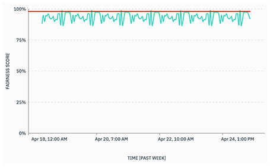
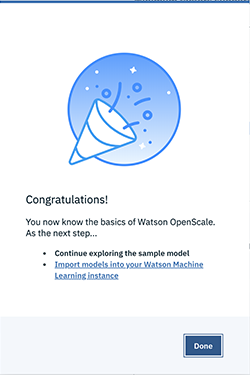

---

title: Trust and transparency for your machine learning models with {{site.data.keyword.aios_short}}
description: Monitor your machine learning deployments for bias, accuracy, and explainability
duration: 120
intro: In this tutorial, you will provision {{site.data.keyword.Bluemix}} machine learning and data services, create and deploy machine learning models in Watson studio, and configure the new IBM {{site.data.keyword.aios_full}} product to monitor your models for trust and transparency.
takeaways:
- See how {{site.data.keyword.aios_short}} provides trust and transparency for AI models
- Understand how {{site.data.keyword.Bluemix}} services and Watson Studio technologies can provide a seamless, AI-driven customer experience

copyright:
  years: 2018, 2019
lastupdated: "2019-06-11"

keywords: ai, getting started, tutorial, understanding, video

subcollection: ai-openscale

---

{:shortdesc: .shortdesc}
{:external: target="_blank" .external}
{:hide-dashboard: .hide-dashboard}
{:tip: .tip}
{:important: .important}
{:note: .note}
{:pre: .pre}
{:codeblock: .codeblock}
{:screen: .screen}
{:javascript: .ph data-hd-programlang='javascript'}
{:java: .ph data-hd-programlang='java'}
{:python: .ph data-hd-programlang='python'}
{:swift: .ph data-hd-programlang='swift'}

# 시작하기 튜토리얼(자동화된 설정)
{: #gettingstarted}

{{site.data.keyword.aios_full}}을 사용하면 엔터프라이즈가 비즈니스 애플리케이션 내에서 AI 라이프사이클을 자동화하고 조작 가능하도록 할 수 있으며 AI 모델에서 편향성을 제거하여 비즈니스 사용자들이 쉽게 설명하고 이해할 수 있도록 하며 비즈니스 트랜잭션에서 감사받을 수 있습니다. {{site.data.keyword.aios_short}}은 사용자가 선택한 도구 및 모델 서버 프레임워크에서 빌드되고 실행되는 AI 모델을 지원합니다.
{: shortdesc}

## 개요
{: #gs-view-demo}

이 동영상을 보면 {{site.data.keyword.aios_short}}의 간단한 개요를 알 수 있습니다.

  

    <iframe class="embed-responsive-item" id="youtubeplayer" title="AI에서의 신뢰성 및 투명성" type="text/html" width="640" height="390" src="https://www.youtube.com/embed/6Ei8rPVtCf8" frameborder="0" webkitallowfullscreen mozallowfullscreen allowfullscreen> </iframe>
  

## {{site.data.keyword.aios_short}}의 유스 케이스
{: #gs-use}

일반적인 대출자는 더 다양한 대상에 대해 재무 서비스의 디지털 포트폴리오를 확장해야 한다는 압박을 받으며 이로 인해 신용 위험 모델화에 대한 새로운 접근법을 필요로 합니다. 데이터 과학 팀은 현재 의사결정 트리 및 로지스틱 회귀 등의 표준 모델화 기술에 의존하고 있으며 이는 적절한 데이터 세트에 대해서는 잘 작동하며 쉽게 설명할 수 있는 추천을 작성합니다. 이는 신용 대출 결정이 투명하고 설명 가능해야 한다는 규제 요구사항을 충족합니다.

더 광범위하고 위험도가 높은 인구에 대해 신용 액세스를 제공하려면 신청자의 신용 히스토리가 담보 대출 및 자동차 대출 등의 일반적인 신용을 넘어 공과금 및 휴대전화 플랜 지불 히스토리 및 교육 및 직업 상의 직위와 같은 대체 신용 소스로 확장되어야 합니다. 이러한 새 데이터 소스는 약속을 제공하나 신청자의 연령, 성별 또는 기타 개인 특성을 기반으로 하는 편향성을 도입하는 예상치 못한 상관의 우도를 증가시켜 위험도 또한 도입할 수 있습니다.

그래디언트 부스티드 트리(gradient boosted tree) 및 신경망 등의 다양한 데이터세트에 가장 적합한 데이터 과학 기술은 매우 정확한 위험 모델을 생성할 수 있으나 비용을 감수해야 합니다. "블랙 박스" 모델은 GDPR(General Data Protection Regulation)의 22항 또는 소비자 금융 보호국에서 관리하는 연방 FCRA(Fair Credit Reporting Act) 등의 규제 승인을 보장하기 위해 어느정도 투명해질 필요가 있는 불투명한 예측을 생성합니다.

이 튜토리얼에서 제공된 신용 위험 모델은 각 대출 신청자에 대한 20가지 속성을 포함하는 훈련 데이터 세트를 사용합니다. 이러한 속성 중 두 가지인 연령 및 성별에 대해 편향성 테스트를 수행할 수 있습니다. 이 튜토리얼에서는 성별과 연령에 대한 편견에 중점을 둡니다. 훈련 데이터에 대한 자세한 정보는 [{{site.data.keyword.aios_short}}에서 내 훈련 데이터에 액세스해야 하는 이유는 무엇입니까?](/docs/services/ai-openscale?topic=ai-openscale-trainingdata#trainingdata)를 참조하십시오.

{{site.data.keyword.aios_short}}이 배치된 모델의, 다른 그룹(모니터되는 그룹)보다 한 그룹(참조 그룹)의 선호 결과("위험 없음")를 우선하는 경향을 모니터합니다. 이 튜토리얼에서 성별에 대해 모니터되는 그룹은 `female`이며 나이에 대해 모니터되는 그룹은 `19 - 25`입니다.

## 설정 옵션
{: #gs-module}

환경 설정 및 전문 지식 레벨에 따라 여러 가지 설정 옵션이 있습니다.

- [다음 자동 설정](/docs/services/ai-openscale?topic=ai-openscale-wos-fast-start)에서는 백그라운드에서 태스크를 수행하여 프로세스를 안내합니다.

   둘러보기를 사용하면 둘러보기를 보고 클릭하여 다음 부분으로 이동할 수 있습니다.
   
- [대화식 설정](/docs/services/ai-openscale?topic=ai-openscale-gs-obj#gs-obj)을 사용하면 따르기 쉬운 스크립트로 제어할 수 있습니다.

   샘플 모델과 삽입된 데이터로 공통 작업을 수행하는 데 인터페이스를 사용하십시오.
   
- [고급 튜토리얼](/docs/services/ai-openscale?topic=ai-openscale-crt-ov)을 사용하면 더 많은 기술 사용자가 전제조건 서비스를 자동으로 프로비저닝하고 구성하는 Python 모듈을 설치할 수 있습니다. 이 고급 튜토리얼은 수월하게 Python과 Notebook을 코딩할 수 있는 사용자나 데이터 과학자용입니다. 프로그래밍 방식으로 기능을 수행하는 데 {{site.data.keyword.aios_short}} 클라이언트를 사용하는 방법의 예입니다. 이 튜토리얼에서 사용하는 노트북은 [자동 설정](/docs/services/ai-openscale?topic=ai-openscale-wos-fast-start)에 따를 때와 동일한 위치에 생깁니다.

   이 모듈에는 pip 패키지 관리 시스템을 포함하는 Python 3이 설치되어 있어야 합니다. 지시사항을 보려면 [Python 모듈을 설치하여 {{site.data.keyword.aios_short}} 설정](/docs/services/ai-openscale?topic=ai-openscale-as-module)을 참조하십시오.

추가 튜토리얼 링크는 [추가 리소스](/docs/services/ai-openscale?topic=ai-openscale-arsc-ov)를 참조하십시오.

## 자동화된 설정
{: #wos-fast-start}

{{site.data.keyword.aios_short}}에서 모델을 모니터하는 방법을 빠르게 확인하려면 {{site.data.keyword.aios_short}} UI에 처음 로그인할 때 제공되는 데모 시나리오 옵션을 실행하십시오.  [UI 데모에 대한 작업](#wos-work-demo)을 참조하십시오.
{: shortdesc}

## 시작하기 전에
{: #wos-prereqs}

둘러보기를 시작하기 전에 다음 리소스가 설정되어 있어야 합니다. 

- [{{site.data.keyword.ibmid}}](/docs/account?topic=account-signup)
- [{{site.data.keyword.aios_full}}](/docs/services/ai-openscale?topic=ai-openscale-gettingstarted#crt-wos-faststart)

자동화된 설정 둘러보기는 사용자와의 상호작용을 가능한 최소화하도록 설계되었습니다. 따라서 다음 사항을 자동으로 결정합니다. 

- {{site.data.keyword.pm_full}} 인스턴스가 여러 개 설정되어 있는 경우, 설치 프로세스가 인스턴스 나열을 위한 API 호출을 실행하고 결과 목록에서 제일 먼저 표시할 {{site.data.keyword.pm_short}} 인스턴스를 선택합니다.  
- {{site.data.keyword.pm_full}}의 새 Lite 버전을 작성하기 위해 {{site.data.keyword.aios_short}} 설치 프로그램이 {{site.data.keyword.Bluemix}} 계정에 대해 기본 리소스 그룹을 사용합니다. 

### {{site.data.keyword.aios_full}} 서비스 프로비저닝
{: #crt-wos-faststart}

아직 수행하지 않은 경우 {{site.data.keyword.aios_full}}을 프로비저닝하십시오. 

- 계정과 아직 연관된 인스턴스가 없으면 [{{site.data.keyword.aios_short}} 인스턴스를 프로비저닝](https://{DomainName}/catalog/services/watson-openscale){: external}하십시오.

  

1. **카탈로그** > **AI** > **{{site.data.keyword.aios_short}}**를 클릭하십시오.
2. 서비스에 이름을 지정하고 플랜을 선택한 다음 **작성** 단추를 클릭하십시오.
3. {{site.data.keyword.aios_short}}를 시작하려면 **시작하기** 단추를 클릭하십시오.

## UI 데모에 대한 작업
{: #wos-work-demo}

1.  {{site.data.keyword.Bluemix}}에서 {{site.data.keyword.aios_short}} 인스턴스에 로그인하십시오.
1.  데모 시나리오에 대해 작업하려면 **데모 실행**을 클릭하십시오.

   

   {{site.data.keyword.aios_short}} 서비스가 프로비저닝되면 데모 시나리오를 검토할 수 있습니다.

   

프로비저닝이 완료되면 **시작합니다** 단추를 클릭하여 {{site.data.keyword.aios_short}} 대시보드를 둘러보고 [{{site.data.keyword.aios_short}}에서 결과 보기](#wos-open)를 진행하십시오.

   

## {{site.data.keyword.aios_short}}에서 결과 보기
{: #wos-open}

모델의 공정성 및 정확성에 대한 인사이트, 모니터링하는 데이터의 세부사항 및 개별 트랜잭션에 대한 설명 가능성을 확인하려면 {{site.data.keyword.aios_short}} 대시보드를 여십시오. 각 배치는 타일식으로 표시됩니다. 둘러보기는 다음 화면 캡처에 표시된 대로 `GermanCreditRiskModel`이라는 배치를 구성한 경우입니다.

   

### 인사이트 보기
{: #wos-insights}

인사이트 페이지에서는 구성되는 임계값에 의해 판별되는 공정성 및 정확성에 관한 문제를 한 눈에 볼 수 있습니다.

   

### 모니터링 데이터 보기
{: #wos-monitoring}

1.  인사이트 페이지에서 `GermanCreditRiskModelICP` 타일을 클릭하여 모니터링한 데이터의 세부사항을 확인하십시오.
1.  차트에서 마커를 클릭한 후 끌어서 데이터를 표시하는 일 및 기간을 확인한 다음 **세부사항 보기** 링크를 클릭하십시오. 또는 차트에서 다른 기간을 클릭하여 표시되는 데이터를 변경할 수 있습니다.

     - 예를 들면, 다음 화면은 특정 날짜 및 시간에 대한 데이터를 표시합니다. 날짜 및 시간은 언제 모듈을 실행하는지에 따라서 다릅니다.

     - 시계열 차트를 해석하는 것에 대한 정보는 [공정성, 분당 평균 요청 및 정확성 모니터링](/docs/services/ai-openscale-icp?topic=ai-openscale-icp-itc-timechart)을 참조하십시오.

   

1.  `SEX` 데이터 모니터링에 대한 세부사항을 보려면 드롭 다운 메뉴에서 `SEX`가 선택되었는지 확인하십시오.

    - 다음 화면 캡처에는 편향성이 있다는 점에 주의하십시오.
    
   

    - 특정 시간에 데이터 점 차트의 해석에 대한 정보는 [데이터 시각화](/docs/services/ai-openscale-icp?topic=ai-openscale-icp-itc-timechart#itc-data-visual)를 참조하십시오.

### 설명 가능성 보기
{: #wos-explain}

이전 섹션에 표시된 시각화 화면에서, 주어진 기간에 대한 편향성이 존재하는 시기에 기여하는 요인을 이해하려면 **편향된 트랜잭션** 단일 선택 단추를 클릭하십시오.

   

지난 시간 동안의 트랜잭션 ID가 편향성이 있는 해당 트랜잭션에 대해 나열됩니다. 이 모듈에서 사용되는 모델의 경우 사용 가능한 요청에 대한 편향성이 있습니다.

   

트랜잭션을 발견하고 설명하는 것에 대한 정보는 [설명 가능성 모니터링](/docs/services/ai-openscale-icp?topic=ai-openscale-icp-ie-ov)을 참조하십시오.

   

## 둘러보기 완료
{: #wos-done-demo}

1. **완료** 단추를 클릭하십시오.

   

2. **시작합니다** 단추를 클릭하여 {{site.data.keyword.aios_short}}에 대한 작업을 시작하십시오.

   

## 다음 단계
{: #gs-next}

- [데이터 보기 및 해석](/docs/services/ai-openscale?topic=ai-openscale-it-ov) 및 [설명 가능성 모니터링](/docs/services/ai-openscale?topic=ai-openscale-ie-ov)에 대해 자세히 알아보십시오.
