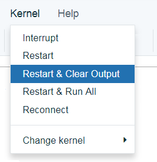

---

copyright:
  years: 2018, 2019
lastupdated: "2019-06-24"

keywords: tutorial, Jupyter notebooks, Watson Studio projects, projects, models, deploy, 

subcollection: ai-openscale

---

{:shortdesc: .shortdesc}
{:new_window: target="_blank"}
{:tip: .tip}
{:important: .important}
{:note: .note}
{:pre: .pre}
{:codeblock: .codeblock}
{:screen: .screen}
{:javascript: .ph data-hd-programlang='javascript'}
{:java: .ph data-hd-programlang='java'}
{:python: .ph data-hd-programlang='python'}
{:swift: .ph data-hd-programlang='swift'}

# Python SDK 튜토리얼(고급)
{: #crt-ov}

## 시나리오
{: #crt-scenario}

일반적인 대출자는 더 다양한 대상에 대해 재무 서비스의 디지털 포트폴리오를 확장해야 한다는 압박을 받으며 이로 인해 신용 위험 모델화에 대한 새로운 접근법을 필요로 합니다. 데이터 과학 팀은 현재 의사결정 트리 및 로지스틱 회귀 등의 표준 모델화 기술에 의존하고 있으며 이는 적절한 데이터 세트에 대해서는 잘 작동하며 쉽게 설명할 수 있는 추천을 작성합니다. 이는 신용 대출 결정이 투명하고 설명 가능해야 한다는 규제 요구사항을 충족합니다.

더 광범위하고 위험도가 높은 인구에 대해 신용 액세스를 제공하려면 신청자의 신용 히스토리가 담보 대출 및 자동차 대출 등의 일반적인 신용을 넘어 공과금 및 휴대전화 플랜 지불 히스토리 및 교육 및 직업 상의 직위와 같은 대체 신용 소스로 확장되어야 합니다. 이러한 새 데이터 소스는 약속을 제공하나 신청자의 연령, 성별 또는 기타 개인 특성을 기반으로 하는 편향성을 도입하는 예상치 못한 상관의 우도를 증가시켜 위험도 또한 도입할 수 있습니다.

그래디언트 부스티드 트리(gradient boosted tree) 및 신경망 등의 다양한 데이터세트에 가장 적합한 데이터 과학 기술은 매우 정확한 위험 모델을 생성할 수 있으나 비용을 감수해야 합니다. "블랙 박스" 모델은 GDPR(General Data Protection Regulation)의 22항 또는 소비자 금융 보호국에서 관리하는 연방 FCRA(Fair Credit Reporting Act) 등의 규제 승인을 보장하기 위해 어느정도 투명해질 필요가 있는 불투명한 예측을 생성합니다.

이 튜토리얼에서 제공된 신용 위험 모델은 각 대출 신청자에 대한 20가지 속성을 포함하는 훈련 데이터 세트를 사용합니다. 이러한 속성 중 두 가지인 연령 및 성별에 대해 편향성 테스트를 수행할 수 있습니다. 이 튜토리얼에서는 성별과 연령에 대한 편견에 중점을 둡니다. 훈련 데이터에 대한 자세한 정보는 [{{site.data.keyword.aios_short}}에서 내 훈련 데이터에 액세스해야 하는 이유는 무엇입니까?](/docs/services/ai-openscale?topic=ai-openscale-trainingdata#trainingdata)를 참조하십시오.

{{site.data.keyword.aios_short}}이 배치된 모델의, 다른 그룹(모니터되는 그룹)보다 한 그룹(참조 그룹)의 선호 결과("위험 없음")를 우선하는 경향을 모니터합니다. 이 튜토리얼에서 성별에 대해 모니터되는 그룹은 `female`이며 나이에 대해 모니터되는 그룹은 `18 - 25`입니다.

## 선행 조건
{: #crt-prereqs}

이 튜토리얼은 "Python 3.5 with Spark" 런타임 환경을 사용하여 Watson Studio 프로젝트에서 실행되어야 하는 Jupyter Notebook을 사용합니다. 다음과 같은 {{site.data.keyword.cloud_notm}} 서비스에 대한 서비스 인증 정보가 필요합니다.

- Cloud Object Storage(Watson Studio 프로젝트를 저장하는 목적)
- {{site.data.keyword.aios_short}}
- Watson Machine Learning
- (선택사항) Databases for PostgreSQL 또는 Db2 Warehouse

Jupyter Notebook은 독일어 신용 위험 모델을 교육, 작성 및 배치하고 {{site.data.keyword.aios_short}}을 구성하여 배치를 모니터하며 {{site.data.keyword.aios_short}} 인사이트 대시보드에서 볼 수 있도록 7일 간의 히스토리 레코드 및 측정치를 제공합니다. 또한 선택적으로 Watson Studio와 Spark로 지속적인 학습을 할 수 있도록 모델을 구성할 수 있습니다.

## 소개
{: #crt-intro}

이 튜토리얼에서는 다음과 같이 학습합니다.

- {{site.data.keyword.cloud_notm}} 기계 학습 및 스토리지 서비스를 프로비저닝합니다.
- Watson Studio 프로젝트를 설정하고 Python Notebook을 실행하여 기계 학습 모델을 작성, 교육 및 배치합니다.
- Python Notebook을 실행하여 데이터 마트를 작성하고 성능, 정확성 및 공정성 모니터를 구성하고 모니터할 데이터를 작성합니다.
- {{site.data.keyword.aios_short}} 인사이트 탭에서 결과를 봅니다.

## {{site.data.keyword.cloud_notm}} 서비스 프로비저닝
{: #crt-services}

{{site.data.keyword.ibmid}}를 사용하여 [{{site.data.keyword.cloud_notm}} 계정 ](https://{DomainName}){: new_window}에 로그인하십시오. 서비스를 프로비저닝할 때 특히 Db2 Warehouse를 사용하는 경우 선택한 조직 및 영역이 모든 서비스에 대해 동일한지 확인하십시오.

### {{site.data.keyword.DSX}} 계정 작성
{: #crt-wstudio}

- 계정과 연관된 인스턴스가 아직 없다면 [{{site.data.keyword.DSX}} 인스턴스 ](https://{DomainName}/catalog/services/watson-studio){: new_window}를 작성하십시오.

  

- 서비스에 이름을 지정하고 Lite(무료) 플랜을 선택한 다음 **작성** 단추를 클릭하십시오.

### {{site.data.keyword.cos_full_notm}} 서비스 프로비저닝
{: #crt-cos}

- 아직 계정과 연관된 서비스가 없으면 [{{site.data.keyword.cos_short}} 서비스 ](https://{DomainName}/catalog/services/cloud-object-storage){: new_window}를 프로비저닝하십시오.

  

- 서비스에 이름을 지정하고 Lite(무료) 플랜을 선택한 다음 **작성** 단추를 클릭하십시오.

### {{site.data.keyword.pm_full}} 서비스 프로비저닝
{: #crt-wml}

- 아직 계정과 연관된 인스턴스가 없다면 [{{site.data.keyword.pm_short}} 인스턴스 ](https://{DomainName}/catalog/services/machine-learning){: new_window}를 프로비저닝하십시오.

  

- 서비스에 이름을 지정하고 Lite(무료) 플랜을 선택한 다음 **작성** 단추를 클릭하십시오.

### (선택사항) Databases for PostgreSQL 또는 DB2 Warehouse 서비스 프로비저닝
{: #crt-db2}

유료 {{site.data.keyword.cloud_notm}} 계정이 있는 경우 `Databases for PostgreSQL` 또는 `Db2 Warehouse` 서비스를 프로비저닝하여 {{site.data.keyword.DSX}} 및 지속적인 학습 서비스와의 통합을 최대한 활용할 수 있습니다. 유료 서비스를 프로비저닝하지 않기로 선택하는 경우 무료 내부 PostgreSQL 스토리지를 {{site.data.keyword.aios_short}}과 함께 사용할 수 있으나 모델에 대한 연속 학습을 구성할 수 없습니다.

- 아직 계정과 연관된 서비스가 없으면 [Databases for PostgreSQL 서비스 ](https://{DomainName}/catalog/services/databases-for-postgresql) 또는 [Db2 Warehouse 서비스 ](https://{DomainName}/catalog/services/db2-warehouse)를 프로비저닝하십시오.

  

  

- 서비스에 이름을 지정하고 표준 플랜(Databases for PostgreSQL) 또는 입문 플랜(Db2 Warehouse)을 선택한 다음 **작성** 단추를 클릭하십시오.

## {{site.data.keyword.DSX}} 프로젝트 설정
{: #crt-set-wstudio}

- [{{site.data.keyword.DSX}} 계정 ](https://dataplatform.ibm.com/){: new_window}에 로그인하십시오. {{site.data.keyword.avatar}}를 클릭하고 사용하는 계정이 {{site.data.keyword.cloud_notm}} 서비스를 작성하는 데 사용한 동일한 계정인지 확인하십시오.

  

- {{site.data.keyword.DSX}}에서 새 프로젝트를 작성하여 시작하십시오. "프로젝트 작성"을 선택하십시오.

  

- **표준** 타일을 선택하여 프로젝트를 작성하십시오.

  

- 프로젝트에 이름과 설명을 지정하고 작성한 Cloud Object Storage 서비스가 **스토리지** 드롭 다운에서 선택되어 있는지 확인하고 **작성**을 클릭하십시오.

## {{site.data.keyword.pm_short}} 모델 작성 및 배치
{: #crt-make-model}

### `Working with Watson Machine Learning` 노트북을 {{site.data.keyword.DSX}} 프로젝트에 추가
{: #crt-add-notebook}

- 다음 파일을 다운로드하십시오.

    - [Watson Machine Learning에 대한 작업 ](https://github.com/pmservice/ai-openscale-tutorials/blob/master/notebooks/Watson%20OpenScale%20and%20Watson%20ML%20Engine.ipynb){: new_window}

- **자산** 탭의 {{site.data.keyword.DSX}} 프로젝트에서 **프로젝트에 추가** 단추를 클릭하고 드롭 다운 메뉴에서 **노트북**을 선택하십시오.

  

- **파일에서**를 선택하십시오.

  

- 그런 다음 **파일 선택** 단추를 클릭하고 다운로드한 "german_credit_lab.ipynb" Notebook 파일을 선택하십시오.

  

- **런타임 선택** 섹션에서 Spark 옵션이 있는 Python 3.5를 선택하십시오.

- **Notebook 작성**을 클릭하십시오.

### `Working with Watson Machine Learning` Notebook 편집 및 실행
{: #crt-edit-notebook}

`Working with Watson Machine Learning` Notebook에는 사용자가 실행할 Python 코드 내의 각 단계에 대한 자세한 지침이 포함되어 있습니다. Notebook을 통해 실행하면서 각 명령이 수행하는 내용에 대해 이해하는 것이 중요합니다.
{: tip}

- Watson Studio 프로젝트의 **자산** 탭에서 `Working with Watson Machine Learning` Notebook 옆의 **편집** 아이콘을 클릭하여 이를 편집하십시오.

- "서비스 프로비저닝 및 인증 정보 구성" 섹션에서 다음과 같이 변경하십시오.

    - 지침에 따라 {{site.data.keyword.cloud_notm}} API 키를 작성하고 복사하여 붙여넣으십시오.

    - Watson Machine Learning(WML) 서비스 인증 정보를 사용자가 앞에서 작성한 인증 정보로 대체하십시오.

    - DB 인증 정보를 Databases for PostgreSQL용으로 작성한 인증 정보로 대체하십시오.

    - 이전에 무료 내부 PostgreSQL 데이터베이스를 데이터 마트로 사용하도록 {{site.data.keyword.aios_short}}을 구성한 경우, Databases for PostgreSQL 서비스를 사용하는 새 데이터 마트로 전환할 수 있습니다. 이전 PostgreSQL 구성을 삭제하고 새 구성을 작성하려면 KEEP_MY_INTERNAL_POSTGRES 변수를 `False`로 설정하십시오.

        Notebook이 기존의 내부 PostgreSQL 데이터 마트를 제거하고 제공된 DB 인증 정보를 사용하여 새 데이터 마트를 작성합니다. **데이터 마이그레이션이 발생하지 않습니다**.
        {: important}

- 일단 서비스를 프로비저닝하고 인증 정보를 입력했으면 Notebook을 실행할 준비가 된 것입니다. **커널** 메뉴 항목을 클릭하고 메뉴에서 **다시 시작 및 결과 지우기**를 선택하십시오.

  

- 이제 Notebook의 각 단계를 순서대로 실행하십시오. 각 단계에서 설명한 대로 작업이 발생하는지 관찰하십시오. "디버깅을 돕기 위한 추가 데이터" 섹션의 단계를 포함하여 모든 단계를 완료하십시오.

최종적인 결과는 **Spark 독일어 위험 배치** 모델을 작성하고 교육하여 {{site.data.keyword.aios_short}} 서비스 인스턴스에 배치했다는 것입니다. {{site.data.keyword.aios_short}}에서 모델이 성별(이 경우, 여성) 또는 연령(이 경우, 18-25세)에 대해 편향성이 있는지 검사하도록 구성됩니다.

## 결과 보기
{: #crt-view-results}

### 배치에 대한 인사이트 보기
{: #crt-view-insights}

[{{site.data.keyword.aios_short}} 대시보드 ](https://aiopenscale.cloud.ibm.com/aiopenscale/){: new_window}를 사용하여 **인사이트** 탭을 클릭하십시오.

  

인사이트 페이지에서 배치된 모델에 대한 메트릭 개요를 볼 수 있습니다. Notebook을 실행할 때 설정한 임계값 아래로 떨어진 공정성 또는 정확성 메트릭에 대한 경보를 쉽게 볼 수 있습니다. 이 튜토리얼에서 사용된 데이터와 설정은 여기에서 표시된 정확성 및 공정성과 유사한 메트릭을 갖게 됩니다.

  

### 배치에 대한 모니터링 데이터 보기
{: #crt-view-mon-data}

1. 모니터링 세부사항을 보려면 **인사이트** 페이지에서 배치에 해당되는 타일을 클릭하십시오. 배치에 대한 모니터링 데이터가 표시됩니다. 
2. 마커를 차트를 가로질러 밀어서 특정한 한 시간 창에 대한 데이터를 선택하십시오. 
3. **세부사항 보기** 링크를 클릭하십시오.

  

이제 모니터한 데이터에 대한 차트를 검토할 수 있습니다. 이 예의 경우, "성별" 특성에 대해 `female` 그룹이 `male` 그룹의 78% 보다 낮은 68%의 "위험 없음" 선호 결과를 수신했음을 알 수 있습니다.

  

### 모델 트랜잭션에 대한 설명 가능성 보기
{: #crt-view-explain}

각 배치에 대해 특정 트랜잭션에 대한 데이터의 설명 가능성을 볼 수 있습니다.

이미 어느 트랜잭션을 볼 것인지 알고 있는 경우, 트랜잭션 ID를 사용하여 신속하게 찾을 수 있습니다. 네비게이터에서 배치 타일을 클릭한 후에 **트랜잭션 설명**  아이콘을 클릭하고 트랜잭션 ID를 입력한 다음 **Enter**를 누르십시오.
{: tip}

PostgreSQL의 내부 Lite 버전을 사용하는 경우, 데이터베이스 인증 정보를 검색하지 못할 수도 있습니다. 이로 인해 트랜잭션을 보지 못할 수도 있습니다.
{: note}

1. 최근의 편향된 데이터 차트에서 **트랜잭션 보기** 단추를 클릭하십시오.

  

  배치가 편향된 방법으로 작동한 트랜잭션의 목록이 표시됩니다. 
  
2. **ACTION** 열에서 트랜잭션 중 하나를 선택하고 **설명** 링크를 클릭하십시오.

  

모델의 신뢰도, 신뢰수준에 기여한 요인 및 모델에 공급된 열을 포함하여 모델이 결론에 이르게 된 방법을 설명합니다.

  
  
## 다음 단계
{: #crt-next-steps}

- [데이터 보기 및 해석](/docs/services/ai-openscale?topic=ai-openscale-it-ov) 및 [설명 가능성 모니터링](/docs/services/ai-openscale?topic=ai-openscale-ie-ov)에 대해 자세히 알아보십시오.
