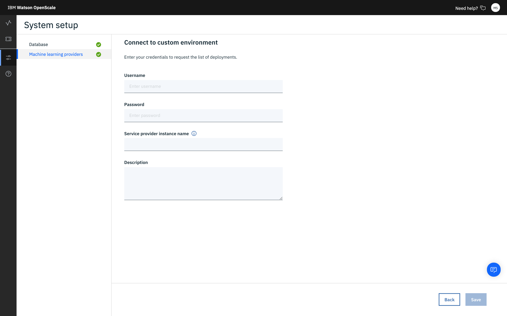

---

copyright:
  years: 2018, 2019
lastupdated: "2019-06-28"

keywords: supported frameworks, models, model types, limitations, limits, custom machine learning engine, custom

subcollection: ai-openscale

---

{:shortdesc: .shortdesc}
{:external: target="_blank" .external}
{:tip: .tip}
{:important: .important}
{:note: .note}
{:pre: .pre}
{:codeblock: .codeblock}
{:download: .download}
{:screen: .screen}
{:javascript: .ph data-hd-programlang='javascript'}
{:java: .ph data-hd-programlang='java'}
{:python: .ph data-hd-programlang='python'}
{:swift: .ph data-hd-programlang='swift'}
{:faq: data-hd-content-type='faq'}

# 사용자 정의 ML 프레임워크
{: #frmwrks-custom}

사용자 정의 기계 학습 프레임워크를 사용하여 {{site.data.keyword.aios_full}}에서 페이로드 로깅, 피드백 로깅을 수행하고 성능 정확성, 런타임 편향성 감지, 설명 가능성 및 자동-편향성 함수를 측정할 수 있습니다. 사용자 정의 기계 학습 프레임워크는 {{site.data.keywor.pm_full}}에 대해 동등함을 보유해야 합니다. 

{{site.data.keyword.aios_full}}에서는 다음 사용자 정의 기계 학습 프레임워크를 전적으로 지원합니다.
{: shortdesc}

표 1. 프레임워크 지원 세부사항

| 프레임워크 | 문제점 유형 | 데이터 유형 |
|:---|:---:|:---:|
| {{site.data.keyword.pm_full}}과 동일 | 분류 | 정형 |
{: caption="프레임워크 지원 세부사항" caption-side="top"}

## {{site.data.keyword.aios_short}}에 사용자 정의 기계 학습 엔진 추가
{: #frmwrks-custom-add}

다음 방법 중 하나를 사용하여 {{site.data.keyword.aios_short}}이 사용자 정의 기계 학습 제공자와 함께 작동하도록 구성할 수 있습니다.

- 사용자 정의 기계 학습 제공자를 {{site.data.keyword.aios_short}}에 처음 추가하는 경우 구성 인터페이스를 사용할 수 있습니다. 자세한 정보는 [사용자 정의 기계 학습 인스턴스 지정](/docs/services/ai-openscale?topic=ai-openscale-co-connect)을 참조하십시오.
- Python SDK를 사용하여 기계 학습 제공자를 추가할 수도 있습니다. 제공자가 둘 이상인 경우 이 방법을 사용해야 합니다. 이를 프로그래밍 방식으로 수행하는 방법은 [사용자 정의 기계 학습 엔진 바인딩](/docs/services/ai-openscale?topic=ai-openscale-cml-connect#cml-cusbind)을 참조하십시오.


## 샘플 노트북
{: #frmwrks-custom-smpl-ntbks}

- [Kubernetes 클러스터를 사용하여 사용자 정의 기계 학습 엔진 작성](https://github.com/pmservice/ai-openscale-tutorials/tree/master/applications/custom-ml-engine-bluemix){: external}
- [데이터 마트 작성, 모델 배치 모니터링 및 데이터 분석](https://github.com/pmservice/ai-openscale-tutorials/blob/master/notebooks/AI%20OpenScale%20and%20Custom%20ML%20Engine.ipynb){: external}

## 추가 탐색
{: #frmwrks-custom-mediumblogs}

[Watson OpenScale로 사용자 정의 기계 학습 엔진 모니터](https://developer.ibm.com/patterns/monitor-custom-machine-learning-engine-with-ai-openscale/){: external}

## 사용자 정의 기계 학습 엔진
{: #fmrk-workaround-customengine}

사용자 정의 기계 학습 엔진에서는 기계 학습 모델과 웹 애플리케이션의 인프라 및 호스팅 기능을 제공합니다. {{site.data.keyword.aios_short}}에서 지원하는 사용자 정의 기계 학습 엔진에서는 다음 요구사항을 준수합니다.

- 두 가지 유형의 REST API 엔드포인트를 노출합니다.

   * 검색 엔드포인트(배치 및 상세 정보의 목록 가져오기)
   * 스코어링 엔드포인트(온라인 및 실시간 스코어링)

- 모든 엔드포인트는 지원될 Swagger 스펙과 호환 가능해야 합니다.

- 배치의 입력 페이로드와 출력은 스펙에 설명된 JSON 파일 형식을 준수해야 합니다.

이 단계에서는 `BasicAuth` 또는 `none` 형식만 지원됩니다.
{: Note}

다음 예제에서는 REST API 엔드포인트 스펙을 보여줍니다.


다음 예제에서는 입력 페이로드의 형식을 보여줍니다.


## 언제 사용자 정의 기계 학습 엔진을 선택하는 것이 가장 좋습니까?
{: #fmrk-workaround-enging-choice}

사용자 정의 기계 학습 엔진은 다음 상황이 참일 때 선택하는 것이 가장 좋습니다.

- 기계 학습 모델을 제공하기 위해 사전 설정된 사용 가능한 제품을 사용하고 있지 않습니다. 해당 작업을 수행하도록 고유 시스템을 개발했습니다. 따라서 {{site.data.keyword.aios_short}}에서 이 시스템을 직접 지원하지 않습니다.
- 서드파티에서 사용 중인 서비스 엔진은 {{site.data.keyword.aios_short}}에서 아직 지원하지 않습니다. 이 경우 사용자 정의 기계 학습 엔진을 원래 또는 고유 배치에 사용할 랩퍼로 개발하는 것을 고려하십시오.

## 사용자 정의 ML 서비스 인스턴스 지정
{: #co-connect}

{{site.data.keyword.aios_short}} 도구에서 첫 번째 단계는 서비스 인스턴스를 지정하는 것입니다. 서비스 인스턴스는 사용자의 AI 모델 및 배치를 저장하는 곳입니다.
{: shortdesc}

## 사용자 정의 서비스 인스턴스 연결
{: #co-config}

{{site.data.keyword.aios_short}}은 서비스 인스턴스에서 AI 모델 및 배치에 연결됩니다. 사용자 정의 서비스를 연결할 수 있습니다.

1.  **구성** 탭의 탐색 분할창에서 **기계 학습 제공자**를 클릭하십시오. 

   

2. **기계 학습 제공자 추가** 단추를 클릭한 후 **사용자 정의 환경** 타일을 클릭하십시오. 

   

3. 사용자 정의 기계 학습 제공자의 이름 및 설명을 입력한 후 **다음**을 클릭하십시오. 

4. [목록을 요청](/docs/services/ai-openscale?topic=ai-openscale-co-connect#co-config-request-list)하거나 [개별 스코어링 엔드포인트를 입력하여](/docs/services/ai-openscale?topic=ai-openscale-co-connect#co-config-scoring-endpoints) 배치에 연결할지 선택하십시오.

   
    
5. **다음**을 클릭하십시오.

### 배치 목록 요청
{: #co-config-request-list}

1. **배치 목록 요청** 타일을 선택한 경우에는 인증 정보 및 API 엔드포인트를 입력한 후 **저장**을 클릭하십시오.

   

2. 기계 학습 설정을 저장한 후에는 **대시보드**로 돌아가서 **인사이트** 탭을 클릭한 후 **대시보드에 추가** 단추를 클릭하십시오. 

3. 목록에서 배치를 선택한 후 **구성**을 클릭하십시오.

이제 모니터를 구성할 준비가 되었습니다.

### 개별 스코어링 엔드포인트 제공
{: #co-config-scoring-endpoints}

1. **개별 스코어링 엔드포인트 입력** 타일을 선택한 경우에는 API 엔드포인트에 대한 인증 정보를 입력한 후 **저장**을 클릭하십시오.

2. 기계 학습 설정을 저장한 후에는 **대시보드**로 돌아가서 **인사이트** 탭을 클릭한 후 **대시보드에 추가** 단추를 클릭하십시오. 

3. **엔드포인트 추가** 단추를 클릭하십시오.

4. 드롭 다운 메뉴에서 사용자 정의 환경을 선택하고 배치 이름 및 API 엔드포인트를 입력한 후 **저장**을 클릭하십시오.

이제 모니터를 구성할 준비가 되었습니다.

### 작동 방식
{: #co-works}

다음 이미지는 사용자 정의 환경 지원을 보여줍니다.


또한 다음 링크를 참조할 수 있습니다.

[{{site.data.keyword.aios_short}} 페이로드 로깅 API](https://{DomainName}/apidocs/ai-openscale#publish-scoring-payload){: external}

[사용자 정의 배치 API](https://aiopenscale-custom-deployement-spec.mybluemix.net/){: external}

[Python 클라이언트 바인딩 SDK](http://ai-openscale-python-client.mybluemix.net/#bindings){: external}

[사용자 정의 기계 학습 엔진에 대한 작업](https://github.com/pmservice/ai-openscale-tutorials/blob/master/notebooks/AI%20OpenScale%20and%20Custom%20ML%20Engine.ipynb){: external}

[IBM Watson OpenScale용 Python SDK](https://pypi.org/project/ibm-ai-openscale/){: external}

- **모니터를 지원하기 위한 모델의 입력 기준**

  모델은 기본적으로 이름 지정된 필드 및 해당 값의 콜렉션인 특성 벡터를 입력으로 사용해야 합니다(편향성에 대해 모니터되는 필드가 해당 필드 중 하나입니다).

  ```bash
  {
    "fields": [
        "name",
        "age",
        "position"
    ],
    "values": [
        [
            "john",
            33,
            "engineer"
        ],
        [
            "mike",
            23,
            "student"
        ]
    ]
  }
  ```

  이 예에서 `"age"`는 누군가가 공정성을 평가하고 있는 필드일 수 있습니다.

  입력이 입력 특성 공간에서 변환된 텐서/메트릭스인 경우(텍스트 또는 이미지로부터의 심층 학습인 경우에 자주 발생), 현재 릴리스에서는 모델이 {{site.data.keyword.aios_short}} 플랫폼에 의해 처리될 수 없습니다. 확장하면 텍스트 또는 이미지 입력이 있는 심층 학습 모델은 편향성 발견 및 완화를 위해 처리될 수 없습니다.

  또한 설명 가능성을 지원하기 위해 훈련 데이터가 로드되어야 합니다.

  텍스트에 대한 설명 가능성의 경우, 전체 텍스트가 다음 특성 중 하나여야 합니다. 사용자 정의 모델의 이미지에 대한 설명 가능성은 현재 릴리스에서 지원되지 않습니다.
  {: note}

- **모니터를 지원하기 위한 모델의 출력 기준**

  모델은 해당 모델에서 다양한 클래스의 예측 확률과 함께 입력 특성 벡터를 출력해야 합니다.

  ```bash
  {
    "fields": [
        "name",
        "age",
        "position",
        "prediction",
        "probability"
    ],
    "labels": [
        "personal",
        "camping"
    ],
    "values": [
        [
            "john",
            33,
            "engineer",
            "personal",
            [
                0.6744664422398081,
                0.3255335577601919
            ]
        ],
        [
            "mike",
            23,
            "student"
            "camping",
            [
                0.2794765664946941,
                0.7205234335053059
            ]
        ]
    ]
  }
  ```

  이 예에서 `"personal"` 및 `"camping"`은 가능한 클래스이며 각 스코어링 출력의 스코어는 두 클래스 모두에 지정됩니다. 예측 확률이 누락되면, 편향성 발견은 작동하나 자동 편향성 제거는 작동하지 않습니다.

  이전 스코어링 출력은 {{site.data.keyword.aios_short}}이 REST를 통해 호출할 수 있는 라이브 스코어링 엔드포인트에서 액세스 가능해야 합니다. AzureML, SageMaker 및 {{site.data.keyword.pm_full}}의 경우 {{site.data.keyword.aios_short}}이 직접 원시 스코어링 엔드포인트에 연결되므로 스코어링 스펙 구현에 대해 걱정하지 않아도 됩니다.

## 사용자 정의 기계 학습 엔진 예
{: #fmrk-workaround-cstmmlsengex}

다음 예를 사용하여 고유 사용자 정의 기계 학습 엔진을 설정하십시오.
{: shortdesc}

### Python 및 Flask
{: #fmrk-workaround-pandflask}

[git에 공개된 사용자 정의 ML 엔진 예](https://github.com/pmservice/ai-openscale-tutorials/tree/master/applications/custom-ml-engine-bluemix){: external}에서는 python과 flask를 사용하여 scikit-learn 모델에 서비스를 제공합니다.

[README 파일](https://github.com/pmservice/ai-openscale-tutorials/tree/master/applications/custom-ml-engine-bluemix){: external}에서는 IBM Cloud의 cf 애플리케이션 외에도 테스트용으로 앱을 로컬에 배치하는 방법을 설명합니다. REST API 엔드포인트의 구현은 [app.py 파일](https://github.com/pmservice/ai-openscale-tutorials/blob/master/applications/custom-ml-engine-bluemix/app.py){: external}에 있습니다.

### Node.js
{: #fmrk-workaround-nodejs}

[여기에는 Node.js](https://github.com/pmservice/ai-openscale-tutorials/tree/master/applications/custom-ml-engine-nodejs){: external}로 작성된 사용자 정의 기계 학습 엔진의 예도 있습니다.

### End2end 코드 패턴
{: #fmrk-workaround-e2ecode}

{{site.data.keyword.aios_short}}와의 통합 및 사용자 정의 엔진 배치에 관한 end2end 예를 보여주는 [코드 패턴](https://developer.ibm.com/patterns/monitor-custom-machine-learning-engine-with-ai-openscale){: external}.

## 사용자 정의 기계 학습 엔진을 사용하여 페이로드 로깅
{: #cml-cusconfig}

### 사용자 정의 기계 학습 엔진을 바인딩하십시오.
{: #cml-cusbind}

- 비{{site.data.keyword.pm_full}} 엔진이 사용자 정의로 바인딩됩니다. 즉, 단지 메타데이터이며 비{{site.data.keyword.pm_full}} 서비스와의 직접 통합은 없습니다. `client.data_mart.bindings.add` 메소드를 사용하여 두 개 이상의 기계 학습 엔진을 {{site.data.keyword.aios_short}}에 바인딩할 수 있습니다.

    ```python
    custom_engine_credentials = {
    "url": "***",
    "username": "***",
    "password": "***"
    }

    binding_uid = client.data_mart.bindings.add('My custom engine', CustomMachineLearningInstance(custom_engine_credentials))

    bindings_details = client.data_mart.bindings.get_details()
    ```
  다음 명령을 사용하여 서비스 바인딩을 볼 수 있습니다.

    ```python
    client.data_mart.bindings.list()
    ```

    

### 사용자 정의 구독 추가
{: #cml-cussub}

- 구독 추가

    ```python
    client.data_mart.subscriptions.add(CustomMachineLearningAsset(source_uid='action', binding_uid=binding_uid, prediction_column='predictedActionLabel'))
    ```

- 구독 목록 가져오기

    ```python
    subscriptions = client.data_mart.subscriptions.get_details()

    subscriptions_uids = client.data_mart.subscriptions.get_uids()
    print(subscriptions_uids)
    ```

### 페이로드 로깅 사용 설정
{: #cml-cusenlog}

- 구독에서 페이로드 로깅 사용 설정

    ```python
    subscription.payload_logging.enable()
    ```

- 로깅 세부사항 가져오기

    ```python
    subscription.payload_logging.get_details()
    ```

자세한 정보는 [페이로드 로깅](/docs/services/ai-openscale?topic=ai-openscale-cml-connect)을 참조하십시오.

### 스코어링 및 페이로드 로깅
{: #cml-cusscore}

- 모델을 스코어링하십시오. 전체 예는 [IBM {{site.data.keyword.aios_full}} & 사용자 정의 ML 엔진 노트북](https://github.com/pmservice/ai-openscale-tutorials/blob/master/notebooks/AI%20OpenScale%20and%20Custom%20ML%20Engine.ipynb){: external}을 참조하십시오.

- 페이로드 로깅 테이블에 요청 및 응답 저장

    ```python
    records_list = [PayloadRecord(request=request_data, response=response_data, response_time=response_time), PayloadRecord(request=request_data, response=response_data, response_time=response_time)]

    subscription.payload_logging.store(records=records_list)
    ```
    **참고**: Python 외의 언어인 경우에도 REST API를 사용하여 직접 페이로드 로깅을 수행할 수 있습니다.

    ```json
    token_endpoint = "https://iam.cloud.ibm.com/identity/token"
    headers = {
            "Content-Type": "application/x-www-form-urlencoded",
            "Accept": "application/json"
    }

    data = {
            "grant_type":"urn:ibm:params:oauth:grant-type:apikey",
            "apikey":aios_credentials["apikey"]
    }

    req = requests.post(token_endpoint, data=data, headers=headers)
    token = req.json()['access_token']
    ```

    ```json
    import requests, uuid

    PAYLOAD_STORING_HREF_PATTERN = '{}/v1/data_marts/{}/scoring_payloads'
    endpoint = PAYLOAD_STORING_HREF_PATTERN.format(aios_credentials['url'], aios_credentials['data_mart_id'])

    payload = [{
      'binding_id': binding_uid,
      'deployment_id': subscription.get_details()['entity']['deployments'][0]['deployment_id'],
      'subscription_id': subscription.uid,
      'scoring_id': str(uuid.uuid4()),
      'response': response_data,
      'request': request_data
    }]

    headers = {"Authorization": "Bearer " + token}
    req_response = requests.post(endpoint, json=payload, headers = headers)
    print("Request OK: " + str(req_response.ok))
    ```


## 다음 단계
{: #fmrk-workaround-nxt-steps-over}

이제 {{site.data.keyword.aios_short}}이 [모니터를 구성](/docs/services/ai-openscale?topic=ai-openscale-mo-config)할 준비가 되었습니다.

[사용자 정의 기계 학습 엔진 예](/docs/services/ai-openscale?topic=ai-openscale-fmrk-workaround-cstmmlsengex) 중 하나를 사용하여 사용자 고유의 솔루션을 구현하십시오.
