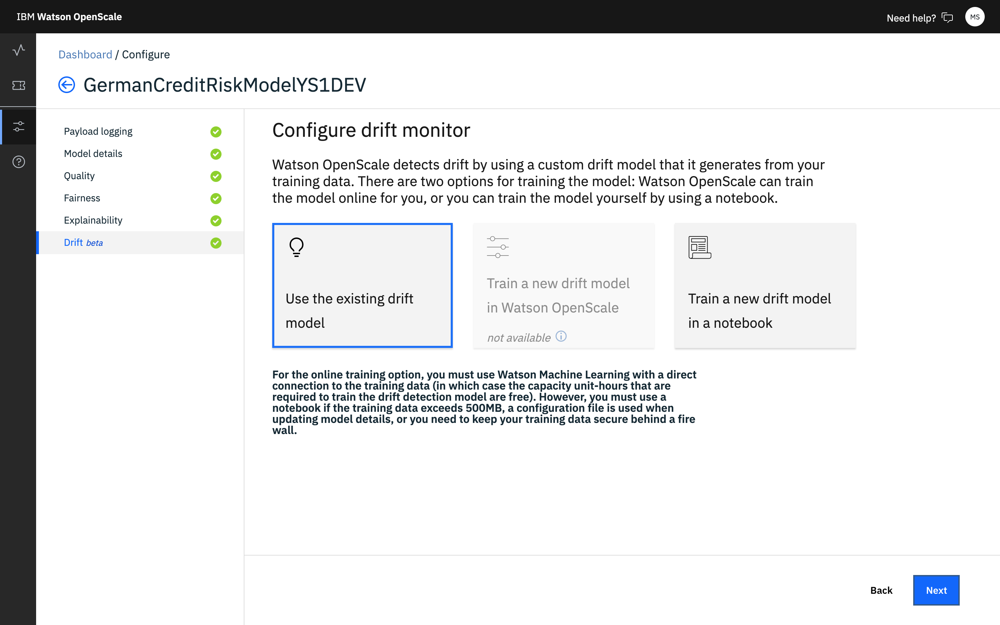
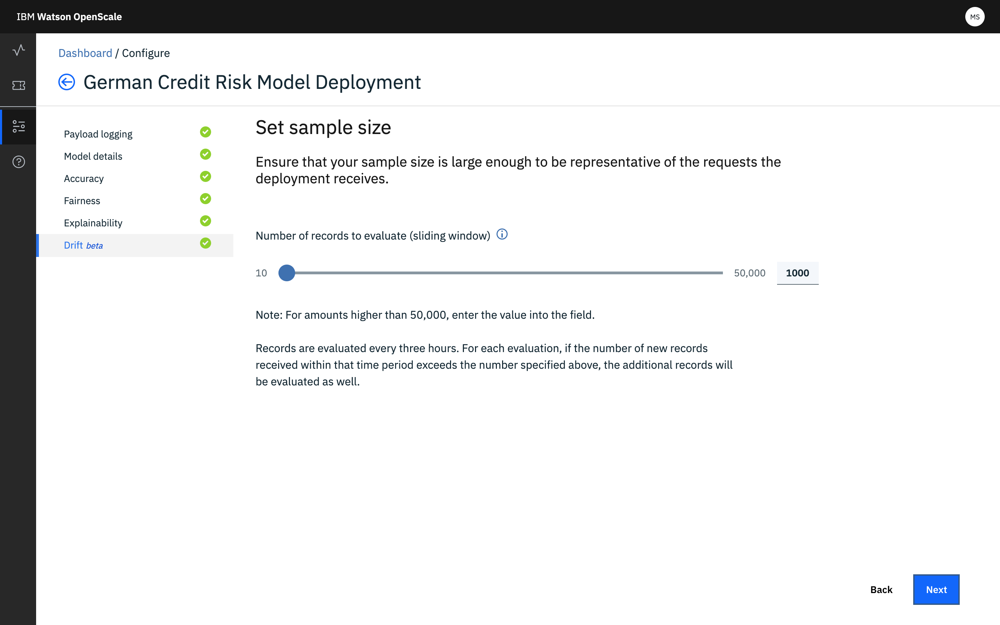
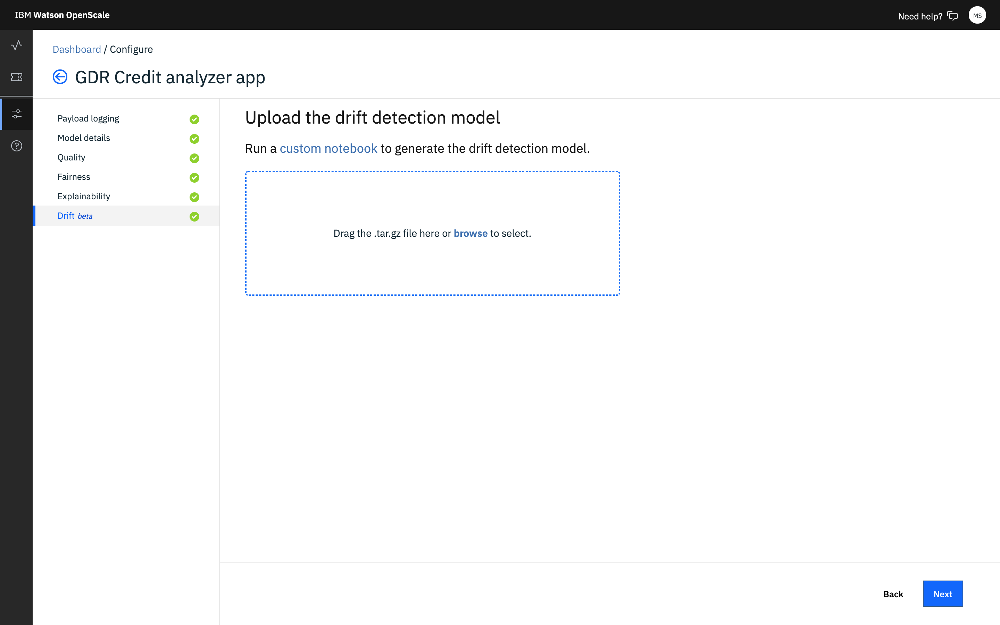

---

copyright:
  years: 2018, 2019
lastupdated: "2019-06-28"

keywords: accuracy, 

subcollection: ai-openscale

---

{:shortdesc: .shortdesc}
{:external: target="_blank" .external}
{:tip: .tip}
{:important: .important}
{:note: .note}
{:pre: .pre}
{:codeblock: .codeblock}
{:download: .download}
{:screen: .screen}
{:javascript: .ph data-hd-programlang='javascript'}
{:java: .ph data-hd-programlang='java'}
{:python: .ph data-hd-programlang='python'}
{:swift: .ph data-hd-programlang='swift'}
{:faq: data-hd-content-type='faq'}

# 드리프트 감지 모니터 구성 
{: #behavior-drift-config}

모델 분석을 시작하려면 먼저 {{site.data.keyword.aios_full}} 드리프트 모니터를 구성해야 합니다. 온라인으로 모델을 훈련하거나 노트북을 사용하는 두 가지 옵션이 있습니다.
{: shortdesc}

{{site.data.keyword.pm_full}}을 사용하고 데이터가 500MB를 초과하지 않는 경우
{{site.data.keyword.aios_short}}을 사용하여 온라인으로 모델을 훈련할 수 있습니다. 그렇지 않으면 노트북을 사용하여 모델을 훈련해야 합니다.

## {{site.data.keyword.aios_short}}에서 드리프트를 구성하는 단계
{: #behavior-drift-config-steps-wos}

{{site.data.keyword.pm_full}}을 사용하는 경우 {{site.data.keyword.aios_short}} 사용자 인터페이스를 사용하여 드리프트 발견을 구성하는 옵션이 있습니다.

1. **드리프트** 탭의 **드리프트의 개념** 페이지에서 **시작**을 클릭하여 구성 프로세스를 시작하십시오.

   

2. **Watson OpenScale에서 훈련** 타일을 클릭하십시오.

   

3. 경보 임계값을 설정하십시오.

   

3. 샘플 크기를 설정하십시오.

   
   
3. **저장**을 클릭하십시오.

## 노트북을 사용하여 드리프트를 구성하는 단계
{: #behavior-drift-config-steps-ntbk}

Microsoft Azure, Amazon SageMaker 또는 사용자 정의 기계 학습 엔진 등의 {{site.data.keyword.pm_full}} 이외의 기계 학습 제공자를 사용하는 경우에는 노트북을 사용하여 드리프트 발견을 구성해야 합니다. 이 방법을 사용하여 {{site.data.keyword.pm_full}}에 대한 드리프트도 구성할 수 있습니다.

이 옵션은 훈련 데이터가 Db2 또는 {{site.data.keyword.cos_full}}에 저장되지 않는 경우 유용합니다. 노트북을 사용하는 경우에는 훈련 데이터를 데이터 프레임으로 읽어와야 합니다. 그런 다음 {{site.data.keyword.aios_short}}에서 다운로드할 수 있는 특수화된 노트북은 사용자가 {{site.data.keyword.aios_short}}에 업로드할 수 있는 특수화된 출력을 작성합니다.

1. 노트북을 작성하여 드리프트 발견 모델을 생성하십시오. {{site.data.keyword.aios_short}} UI에서 사용 가능한 [샘플 노트북](https://github.com/IBM-Watson/aios-data-distribution/blob/master/training_statistics_notebook.ipynb)을 사용하십시오.
2. 압축 소프트웨어를 사용하여 드리프트 발견 모델을 .tar.gz 파일로 압축하십시오.

1. **드리프트** 탭의 **드리프트의 개념** 페이지에서 **시작**을 클릭하여 구성 프로세스를 시작하십시오.

   

2. **노트북에서 훈련** 타일을 클릭하십시오.

   

3. 압축된 모델 파일을 대상 구역으로 끌어오거나 찾아서 선택한 후 **다음**을 클릭하십시오.

   
   
3. 드리프트 발견 모델을 업로드한 후 **다음**을 클릭하십시오.

   
   
3. 경보 임계값을 설정하십시오.

   

3. 샘플 크기를 설정하십시오.

   
   
3. **저장**을 클릭하십시오.

## 다음 단계
{: #behavior-drift-config-next-steps}

- 드리프트 해석에 대한 자세한 정보는 [드리프트 규모](/docs/services/ai-openscale?topic=ai-openscale-behavior-drift-ovr)를 참조하십시오. 
