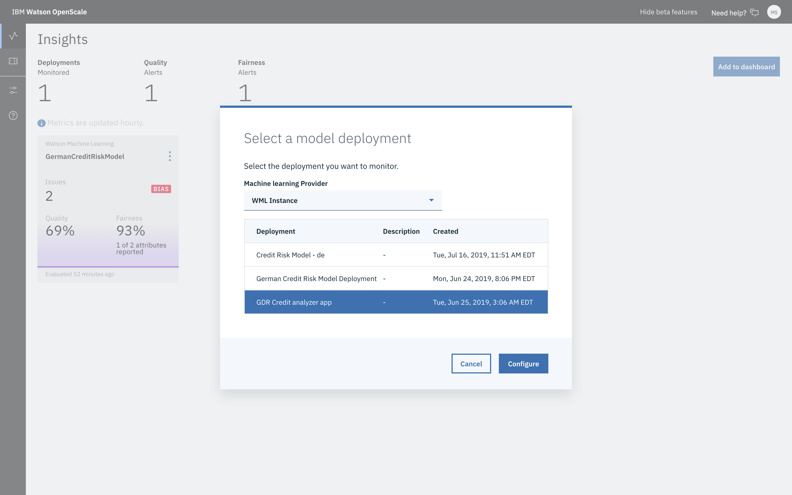

---

copyright:
  years: 2018, 2019
lastupdated: "2019-06-28"

keywords: deployment, monitors, data

subcollection: ai-openscale

---

{:shortdesc: .shortdesc}
{:external: target="_blank" .external}
{:tip: .tip}
{:important: .important}
{:note: .note}
{:pre: .pre}
{:codeblock: .codeblock}
{:download: .download}
{:screen: .screen}
{:javascript: .ph data-hd-programlang='javascript'}
{:java: .ph data-hd-programlang='java'}
{:python: .ph data-hd-programlang='python'}
{:swift: .ph data-hd-programlang='swift'}
{:faq: data-hd-content-type='faq'}

# 배치에 대한 모니터 준비
{: #mo-config}

{{site.data.keyword.aios_short}}을 사용하여 추적하고 있는 각 배치에 대해 모니터를 설정하고 사용 가능하도록 설정하십시오.
{: shortdesc}

예를 들어, 대화식 튜토리얼의 경우 **독일 신용 위험 모델**을 사용 중이면 모델 배치를 선택하고 페이로드 로깅의 데이터 유형을 설정한 후 모델 세부사항 섹션의 일부로서 표시되는 설정을 확인하십시오. 

## 배치 선택
{: #mo-select-deploy}

1. **인사이트** 탭에서 **대시보드에 추가** 단추를 클릭하십시오.  

   사용 가능한 모델 배치 목록이 표시됩니다. 모델 배치가 나타나지 않으면 기계 학습 제공자를 사용하여 모델을 배치해야 합니다. 튜토리얼의 경우 **독일 신용 위험 모델**을 선택하십시오. 

   

2. 모델 배치를 클릭한 후 **구성**을 클릭하십시오.

   지정된 모델에 대해 여러 배치가 있는 경우에 하나의 배치를 구성하면 동일한 모델에 대한 기타 모든 배치도 구성됩니다.

   선택사항을 저장하고 나면 모니터를 구성(페이로드 로깅, 정확성 및 공정성 포함)할 준비가 된 것입니다. 

2. 시작하려면 **모니터 구성**을 클릭하십시오.

## 페이로드 로깅 세부사항 제공
{: #mo-work-data}

모델 및 훈련 데이터에 대한 정보를 제공해야 합니다. 훈련 데이터에 대한 자세한 정보는 [{{site.data.keyword.aios_short}}에서 내 훈련 데이터에 액세스해야 하는 이유는 무엇입니까?](/docs/services/ai-openscale?topic=ai-openscale-trainingdata#trainingdata)를 참조하십시오. 튜토리얼의 경우 **데이터 유형** 필드에서 **숫자/카테고리**를 선택하고 **알고리즘 유형**에 대해 **2진 분류**를 선택하십시오. 

- {{site.data.keyword.aios_short}} 인스턴스와 동일한 지역에 있는 {{site.data.keyword.pm_full}} 인스턴스를 사용하는 경우 데이터 유형 및 알고리즘 유형을 선택해야 하지만 일부 페이로드 로깅 정보는 자동으로 구성됩니다. 
- 그렇지 않은 경우 **페이로드 로깅** 탭과 창에 데이터 및 알고리즘 유형과 페이로드 로깅에 대한 정보를 입력해야 합니다. 

   선택사항에 따라 특정 요구사항이 있습니다. 자세한 정보는 [숫자/카테고리 데이터](https://test.cloud.ibm.com/docs/services/ai-openscale?topic=ai-openscale-mo-config#mo-datan)를 참조하십시오.

   모니터를 구성하기 전에 실행할 코드 스니펫 중 하나를 복사해야 합니다. 클라이언트 애플리케이션에서 cURL 명령을 실행하거나 데이터 사이언스 노트북에서 Python 명령을 실행하십시오. 이 방법으로 모델 배치 요청을 로깅하고 페이로드 데이터베이스에 응답 데이터를 기록할 수 있습니다.
   
로컬 {{site.data.keyword.pm_full}} 메소드를 사용하거나 API를 사용하여 페이로드 로깅 세부사항을 전송한 후에는 **페이로드 로깅** 화면으로 돌아가서 **완료했습니다**를 클릭하십시오.

스코어링이 {{site.data.keyword.aios_short}}에 올바르게 전송된 경우에는 **완료했습니다** 단추를 클릭하면 다음과 같은 화면이 표시됩니다. 단추가 숨겨지고 **로깅이 활성화됨** 메시지가 표시됩니다.

### 모델 세부사항 제공
{: #mo-work-model-dets}

{{site.data.keyword.aios_short}}에서 데이터베이스에 액세스하고 모델 설정 방식을 파악할 수 있도록 모델에 대한 정보를 제공하십시오. 예를 들어, 대화식 튜토리얼의 경우 **독일 신용 위험 모델**을 사용 중이면 다수의 다음 필드가 사용자를 위해 자동으로 채워집니다. 

모니터를 구성하려면 특히, 다음 태스크를 수행해야 합니다.

1. 훈련 데이터의 위치를 지정하십시오. 위치, 호스트 이름 또는 IP 주소, 데이터베이스 이름 및 인증 정보를 입력하면 됩니다.
2. 데이터베이스 내에서 스키마 및 테이블을 선택하여 훈련 테이블을 선택해야 합니다.
3. 훈련 테이블에서 레이블 열을 선택하십시오. 예를 들어, 튜토리얼의 경우 **위험** 타일을 클릭하십시오. 
4. AI 배치를 훈련시키는 데 사용된 기능을 선택하십시오.
5. 텍스트 및 카테고리 기능을 선택하십시오.
6. 배치 예측 열을 선택하십시오. 예를 들어, 튜토리얼의 경우 **predictedLabel** 타일을 클릭하십시오. 
7. 끝으로, 모델 세부사항을 저장하기 전에 검토할 수 있습니다.

다음 절에서는 모델 유형[숫자/카테고리 데이터](/docs/services/ai-openscale?topic=ai-openscale-mo-config#mo-datan) 또는 [이미지 및 비정형 텍스트](/docs/services/ai-openscale?topic=ai-openscale-mo-config#mo-datai))에 따라 표시되는 몇 가지 구체적인 정보를 제공합니다.

### 숫자/카테고리 데이터
{: #mo-nuca}

숫자 또는 카테고리 데이터의 경우, 모니터를 구성하려면 모델에 대한 훈련 데이터에 대한 정보를 제공해야 합니다.

- **수동으로 모니터 구성** - 훈련 데이터에 대한 연결 정보를 제공하도록 요구합니다.

    - [알고리즘 유형](/docs/services/ai-openscale?topic=ai-openscale-acc-monitor#acc-understand)을 선택하고 **다음**을 클릭하십시오.

      훈련 데이터의 형식은 모델과 일치해야 합니다. 예를 들어, 모델이 `Gender` 특성으로 `M` 및 `F`를 예상할 경우 훈련 데이터는 `Male` 및 `Female`이 아니라 `M` 및 `F`여야 합니다.  {{site.data.keyword.aios_short}}의 현재 릴리스에서는 DB2 데이터베이스 또는 Cloud Object Storage 위치만 지원합니다.
        {: important}

    - 위치(`Db2` 또는 `Cloud Object Storage`)를 지정하고 다음을 수행하십시오.

        - DB2 데이터베이스의 경우 다음 정보를 입력하십시오.

            - 호스트 이름 또는 IP 주소
            - 포트
            - 데이터베이스(이름)
            - 사용자 이름
            - 비밀번호

        - Cloud Object Storage의 경우 다음 정보를 입력하십시오.

            - 로그인 URL: 로그인 URL은 사용자의 훈련 데이터가 있는 버킷의 지역 설정과 일치해야 합니다. 다음 단계에서 훈련 데이터 버킷을 지정합니다.
            - 리소스 인스턴스(ID)
            - API 키

    - 유효한 연결인지 확인하려면 **테스트** 단추를 클릭하여 훈련 데이터에 연결하십시오.
    - 훈련 데이터가 위치한 Db2 데이터베이스 또는 Cloud Object Storage의 정확한 위치를 지정하십시오.

        - DB2 데이터베이스의 경우 모델에서 예상하는 열을 포함하는 스키마 및 훈련 테이블을 둘 다 선택하십시오.
        - Cloud Object Storage의 경우 버킷 및 데이터 세트를 선택하십시오.

- **구성 파일 업로드** - 훈련 데이터를 개인용으로 유지하려면 이 옵션을 선택하십시오. 사용자 정의 Python Notebook을 사용하면 훈련 데이터 자체에 대한 액세스를 제공하지 않고도 훈련 데이터를 분석하는 데 필요한 정보를 {{site.data.keyword.aios_short}}에 제공할 수 있습니다.

  Python Notebook을 실행하면 열 이름 및 스키마 열 내의 구분 값을 캡처할 수 있습니다. 또한 Notebook을 사용하여 공정성 모니터를 사전 구성할 수 있습니다.

   - [사용자 정의 노트북](https://github.com/IBM-Watson/aios-data-distribution/blob/master/training_statistics_notebook.ipynb){: external}을 다운로드하고 고유 인증서로 모든 인증서를 바꾸십시오.
   - 적절한 모델용 데이터를 지정하면서 Notebook을 주의 깊게 검토하십시오. Notebook을 저장하십시오.
   - Notebook을 실행하여 JSON 형식의 구성 파일을 생성하십시오.
   - JSON 구성 파일을 업로드하십시오.

     

- {{site.data.keyword.aios_short}}에서 {{site.data.keyword.pm_full}}의 모델을 사용하여 저장된 메타데이터에서 훈련 데이터를 찾습니다. 예측 값이 포함된 훈련 데이터에서 레이블 열을 선택하십시오.
- 모델을 훈련시키는 데 사용되는 열을 선택하십시오. 이는 모델 배치가 요청에서 예상하는 특성입니다.
- 마지막으로 텍스트를 포함하였다가 정수로 변환된 열을 선택하십시오. 예를 들어, 원래 훈련 데이터는 `Gender`에 대해 `Male` 및 `Female`을 포함했으나 지금은 `0` 및 `1`에 각각 맵핑되었으며 이제 훈련 데이터가 `Gender` 열에 대해 `0` 및 `1` 값을 포함합니다. 우, 원래 포함된 텍스트 값이 아니라 정수를 포함하는 열을 식별하십시오.

### 이미지 및 비정형 텍스트
{: #mo-imun}

- **이미지**

  이미지를 입력으로 허용하는 모델의 경우, 이미지가 (높이) x (너비) x (# 채널) 형식으로 다시 표시되어야 합니다. 이 때, 각 점은 각 픽셀에 대한 흑백 또는 RGB 값을 나타냅니다.

- **비정형 텍스트**

   텍스트를 입력으로 허용하는 모델의 경우, 모델이 텍스트의 벡터화된 표현이 아니라 전체 텍스트를 허용할 것으로 예상됩니다.

## 구성 검토 및 저장
{: #mo-save}

선택 요약을 검토하고 **저장**을 클릭하여 계속하십시오.

  

### 다음 단계
{: #mo-next}

모니터 구성을 계속하려면 **품질** 탭을 클릭한 후 **시작**을 클릭하십시오. 자세한 정보는 [품질 모니터 구성](/docs/services/ai-openscale?topic=ai-openscale-acc-monitor)을 참조하십시오. 
