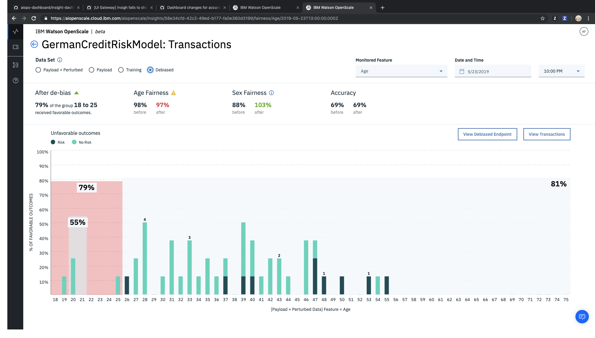

---

copyright:
  years: 2018, 2019
lastupdated: "2019-06-28"

keywords: metrics, monitoring, custom metrics, thresholds

subcollection: ai-openscale

---

{:shortdesc: .shortdesc}
{:external: target="_blank" .external}
{:tip: .tip}
{:important: .important}
{:note: .note}
{:pre: .pre}
{:codeblock: .codeblock}
{:download: .download}
{:screen: .screen}
{:javascript: .ph data-hd-programlang='javascript'}
{:java: .ph data-hd-programlang='java'}
{:python: .ph data-hd-programlang='python'}
{:swift: .ph data-hd-programlang='swift'}
{:faq: data-hd-content-type='faq'}

# 정확성
{: #accuracy-opener}

정확성이란 모델에 포함된 정확한 예측의 비율을 나타내는 척도입니다.
{: shortdesc}

## 정확성 개요
{: #anlz_metrics_supqualdets_acc}

- **설명**: 정확한 예측 비율
- **기본 임계값**: 하한값 = 80%
- **기본 권장사항**:
   - **상승세**: 상승세는 메트릭이 개선되고 있음을 표시합니다. 모델 재훈련이 효과적임을 의미합니다.
   - **하락세**: 하락세는 메트릭이 나빠지고 있음을 표시합니다. 피드백 데이터가 훈련 데이터와 크게 달라집니다.
   - **불규칙하거나 일정하지 않은 변화**: 불규칙하거나 일정하지 않은 변화는 피드백 데이터가 평가 간에 일관되지 않음을 표시합니다. 품질 모니터에 대한 최소 샘플 크기를 늘리십시오.
- **문제점 유형**: 2진 분류 및 다중 클래스 분류
- **차트 값**: 시간 범위의 마지막 값
- **메트릭 세부사항 사용 가능**: 오차 행렬

## 정확성 이해
{: #acc-understand}

정확성은 알고리즘의 유형에 따라 다른 것을 의미할 수 있습니다.

- *다중 클래스 분류*: 정확성이 임의의 클래스가 올바르게 예측할 수 있는 횟수를 측정하며 데이터 점의 수로 정규화됩니다. 자세한 정보는 Apache Spark 문서에서 [다중 클래스 분류](https://spark.apache.org/docs/2.1.0/mllib-evaluation-metrics.html#multiclass-classification){: external}를 참조하십시오.

- *2진 분류*: 2진 분류 알고리즘의 경우, 정확성이 ROC 곡선 아래의 영역으로 측정됩니다. 자세한 정보는 Apache Spark 문서에서 [2진 분류](https://spark.apache.org/docs/2.1.0/mllib-evaluation-metrics.html#binary-classification){: external}를 참조하십시오.

- *회귀*: 회귀 알고리즘은 결정 계수 또는 R2를 사용하여 측정됩니다. 자세한 정보는 Apache Spark 문서에서 [회귀 모델 평가](https://spark.apache.org/docs/2.1.0/mllib-evaluation-metrics.html#regression-model-evaluation){: external}를 참조하십시오.

### 작동 방식
{: #acc-works}

[Python 클라이언트](http://ai-openscale-python-client.mybluemix.net/#feedbacklogging){: external} 또는 [Rest API](https://cloud.ibm.com/apidocs/ai-openscale#post-feedback-payload){: external}를 사용하여 다음 예에 표시된 대로 {{site.data.keyword.aios_short}} UI를 통해 수동으로 레이블이 지정된 피드백 데이터를 추가해야 합니다.

### 편향성 제거된 정확성
{: #acc-debias-view}

이를 지원하는 데이터가 있는 경우 원래 모델과 편향성 제거된 모델에 대해 정확성이 계산됩니다. {{site.data.keyword.aios_full_notm}}에서는 편향성 제거된 출력의 정확성을 계산하여 페이로드 로깅 테이블에 추가 열로 저장합니다.

