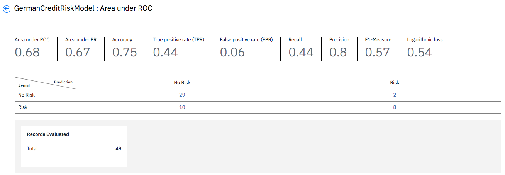

---

copyright:
  years: 2018, 2019
lastupdated: "2019-06-11"

keywords: metrics, monitoring, custom metrics, thresholds

subcollection: ai-openscale

---

{:shortdesc: .shortdesc}
{:new_window: target="_blank"}
{:tip: .tip}
{:important: .important}
{:note: .note}
{:pre: .pre}
{:codeblock: .codeblock}
{:screen: .screen}

# Analisando métricas e transações 
{: #anlz_metrics}

É possível usar o {{site.data.keyword.aios_full}} para analisar métricas e transações por meio de uma variedade de formas.
{: shortdesc}

## Métricas de justiça
{: #anlz_metrics_fairness}

Use o monitoramento de justiça para determinar se os resultados que são produzidos por seu modelo
são ou não justos para o grupo monitorado. Quando o monitoramento de justiça está ativado, por padrão, ele
gera um conjunto de métricas a cada hora. É possível gerar essas métricas sob demanda clicando no botão **Verificar qualidade agora** ou usando o cliente Python.

As métricas de justiça são calculadas com base nas informações a seguir:

- dados de carga útil de pontuação.

Para o propósito de monitoramento adequado, cada solicitação de pontuação também deve ser
registrada no {{site.data.keyword.aios_short}}. A criação de log de dados de carga útil é
automatizada para mecanismos {{site.data.keyword.pm_full}}.

Para outros mecanismos de aprendizado de máquina, os dados de carga útil podem ser fornecidos
usando o cliente Python ou a API de REST.

Para mecanismos de aprendizado de máquina diferentes do {{site.data.keyword.pm_full}},
o monitoramento de justiça cria solicitações de pontuação adicionais na implementação monitorada.
{: note}

É possível revisar todos os valores de métricas ao longo do tempo no painel do {{site.data.keyword.aios_short}}:

É possível revisar detalhes relacionados, tais como resultados favoráveis e desfavoráveis:

É possível visualizar transações detalhadas:

É possível visualizar o terminal de pontuação com propensão reduzida recomendado:

### Métricas de justiça suportadas
{: #anlz_metrics_supfairmets}

As métricas de justiça a seguir são suportadas pelo {{site.data.keyword.aios_short}}:

#### Justiça para um grupo
{: #anlz_metrics_supfairmets_group}

- **Descrição**: a propensão dos modelos de fornecer resultados favoráveis para um grupo em oposição a outro.
- **Limites padrão**: limite inferior = 80%
- **Recomendação padrão**: terminal de pontuação com propensão reduzida que você pode usar em seu aplicativo de negócios para receber respostas com propensão reduzida do seu modelo implementado.
- **Tipo de problema**: todos
- **Tipo de dados**: estruturados
- **Valores de gráfico**: último valor no prazo
- **Detalhes de métricas disponíveis**: sim

### Detalhes de justiça suportados
{: #anlz_metrics_supfairdets}

Os detalhes a seguir para as métricas de justiça são suportados pelo {{site.data.keyword.aios_short}}:

- As porcentagens favoráveis para cada um dos grupos
- Médias de justiça para todos os grupos de justiça

  Razão de impacto discrepante = (% do resultado favorável no grupo monitorado)/(% do resultado favorável no grupo de referência)

- Distribuição dos dados para cada um dos grupos monitorados
- Distribuição de dados de carga útil

<!---
BTW, I propose to use screenshots with data from FastPath.
Source monitored group or referenced group
Source of bias is also in fairness metrics
--->

## Métricas de qualidade
{: #anlz_metrics_quality}

Use o monitoramento de qualidade para determinar a qualidade da previsão de resultados do seu modelo. Quando o
monitoramento de qualidade está ativado, por padrão, ele gera um conjunto de métricas a cada hora. É possível gerar essas métricas sob demanda clicando no botão **Verificar qualidade agora** ou usando o cliente Python.

As métricas de qualidade são calculadas com base nas informações a seguir:

- dados de feedback rotulados manualmente,
- respostas de implementação monitoradas para esses dados.

Para monitoramento adequado, os dados de feedback devem ser registrados no {{site.data.keyword.aios_short}}
em uma base regular. Os dados de feedback podem ser fornecidos usando a opção "Incluir dados de feedback" ou
usando o cliente Python ou a API de REST.

Para mecanismos de aprendizado de máquina diferentes do {{site.data.keyword.aios_short}},
tal como o Microsoft Azure ML Studio ou o monitoramento de qualidade do Amazon Sagemaker ML, são criadas
solicitações de pontuação adicionais na implementação monitorada.
{: note}

É possível revisar todos os valores de métricas ao longo do tempo no painel do {{site.data.keyword.aios_short}}:

Para revisar detalhes relacionados, tais como matriz de confusão para classificação binária
e de várias classes, que estão disponíveis para algumas métricas, clique no gráfico.

### Métricas de qualidade suportadas
{: #anlz_metrics_supqualdets}

As métricas de qualidade a seguir são suportadas pelo {{site.data.keyword.aios_short}}:

#### Área sob ROC
{: #anlz_metrics_supqualdets_roc}

- **Descrição**: área sob rechamada e curva de taxa de falso positivo
- **Limites padrão**: limite inferior = 80%
- **Recomendação padrão**:
   - **Tendência ascendente**: uma tendência ascendente indica que a métrica está melhorando. Isso significa que o novo treinamento dos modelos é efetivo.
   - **Tendência de queda**: uma tendência de queda indica que a métrica
está se deteriorando. Os dados de feedback estão se tornando significativamente diferentes dos dados de treinamento.
   - **Variação errática ou irregular**: uma variação errática ou irregular
indica que os dados de feedback não são consistentes entre as avaliações. Aumente o tamanho mínimo da
amostra para o monitor de Qualidade.
- **Tipo de problema**: classificação binária
- **Valores de gráfico**: último valor no prazo
- **Detalhes de métricas disponíveis**: matriz de confusão

#### Área sob PR
{: #anlz_metrics_supqualdets_pr}

- **Descrição**: área sob a curva de precisão e rechamada
- **Limites padrão**: limite inferior = 80%
- **Recomendação padrão**:
   - **Tendência ascendente**: uma tendência ascendente indica que a métrica está melhorando. Isso significa que o novo treinamento dos modelos é efetivo.
   - **Tendência de queda**: uma tendência de queda indica que a métrica
está se deteriorando. Os dados de feedback estão se tornando significativamente diferentes dos dados de treinamento.
   - **Variação errática ou irregular**: uma variação errática ou irregular
indica que os dados de feedback não são consistentes entre as avaliações. Aumente o tamanho mínimo da
amostra para o monitor de Qualidade.
- **Tipo de problema**: classificação binária
- **Valores de gráfico**: último valor no prazo
- **Detalhes de métricas disponíveis**: matriz de confusão

#### Variação explicada da proporção
{: #anlz_metrics_supqualdets_var}

- **Descrição**: a variação explicada da proporção é a razão de variação explicada e a variação de destino. A variação explicada é a diferença entre a variação de destino e a variação do erro de predição.
- **Limites padrão**: limite inferior = 80%
- **Recomendação padrão**:
   - **Tendência ascendente**: uma tendência ascendente indica que a métrica está melhorando. Isso significa que o novo treinamento dos modelos é efetivo.
   - **Tendência de queda**: uma tendência de queda indica que a métrica
está se deteriorando. Os dados de feedback estão se tornando significativamente diferentes dos dados de treinamento.
   - **Variação errática ou irregular**: uma variação errática ou irregular
indica que os dados de feedback não são consistentes entre as avaliações. Aumente o tamanho mínimo da
amostra para o monitor de Qualidade.
- **Tipo de problema**: regressão
- **Valores de gráfico**: último valor no prazo
- **Detalhes de métricas disponíveis**: nenhum

#### Erro médio absoluto
{: #anlz_metrics_supqualdets_abserror}

- **Descrição**: média de diferença absoluta entre a previsão do modelo e o valor de destino
- **Limites padrão**: limite superior = 80%
- **Recomendação padrão**:
   - **Tendência ascendente**: uma tendência ascendente indica que a métrica está se deteriorando. Os dados de feedback estão se tornando significativamente diferentes dos dados de treinamento.
   - **Tendência de queda**: uma tendência de queda indica que a métrica está melhorando. Isso significa que o novo treinamento dos modelos é efetivo.
   - **Variação errática ou irregular**: uma variação errática ou irregular
indica que os dados de feedback não são consistentes entre as avaliações. Aumente o tamanho mínimo da
amostra para o monitor de Qualidade.
- **Tipo de problema**: regressão
- **Valores de gráfico**: último valor no prazo
- **Detalhes de métricas disponíveis**: nenhum

#### Erro quadrático médio
{: #anlz_metrics_supqualdets_squerror}

- **Descrição**: média de diferença quadrática entre a predição do modelo e o valor de destino
- **Limites padrão**: limite superior = 80%
- **Recomendação padrão**:
   - **Tendência ascendente**: uma tendência ascendente indica que a métrica está se deteriorando. Os dados de feedback estão se tornando significativamente diferentes dos dados de treinamento.
   - **Tendência de queda**: uma tendência de queda indica que a métrica está melhorando. Isso significa que o novo treinamento dos modelos é efetivo.
   - **Variação errática ou irregular**: uma variação errática ou irregular
indica que os dados de feedback não são consistentes entre as avaliações. Aumente o tamanho mínimo da
amostra para o monitor de Qualidade.
- **Tipo de problema**: regressão
- **Valores de gráfico**: último valor no prazo
- **Detalhes de métricas disponíveis**: nenhum

#### R ao quadrado
{: #anlz_metrics_supqualdets_r_squared}

- **Descrição**: razão de diferença entre a variação de destino e a variação para o erro de predição para a variação de destino
- **Limites padrão**: limite inferior = 80%
- **Recomendação padrão**:
   - **Tendência ascendente**: uma tendência ascendente indica que a métrica está melhorando. Isso significa que o novo treinamento dos modelos é efetivo.
   - **Tendência de queda**: uma tendência de queda indica que a métrica
está se deteriorando. Os dados de feedback estão se tornando significativamente diferentes dos dados de treinamento.
   - **Variação errática ou irregular**: uma variação errática ou irregular
indica que os dados de feedback não são consistentes entre as avaliações. Aumente o tamanho mínimo da
amostra para o monitor de Qualidade.
- **Tipo de problema**: regressão
- **Valores de gráfico**: último valor no prazo
- **Detalhes de métricas disponíveis**: nenhum

#### Raiz do erro de quadrado médio
{: #anlz_metrics_supqualdets_squ_errors_mean}

- **Descrição**: raiz quadrada da média de diferença quadrática entre a previsão do modelo e o valor de destino
- **Limites padrão**: limite superior = 80%
- **Recomendação padrão**:
   - **Tendência ascendente**: uma tendência ascendente indica que a métrica está se deteriorando. Os dados de feedback estão se tornando significativamente diferentes dos dados de treinamento.
   - **Tendência de queda**: uma tendência de queda indica que a métrica está melhorando. Isso significa que o novo treinamento dos modelos é efetivo.
   - **Variação errática ou irregular**: uma variação errática ou irregular
indica que os dados de feedback não são consistentes entre as avaliações. Aumente o tamanho mínimo da
amostra para o monitor de Qualidade.
- **Tipo de problema**: regressão
- **Valores de gráfico**: último valor no prazo
- **Detalhes de métricas disponíveis**: nenhum

#### Precisão
{: #anlz_metrics_supqualdets_acc}

- **Descrição**: a proporção de previsões corretas
- **Limites padrão**: limite inferior = 80%
- **Recomendação padrão**:
   - **Tendência ascendente**: uma tendência ascendente indica que a métrica está melhorando. Isso significa que o novo treinamento dos modelos é efetivo.
   - **Tendência de queda**: uma tendência de queda indica que a métrica
está se deteriorando. Os dados de feedback estão se tornando significativamente diferentes dos dados de treinamento.
   - **Variação errática ou irregular**: uma variação errática ou irregular
indica que os dados de feedback não são consistentes entre as avaliações. Aumente o tamanho mínimo da
amostra para o monitor de Qualidade.
- **Tipos de problemas**: classificação binária e classificação de várias classes
- **Valores de gráfico**: último valor no prazo
- **Detalhes de métricas disponíveis**: matriz de confusão

#### Taxa de positivo verdadeiro ponderada (wTPR)
{: #anlz_metrics_supqualdets_wtpr}

- **Descrição**: média ponderada da classe TPR com pesos iguais à probabilidade de classe
- **Limites padrão**: limite inferior = 80%
- **Recomendação padrão**:
   - **Tendência ascendente**: uma tendência ascendente indica que a métrica está melhorando. Isso significa que o novo treinamento dos modelos é efetivo.
   - **Tendência de queda**: uma tendência de queda indica que a métrica
está se deteriorando. Os dados de feedback estão se tornando significativamente diferentes dos dados de treinamento.
   - **Variação errática ou irregular**: uma variação errática ou irregular
indica que os dados de feedback não são consistentes entre as avaliações. Aumente o tamanho mínimo da
amostra para o monitor de Qualidade.
- **Tipo de problema**: classificação de várias classes
- **Valores de gráfico**: último valor no prazo
- **Detalhes de métricas disponíveis**: matriz de confusão

#### Taxa de positivo verdadeiro (TPR)
{: #anlz_metrics_supqualdets_tpr}

- **Descrição**: proporção de previsões corretas em predições de classe positiva
- **Limites padrão**: limite inferior = 80%
- **Recomendação padrão**:
   - **Tendência ascendente**: uma tendência ascendente indica que a métrica está melhorando. Isso significa que o novo treinamento dos modelos é efetivo.
   - **Tendência de queda**: uma tendência de queda indica que a métrica
está se deteriorando. Os dados de feedback estão se tornando significativamente diferentes dos dados de treinamento.
   - **Variação errática ou irregular**: uma variação errática ou irregular
indica que os dados de feedback não são consistentes entre as avaliações. Aumente o tamanho mínimo da
amostra para o monitor de Qualidade.
- **Tipo de problema**: classificação binária
- **Valores de gráfico**: último valor no prazo
- **Detalhes de métricas disponíveis**: matriz de confusão

#### Taxa de falso positivo ponderada (wFPR)
{: #anlz_metrics_supqualdets_wfpr_weighted}

- **Descrição**: média ponderada da classe FPR com pesos iguais à probabilidade de classe
- **Limites padrão**: limite inferior = 80%
- **Recomendação padrão**:
   - **Tendência ascendente**: uma tendência ascendente indica que a métrica está melhorando. Isso significa que o novo treinamento dos modelos é efetivo.
   - **Tendência de queda**: uma tendência de queda indica que a métrica
está se deteriorando. Os dados de feedback estão se tornando significativamente diferentes dos dados de treinamento.
   - **Variação errática ou irregular**: uma variação errática ou irregular
indica que os dados de feedback não são consistentes entre as avaliações. Aumente o tamanho mínimo da
amostra para o monitor de Qualidade.
- **Tipo de problema**: classificação de várias classes
- **Valores de gráfico**: último valor no prazo
- **Detalhes de métricas disponíveis**: matriz de confusão

#### Taxa de falso positivo (FPR)
{: #anlz_metrics_supqualdets_fpr_false}

- **Descrição**: proporção de predições incorretas na classe positiva
- **Limites padrão**: limite inferior = 80%
- **Recomendação padrão**:
   - **Tendência ascendente**: uma tendência ascendente indica que a métrica está melhorando. Isso significa que o novo treinamento dos modelos é efetivo.
   - **Tendência de queda**: uma tendência de queda indica que a métrica
está se deteriorando. Os dados de feedback estão se tornando significativamente diferentes dos dados de treinamento.
   - **Variação errática ou irregular**: uma variação errática ou irregular
indica que os dados de feedback não são consistentes entre as avaliações. Aumente o tamanho mínimo da
amostra para o monitor de Qualidade.
- **Tipo de problema**: classificação binária
- **Valores de gráfico**: último valor no prazo
- **Detalhes de métricas disponíveis**: matriz de confusão

#### Rechamada ponderada
{: #anlz_metrics_supqualdets_weighted_recall}

- **Descrição**: média ponderada de rechamada com pesos iguais à probabilidade de classe
- **Limites padrão**: limite inferior = 80%
- **Recomendação padrão**:
   - **Tendência ascendente**: uma tendência ascendente indica que a métrica está melhorando. Isso significa que o novo treinamento dos modelos é efetivo.
   - **Tendência de queda**: uma tendência de queda indica que a métrica
está se deteriorando. Os dados de feedback estão se tornando significativamente diferentes dos dados de treinamento.
   - **Variação errática ou irregular**: uma variação errática ou irregular
indica que os dados de feedback não são consistentes entre as avaliações. Aumente o tamanho mínimo da
amostra para o monitor de Qualidade.
- **Tipo de problema**: classificação de várias classes
- **Valores de gráfico**: último valor no prazo
- **Detalhes de métricas disponíveis**: matriz de confusão

#### Rechamada
{: #anlz_metrics_supqualdets_recall}

- **Descrição**: proporção de predições corretas na classe positiva
- **Limites padrão**: limite inferior = 80%
- **Recomendação padrão**:
   - **Tendência ascendente**: uma tendência ascendente indica que a métrica está melhorando. Isso significa que o novo treinamento dos modelos é efetivo.
   - **Tendência de queda**: uma tendência de queda indica que a métrica
está se deteriorando. Os dados de feedback estão se tornando significativamente diferentes dos dados de treinamento.
   - **Variação errática ou irregular**: uma variação errática ou irregular
indica que os dados de feedback não são consistentes entre as avaliações. Aumente o tamanho mínimo da
amostra para o monitor de Qualidade.
- **Tipo de problema**: classificação binária
- **Valores de gráfico**: último valor no prazo
- **Detalhes de métricas disponíveis**: matriz de confusão

#### Precisão ponderada
{: #anlz_metrics_supqualdets_wgth_prec}

- **Descrição**: média ponderada de precisão com pesos iguais à probabilidade de classe
- **Limites padrão**: limite inferior = 80%
- **Recomendação padrão**:
   - **Tendência ascendente**: uma tendência ascendente indica que a métrica está melhorando. Isso significa que o novo treinamento dos modelos é efetivo.
   - **Tendência de queda**: uma tendência de queda indica que a métrica
está se deteriorando. Os dados de feedback estão se tornando significativamente diferentes dos dados de treinamento.
   - **Variação errática ou irregular**: uma variação errática ou irregular
indica que os dados de feedback não são consistentes entre as avaliações. Aumente o tamanho mínimo da
amostra para o monitor de Qualidade.
- **Tipo de problema**: classificação de várias classes
- **Valores de gráfico**: último valor no prazo
- **Detalhes de métricas disponíveis**: matriz de confusão

#### Precisão
{: #anlz_metrics_supqualdets_precision}

- **Descrição**: proporção de previsões corretas em predições de classe positiva
- **Limites padrão**: limite inferior = 80%
- **Recomendação padrão**:
   - **Tendência ascendente**: uma tendência ascendente indica que a métrica está melhorando. Isso significa que o novo treinamento dos modelos é efetivo.
   - **Tendência de queda**: uma tendência de queda indica que a métrica
está se deteriorando. Os dados de feedback estão se tornando significativamente diferentes dos dados de treinamento.
   - **Variação errática ou irregular**: uma variação errática ou irregular
indica que os dados de feedback não são consistentes entre as avaliações. Aumente o tamanho mínimo da
amostra para o monitor de Qualidade.
- **Tipo de problema**: classificação binária
- **Valores de gráfico**: último valor no prazo
- **Detalhes de métricas disponíveis**: matriz de confusão

#### F1-Measure ponderada
{: #anlz_metrics_supqualdets_wght_f1-measure}

- **Descrição**: média ponderada de F1-measure com pesos iguais à probabilidade de classe
- **Limites padrão**: limite inferior = 80%
- **Recomendação padrão**:
   - **Tendência ascendente**: uma tendência ascendente indica que a métrica está melhorando. Isso significa que o novo treinamento dos modelos é efetivo.
   - **Tendência de queda**: uma tendência de queda indica que a métrica
está se deteriorando. Os dados de feedback estão se tornando significativamente diferentes dos dados de treinamento.
   - **Variação errática ou irregular**: uma variação errática ou irregular
indica que os dados de feedback não são consistentes entre as avaliações. Aumente o tamanho mínimo da
amostra para o monitor de Qualidade.
- **Tipo de problema**: classificação de várias classes
- **Valores de gráfico**: último valor no prazo
- **Detalhes de métricas disponíveis**: matriz de confusão

#### F1-Measure
{: #anlz_metrics_supqualdets_f1-measr}

- **Descrição**: média harmônica de precisão e rechamada
- **Limites padrão**: limite inferior = 80%
- **Recomendação padrão**:
   - **Tendência ascendente**: uma tendência ascendente indica que a métrica está melhorando. Isso significa que o novo treinamento dos modelos é efetivo.
   - **Tendência de queda**: uma tendência de queda indica que a métrica
está se deteriorando. Os dados de feedback estão se tornando significativamente diferentes dos dados de treinamento.
   - **Variação errática ou irregular**: uma variação errática ou irregular
indica que os dados de feedback não são consistentes entre as avaliações. Aumente o tamanho mínimo da
amostra para o monitor de Qualidade.
- **Tipo de problema**: classificação binária
- **Valores de gráfico**: último valor no prazo
- **Detalhes de métricas disponíveis**: matriz de confusão

#### Perda logarítmica
{: #anlz_metrics_supqualdets_log_loss}

- **Descrição**: média dos logaritmos das probabilidades de classe de destino (confiança). Ela também é conhecida como Log da verossimilhança esperada.
- **Limites padrão**: limite inferior = 80%
- **Recomendação padrão**:
   - **Tendência ascendente**: uma tendência ascendente indica que a métrica está melhorando. Isso significa que o novo treinamento dos modelos é efetivo.
   - **Tendência de queda**: uma tendência de queda indica que a métrica
está se deteriorando. Os dados de feedback estão se tornando significativamente diferentes dos dados de treinamento.
   - **Variação errática ou irregular**: uma variação errática ou irregular
indica que os dados de feedback não são consistentes entre as avaliações. Aumente o tamanho mínimo da
amostra para o monitor de Qualidade.
- **Tipo de problema**: classificação binária e classificação de várias classes
- **Valores de gráfico**: último valor no prazo
- **Detalhes de métricas disponíveis**: nenhum

### Detalhes de qualidade suportados
{: #anlz_metrics_supqualdets_suppr_dets}

Os detalhes a seguir para as métricas de qualidade são suportados pelo {{site.data.keyword.aios_short}}:

#### Matriz de confusão
{: #anlz_metrics_supqualdets_confusion}

A matriz de confusão o ajuda a entender para qual dos seus dados de feedback a resposta da implantação monitorada está correta e para qual não está.

## Métricas de desempenho
{: #anlz_metrics_performance}

Use o monitoramento de desempenho para saber a velocidade dos registros de dados processados
por sua implementação. Você ativa o monitoramento de desempenho ao selecionar a implementação a ser
rastreada e monitorada pelo {{site.data.keyword.aios_short}}.

As métricas de desempenho são calculadas com base nas informações a seguir:

- dados de carga útil de pontuação

Para o propósito de monitoramento adequado, cada solicitação de pontuação também deve ser
registrada no {{site.data.keyword.aios_short}}. A criação de log de dados de carga útil é
automatizada para mecanismos {{site.data.keyword.pm_full}}. Para outros mecanismos de aprendizado
de máquina, os dados de carga útil podem ser fornecidos usando o usando o cliente Python ou a API de REST. O monitoramento de desempenho não cria nenhuma solicitação de pontuação adicional na implementação monitorada.

É possível revisar o valor das métricas de desempenho ao longo do tempo no painel do {{site.data.keyword.aios_short}}:

### Métricas de desempenho suportadas
{: #anlz_metrics_performance_supp_quality_mets}

As métricas de desempenho a seguir são suportadas pelo {{site.data.keyword.aios_short}}:

#### Rendimento
{: #anlz_metrics_performance_supp_quality_mets_through}

- **Descrição**: média de solicitações de pontuação por minuto em um intervalo de tempo específico
- **Limites padrão**: não aplicável
- **Recomendação padrão**: não aplicável
- **Tipo de problema**: todos
- **Valores de gráfico**: valor médio no prazo
- **Detalhes de métricas disponíveis**: nenhum

## Análise de dados de carga útil
{: #anlz_metrics_payload}

É possível analisar a carga útil de pontuação que é enviada para sua implementação no intervalo de dados selecionado por um dos métodos a seguir:

- por classes de predição de revisão e distribuição de confiança em cada classe
   
   
   
- Por gráfico customizado (seleção entre recursos, classes de predição e confiança)
   
   

