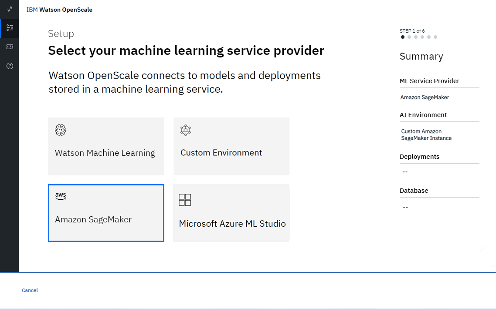

---

copyright:
  years: 2018, 2019
lastupdated: "2019-05-29"

keywords: Amazon SageMaker, machine learning, services, AWS

subcollection: ai-openscale

---

{:shortdesc: .shortdesc}
{:new_window: target="_blank"}
{:tip: .tip}
{:important: .important}
{:note: .note}
{:pre: .pre}
{:codeblock: .codeblock}
{:screen: .screen}

# Especificando uma instância de serviço do Amazon SageMaker ML
{: #csm-connect}

Sua primeira etapa na ferramenta {{site.data.keyword.aios_short}} é especificar uma instância de serviço do Amazon SageMaker. Sua instância de serviço do Amazon SageMaker é onde você armazena seus modelos e implementações de IA.
{: shortdesc}

## Conecte sua instância de serviço Amazon SageMaker
{: #csm-config}

O {{site.data.keyword.aios_short}} se conecta a modelos e implementações de IA em uma instância de serviço do Amazon SageMaker.

1.  Na página inicial da ferramenta {{site.data.keyword.aios_short}}, clique em **Iniciar**.

    

1.  Selecione o ladrilho **Amazon SageMaker** e clique em **Avançar**.

    

1.  Insira suas credenciais:

    

1.  Clique em **Avançar**.

1.  O {{site.data.keyword.aios_short}} listará seus modelos implementados; selecione os que você deseja monitorar

    

1.  Clique em **Avançar**.

### Próximos passos
{: #csm-next}

O {{site.data.keyword.aios_short}} agora está pronto para você [especificar um banco de dados](/docs/services/ai-openscale?topic=ai-openscale-connect-db).
