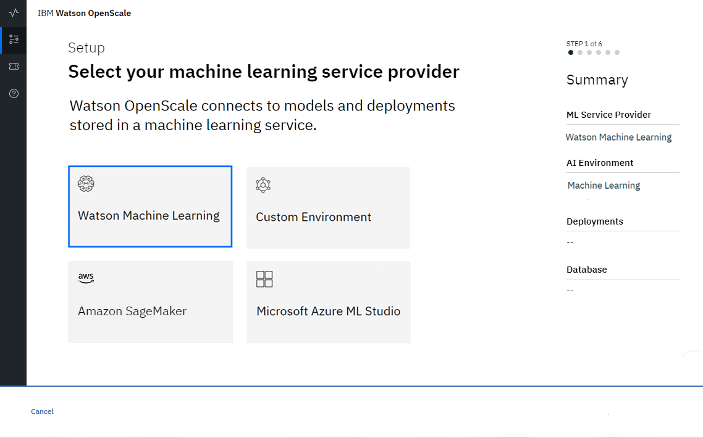

---

copyright:
  years: 2018, 2019
lastupdated: "2019-05-29"

keywords: Watson Studio, Watson Machine Learning, wml, machine learning, services

subcollection: ai-openscale

---

{:shortdesc: .shortdesc}
{:new_window: target="_blank"}
{:tip: .tip}
{:important: .important}
{:note: .note}
{:pre: .pre}
{:codeblock: .codeblock}
{:screen: .screen}

# Especificando uma instância de serviço do Watson Machine Learning
{: #wml-connect}

Sua primeira etapa na ferramenta {{site.data.keyword.aios_short}} é especificar uma instância do Watson Machine Learning (WML). Sua instância do WML é onde você armazena seus modelos e implementações de IA.
{: shortdesc}

## Pré-requisitos
{: #wml-prereq}

É necessário provisionar uma instância do WML na mesma conta do {{site.data.keyword.Bluemix_notm}} na qual a instância de serviço do {{site.data.keyword.aios_short}} está presente. Se você tiver provisionado uma instância do WML em alguma outra conta, não será possível configurar essa instância com o {{site.data.keyword.aios_short}}.

## Conectar sua instância de serviço do Watson Machine Learning
{: #wml-config}

O {{site.data.keyword.aios_short}} se conecta a modelos e implementações de IA em uma instância do WML.

1.  Na página inicial da ferramenta {{site.data.keyword.aios_short}}, clique em **Iniciar**.

    

2.  Selecione o bloco do Watson Machine Learning.

    

3.  O {{site.data.keyword.aios_short}} verifica a sua conta do {{site.data.keyword.Bluemix_notm}} para localizar quaisquer instâncias existentes do WML. Em seguida, é possível selecionar uma instância no menu suspenso **Serviço Watson Machine Learning**.

    

4.  (Opcional) Também há a opção de **Selecionar um local diferente** para especificar um local de aprendizado de máquina fora de sua conta do {{site.data.keyword.Bluemix_notm}}. Forneça credenciais para seu local como JSON válido:

    

    Clique em **Avançar**.

5.  O {{site.data.keyword.aios_short}} verifica a instância selecionada do Machine Learning para localizar uma lista de implementações armazenadas nessa instância. Na lista de implementações, selecione quais você monitorará.

    

6.  Clique em **Avançar**.
7.  Clique em **Salvar**.

### Próximos passos
{: #wml-next}

O {{site.data.keyword.aios_short}} agora está pronto para você [especificar um banco de dados](/docs/services/ai-openscale?topic=ai-openscale-connect-db).
