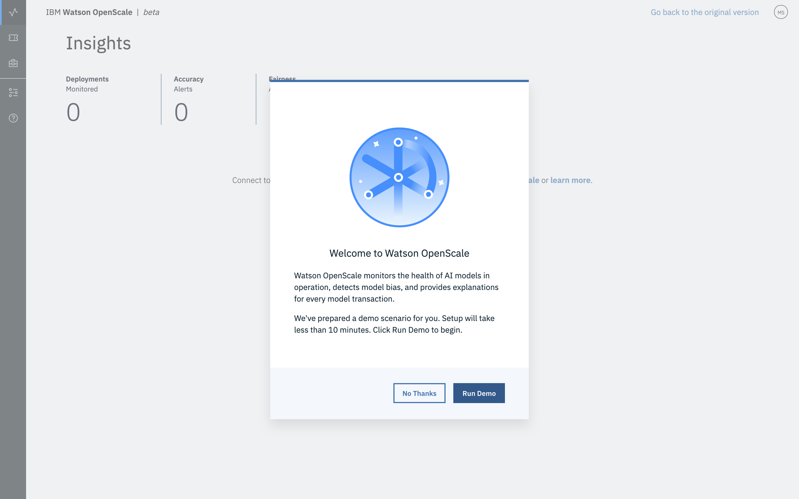
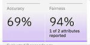
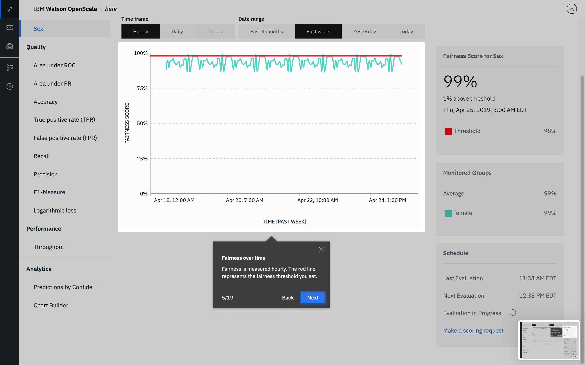

---

copyright:
  years: 2018, 2019
lastupdated: "2019-06-28"

keywords: ai, getting started, tutorial, understanding, fast start

subcollection: ai-openscale

---

{:shortdesc: .shortdesc}
{:new_window: target="_blank"}
{:hide-dashboard: .hide-dashboard}
{:tip: .tip}
{:important: .important}
{:note: .note}
{:pre: .pre}
{:codeblock: .codeblock}
{:screen: .screen}
{:javascript: .ph data-hd-programlang='javascript'}
{:java: .ph data-hd-programlang='java'}
{:python: .ph data-hd-programlang='python'}
{:swift: .ph data-hd-programlang='swift'}

# Configuração Automatizada
{: #wos-fast-start}

Para ver rapidamente como o {{site.data.keyword.aios_short}} monitora um modelo, execute a opção de cenário demo que é fornecida quando você efetua login pela primeira vez na IU do {{site.data.keyword.aios_short}}.  Consulte [Trabalhando com a demo de UI](#wos-work-demo).
{: shortdesc}

## Antes de Começar
{: #wos-prereqs}

Antes de iniciar o tour, deve-se ter os recursos a seguir já configurados:

- {{site.data.keyword.ibmid}}
- {{site.data.keyword.aios_full}}

## Trabalhando com a demo de UI
{: #wos-work-demo}

1.  Conecte-se à sua instância do {{site.data.keyword.aios_short}} no {{site.data.keyword.bluemix_full}}.
1.  Para trabalhar com o cenário de demonstração, clique em **Executar demo**.

   

   À medida que os serviços do {{site.data.keyword.aios_short}} estão sendo provisionados, é possível revisar o cenário demo:

   

Quando o fornecimento for concluído, clique no botão **Vamos lá** para
fazer o tour pelo painel do {{site.data.keyword.aios_short}} e continue com [Visualizando resultados no {{site.data.keyword.aios_short}}](#wos-open).

   

## Visualizando resultados no
{{site.data.keyword.aios_short}}
{: #wos-open}

Para visualizar insights sobre a justiça e a precisão do modelo, os detalhes de dados que são monitorados e a explicabilidade para uma transação individual, abra o painel do {{site.data.keyword.aios_short}}. Cada implementação é mostrada como um ladrilho. O tour configurou uma implementação chamada `GermanCreditRiskModel`, conforme mostrado na captura de tela a seguir:

   

### Visualizar insights
{: #wos-insights}

Em uma visão rápida, a página Insights mostra quaisquer problemas com justiça e precisão, conforme determinado pelos limites que estão configurados.

   

### Visualizar dados de monitoramento
{: #wos-monitoring}

1.  Na página Insights, clique no ladrilho `GermanCreditRiskModelICP` para visualizar detalhes sobre os dados monitorados.
1.  Clique e arraste o marcador no gráfico para visualizar um período de dia e horário que mostra os dados e, em seguida, clique no link **Visualizar detalhes**. Como alternativa, é possível clicar em diferentes períodos no gráfico para mudar os dados que você vê.

     - Por exemplo, a tela a seguir mostra os dados para uma data e um horário específicos. As datas e os horários variam, dependendo de quando você executa o módulo.

     - Para obter informações sobre como interpretar o gráfico de séries temporais, consulte [Monitorando a justiça, a média de solicitações por minuto e a precisão](/docs/services/ai-openscale-icp?topic=ai-openscale-icp-itc-timechart).

   

1.  Para ver detalhes sobre o monitoramento de dados de `SEX`, certifique-se
de que `SEX` esteja selecionado no menu suspenso.

    - Observe que na captura de tela a seguir, existe uma propensão.
    
   

    - Para obter informações sobre como interpretar o gráfico dos pontos de dados em uma hora específica, consulte [Visualização de dados](/docs/services/ai-openscale-icp?topic=ai-openscale-icp-itc-timechart#itc-data-visual).

### Visualizar explicabilidade
{: #wos-explain}

Para entender os fatores que contribuem quando a propensão está presente em um determinado
período, na tela de visualização mostrada na seção anterior, clique no botão de opções
**Transações com propensão**.

   

Os IDs de transação para a hora passada são listados para as transações que têm propensões. Para
o modelo usado neste módulo, existe uma propensão para solicitações que estão disponíveis.

   

Para obter informações sobre como localizar e explicar transações, consulte [Monitorando a explicabilidade](/docs/services/ai-openscale-icp?topic=ai-openscale-icp-ie-ov).

   

## Concluindo o tour
{: #wos-done-demo}

1. Clique no botão **Pronto**.

   

2. Clique no botão **Vamos lá** para começar a trabalhar com o {{site.data.keyword.aios_short}}.

   

## Informações
Relacionada
{: #wos-info}

- Para aprender sobre os biases, consulte [Equidade](/docs/services/ai-openscale-icp?topic=ai-openscale-icp-mf-monitor).
- Para aprender sobre o quão bem o seu modelo prevê resultados, consulte [Precisão](/docs/services/ai-openscale-icp?topic=ai-openscale-icp-acc-monitor).
- Para aprender sobre interpretação de gráficos, dados e transações, consulte [Monitorando a justiça, a média de solicitações por minuto e a precisão](/docs/services/ai-openscale-icp?topic=ai-openscale-icp-itc-timechart).
