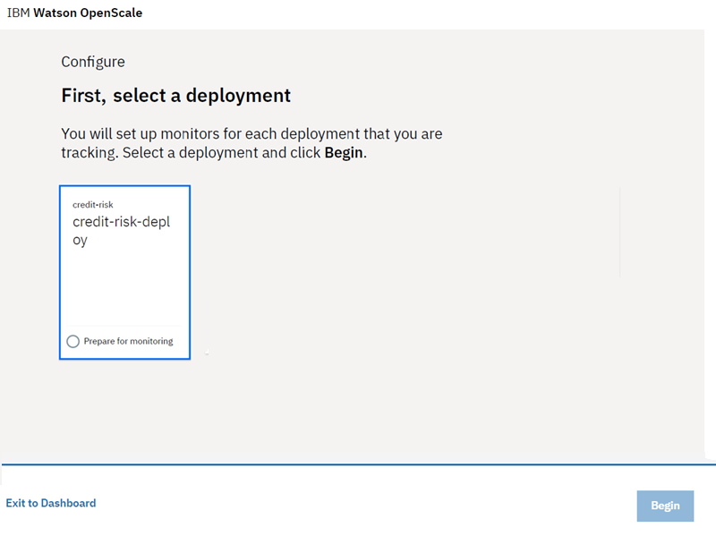
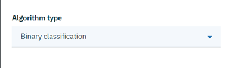
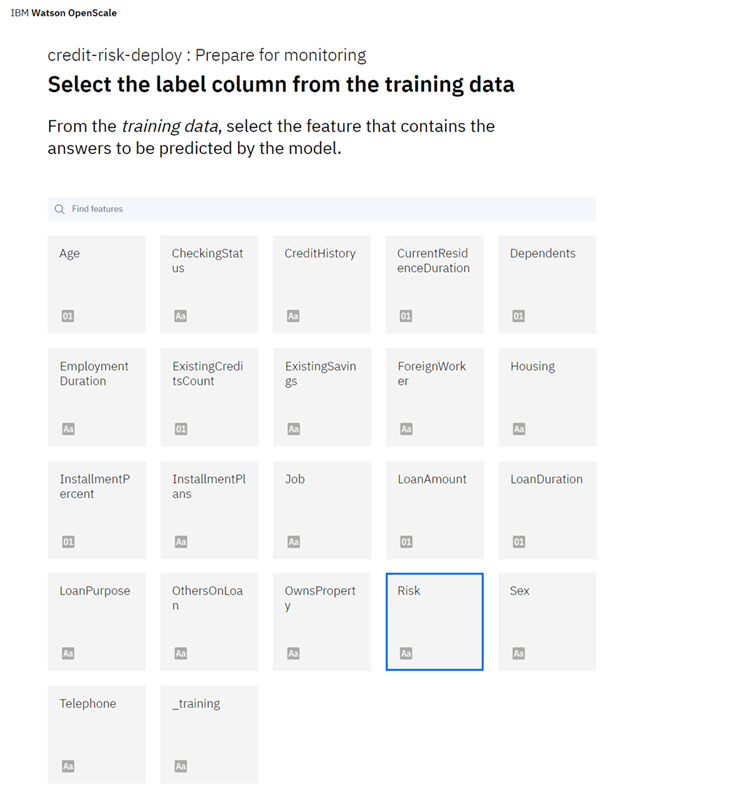

---

title: Confiança e transparência para os modelos de aprendizado de máquina com o {{site.data.keyword.aios_short}}
description: Monitor your machine learning deployments for bias, accuracy, and explainability
duration: 120
intro: In this tutorial, you will provision IBM Cloud machine learning and data services, create and deploy machine learning models in Watson studio, and configure the new IBM {{site.data.keyword.aios_full}} product to monitor your models for trust and transparency.
takeaways:
- See how {{site.data.keyword.aios_short}} provides trust and transparency for AI models
- Understand how IBM Cloud services and Watson Studio technologies can provide a seamless, AI-driven customer experience

copyright:
  years: 2018, 2019
lastupdated: "2019-04-11"

keywords: ai, getting started, tutorial, understanding, video

subcollection: ai-openscale

---

{:shortdesc: .shortdesc}
{:new_window: target="_blank"}
{:hide-dashboard: .hide-dashboard}
{:tip: .tip}
{:important: .important}
{:note: .note}
{:pre: .pre}
{:codeblock: .codeblock}
{:screen: .screen}
{:javascript: .ph data-hd-programlang='javascript'}
{:java: .ph data-hd-programlang='java'}
{:python: .ph data-hd-programlang='python'}
{:swift: .ph data-hd-programlang='swift'}

# Introdução - Tutorial (básico)
{: #gettingstarted}

O {{site.data.keyword.aios_full}} permite que as empresas automatizem e operacionalizem o ciclo de vida de IA em aplicativos de negócios, assegurando que os modelos de IA sejam livres de propensão, possam ser facilmente explicados e entendidos pelos usuários de negócios e sejam auditáveis em transações de negócios. O {{site.data.keyword.aios_short}} suporta modelos de AI construídos e executados nas ferramentas e estruturas de entrega de modelo de sua escolha.
{: shortdesc}

## Visão geral
{: #gs-view-demo}

Obtenha uma visão geral rápida do {{site.data.keyword.aios_short}} assistindo a este vídeo.

  

    <iframe class="embed-responsive-item" id="youtubeplayer" title="Confiança e transparência em IA" type="text/html" width="640" height="390" src="https://www.youtube.com/embed/6Ei8rPVtCf8" frameborder="0" webkitallowfullscreen mozallowfullscreen allowfullscreen> </iframe>
  

## Caso de uso do {{site.data.keyword.aios_short}}
{: #gs-use}

Os concessores tradicionais estão sob pressão para expandir seu portfólio digital de serviços financeiros para um público maior e mais diversificado, o que requer uma nova abordagem da modelagem de risco de crédito. Suas equipes de ciência de dados dependem atualmente de técnicas de modelagem padrão - como árvores de decisão e regressão logística - que funcionam bem para conjuntos de dados moderados e fazem recomendações que podem ser facilmente explicadas. Isso satisfaz os requisitos regulamentares de que as decisões de concessão de crédito devem ser transparentes e explicáveis.

Para fornecer acesso ao crédito para uma população mais ampla e mais arriscada, os históricos de crédito do requerente devem se expandir além do crédito tradicional, como hipotecas e empréstimos de carro, para fontes de crédito alternativo, como históricos de pagamento de serviços de utilidade e de plano telefônico móvel, além educação e cargos. Essas novas fontes de dados oferecem uma promessa, mas também apresentam riscos aumentando a probabilidade de correlações inesperadas que introduzem propensão com base na idade, sexo ou outras características pessoais de um requerente.

As técnicas de ciência de dados mais adequadas a esses diferentes conjuntos de dados, como as árvores impulsionadas por gradiente e as redes neurais, podem gerar modelos de risco altamente precisos, mas a um custo. Esses modelos de "caixa preta" geram predições opacas que devem de alguma forma se tornar transparentes, para garantir a aprovação regulamentar, como o artigo 22 do Regulamento Geral sobre a Proteção de Dados (GDPR) ou o Fair Credit Reporting Act (FCRA) federal gerenciado pelo Departamento de Proteção Financeira do Consumidor.

O modelo de risco de crédito fornecido neste tutorial usa um conjunto de dados de treinamento que contém 20 atributos sobre cada requerente de empréstimo. Dois desses atributos - idade e sexo - podem ser testados para propensão. Para este tutorial, o foco será a propensão com relação a sexo e idade.

O {{site.data.keyword.aios_short}} monitorará a propensão do modelo implementado para um resultado favorável ("Sem risco") para um grupo (o Grupo de referência) sobre outro (o Grupo monitorado). Neste tutorial, o Grupo monitorado para sexo é `female`, enquanto o Grupo monitorado para idade é `19 to 25`.

<!---
### How {{site.data.keyword.aios_short}} can help
{: #gs-how}

- *Identify run-time bias in the model*: The company has established evidence that shows the key factors that should influence which drug is predicted are BP, CHOLESTEROL, K and NA. AGE and SEX do play a role, but they're not as significant when compared to the other indicators. The company suspects that the data coming from patient trials might have suffered from biases of the practitioners for prescribing medications based on SEX and BP. The company wants to constantly monitor for such biases being learned from the data, and flag a suspected bias.

- *Constantly validate the accuracy of the model*: The company routinely evaluates the model prediction by having experts provide their own drug recommendations based on the patient data. The goal is to integrate these manual evaluations as feedback, to tell the model in real time where it might be wrong, and improve it over time.

- *Make the model more trustworthy*: To achieve a successful adoption of its AI assistant, the company received feedback from its customer base of medical practitioners and doctors who said they would not trust the AI model recommendations without understanding the logic behind them.

Each of these issues will be addressed in this tutorial, through the use of {{site.data.keyword.aios_short}}:

- The Fairness monitor will flag SEX and BP biases the model may have
- The Accuracy monitor uses feedback generated by your experts to test the performance of the deployed model, to detect model drift
--->

## Alternate setup option
{: #gs-module}

Instead of completing the following tutorial to explore {{site.data.keyword.aios_short}}, technical users can install a Python module that automates the provisioning and configuration of prerequisite services. This module requires that Python 3 is installed, which includes the pip package management system. For instructions, see, [Installing a Python module to set up {{site.data.keyword.aios_short}}](/docs/services/ai-openscale?topic=ai-openscale-as-module).

Additional tutorial links may be found in the [Additional resources](/docs/services/ai-openscale?topic=ai-openscale-arsc-ov) topic.

## Tutorial objectives
{: #gs-obj}

In this tutorial, you will:

- Provision {{site.data.keyword.Bluemix_notm}} machine learning and storage services
- Set up a Watson Studio project, and create, train and deploy a machine learning model
- Configure and explore trust, transparency and explainability for your model

## Provision prerequisite {{site.data.keyword.Bluemix_notm}} services
{: #gs-prps}

In addition to {{site.data.keyword.aios_short}}, to complete this tutorial, you need the following accounts and services.

<!---

Para o serviço {{site.data.keyword.composeForPostgreSQL}}, um plano Standard **pago** é necessário. Um crédito de US$ 200 {{site.data.keyword.Bluemix_notm}} pode ser obtido convertendo para uma conta paga com um cartão de crédito. Se você já tiver uma conta paga, receberá um reembolso único de US$ 16 do custo do primeiro GB de armazenamento, por um mês.
{: tip}

--->

**Importante**: para obter um melhor desempenho, recomenda-se que os serviços de pré-requisitos sejam criados na mesma região que o {{site.data.keyword.aios_short}}. Para visualizar os locais disponíveis para o {{site.data.keyword.aios_short}}, consulte [Disponibilidade do serviço](/docs/resources?topic=resources-services_region).

1.  Efetue login em sua conta do [{{site.data.keyword.Bluemix_notm}} ](https://{DomainName}){: new_window} com seu {{site.data.keyword.ibmid}}.
1.  Para cada um dos serviços a seguir que você ainda não associou à sua conta, crie uma instância clicando no link, fornecendo um nome ao serviço, selecionando o plano **Lite** (grátis) e clicando no botão **Criar**:

    - [Watson Studio ](https://{DomainName}/catalog/services/watson-studio){: new_window}

      

    - [Watson Machine Learning ](https://{DomainName}/catalog/services/machine-learning){: new_window}

      

    - [Object Storage ](https://{DomainName}/catalog/services/cloud-object-storage){: new_window}

      

<!---

### Fornecimento de um serviço Db2 Warehouse
{: #gs-provdb2}

- [Fornecimento de um serviço Db2 Warehouse ](https://{DomainName}/catalog/services/db2-warehouse){: new_window} se você ainda não tem um associado à sua conta:

  

- Forneça um nome ao seu serviço, escolha o plano de Entrada e clique no botão **Criar**.

### Faça upload dos dados de treinamento para o Db2 Warehouse
{: #gs-traindb2}

- Faça download do arquivo [drug_train_data_updated.csv ](https://raw.githubusercontent.com/watson-developer-cloud/doc-tutorial-downloads/master/ai-openscale/drug_train_data_updated.csv). Certifique-se de salvar o download do arquivo como um arquivo .CSV.

- Abra seu Db2 Warehouse existente (ou recém-criado) no [console do IBM Cloud ](https://{DomainName}){: new_window}, clique em **Gerenciar** no painel lateral esquerdo e, em seguida, clique no botão **Abrir**.

- Se necessário, use suas credenciais Db2 `username` e `password` para efetuar login no Db2 Warehouse.

- Depois que o Db2 Warehouse estiver aberto, clique no botão **Menu** e selecione **Carregar** no menu:

  

- Navegue para o arquivo de dados de treinamento ou arraste e solte-o na área apropriada no formulário. Clique em **Avançar**. Selecione um esquema na lista de destinos de carregamento; geralmente, eles estão em um formato como `DASH12345`. Em seguida, clique em **Nova tabela** à direita:

  

- Nomeie sua tabela como HEART\_DRUG\_TRAINING e clique no botão **Criar**:

  

- Clique em **Avançar** para visualizar os dados. Na tela de visualização, configure o campo **Separador** para um ponto e vírgula (;) e certifique-se de que a opção **Cabeçalho na primeira linha** esteja marcada:

  

- Os dados de treinamento devem agora ser exibidos corretamente em colunas. Clique em **Avançar** para continuar e, em seguida, clique em **Iniciar carregamento** para carregar os dados.

--->

## Configurar um projeto do Watson Studio
{: #gs-setup}

1.  Efetue login em sua [Conta do Watson Studio ](https://dataplatform.ibm.com/){: new_window} e comece criando um novo projeto. Selecione **Criar um projeto**.

    

1.  Selecione o bloco **Standard**.

    

1.  Forneça ao seu projeto um nome e uma descrição, certifique-se de que o serviço Object Storage criado na etapa anterior esteja selecionado no menu **Armazenamento** e clique em **Criar**.

### Associe seus serviços do {{site.data.keyword.Bluemix_notm}} ao seu projeto do Watson
{: #gs-assoc}

1.  Abra seu projeto do Watson Studio e selecione a guia **Configurações**. Role para baixo até chegar na seção **Serviços associados**, clique no menu **Incluir serviço** e selecione **Watson**.

    

1.  Clique no link **Incluir** no bloco **Machine Learning** e selecione a guia **Existente**. Escolha o serviço criado na seção anterior no menu **Instância de serviço existente** e clique em **Selecionar**.

<!---

- Na guia de configurações do projeto, selecione **Incluir serviço** novamente e escolha **Spark** no menu. Na guia **Existente**, escolha o serviço Spark criado e clique em **Selecionar**.

--->

### Inclua o modelo `Credit Risk`
{: #gs-addmod}

1.  No Watson Studio, selecione a guia **Ativos** do seu projeto, role para baixo até a seção **Modelos do Watson Machine Learning** e clique no botão **Novo modelo do Watson Machine Learning**.

1.  Na seção **Selecionar tipo de modelo**, selecione **Da amostra** e o modelo `Credit Risk` e, em seguida, clique em **Criar**.

    

### Implemente o modelo `Credit Risk`
{: #gs-depmod}

1.  Em seu projeto do Watson Studio, clique na guia **Ativos**, role até a seção **Modelos do Watson Machine Learning** e clique no modelo de risco de crédito que você acabou de criar.
2.  Na coluna **AÇÕES**, clique no menu **Ações**  e, em seguida, clique em **Implementar**.
3. Na guia **Ativos** em seu projeto do Watson Studio, role até a seção **Modelos do Watson Machine Learning** e clique no modelo `credit-risk` que você acabou de criar.
1.  Clique na guia **Implementações** e, em seguida, clique em **Incluir implementação**.
1.  Insira `credit-risk-deploy` como o nome para sua implementação e selecione o tipo de implementação **Serviço da web**.
1.  Clique em **Salvar**.

## Configurar o {{site.data.keyword.aios_short}}
{: #gs-confaios}

### Provisão {{site.data.keyword.aios_short}}
{: hide-dashboard}
{: #gs-provaios}

1.  [Provisione uma nova instância de serviço do {{site.data.keyword.aios_short}} ](https://{DomainName}/catalog/services/watson-openscale){: new_window}

<!---
    ![{{site.data.keyword.aios_short } } ] (images/openscale.png)
--->

2.  Forneça ao seu serviço um nome, selecione o plano Lite e clique em **Criar**.

### Conectar o {{site.data.keyword.aios_short}} ao seu modelo de aprendizado de máquina
{: #gs-ctmod}

Agora que o modelo de aprendizado de máquina foi implementado, é possível configurar o {{site.data.keyword.aios_short}} para assegurar confiança e transparência com seus modelos.

1.  Selecione a guia **Gerenciar** de sua instância do {{site.data.keyword.aios_short}} e clique no botão **Ativar aplicativo**. A página Introdução ao {{site.data.keyword.aios_full}} é aberta. Clique em **Iniciar**.

1.  Clique no bloco **Watson Machine Learning**.

1.  Para esse tutorial, selecione sua instância do Watson Machine Learning no menu e clique em **Avançar**.

    Também há a opção de selecionar uma localização diferente do Machine Learning. Consulte [Especificando uma instância de serviço do Watson Machine Learning](/docs/services/ai-openscale?topic=ai-openscale-wml-connect) para obter informações adicionais.
    {: note}

    

1.  Agora é possível selecionar os modelos implementados que serão monitorados pelo {{site.data.keyword.aios_short}}. Selecione o modelo criado e implementado e clique em **Avançar**.

    

1.  Em seguida, é necessário escolher um banco de dados. Você tem duas opções: o banco de dados do plano Lite grátis ou um banco de dados novo ou existente. Para este tutorial, selecione o bloco **Usar o banco de dados do plano Lite grátis**.

Consulte detalhes mais completos sobre cada uma dessas opções no tópico [Especificando um banco de dados](/docs/services/ai-openscale?topic=ai-openscale-connect-db).
  O banco de dados existente pode ser um banco de dados PostgreSQL ou um banco de dados Db2.
    {: tip}

    

1.  Revise os dados de resumo e clique em **Salvar**. Confirme e, quando solicitado, clique no botão **Continuar com a configuração**.

    Um ID do Data Mart também é listado, que é a mesma coisa que um ID da instância do {{site.data.keyword.aios_short}}.
    {: tip}

    

1.  Sua tela pode ser semelhante à captura de tela a seguir. Como você usará um método GUI para classificar seus dados, basta selecionar o botão **Configurar monitores** para concluir essa configuração.

    

### Forneça um conjunto de dados de amostra para seu modelo
{: #gs-samp}

Antes de ser possível configurar os monitores, deve-se gerar pelo menos uma solicitação de pontuação em seu modelo para gerar a criação de log de carga útil que os monitores podem consumir. Nesta seção, você fornecerá dados de amostra no formato de um arquivo JSON para gerar uma solicitação de pontuação.

1.  Faça download do arquivo [credit_payload_data.json ](https://raw.githubusercontent.com/watson-developer-cloud/doc-tutorial-downloads/master/ai-openscale/credit_payload_data.json).

1.  Na guia **Implementações** do seu projeto do Watson Studio, clique no link **credit-risk-deploy**, clique na guia **Teste** e selecione o ícone de entrada JSON.

    

1.  Agora, abra o arquivo `credit_payload_data.json` transferido por download e copie o conteúdo para o campo JSON na guia **Teste**. Clique no botão **Prever** para enviar e pontuar cargas úteis de treinamento para seu modelo.

    

### Preparando para Monitoramento
{: #gs-prepmon}

1.  Agora, na instância do {{site.data.keyword.aios_short}}, selecione sua implementação e clique em **Iniciar**.

    

1.  Selecione o bloco **Preparar para monitoramento** e, em seguida, clique em **Iniciar**.

    

1.  Em seguida, você fornecerá informações sobre seu modelo e dados de treinamento. Clique em **Avançar**.

    

1.  No menu **Tipo de dados**, selecione **Numérico/categórico** como o tipo de dados que sua implementação analisa e clique em **Avançar**.

    

1.  Para dados numéricos ou categóricos, é necessário fornecer informações sobre os dados de treinamento para seu modelo, a fim de configurar os monitores. Selecione **Configurar manualmente monitores** para fornecer informações de conexão para seus dados de treinamento.

    

1.  O tipo de algoritmo é importante para monitorar suas métricas de modelo, como Precisão. Como a previsão que o modelo pode fazer é "Risco" ou "Sem risco", selecione o **Classificação binária** [tipo de algoritmo](/docs/services/ai-openscale?topic=ai-openscale-acc-monitor#acc-understand) e clique em **Avançar**.

    

1.  As informações de local para os dados de amostra são pré-preenchidas na tela a seguir. Selecione **Avançar** para continuar.

    

1.  O esquema e a tabela também são pré-preenchidos. Clique em **Avançar** para continuar.

    

1.  Agora, deve-se especificar o recurso que contém a(s) resposta(s) que o modelo irá prever (em outras palavras, em seu banco de dados, qual coluna da tabela contém valores de predição (rótulos)). Nesse caso, o modelo irá prever o risco de crédito, portanto, selecione a coluna **Risco** e clique em **Avançar**.

    Seu banco de dados de treinamento tem os valores que você forneceu para treinar seu modelo.
    {: note}

    

1.  Selecione as colunas usadas para treinar o modelo. Esses são os dados que a implementação do modelo espera em uma solicitação. Todas as colunas de dados, exceto `_training`, são entradas para o modelo. Selecione todas as outras entradas e clique em **Avançar**.

    

1.  Para dados categóricos, deve-se identificar as colunas que agora contêm números inteiros, mas originalmente continham valores de texto. Selecione os valores conforme mostrado aqui.

    

1.  Revise o resumo de seleção, clique em **Salvar** e, em seguida, clique em **OK**.

### Configurar monitoramento de justiça
{: #gs-cfgfair}

1.  Clique em **Justiça**.

1.  Leia sobre justiça e clique em **Avançar**. Para obter mais informações, consulte [Justiça](/docs/services/ai-openscale?topic=ai-openscale-mf-monitor).

1.  Agora é possível escolher quais recursos monitorar para justiça. Para cada recurso selecionado, o {{site.data.keyword.aios_short}} monitorará a propensão do modelo implementado para um resultado favorável para um grupo sobre o outro. Neste exemplo, monitoraremos os recursos **Sexo** e **Idade**.

    Os recursos são monitorados individualmente, mas qualquer despropensão corrigirá problemas para todos os recursos juntos. Clique nos blocos **Sexo** e **Idade** e clique em **Avançar**.

1.  O {{site.data.keyword.aios_short}} trabalha para detectar propensão em relação a um grupo monitorado em comparação com um grupo de referência. Para o recurso **Sexo**, inclua o valor `male` no **Grupo de referência** e o valor `female` para o **Grupo monitorado** e clique em **Avançar**.

    O modelo será sinalizado como propenso para **Sexo** se as razões de previsão de Risco para o grupo monitorado forem diferentes das proporções para o grupo de referência. Então, se o modelo prevê risco para clientes do sexo masculino em 60% do tempo e para clientes do sexo feminino em 20% do tempo, ele é propenso.

    

1.  Agora é possível designar um limite de justiça para **Sexo**. Você verá um alerta em seu painel de operações se a classificação de Justiça ficar abaixo deste limite. Configure o limite em 90% e clique em **Avançar**.

1.  Para o recurso **Idade**, inclua os valores `26-74` no **Grupo de referência** e os valores `19-25` no **Grupo monitorado** e clique em **Avançar**.

    Assim como no caso de **Sexo**, o modelo será sinalizado como propenso para **Idade** se as razões de previsão de Risco para o grupo monitorado forem diferentes das proporções para o grupo de referência. Portanto, se os clientes com idade entre 26 e 74 anos receberem uma previsão de Risco em uma proporção diferente da previsão de clientes com idades entre 19 e 25 anos, o modelo será propenso.

    

1.  Configure o limite para **Idade** em 90% e clique em **Avançar**.

1.  Arraste e solte valores do campo **Valores de dados de treinamento** para os campos **Valores favoráveis** e **Valores desfavoráveis**. Para este tutorial, o valor favorável é **Nenhum risco** e o valor desfavorável é **Risco**. Clique em **Avançar**.

    O {{site.data.keyword.aios_short}} detecta automaticamente qual coluna no banco de dados de criação de log de carga útil contém os valores de previsão e os apresenta no campo **Valores de dados de treinamento**. Observe que enquanto seu banco de dados de treinamento tem valores que foram fornecidos para treinar seu modelo, o banco de dados de criação de log de carga útil contém dados de feedback coletados no tempo de execução do modelo, que podem, opcionalmente, ser usados para retreinar e reimplementar seu modelo.
    {: note}

    

1.  Use a régua de controle para ajustar o tamanho mínimo de amostra para 100, em seguida, clique em **Avançar**.

    

    Para este tutorial, o tamanho mínimo da amostra é configurado para 100. Normalmente, recomenda-se um tamanho de amostra maior para garantir que o tamanho da amostra não seja muito pequeno, o que distorceria os resultados.
    {: note}

1.  Revise suas opções, clique em **Salvar** e, em seguida, clique em **OK**.

    

    A janela a seguir, que fornece um terminal de pontuação despropenso, aparece. Como este tutorial usa o método da GUI e não a CLI para pontuar dados, para continuar, clique em **OK**.

    

### Configurar monitoramento de precisão
{: #gs-cfgac}

1.  Clique em **Precisão**.

1.  Leia sobre precisão e clique em **Avançar**. Para obter mais informações, consulte [Precisão](/docs/services/ai-openscale?topic=ai-openscale-acc-monitor).

1.  Configure o limite de alerta de precisão em 90% e clique em **Avançar**.

1.  Na próxima tela, use a régua de controle para ajustar o tamanho mínimo de amostra para 10, em seguida, clique em **Avançar**.

    Para este tutorial, o tamanho mínimo da amostra é configurado para 10. Normalmente, recomenda-se um tamanho de amostra maior para garantir que o tamanho da amostra não seja muito pequeno, o que distorceria os resultados.
    {: note}

1.  Para o tamanho máximo de amostra, use 10000. Clique em **Avançar**.

1.  Revise suas opções, clique em **Salvar** e, em seguida, clique em **OK**.

1.  Finalmente, você é apresentado a uma opção para incluir dados de feedback, que é coberta na próxima seção. Por agora, feche a janela clicando em **OK**, sem clicar no botão **Incluir dados de feedback**.

    Para obter mais detalhes, consulte [Configurando o monitor de precisão](/docs/services/ai-openscale?topic=ai-openscale-acc-monitor#acc-config).

## Forneça um conjunto de dados de feedback de amostra para seu modelo
{: #gs-smpfeed}

Para ativar o monitoramento para precisão, deve-se fornecer dados de feedback ao seu modelo. Os dados de precisão não aparecerão no painel até que isso seja feito. É possível gerar as solicitações de uma só vez, incluindo dados de feedback de amostra no modelo para pontuação. Para esta tarefa, você fará download de um arquivo CSV que contém dados de feedback de amostra.

1.  Faça download do arquivo [credit_feedback_data.csv ](https://raw.githubusercontent.com/watson-developer-cloud/doc-tutorial-downloads/master/ai-openscale/credit_feedback_data.csv).

1.  No {{site.data.keyword.aios_short}}, clique na guia **Insights**.

    

1.  Clique no bloco para seu modelo implementado.

    

1.  Em seguida, clique no ícone de edição para editar a configuração de implementação.

    

1.  No painel lateral de Resumo, clique no botão **Incluir dados de feedback** e selecione o arquivo `credit_feedback_data.csv` transferido por download. Selecione o delimitador **Vírgula (,)** e, em seguida, clique em **OK**.

    Os tamanhos dos arquivos são limitados atualmente a 8 MB.
    {: note}

    

    A inclusão do arquivo CSV fornece dados de feedback para seu modelo.

    

## Visualização de resultados
{: #gs-viewres}

Depois de configurar o monitoramento de precisão, a verificação de precisão é executada após uma hora. Em um sistema de produção, isso faz sentido para que seu painel possa acumular dados de feedback. Para os propósitos deste tutorial, você provavelmente desejará acionar a verificação de precisão manualmente depois de incluir seus dados de feedback, de modo que seja possível ver os resultados no painel **Insights**.

Para verificar o resultado imediatamente, na página **Insights**, selecione uma implementação e, em seguida, clique no botão **Verificar justiça agora** ou **Verificar precisão agora**.

### Visualizar insights para sua implementação
{: #gs-viewin}

1. No [painel do {{site.data.keyword.aios_short}} ](https://aiopenscale.cloud.ibm.com/aiopenscale/){: new_window}, clique na guia **Insights**.

  

1. Visualize a página Insights para ter uma visão geral das métricas para seus modelos implementados. É possível ver facilmente os alertas para as métricas de Justiça ou Precisão que ficaram abaixo do limite de 90%. 

  As métricas de Justiça e Precisão podem levar até uma hora para serem exibidas.
  {: tip}

  

### Visualizar dados de monitoramento para sua implementação
{: #gs-viewmon}

1.  Selecione uma implementação clicando no bloco na página Insights. Os dados de monitoramento para essa implementação serão exibidos. Nota: depois de fazer upload do arquivo .csv de feedback, talvez você ache que os dados de Justiça e Precisão não estão atualizados. Para verificar o resultado imediatamente, clique no botão **Verificar justiça agora** ou **Verificar precisão agora**.
1.  Deslize o marcador pelo gráfico para selecionar dados para o intervalo de tempo durante o qual você executou os dados de amostra e os dados de amostra de feedback. Em seguida, clique em **Visualizar detalhes**.

    

1.  Em seguida, revise os gráficos dos dados que você monitorou. Para este exemplo, use o menu **Recurso** para selecionar `Age` ou `Sex` para ver detalhes sobre os dados monitorados.

    Consulte [Visualizando dados para um horário específico](/docs/services/ai-openscale?topic=ai-openscale-it-ov#it-vdet) para obter mais informações sobre como ler esses gráficos.
    {: tip}

    

### Visualizar explicabilidade para uma transação de modelo
{: #gs-viewextx}

1.  Clique no botão **Visualizar transações** nos gráficos para obter os dados monitorados.

    

1.  Uma lista de transações que contribuíram para a propensão para a hora passada é exibida. Para visualizar uma explicação mais detalhada de uma transação específica, na coluna **AÇÃO**, clique em **Explicar**.

    

1.  Uma explicação de como o modelo chegou a sua conclusão é exibida. Essa explicação inclui o quão confiável o modelo era, os fatores que contribuíram para o nível de confiança e as colunas que foram alimentadas para o modelo.

    

## Próximos passos
{: #gs-next}

- Aprenda mais sobre [como visualizar e interpretar os dados](/docs/services/ai-openscale?topic=ai-openscale-it-ov) e [monitorar a explicabilidade](/docs/services/ai-openscale?topic=ai-openscale-ie-ov).
