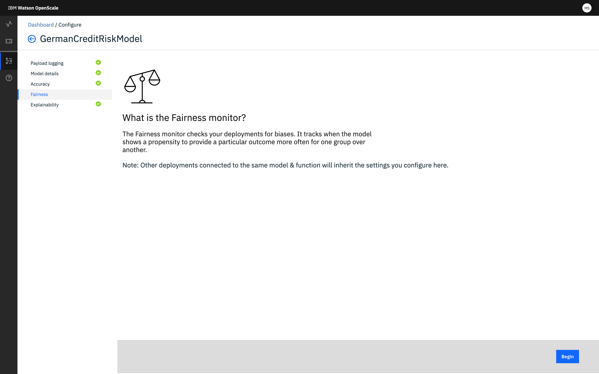

---

copyright:
  years: 2018, 2019
lastupdated: "2019-06-11"

keywords: fairness, fairness monitor, payload, perturbation, training data, debiased

subcollection: ai-openscale

---

{:shortdesc: .shortdesc}
{:external: target="_blank" .external}
{:tip: .tip}
{:important: .important}
{:note: .note}
{:pre: .pre}
{:codeblock: .codeblock}
{:download: .download}
{:screen: .screen}
{:javascript: .ph data-hd-programlang='javascript'}
{:java: .ph data-hd-programlang='java'}
{:python: .ph data-hd-programlang='python'}
{:swift: .ph data-hd-programlang='swift'}
{:faq: data-hd-content-type='faq'}

# Configurando o monitor de justiça
{: #mf-monitor}

No {{site.data.keyword.aios_full}}, o monitor de justiça varre sua implementação em busca de propensões, para assegurar resultados justos em diferentes populações.
{: shortdesc}

## Entendendo a Equidade
{: #mf-understand}

O {{site.data.keyword.aios_short}} verifica seu modelo implementado para propensão no tempo de execução. Para detectar a propensão para um modelo implementado, deve-se definir os atributos de justiça, como Idade ou Gênero, conforme detalhado na seção [Configurando o monitor de justiça](#mf-config) a seguir.

É obrigatório especificar o esquema de saída para um modelo ou função no Watson {{site.data.keyword.pm_short}}, para que a verificação de propensão seja ativada no {{site.data.keyword.aios_short}}. O esquema de saída pode ser especificado usando a propriedade `client.repository.ModelMetaNames.OUTPUT_DATA_SCHEMA` na parte de metadados da API `store_model`. Para obter mais informações, consulte a [documentação do cliente {{site.data.keyword.pm_full}}](http://wml-api-pyclient-dev.mybluemix.net/#repository){: external}.

### Como ele funciona
{: #mf-works}

Antes de configurar o monitor de Justiça, há alguns conceitos chave que são críticos para entender:

- Os atributos de justiça são os atributos de modelo para os quais o modelo provavelmente exibirá propensão. Como um exemplo, para o atributo de justiça **`Gender`**, o modelo pode ser propenso com relação a valores de gênero específicos (`Female`, `Transgender` etc.) Outro exemplo de um atributo de justiça é **`Age`**, em que o modelo pode exibir propensão com relação a pessoas em um grupo de idade, como `18 to 25`.

- Valores de referência monitorados: os valores de atributos de justiça são divididos em duas categorias distintas: Referência e Monitorado. Os valores Monitorados são aqueles que provavelmente serão discriminados. No caso de um atributo de justiça como **`Gender`**, os valores Monitorados podem ser `Female` e `Transgender`. Para um atributo de justiça numérico, como **`Age`**, os valores Monitorados podem ser `[18-25]`. Todos os outros valores para um determinado atributo de justiça são, então, considerados como valores de Referência, por exemplo, `Gender=Male` ou `Age=[26,100]`.

- Resultados favoráveis e desfavoráveis: a saída do modelo é categorizada como Favorável ou Desfavorável. Como um exemplo, se o modelo estiver prevendo se uma pessoa deve obter um empréstimo ou não, o resultado Favorável poderá ser `Loan Granted` ou `Loan Partially Granted`, enquanto o resultado Desfavorável pode ser `Loan Denied`. Portanto, o resultado Favorável é aquele que é considerado como um resultado positivo, enquanto o resultado Desfavorável é considerado como sendo negativo.

O algoritmo do {{site.data.keyword.aios_short}} calcula a propensão em uma base por hora, usando os últimos `N` registros presentes na tabela de criação de log de carga útil; o valor de `N` é especificado ao configurar a Justiça. O algoritmo perturba esses últimos `N` registros para gerar dados adicionais.

A perturbação é feita mudando o valor do atributo fairness de Reference para Monitored ou vice-versa. Os dados perturbados são então enviados para o modelo para avaliar seu comportamento. O algoritmo examina os últimos `N` registros na tabela de carga útil e o comportamento do modelo nos dados perturbados para decidir se o modelo está agindo de uma maneira propensa.

Um modelo será considerado como propenso se, nesse conjunto de dados combinado, a porcentagem de resultados Favoráveis para a classe Monitorada for menor que a porcentagem de resultados Favoráveis para a classe de Referência, por algum valor do limite. Esse valor do limite deve ser especificado ao configurar a Justiça.

Os valores de justiça podem ser mais de 100%. Isso significa que o grupo Monitorado recebeu resultados mais favoráveis do que o grupo de Referência. Além disso, se nenhuma nova solicitação de escoragem for enviada, o Valor de justiça permanecerá constante.
{: note}

### Faça as contas
{: #mf-bias-math}

A métrica de justiça usada no {{site.data.keyword.aios_short}} é um impacto desproporcional, que é uma medida de como a taxa na qual um grupo não privilegiado recebe um determinado resultado se compara à taxa na qual um grupo privilegiado recebe esse mesmo resultado.

A fórmula matemática a seguir é usada para calcular o impacto desproporcional:

```
                     (num_positives(privileged=False) / num_instances(privileged=False))
Impacto desproporcional =   ______________________________________________________________________

                     (num_positives(privileged=True) / num_instances(privileged=True))
```

em que `num_positives` é o número de indivíduos no grupo (privileged=False, ou seja, não privilegiado, ou privileged=True, ou seja, privilegiado) que recebeu um resultado positivo e num_instances é o número total de indivíduos no grupo.

O número resultante será uma porcentagem, ou seja, a porcentagem de comparação entre a taxa na qual o grupo não privilegiado recebe o resultado positivo e a taxa na qual o grupo privilegiado recebe o resultado positivo. Por exemplo, se um modelo de risco de crédito atribuir a predição “sem risco” a 80% dos requerentes não privilegiados e a 100% dos requerentes privilegiados, esse modelo terá um impacto desproporcional (apresentado como a pontuação de justiça no {{site.data.keyword.aios_short}}) de 80%.

No {{site.data.keyword.aios_short}}, os resultados positivos são designados como os resultados favoráveis e os resultados negativos são designados como os resultados desfavoráveis. O grupo privilegiado é designado como o grupo de referência e o grupo não privilegiado é designado como o grupo monitorado.


### Visualização de propensão 
{: #mf-monitor-bias-viz}

Quando uma propensão em potencial é detectada, o {{site.data.keyword.aios_short}} executa várias funções para confirmar se a propensão é real. O {{site.data.keyword.aios_short}} perturba os dados invertendo o valor monitorado para o valor de referência e, em seguida, executando esse novo registro por meio do modelo. Em seguida, ele exibe a saída resultante como uma saída sem propensão. O {{site.data.keyword.aios_short}} também treina um modelo sem propensão de sombra que depois é usado para detectar quando um modelo fará uma previsão com propensão. 

São usados dois conjuntos de dados diferentes para calcular a justiça e a precisão. A justiça é calculada usando a carga útil + dados perturbados. A Precisão é calculada usando os dados de feedback. Para calcular a precisão, o {{site.data.keyword.aios_short}} precisa de dados rotulados manualmente, presentes apenas na tabela de feedback.

Os resultados dessas determinações estão disponíveis na visualização de propensão, que inclui as visualizações a seguir: 

- **Carga útil + Perturbado**: inclui a solicitação de pontuação recebida para a hora selecionada mais os registros adicionais das horas anteriores se o número mínimo de registros necessários para avaliação não é atendido. Inclui registros adicionais perturbados/sintetizados usados para testar a resposta do modelo quando o valor do recurso monitorado é mudado.

   Anote as cargas úteis e detalhes perturbados a seguir:

   - número de registros que são lidos nesta hora por meio da tabela de carga útil
   - Registros adicionais que são lidos por meio de horas anteriores (por exemplo, se o valor `min_records` na configuração de justiça for configurado para 1.000 e apenas 10 registros forem incluídos das 14h às 15h, para atender ao requisito mínimo, o sistema lerá um adicional de 990 registros de horas anteriores.)
   - Registros perturbados por atributo de justiça
   - Registro de data e hora mais antigo no quadro de dados para o qual a propensão deve ser calculada
   - O registro de data e hora mais recente/mais novo no quadro de dados para o qual a propensão deve ser calculada

  


- **Carga útil**: as solicitações de pontuação reais recebidas pelo modelo para a hora selecionada.

   Anote os detalhes da carga útil a seguir:
   
   - número de registros que são lidos/em que a operação sem propensão é executada por meio da tabela de carga útil
   - Registro de data e hora mais antigo no quadro de dados para o qual a propensão deve ser calculada
   - O registro de data e hora mais recente/mais novo no quadro de dados para o qual a propensão deve ser calculada


  

- **Treinamento**: os registros de dados de treinamento usados para treinar o modelo.

   Anote os detalhes de treinamento a seguir:
   
   - número de registros de dados de treinamento. Os dados de treinamento são lidos uma vez e a distribuição é armazenada na variável `subscription/fairness_configuration`. Ao calcular a distribuição, também é necessário encontrar o número de registros de dados de treinamento e armazená-lo na mesma distribuição. Também, quando os dados de treinamento mudarem, ou seja, se o comando `POST /data_distribution` for executado novamente, esse valor será atualizado na variável `fairness_configuration/training_data_distribution`. Ao enviar a métrica, é necessário enviar esse valor também.
   - O horário em que os dados de treinamento são processados pela última vez (primeira vez e atualizações subsequentes)

  
   

   
- **Sem propensão**: a saída do algoritmo sem propensão após o processamento do tempo de execução e de dados perturbados.

   Anote os detalhes sem propensão a seguir:
   
   - número de registros que são lidos/nos quais a operação sem propensão é executada por meio da tabela de carga útil
   - Registros adicionais que são lidos para executar propensão e, portanto, sem propensão também. Mesmo número que na seleção `Carga útil + Perturbado`
   - Registros perturbados por atributo de justiça
   - Registro de data e hora mais antigo no quadro de dados para o qual a propensão deve ser calculada
   - O registro de data e hora mais recente/mais novo no quadro de dados para o qual a propensão deve ser calculada
   - Valores de justiça anteriores e posteriores são exibidos na parte do cabeçalho da visualização Sem propensão. 
      - A precisão **posterior** é calculada usando os dados de feedback e enviando-os para a API de remoção de propensão ativa. Esta API retorna a predição sem propensão. Os dados de feedback também contêm o rótulo manual. O rótulo manual é comparado com a predição sem propensão para calcular a precisão. Esta API retorna a predição sem propensão. A tabela de feedback também contém o rótulo manual. O rótulo manual é comparado com a predição sem propensão para calcular a precisão. 
      - A precisão **anterior** é calculada usando os mesmos dados de feedback. Para o cálculo da precisão anterior, os dados de feedback são enviados para o modelo para obter sua predição e o valor predito é comparado com o rótulo manual para obter a precisão.

  
  
### Por exemplo
{: #mf-ex1}

Considere um ponto de dados em que, para `Gender=Male` (valor de Referência), o modelo prevê um resultado Favorável, mas quando o registro é perturbado mudando `Gender` para `Female` (valor Monitorado), enquanto mantém todos os outros valores de recurso iguais, o modelo prevê um resultado Desfavorável. Um modelo geral é indicado para exibir propensão se houver pontos de dados suficientes (nos últimos `N` registros na tabela de carga útil, mais os dados perturbados) em que o modelo estava agindo de uma maneira propensa.

### Modelos suportados
{: #mf-supmo}

 O {{site.data.keyword.aios_short}} suporta a detecção de propensão somente para os modelos e funções Python que esperam algum tipo de dados estruturados em seu vetor de recurso.

## Configurando o Monitor de Equidade
{: #mf-config}

Na guia **Justiça**, na página **O que é Justiça?**, clique em **Iniciar** para começar o processo de configuração.



Em todo esse processo, o {{site.data.keyword.aios_full}} analisa seu modelo e faz recomendações com base no resultado mais lógico. Nas páginas sucessivas da guia **Justiça**, deve-se executar as tarefas a seguir:

1. Selecione os recursos a serem monitorados. Somente os recursos que são do tipo de dados de justiça categórico, numérico (inteiro), flutuante ou duplo são suportados. Os recursos com outros tipos de dados não são suportados.

1. Especifique os grupos de referência e monitorados.

   Cada recurso tem requisitos específicos para configurar. Por exemplo, caso você escolha `age` como um de seus recursos monitorados, deve-se definir os intervalos de duração para um **Grupo de referência** e um **Grupo monitorado** inserindo valores diretamente em cada grupo.

1.  Configure o limite de alerta de justiça para o recurso.

    Um limite de Justiça é usado para especificar uma diferença aceitável entre a porcentagem de resultados Favoráveis para o grupo Monitorado em comparação com a porcentagem de resultados Favoráveis para o grupo de Referência.

    Considere um modelo que prevê quem deve obter um empréstimo (`favorable outcome=loan granted`) e quem não deve (`unfavorable outcome=loan denied`). Além disso, o valor Monitorado para a idade é `[18,25]` e o valor de Referência é `[26,100]`. Quando o algoritmo de detecção de propensão é executado, se ele descobre que a porcentagem de resultados Favoráveis para pessoas no grupo de idade `[18,25]` nos últimos `N` registros mais os dados perturbados é `50%`, enquanto a porcentagem de resultados Favoráveis para as pessoas no grupo de idade `[26,100]` é `70%`, a Justiça é calculada como 50*100/70 = 71,42.

    Se o limite de Justiça for configurado como 80%, o algoritmo sinalizará o modelo como sendo propenso, porque a Justiça calculada excede o limite. No entanto, se o limite for configurado como 70%, ele não relatará o modelo como sendo propenso.

     Os valores inseridos nessas telas devem ser aqueles enviados para o terminal de pontuação do modelo (e, consequentemente, serão incluídos na tabela de carga útil). Se os dados estiverem sendo manipulados antes de serem enviados para o terminal de pontuação, insira os valores manipulados. Por exemplo, se os dados originais tinham valores de `Male` e `Female` para *Gênero* e eles foram manipulados para que os dados enviados ao terminal de pontuação fossem `M` e `F`, insira `M` e `F` nessa tela.

1.  Especifique valores que representem um resultado favorável para o modelo. Os valores serão derivados da coluna `label` nos [dados de treinamento](/docs/services/ai-openscale?topic=ai-openscale-trainingdata#trainingdata), se o esquema de saída do modelo contiver uma coluna de mapeamento. No {{site.data.keyword.pm_full}}, a coluna `prediction` sempre tem um valor duplo. A coluna de mapeamento é usada para especificar o mapeamento desse valor `prediction` para o rótulo de classe.

    Por exemplo, se o valor `prediction` for `1.0`, a coluna de mapeamento poderá ter um valor de `Loan denied`; isso implica que a predição do modelo é `Loan denied`. Portanto, se o esquema de saída do modelo contiver uma coluna de mapeamento, especifique os valores Favoráveis e Desfavoráveis usando aqueles presentes na coluna de mapeamento.

    Se, no entanto, a coluna de mapeamento não estiver presente no esquema de saída do modelo, os valores Favoráveis e Desfavoráveis precisarão ser especificados usando o valor da coluna `prediction` (`0.0`, `1.0` etc.)

1.  Finalmente, configure um tamanho mínimo de amostra para evitar a medição de Justiça até que um número mínimo de registros esteja disponível no conjunto de dados de avaliação. Isso assegura que o tamanho da amostra não seja muito pequeno para distorcer os resultados. Toda vez que a verificação de propensão for executada, ela usará o tamanho mínimo de amostra para decidir o número de registros nos quais ela fará o cálculo de propensão.

    Um resumo de suas seleções é apresentado para revisão. Se desejar mudar alguma coisa, clique no link **Editar** dessa seção, caso contrário, clique em **Salvar**.

    Também é possível clicar em **Incluir outro recurso** para retornar à tela de seleção de variável e incluir mais recursos, como `City`, `Zip Code` ou `Account Balance` no monitor de Justiça.

### Entender como funciona a desbiasing
{: #mf-debias}

Para verificar o terminal de remoção de propensão, clique no botão **Terminal de remoção de propensão**. Em seguida, é possível visualizar e copiar o terminal em diferentes formatos, como cURL, Java ou Python. 

O terminal de pontuação despropensa pode ser usado exatamente como o terminal de pontuação normal de seu modelo implementado. Além de retornar a resposta de seu modelo implementado, ele também retorna as colunas `debiased_prediction` e `debiased_probability`.

- A coluna `debiased_prediction` contém o valor de predição propensa. No caso do {{site.data.keyword.pm_full}}, esta é uma representação codificada da predição. Por exemplo, se a predição do modelo for "Loan Granted" ou "Loan Denied", o {{site.data.keyword.pm_full}} poderá codificar esses dois valores como "0.0" e "1.0", respectivamente. A coluna `debiased_prediction` contém uma representação codificada como codificada da predição despropensa.

- A coluna `debiased_probability`, por outro lado, representa a probabilidade da predição despropensa. Esta é uma matriz de valor duplo, em que cada valor representa a probabilidade da predição despropensa pertencente a uma das classes de predição.

Uma outra coluna, `debiased_decoded_target`, também é retornada, caso você tenha uma coluna em seu esquema de saída que contenha uma coluna com `modeling-role` como `decoded-target`.

- A coluna `debiased_decoded_target` contém a representação de sequência da predição despropensa. No exemplo anterior, em que o valor de predição era "0.0" ou "1.0", o `debiased_decoded_target` conterá "Loan Granted" ou "Loan Denied".

Idealmente, você chamaria diretamente esse terminal por meio de seu aplicativo de produção, em vez de chamar diretamente o terminal de pontuação de seu modelo implementado em seu mecanismo de entrega de modelo ({{site.data.keyword.pm_full}}, Amazon Sagemaker, Microsoft Azure ML Studio, etc.) Dessa forma, o {{site.data.keyword.aios_short}} também armazenará os valores `debiased` na tabela de criação de log de carga útil de sua implementação de modelo. Em seguida, toda a pontuação feita por meio desse terminal seria automaticamente despropensa.

Como esse terminal lida com a propensão de tempo de execução, ele continuará a executar verificações de segundo plano para os dados de pontuação mais recentes da tabela de criação de log de carga útil e continuará atualizando o modelo de mitigação de propensão que é usado para a despropensão das solicitações de pontuação enviadas. Dessa forma, o {{site.data.keyword.aios_short}} é sempre atualizado com os dados recebidos mais recentes e com seu comportamento para detectar e minimizar a propensão.

Finalmente, o {{site.data.keyword.aios_short}} usa um limite para decidir que os dados são agora aceitáveis e considerados como imparciais. Esse limite é tomado como o menor valor dos limites configurados no monitor de Justiça para todos os atributos de justiça configurados.

## Próximos passos
{: #mf-next}

Na página **Configurar monitores**, é possível selecionar outra categoria de monitoramento.
