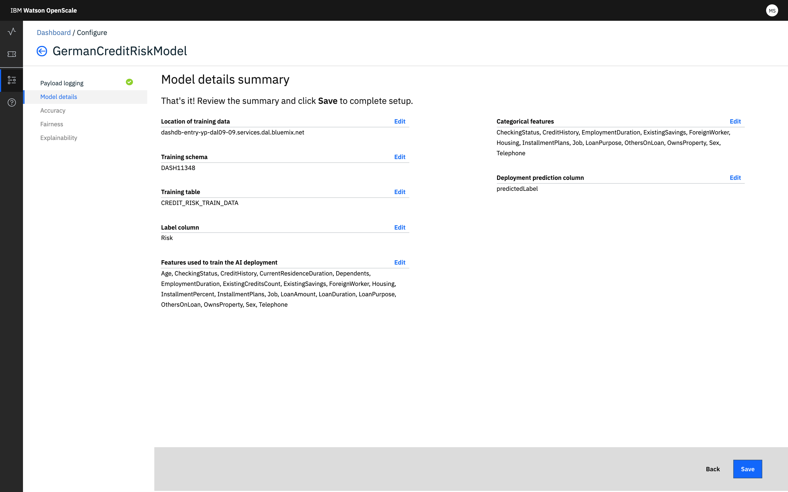

---

copyright:
  years: 2018, 2019
lastupdated: "2019-06-28"

keywords: deployment, monitors, data

subcollection: ai-openscale

---

{:shortdesc: .shortdesc}
{:new_window: target="_blank"}
{:tip: .tip}
{:important: .important}
{:note: .note}
{:pre: .pre}
{:codeblock: .codeblock}
{:screen: .screen}

# Preparando Monitores para uma Implementação
{: #mo-config}

Configure e ative os monitores para cada implementação que você está rastreando com o {{site.data.keyword.aios_short}}.
{: shortdesc}

## Selecionando uma implementação
{: #mo-select-deploy}

1.  Primeiro, você deve selecionar uma implementação.

    Se houver múltiplas implementações para um determinado modelo, ao configurar uma implementação, todas as outras implementações para o mesmo modelo também serão configuradas.
    {: note}

    

1.  Selecione o bloco *Preparar para monitoramento*.

    

## Trabalhando com dados
{: #mo-work-data}

1.  Agora você fornecerá informações sobre seus dados de modelo e treinamento; clique em **Avançar**. Para
obter mais informações sobre os dados de treinamento, veja [Por que o {{site.data.keyword.aios_short}} precisa de acesso aos meus dados de treinamento?](/docs/services/ai-openscale?topic=ai-openscale-trainingdata#trainingdata)

    

1.  No menu suspenso, selecione o tipo de dados que sua implementação analisa e clique em **Avançar**.

    

### Dados numéricos / categóricos
{: #mo-nuca}

Para dados numéricos ou categóricos, é necessário fornecer informações sobre os dados de treinamento para seu modelo, a fim de configurar os monitores.

  

- **Configurar monitores manualmente** - requer que você forneça informações de conexão para seus dados de treinamento.

    - Selecione o [tipo de algoritmo](/docs/services/ai-openscale?topic=ai-openscale-acc-monitor#acc-understand) e clique em **Avançar**:

      

      Assegure-se de que o formato dos dados de treinamento seja exatamente o mesmo que o esperado por seu modelo. Por exemplo, se o modelo espera `M` e `F` para o recurso *Gender*, os dados de treinamento devem ter `M` e `F`, não `Male` e `Female`. Atualmente, o {{site.data.keyword.aios_short}} suporta somente os locais do banco de dados Db2 ou do Cloud Object Storage.
        {: important}

    - Especifique o Local (`Db2` ou `Cloud Object Storage`), em seguida:

        - Para um banco de dados Db2, conclua o seguinte:

            - Nome do host ou Endereço IP
            - Port
            - Banco de dados (nome)
            - Nome de usuário
            - Senha

            

        - Para o Cloud Object Storage, conclua o seguinte:

            - URL de Login

              A URL de Login deve corresponder à configuração de região do depósito no qual os dados de treinamento estão localizados. Você especificará o depósito de dados de treinamento na próxima etapa.
              {: important}

            - Instância de recurso (ID)
            - Chave de API

            

    - Assegure uma conexão válida clicando no botão **Testar** para conectar-se aos dados de treinamento. Clique em **Avançar**.

    - Especifique o local exato no banco de dados Db2 ou no Cloud Object Storage em que os dados de treinamento estão localizados.

        - Para um banco de dados Db2, selecione um esquema e uma tabela de treinamento que inclua colunas esperadas por seu modelo:

          

        - Para o Cloud Object Storage, selecione um Depósito e um Conjunto de dados:

          

          Clique em **Avançar** para continuar com a Etapa 5 abaixo.

- **Fazer upload de um arquivo de configuração** - escolha essa opção se preferir manter seus dados de treinamento privados. É possível usar um bloco de notas Python customizado para fornecer ao {{site.data.keyword.aios_short}} informações para analisar seus dados de treinamento sem fornecer acesso aos dados de treinamento em si.

  A execução do bloco de notas Python permite capturar valores distintos nas colunas do esquema, assim como os nomes de colunas. Além disso, é possível usar o bloco de notas para pré-configurar o monitor de Justiça.

    - Faça download do [bloco de notas customizado ](https://github.com/IBM-Watson/aios-data-distribution/blob/master/training_statistics_notebook.ipynb){: new_window} e substitua quaisquer credenciais por suas próprias credenciais.

    - Revise cuidadosamente o bloco de notas, especificando dados para seu modelo onde apropriado. Salve o bloco de notas.

    - Execute o bloco de notas para gerar um arquivo de configuração formatado por JSON.

    - Faça upload do arquivo de configuração JSON.

        

    - Clique em **Avançar**.

- O {{site.data.keyword.aios_short}} localizará seus dados de treinamento por meio dos metadados armazenados com o modelo no WML. Escolha a coluna do rótulo nos dados de treinamento que contêm seus valores de predição e clique em **Avançar**.

  

- Selecione as colunas usadas para treinar o modelo - estes são os recursos que sua implementação de modelo espera em uma solicitação. Clique em **Avançar**.

    

- Finalmente, selecione as colunas que continham texto e foram convertidas em números inteiros. Por exemplo, se os dados de treinamento originais contiverem `Male` e `Female` para *Gênero* e eles tiverem sido mapeados para `0` e `1` respectivamente, os dados de treinamento agora conterão os valores `0` e `1` para a coluna *Gênero*. Identifique essas colunas que agora contêm números inteiros, mas originalmente continham valores de texto. Clique em **Avançar**.

    

### Imagens e Texto Não Estruturado
{: #mo-imun}

- **Imagens**

  Para modelos que aceitam imagens como entrada, a imagem precisa ser representada como um formato (altura) x (largura) x (# canais), em que cada ponto representa valores monocromáticos ou RGB para cada pixel.

- **Texto sem estrutura**

   Para modelos que aceitam texto como entrada, espera-se que o modelo aceite o texto inteiro, e não uma representação vetorizada do texto.

## Revisar e Salvar Configuração
{: #mo-save}

Revise o resumo da seleção e clique em **Salvar** para continuar.

  

### Próximos passos
{: #mo-next}

Para iniciar a configuração de monitores, selecione uma categoria e clique em **Iniciar**.
