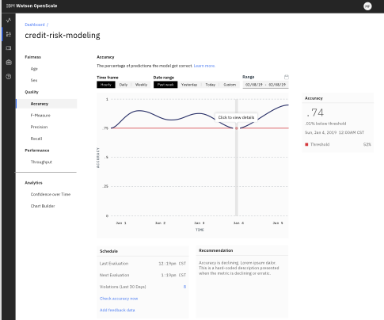
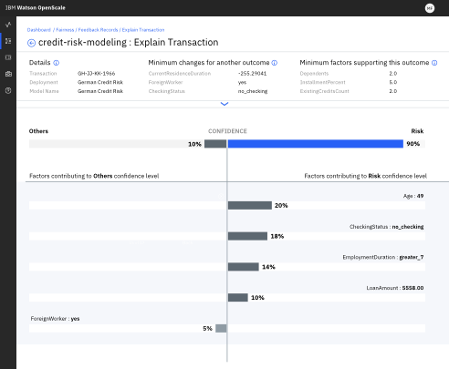

---

copyright:
  years: 2018, 2019
lastupdated: "2019-06-24"

keywords: metrics, monitoring, custom metrics, thresholds

subcollection: ai-openscale

---

{:shortdesc: .shortdesc}
{:new_window: target="_blank"}
{:tip: .tip}
{:important: .important}
{:note: .note}
{:pre: .pre}
{:codeblock: .codeblock}
{:screen: .screen}

# Analisando métricas e transações 
{: #anlz_metrics}

É possível usar o {{site.data.keyword.aios_full}} para analisar métricas e transações por meio de uma variedade de formas.
{: shortdesc}

## Matriz de confusão 
{: #it-conf-mtx}

Como um detalhe das métricas de qualidade, é possível visualizar os registros que o modelo analisou incorretamente. Essas anomalias podem ser falsos positivos ou falsos negativos para modelos de classificação binários ou podem ser designações de classe incorretas para modelos de várias classes. Também
é possível visualizar uma lista de registros de feedback que o modelo não analisou corretamente.
{: shortdesc}

1. Em qualquer um dos gráficos de **Qualidade**, tais como **Justiça**, clique em uma hora/dia no gráfico.
    
    

1. Uma matriz de confusão exibe os falsos positivos e os falsos negativos. Clique em uma célula
para visualizar o subconjunto de registros de feedback.

    

1. Revise os registros de feedback e solicite uma explicação da análise com relação ao registro de feedback.

    

1. As transações aparecem em sequência.

    

