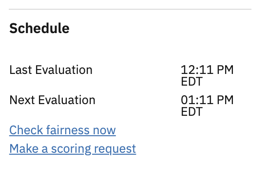

---

copyright:
  years: 2018, 2019
lastupdated: "2019-06-28"

keywords: fairness, monitoring, charts, de-biasing, bias, accuracy

subcollection: ai-openscale

---

{:shortdesc: .shortdesc}
{:external: target="_blank" .external}
{:tip: .tip}
{:important: .important}
{:note: .note}
{:pre: .pre}
{:codeblock: .codeblock}
{:download: .download}
{:screen: .screen}
{:javascript: .ph data-hd-programlang='javascript'}
{:java: .ph data-hd-programlang='java'}
{:python: .ph data-hd-programlang='python'}
{:swift: .ph data-hd-programlang='swift'}
{:faq: data-hd-content-type='faq'}

# Visualizando dados para uma implementação
{: #it-vdep}

Selecione uma implementação no painel para ver os dados de monitoramento para essa implementação. O título exibe informações sobre o modelo implementado, tais como os campos **ID do modelo** e **Data de criação**.
{: shortdesc}

Como as verificações de algoritmo são executadas apenas a cada hora, também há links fornecidos para verificar a justiça e a qualidade on demand. No painel **Planejamento**, é possível clicar nos links a seguir para fazer uma verificação imediata de seus dados:

Em seguida, clique no gráfico e mova o marcador por ele para ver as estatísticas para uma hora individual:

- ***Justiça***: dois recursos de justiça, Sexo e Idade, atendem seus limites configurados para aprovação.
- ***Qualidade***: a métrica **Área em ROC** exibe um alerta porque não estava dentro do limite configurado.
- ***Méd. Solics./min***: clique na métrica **Rendimento** para ver o número de registros que foram processados por minuto. O rendimento é calculado a cada minuto e seu valor médio durante o curso da hora é relatado no gráfico.

## Visualizar Transações
{: #it-tra}

Essa opção permite visualizar as transações individuais que contribuíram para a propensão quando você clica no botão **Visualizar transações**.

Uma lista de transações em que a implementação agiu de uma maneira propensa é especificada. Clique no link **Explicar** para qualquer um dos IDs de transação para obter detalhes sobre essa transação na guia Explicabilidade. Para obter mais informações, consulte [Monitorando a explicabilidade](/docs/services/ai-openscale?topic=ai-openscale-ie-ov).

Selecione a visualização **Todas as transações** para ver todas as transações do recurso selecionado (neste exemplo, "AGE") e o período selecionado (neste exemplo, "September 15, 2018 1:00 PM"):

Selecione a visualização **Transações propensas** para ver somente o subconjunto de transações que receberam resultados propensos. Cada transação propensa é comparada a uma transação semelhante, mas ligeiramente alterada (perturbada), que mostra como a mudança do valor do recurso monitorado (AGE) resultará em um resultado favorável para a transação propensa:

