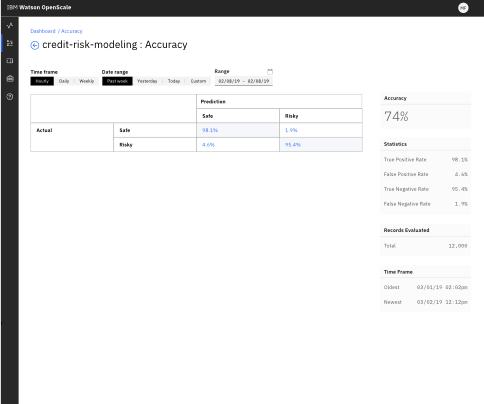
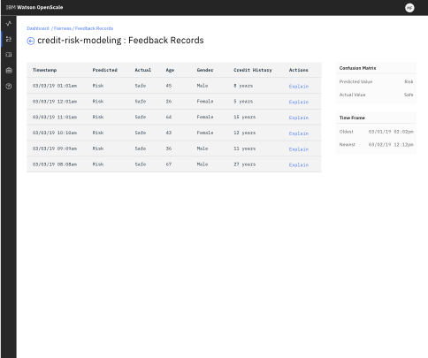

---

copyright:
  years: 2018, 2019
lastupdated: "2019-06-11"

keywords: metrics, monitoring, custom metrics, thresholds

subcollection: ai-openscale

---

{:shortdesc: .shortdesc}
{:external: target="_blank" .external}
{:tip: .tip}
{:important: .important}
{:note: .note}
{:pre: .pre}
{:codeblock: .codeblock}
{:download: .download}
{:screen: .screen}
{:javascript: .ph data-hd-programlang='javascript'}
{:java: .ph data-hd-programlang='java'}
{:python: .ph data-hd-programlang='python'}
{:swift: .ph data-hd-programlang='swift'}
{:faq: data-hd-content-type='faq'}

# 分析度量和事务 
{: #anlz_metrics}

可以使用 {{site.data.keyword.aios_full}} 通过各种方法来分析度量和交易。
{: shortdesc}

## 混淆矩阵 
{: #it-conf-mtx}

作为质量度量的详细信息，您可以查看模型未正确分析的记录。对于二元分类模型，此类异常可能表示误报或漏报，对于多类模型，则可能表示类赋值不正确。您还可以查看模型未正确分析的反馈记录的列表。
{: shortdesc}

1. 在任何**质量**图表中（如**公平性**），单击图表中的小时/日。
    
    

1. 混淆矩阵显示误报和漏报。 单击单元格可查看反馈记录的子集。

    

1. 查看反馈记录并请求对反馈记录的分析结果进行说明。

    

1. 事务以内联方式显示。

    

