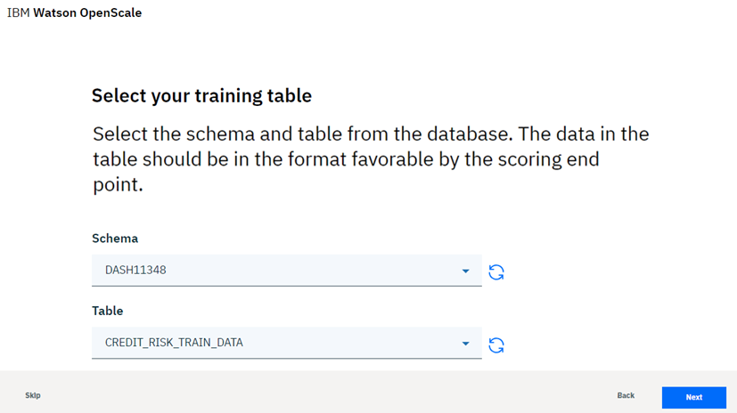
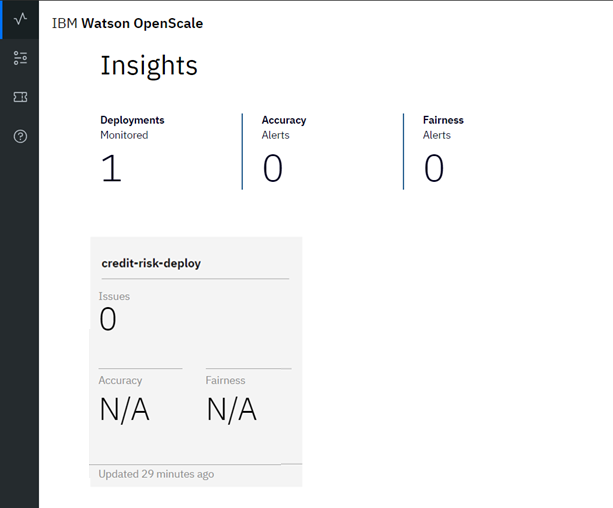

---

title: {{site.data.keyword.aios_short}} 的机器学习模型的信任和透明度
description: Monitor your machine learning deployments for bias, accuracy, and explainability
duration: 120
intro: In this tutorial, you will provision IBM Cloud machine learning and data services, create and deploy machine learning models in Watson studio, and configure the new IBM {{site.data.keyword.aios_full}} product to monitor your models for trust and transparency.
takeaways:
- See how {{site.data.keyword.aios_short}} provides trust and transparency for AI models
- Understand how IBM Cloud services and Watson Studio technologies can provide a seamless, AI-driven customer experience

copyright:
  years: 2018, 2019
lastupdated: "2019-04-11"

keywords: ai, getting started, tutorial, understanding, video

subcollection: ai-openscale

---

{:shortdesc: .shortdesc}
{:new_window: target="_blank"}
{:hide-dashboard: .hide-dashboard}
{:tip: .tip}
{:important: .important}
{:note: .note}
{:pre: .pre}
{:codeblock: .codeblock}
{:screen: .screen}
{:javascript: .ph data-hd-programlang='javascript'}
{:java: .ph data-hd-programlang='java'}
{:python: .ph data-hd-programlang='python'}
{:swift: .ph data-hd-programlang='swift'}

# 入门 - 教程（基础）
{: #gettingstarted}

{{site.data.keyword.aios_full}} 允许企业自动化和操作化业务应用程序中的 AI 生命周期，从而确保 AI 模型无偏差，可由业务用户轻松解释和理解，并在业务事务中可审计。{{site.data.keyword.aios_short}} 支持在所选工具和模型服务框架中构建并运行的 AI 模型。
{: shortdesc}

## 概述
{: #gs-view-demo}

通过观看此视频快速概览 {{site.data.keyword.aios_short}}。

  

    <iframe class="embed-responsive-item" id="youtubeplayer" title="Trust and Transparency in AI" type="text/html" width="640" height="390" src="https://www.youtube.com/embed/6Ei8rPVtCf8" frameborder="0" webkitallowfullscreen mozallowfullscreen allowfullscreen> </iframe>
  

## {{site.data.keyword.aios_short}} 的用例
{: #gs-use}

传统贷款人面临着将其金融服务的数字产品服务组合扩展到更大且更多样化的受众的压力，这需要采取新的方法进行信用风险建模。其数据科学团队目前依靠非常适合中等数据集的标准建模方法（例如决策树和逻辑回归），并且做出可以轻松解释的建议。这满足了信贷决策必须透明且可解释的法规需求。

为了向更广泛和风险更高的群体提供信贷，申请人的信用记录必须从传统信贷（例如抵押贷款和汽车贷款）扩展至替代信贷来源（例如公用事业和手机套餐付费记录，以及教育程度和职位）。这些新数据源带来了希望，但也通过增加意外关联的可能性产生风险，这些关联会基于申请人的年龄、性别或其他个人特质造成偏差。

最适合这些多样化数据集的数据科学方法（例如梯度提升树和神经网络）可以生成高度精确的风险模型，但是存在相应的代价。此类“黑匣”模型生成的是不透明的预测，这些预测必须以某种方式变为透明，以确保获得监管批准，例如通用数据保护条例 (GDPR) 第 22 条，或由消费者金融保护局管理的联邦公平信用报告法案 (FCRA)。

本教程中提供的信用风险模型使用训练数据集，其中包含有关每个贷款申请人的 20 个属性。其中两个属性（年龄和性别）可以测试有无偏差。对于本教程，重点将在于针对性别和年龄的偏差。

{{site.data.keyword.aios_short}} 将监视已部署模型中一个组（参考组）相对于另一个组（受监视组）获取有利结果（“无风险”）的倾向。在本教程中，性别的受监视组为 `female`，而年龄的受监视组为 `19 to 25`。

<!---
### How {{site.data.keyword.aios_short}} can help
{: #gs-how}

- *Identify run-time bias in the model*: The company has established evidence that shows the key factors that should influence which drug is predicted are BP, CHOLESTEROL, K and NA. AGE and SEX do play a role, but they're not as significant when compared to the other indicators. The company suspects that the data coming from patient trials might have suffered from biases of the practitioners for prescribing medications based on SEX and BP. The company wants to constantly monitor for such biases being learned from the data, and flag a suspected bias.

- *Constantly validate the accuracy of the model*: The company routinely evaluates the model prediction by having experts provide their own drug recommendations based on the patient data. The goal is to integrate these manual evaluations as feedback, to tell the model in real time where it might be wrong, and improve it over time.

- *Make the model more trustworthy*: To achieve a successful adoption of its AI assistant, the company received feedback from its customer base of medical practitioners and doctors who said they would not trust the AI model recommendations without understanding the logic behind them.

Each of these issues will be addressed in this tutorial, through the use of {{site.data.keyword.aios_short}}:

- The Fairness monitor will flag SEX and BP biases the model may have
- The Accuracy monitor uses feedback generated by your experts to test the performance of the deployed model, to detect model drift
--->

## Alternate setup option
{: #gs-module}

Instead of completing the following tutorial to explore {{site.data.keyword.aios_short}}, technical users can install a Python module that automates the provisioning and configuration of prerequisite services. This module requires that Python 3 is installed, which includes the pip package management system. For instructions, see, [Installing a Python module to set up {{site.data.keyword.aios_short}}](/docs/services/ai-openscale?topic=ai-openscale-as-module).

Additional tutorial links may be found in the [Additional resources](/docs/services/ai-openscale?topic=ai-openscale-arsc-ov) topic.

## Tutorial objectives
{: #gs-obj}

In this tutorial, you will:

- Provision {{site.data.keyword.Bluemix_notm}} machine learning and storage services
- Set up a Watson Studio project, and create, train and deploy a machine learning model
- Configure and explore trust, transparency and explainability for your model

## Provision prerequisite {{site.data.keyword.Bluemix_notm}} services
{: #gs-prps}

In addition to {{site.data.keyword.aios_short}}, to complete this tutorial, you need the following accounts and services.

<!---

对于 {{site.data.keyword.composeForPostgreSQL}} 服务，需要**付费**标准套餐。通过转换为使用信用卡的付费帐户，可以获取 200 美元 {{site.data.keyword.Bluemix_notm}} 信贷。如果您已具有付费帐户，那么将针对一个月的首个 1 GB 的存储成本收到一笔 16 美元的一次性退款。
{: tip}

--->

**要点**：为获取最佳性能，建议在与 {{site.data.keyword.aios_short}} 相同的区域中创建必备服务。要查看 {{site.data.keyword.aios_short}} 的可用位置，请参阅[服务可用性](/docs/resources?topic=resources-services_region)。

1.  使用您的 {{site.data.keyword.ibmid}} 登录到 [{{site.data.keyword.Bluemix_notm}} 帐户 ](https://{DomainName}){: new_window}。
1.  对于尚未与帐户关联的以下每个服务，创建实例，方法是单击链接，指定服务的名称，选择 **Lite**（免费）套餐，然后单击**创建**按钮：
    - [Watson Studio ](https://{DomainName}/catalog/services/watson-studio){: new_window}

      

    - [Watson Machine Learning ](https://{DomainName}/catalog/services/machine-learning){: new_window}

      

    - [Object Storage ](https://{DomainName}/catalog/services/cloud-object-storage){: new_window}

      

<!---

### 供应 Db2 Warehouse 服务
{: #gs-provdb2}

- 如果您尚未具有与帐户关联的 Db2 Warehouse 服务，请[供应 Db2 Warehouse 服务 ](https://{DomainName}/catalog/services/db2-warehouse){: new_window}：

  

- 指定服务的名称，选择 Entry 套餐，然后单击**创建**按钮。

### 将训练数据上载到 Db2 Warehouse
{: #gs-traindb2}

- 下载 [drug_train_data_updated.csv ](https://raw.githubusercontent.com/watson-developer-cloud/doc-tutorial-downloads/master/ai-openscale/drug_train_data_updated.csv) 文件。请确保将下载的文件另存为 .CSV 文件。

- 从 [IBM Cloud 控制台 ](https://{DomainName}){: new_window} 打开现有（或新创建的）Db2 Warehouse，单击左侧面板中的**管理**，然后单击**打开**按钮。

- 如有必要，请使用 Db2 凭证的“username”和“password”登录到 Db2 Warehouse。

- 一旦打开 Db2 Warehouse，请单击**菜单**按钮，然后从菜单中选择**装入**：

  

- 浏览至训练数据文件，或者将其拖放到表单上的相应区域中。单击**下一步**。从装入目标列表中选择模式；这通常采用 `DASH12345` 之类的格式。然后，单击右侧的**新建表**：

  

- 将表命名为 HEART\_DRUG\_TRAINING，然后单击**创建**按钮：

  

- 单击**下一步**以预览数据。在预览屏幕上，将**分隔符**字段设置为分号 (;)，并确保选中**第一行中的标题**选项：

  

- 现在，训练数据应在列中正确显示。单击**下一步**以继续，然后单击**开始装入**以装入数据。

--->

## 设置 Watson Studio 项目
{: #gs-setup}

1.  登录到 [Watson Studio 帐户 ](https://dataplatform.ibm.com/){: new_window} 并首先创建新项目。选择**创建项目**。

    

1.  选择**标准**磁贴。

    

1.  指定项目的名称和描述，确保在**存储**菜单中选择上一步中创建的 Object Storage 服务，然后单击**创建**。

### 将 {{site.data.keyword.Bluemix_notm}} 服务与 Watson 项目关联
{: #gs-assoc}

1.  打开 Watson Studio 项目并选择**设置**选项卡。向下滚动到**关联服务**部分，单击**添加服务**菜单，然后选择 **Watson**。

    

1.  单击 **Machine Learning** 磁贴上的**添加**链接，然后选择**现有**选项卡。从**现有服务实例**菜单中选择上一部分中创建的服务，然后单击**选择**。

<!---

- 从项目设置选项卡中，再次选择**添加服务**，然后从菜单中选择 **Spark**。从**现有**选项卡中，选择所创建的 Spark 服务，然后单击**选择**。

--->

### 添加 `Credit Risk` 模型
{: #gs-addmod}

1.  在 Watson Studio 中，选择项目的**资产**选项卡，向下滚动到 **Watson Machine Learning 模型**部分，然后单击**新建 Watson Machine Learning 模型**按钮。

1.  从**选择模型类型**部分中，选择**从样本**和 `Credit Risk` 模型，然后单击**创建**。

    

### 部署 `Credit Risk` 模型
{: #gs-depmod}

1.  在 Watson Studio 项目中，单击**资产**选项卡，滚动到 **Watson Machine Learning 模型**部分，然后单击刚创建的 credit-risk 模型。
2.  在**操作**列中，单击**操作**  菜单，然后单击**部署**。
3. 从 Watson Studio 项目中的**资产**选项卡滚动到 **Watson Machine Learning 模型**部分，然后单击刚创建的 `credit-risk` 模型。
1.  单击**部署**选项卡，然后单击**添加部署**。
1.  输入 `credit-risk-deploy` 作为部署的名称，然后选择 **Web Service** 部署类型。
1.  单击**保存**。

## 配置 {{site.data.keyword.aios_short}}
{: #gs-confaios}

### 供应 {{site.data.keyword.aios_short}}
{: hide-dashboard}
{: #gs-provaios}

1.  [供应新 {{site.data.keyword.aios_short}} 服务实例 ](https://{DomainName}/catalog/services/watson-openscale){: new_window}

<!---
    
--->

2.  指定服务的名称，选择 Lite 套餐，然后单击**创建**。

### 将 {{site.data.keyword.aios_short}} 连接到机器学习模型
{: #gs-ctmod}

现在已部署机器学习模型，您可以配置 {{site.data.keyword.aios_short}} 来确保模型的信任和透明度。

1.  选择 {{site.data.keyword.aios_short}} 实例的**管理**选项卡，然后单击**启动应用程序**按钮。此时会打开“{{site.data.keyword.aios_full}} 入门”页面。单击**开始**。
1.  单击 **Watson Machine Learning** 磁贴。

1.  对于本教程，请从菜单中选择 Watson Machine Learning 实例，然后单击**下一步**。

    您还可以选择其他 Machine Learning 位置。请参阅[指定 Watson Machine Learning 服务实例](/docs/services/ai-openscale?topic=ai-openscale-wml-connect)以获取其他信息。
    {: note}

    

1.  现在，您能够选择将由 {{site.data.keyword.aios_short}} 监视的已部署的模型。选择已创建并部署的模型，然后单击**下一步**。

    

1.  接下来，需要选择数据库。您有两个选项：免费 Lite 套餐数据库，或者现有数据库或新数据库。对于本教程，请选择**使用免费 Lite 套餐数据库**磁贴。

    请参阅[指定数据库](/docs/services/ai-openscale?topic=ai-openscale-connect-db)主题中有关其中每个选项的更多完整详细信息。现有数据库可以是 PostgreSQL 数据库或 Db2 数据库。
    {: tip}

    

1.  查看摘要数据，然后单击**保存**。确认，并在出现提示时单击**继续配置**按钮。

    此外，还会列出数据集市标识，它与 {{site.data.keyword.aios_short}} 实例标识是一回事。
    {: tip}

    

1.  您的屏幕可能类似于以下截屏。由于您将使用 GUI 方法对数据进行评分，因此只要选择**配置监视器**按钮即可完成此设置。

    

### 向模型提供样本数据集
{: #gs-samp}

您必须先针对模型至少生成一个评分请求，以便生成监视器可以使用的有效内容日志记录，然后才能配置监视器。在此部分中，将以 JSON 文件形式提供样本数据，从而生成评分请求。
1.  下载 [credit_payload_data.json ](https://raw.githubusercontent.com/watson-developer-cloud/doc-tutorial-downloads/master/ai-openscale/credit_payload_data.json) 文件。

1.  从 Watson Studio 项目的**部署**选项卡中，单击 **credit-risk-deploy** 链接，单击**测试**选项卡，然后选择 JSON 输入图标。

    

1.  现在，打开所下载的 `credit_payload_data.json` 文件，并将内容复制到**测试**选项卡中的 JSON 字段。单击**预测**按钮以向模型发送训练有效内容并对其进行评分。

    

### 准备监视
{: #gs-prepmon}

1.  现在，在 {{site.data.keyword.aios_short}} 实例中，选择部署并单击**开始**。

    

1.  选择**准备监视**磁贴，然后单击**开始**。

    

1.  接下来，您将提供有关模型和训练数据的信息。单击**下一步**。

    

1.  从**数据类型**菜单中，选择**数字/分类**作为部署分析的数据类型，然后单击**下一步**。

    

1.  对于数字或分类数据，需要提供有关模型的训练数据的信息，以便配置监视器。选择**手动配置监视器**以向训练数据提供连接信息。

    

1.  算法类型对于监视模型度量（例如“准确性”）非常重要。由于模型可以进行的预测是“风险”或“无风险”，请选择**二元分类**[算法类型](/docs/services/ai-openscale?topic=ai-openscale-acc-monitor#acc-understand)，然后单击**下一步**。

    

1.  样本数据的位置信息在以下屏幕上已预填充。选择**下一步**以继续。

    

1.  模式和表也已预填充。单击**下一步**以继续。

    

1.  现在，必须指定包含模型将预测的答案的特征（换句话说，在数据库中，即表中的哪列包含预测值（标签））。在此情况下，模型将预测信用风险，因此请选择**风险**列，然后单击**下一步**。

    训练数据库具有为训练模型而提供的值。
    {: note}

    

1.  选择用于训练模型的列。这是模型部署在请求中期望的数据。除 `_training` 以外的所有数据列都是模型的输入。选择所有其他输入，然后单击**下一步**。

    

1.  对于分类数据，必须标识现在包含整数但最初包含文本值的列。选择此处显示的值。

    

1.  查看您的选择摘要，单击**保存**，然后单击**确定**。

### 配置公平性监视
{: #gs-cfgfair}

1.  单击**公平性**。

1.  阅读有关公平性的信息，然后单击**下一步**。有关更多信息，请参阅[公平性](/docs/services/ai-openscale?topic=ai-openscale-mf-monitor)。

1.  现在，您可以选择要针对公平性监视哪些特征。对于选择的每个特征，{{site.data.keyword.aios_short}} 将监视已部署模型中一个组相对于另一个组获取有利结果的倾向。在此示例中，我们将监视**性别**和**年龄**特征。

    将单独监视功能部件，但任何去偏差操作都会一起更正所有功能部件的问题。单击**性别**和**年龄**磁贴，然后单击**下一步**。

1.  {{site.data.keyword.aios_short}} 旨在检测受监视组的偏差（与参考组相比）。对于 **Sex** 特征，请将值 `male` 添加到**参考组**，将值 `female` 添加到**受监视组**，然后单击**下一步**。

    如果受监视组的风险预测比率与参考组的比率不同，那么会将模型标记为 **Sex** 有偏差。因此，如果模型在 60% 的时间针对男性客户预测“风险”，在 20% 的时间针对女性客户预测“风险”，那么该模型有偏差。

    

1.  现在，您可以为 **Sex** 分配公平性阈值。如果公平性评级降至低于此阈值，那么您将在操作仪表板上看到警报。将阈值设置为 90%，然后单击**下一步**。

1.  对于 **Age** 特征，请将值 `26-74` 添加到**参考组**，将值 `19-25` 添加到**受监视组**，然后单击**下一步**。

    与 **Sex** 一样，如果受监视组的风险预测比率与参考组的比率不同，那么会将模型标记为 **Age** 有偏差。因此，如果年龄在 26 岁到 74 岁之间的客户的风险预测比率与年龄在 19 岁到 25 岁之间的客户的比率不同，那么模型有偏差。

    

1.  将**年龄**的阈值设置为 90%，然后单击**下一步**。

1.  将值从**来自训练数据的值**字段拖放到**有利值**和**不利值**字段。对于本教程，有利值为**无风险**，不利值为**风险**。单击**下一步**。

    {{site.data.keyword.aios_short}} 自动检测有效内容日志记录数据库中的哪列包含预测值，并在**来自训练数据的值**字段中提供这些预测值。请注意，虽然训练数据库具有所提供的用于训练模型的值，但是有效内容日志记录数据库包含在模型运行时收集的反馈数据，然后您可以选择性地使用该数据来重新训练和重新部署模型。
    {: note}

    

1.  使用滑块将最小样本大小调整为 100，然后单击**下一步**。

    

    对于本教程，最小样本大小设置为 100。通常，建议使用更大的样本大小来确保样本大小不会太小，否则会导致结果偏差。
    {: note}

1.  查看您的选择，单击**保存**，然后单击**确定**。

    

    系统将显示以下窗口，其中提供已除偏的评分端点。由于本教程使用 GUI 方法而不是 CLI 对数据进行评分，因此要继续，请单击**确定**。

    

### 配置准确性监视
{: #gs-cfgac}

1.  单击**准确性**。

1.  阅读有关准确性的信息，然后单击**下一步**。有关更多信息，请参阅[准确性](/docs/services/ai-openscale?topic=ai-openscale-acc-monitor)。

1.  将准确性警报阈值设置为 90%，然后单击**下一步**。

1.  在下一个屏幕上，使用滑块将最小样本大小调整为 10，然后单击**下一步**。

    对于本教程，最小样本大小已设置为 10。通常，建议使用更大的样本大小来确保样本大小不会太小，否则会导致结果偏差。
    {: note}

1.  对于最大样本大小，请使用 10000。单击**下一步**。

1.  查看您的选择，单击**保存**，然后单击**确定**。

1.  最后，系统会呈现一个用于添加反馈数据的选项，在下一节中将对其进行介绍。目前，请通过单击**确定**而不单击**添加反馈数据**按钮来关闭窗口。

    有关更多详细信息，请参阅[配置准确性监视器](/docs/services/ai-openscale?topic=ai-openscale-acc-monitor#acc-config)。

## 向模型提供样本反馈数据集
{: #gs-smpfeed}

要启用对准确性的监视，必须为模型提供反馈数据。在完成此操作之前，仪表板中将不会显示准确性数据。您可以通过将样本反馈数据添加到模型进行评分来一次性生成所有请求。对于此任务，您将下载包含样本反馈数据的 CSV 文件。

1.  下载 [credit_feedback_data.csv ](https://raw.githubusercontent.com/watson-developer-cloud/doc-tutorial-downloads/master/ai-openscale/credit_feedback_data.csv) 文件。

1.  在 {{site.data.keyword.aios_short}} 中，单击**洞察**选项卡。

    

1.  单击已部署的模型的磁贴。

    

1.  然后，单击“编辑”图标以编辑部署配置。

    

1.  在“摘要”侧面板中，单击**添加反馈数据**按钮，然后选择所下载的 `credit_feedback_data.csv` 文件。选择**逗号 (,)** 定界符，然后单击**确定**。

    文件大小当前限制为 8 MB。
    {: note}

    

    添加 CSV 文件会向模型提供反馈数据。

    

## 查看结果
{: #gs-viewres}

配置准确性监视后，将在一小时后运行准确性检查。在生产系统中，这有意义，以便仪表板可以累积反馈数据。出于本教程的目的，您可能希望在添加反馈数据后手动触发准确性检查，以便可以在**洞察**仪表板中查看结果。

要立即检查结果，请从**洞察**页面中选择部署，然后单击**立即检查公平性**或**立即检查准确性**按钮。

### 查看部署的洞察
{: #gs-viewin}

1. 从 [{{site.data.keyword.aios_short}} 仪表板 ](https://aiopenscale.cloud.ibm.com/aiopenscale/){: new_window} 中，单击**洞察**选项卡。

  

1. 查看“洞察”页面以查看已部署的模型的度量概述。针对已降至低于 90% 阈值的“公平性”或“准确性”度量，您可以轻松查看相应警报。

  显示“公平性”和“准确性”度量可能需要最多一个小时。
  {: tip}

  

### 查看部署的监视数据
{: #gs-viewmon}

1.  通过单击“洞察”页面上的磁贴来选择部署。此时将显示该部署的监视数据。注意：上载反馈 .csv 文件后，您可能会发现“公平性”或“准确性”数据未更新。要立即检查结果，请单击**立即检查公平性**或**立即检查准确性**按钮。
1.  在图表中滑动标记，以选择期间运行了样本数据和样本反馈数据的时间范围的数据。然后，单击**查看详细信息**。

    

1.  接下来，查看所监视的数据的图表。对于此示例，可以使用**特征**菜单选择 `Age` 或 `Sex`，以查看有关受监视数据的详细信息。

    请参阅[可视化特定小时的数据](/docs/services/ai-openscale?topic=ai-openscale-it-ov#it-vdet)以获取有关如何阅读这些图表的更多信息。
    {: tip}

    

### 查看模型事务的可解释性
{: #gs-viewextx}

1.  从所监视的数据的图表中单击**查看事务**按钮。

    

1.  系统显示过去一小时造成偏差的事务的列表。要查看特定事务的更详细解释，请从**操作**列中单击**解释**。

    

1.  系统显示有关模型如何达成其结论的解释。此解释包括模型的置信度、造成该置信度级别的因素，以及已馈送到模型的列。

    

## 后续步骤
{: #gs-next}

- 了解有关[查看和解释数据](/docs/services/ai-openscale?topic=ai-openscale-it-ov)以及[监视可解释性](/docs/services/ai-openscale?topic=ai-openscale-ie-ov)的更多信息。
