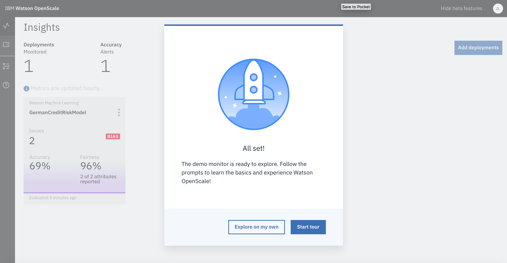

---

title: Trust and transparency for your machine learning models with {{site.data.keyword.aios_short}}
description: Monitor your machine learning deployments for bias, accuracy, and explainability
duration: 120
intro: In this tutorial, you will provision {{site.data.keyword.Bluemix}} machine learning and data services, create and deploy machine learning models in Watson studio, and configure the new IBM {{site.data.keyword.aios_full}} product to monitor your models for trust and transparency.
takeaways:
- See how {{site.data.keyword.aios_short}} provides trust and transparency for AI models
- Understand how {{site.data.keyword.Bluemix}} services and Watson Studio technologies can provide a seamless, AI-driven customer experience

copyright:
  years: 2018, 2019
lastupdated: "2019-06-28"

keywords: ai, getting started, tutorial, understanding, video

subcollection: ai-openscale

---

{:shortdesc: .shortdesc}
{:external: target="_blank" .external}
{:hide-dashboard: .hide-dashboard}
{:tip: .tip}
{:important: .important}
{:note: .note}
{:pre: .pre}
{:codeblock: .codeblock}
{:screen: .screen}
{:javascript: .ph data-hd-programlang='javascript'}
{:java: .ph data-hd-programlang='java'}
{:python: .ph data-hd-programlang='python'}
{:swift: .ph data-hd-programlang='swift'}

# 入门教程（自动设置）
{: #gettingstarted}

{{site.data.keyword.aios_full}} 允许企业自动化和操作化业务应用程序中的 AI 生命周期，从而确保 AI 模型无偏差，可由业务用户轻松解释和理解，并在业务事务中可审计。{{site.data.keyword.aios_short}} 支持在所选工具和模型服务框架中构建并运行的 AI 模型。
{: shortdesc}

## 概述
{: #gs-view-demo}

通过观看此视频快速概览 {{site.data.keyword.aios_short}}。

  

    <iframe class="embed-responsive-item" id="youtubeplayer" title="Trust and Transparency in AI" type="text/html" width="640" height="390" src="https://www.youtube.com/embed/6Ei8rPVtCf8" frameborder="0" webkitallowfullscreen mozallowfullscreen allowfullscreen> </iframe>
  

## {{site.data.keyword.aios_short}} 的用例
{: #gs-use}

传统贷款人面临着将其金融服务的数字产品服务组合扩展到更大且更多样化的受众的压力，这需要采取新的方法进行信用风险建模。其数据科学团队目前依靠非常适合中等数据集的标准建模方法（例如决策树和逻辑回归），并且做出可以轻松解释的建议。这满足了信贷决策必须透明且可解释的法规需求。

为了向更广泛和风险更高的群体提供信贷，申请人的信用记录必须从传统信贷（例如抵押贷款和汽车贷款）扩展至替代信贷来源（例如公用事业和手机套餐付费记录，以及教育程度和职位）。这些新数据源带来了希望，但也通过增加意外关联的可能性产生风险，这些关联会基于申请人的年龄、性别或其他个人特质造成偏差。

最适合这些多样化数据集的数据科学方法（例如梯度提升树和神经网络）可以生成高度精确的风险模型，但是存在相应的代价。此类“黑匣”模型生成的是不透明的预测，这些预测必须以某种方式变为透明，以确保获得监管批准，例如通用数据保护条例 (GDPR) 第 22 条，或由消费者金融保护局管理的联邦公平信用报告法案 (FCRA)。

本教程中提供的信用风险模型使用训练数据集，其中包含有关每个贷款申请人的 20 个属性。其中两个属性（年龄和性别）可以测试有无偏差。对于本教程，重点将在于针对性别和年龄的偏差。有关训练数据的更多信息，请参阅 [ 为什么 {{site.data.keyword.aios_short}} 需要访问我的培训数据？](/docs/services/ai-openscale?topic=ai-openscale-trainingdata#trainingdata)

{{site.data.keyword.aios_short}} 将监视已部署模型中一个组（参考组）相对于另一个组（受监视组）获取有利结果（“无风险”）的倾向。在本教程中，性别的受监视组为“`女性`”，而年龄的受监视组为“`19 至 25`”。

## 设置选项
{: #gs-module}

根据您的首选项和专业知识级别，有多个设置选项。

- [以下自动化设置](/docs/services/ai-openscale?topic=ai-openscale-wos-fast-start)通过在后台执行任务来指导您完成此过程。

   使用教程意味着您可以观看并单击浏览教程的下一部分。
   
- [交互式设置](/docs/services/ai-openscale?topic=ai-openscale-gs-obj#gs-obj)允许您使用易于理解的脚本进行控制。

   使用界面可通过样本模型和注入的数据执行常见任务。
   
- [高级教程](/docs/services/ai-openscale?topic=ai-openscale-crt-ov)让技术更高超的用户能够安装用于自动供应和配置必备服务的 Python 模块。此高级教程适用于数据研究员或者能够使用 Python 和笔记本熟练编写代码的用户。它举例说明如何可以使用 {{site.data.keyword.aios_short}} 客户机以编程方式执行功能。本教程中使用的笔记本导致[自动设置](/docs/services/ai-openscale?topic=ai-openscale-wos-fast-start)后位置相同。

   此模块要求安装 Python 3，其中包含 pip 软件包管理系统。有关指示信息，请参阅[安装 Python 模块以设置 {{site.data.keyword.aios_short}}](/docs/services/ai-openscale?topic=ai-openscale-as-module)。

有关其他教程链接，请参阅[其他资源](/docs/services/ai-openscale?topic=ai-openscale-arsc-ov)。

## 自动化设置
{: #wos-fast-start}

要快速了解 {{site.data.keyword.aios_short}} 如何监视模型，请运行首次登录到 {{site.data.keyword.aios_short}} UI 时提供的演示方案选项。请参阅[使用 UI 演示](#wos-work-demo)。
{: shortdesc}

## 开始之前
{: #wos-prereqs}

在开始教程之前，必须已设置下列资源：

- [{{site.data.keyword.ibmid}}](/docs/account?topic=account-signup)
- [{{site.data.keyword.aios_full}}](/docs/services/ai-openscale?topic=ai-openscale-gettingstarted#crt-wos-faststart)

自动化设置教程旨在运用尽可能最少的用户交互。它自动为您制定以下决策：

- 如果已设置多个 {{site.data.keyword.pm_full}} 实例，那么安装过程将运行用于列出实例的 API 调用，并选择最先显示在生成的列表中的任何 {{site.data.keyword.pm_short}} 实例。 
- 要创建新的 Lite 版本 {{site.data.keyword.pm_full}}，{{site.data.keyword.aios_short}} 安装程序将使用 {{site.data.keyword.Bluemix}} 帐户的缺省资源组。

### 供应 {{site.data.keyword.aios_full}} 服务
{: #crt-wos-faststart}

如果您尚未供应，请确保供应 {{site.data.keyword.aios_full}}。 

- [供应 {{site.data.keyword.aios_short}} 实例](https://{DomainName}/catalog/services/watson-openscale){: external}（如果您还没有与帐户关联的实例）：

  

1. 单击**目录** > **AI** > **{{site.data.keyword.aios_short}}**。
2. 指定服务的名称，选择套餐，然后单击**创建**按钮。
3. 要启动 {{site.data.keyword.aios_short}}，请单击**入门**按钮。

## 自动设置
{: #wos-work-demo}

1.  登录到 {{site.data.keyword.Bluemix}} 上的 {{site.data.keyword.aios_short}} 实例。
1.  要通过使用样本数据来自动设置 {{site.data.keyword.aios_short}} 实例，请单击**自动设置**。

   

   在供应 {{site.data.keyword.aios_short}} 服务时，您可以查看演示方案：

   

供应完成后，单击**执行**按钮以浏览 {{site.data.keyword.aios_short}} 仪表板，然后继续[在 {{site.data.keyword.aios_short}} 中查看结果](#wos-open)。

   

## 在 {{site.data.keyword.aios_short}} 中查看结果
{: #wos-open}

要查看对模型的公平性和准确性的洞察、受监视数据的详细信息以及个别事务的可解释性，请打开 {{site.data.keyword.aios_short}} 仪表板。每个部署显示为磁贴。教程配置了一个名为 `GermanCreditRiskModel` 的部署，如以下截屏中所示：

   

### 查看洞察
{: #wos-insights}

“洞察”页面概括显示根据所配置的阈值确定的任何公平性和准确性问题。

   

### 查看监视数据
{: #wos-monitoring}

1.  从“洞察”页面中，单击 `GermanCreditRiskModelICP` 磁贴以查看有关受监视数据的详细信息。
1.  单击标记并在图表中将其拖动，以查看显示数据的日期和时间段，然后单击**查看详细信息**链接。或者，可以单击图表中的不同时间段，以更改查看的数据。

     - 例如，以下屏幕显示特定日期和时间的数据。日期和时间根据您运行模块的时间而异。

     - 有关解释时间序列图表的信息，请参阅[监视公平性、每分钟的平均请求数以及准确性](/docs/services/ai-openscale-icp?topic=ai-openscale-icp-itc-timechart)。

   

1.  要查看有关 `SEX` 数据监视的详细信息，请确保从下拉菜单中选择 `SEX`。

    - 请注意，在以下截屏中，存在偏差。
    
   

    - 有关解释特定小时所对应数据点的图表的信息，请参阅[数据可视化](/docs/services/ai-openscale-icp?topic=ai-openscale-icp-itc-timechart#itc-data-visual)。

### 查看可解释性
{: #wos-explain}

要了解造成在给定时间段存在偏差的因素，请从先前部分中显示的可视化屏幕中单击**有偏差事务**按钮。

   

对于具有偏差的事务，将会列出过去一小时的事务标识。对于此模块中使用的模型，可用的请求存在偏差。

   

有关查找和解释事务的信息，请参阅[监视可解释性](/docs/services/ai-openscale-icp?topic=ai-openscale-icp-ie-ov)。

   

## 完成教程
{: #wos-done-demo}

1. 单击**完成**按钮。

   

2. 单击**执行**按钮以开始使用 {{site.data.keyword.aios_short}}。

   

## 后续步骤
{: #gs-next}

- 了解有关[查看和解释数据](/docs/services/ai-openscale?topic=ai-openscale-it-ov)以及[监视可解释性](/docs/services/ai-openscale?topic=ai-openscale-ie-ov)的更多信息。
