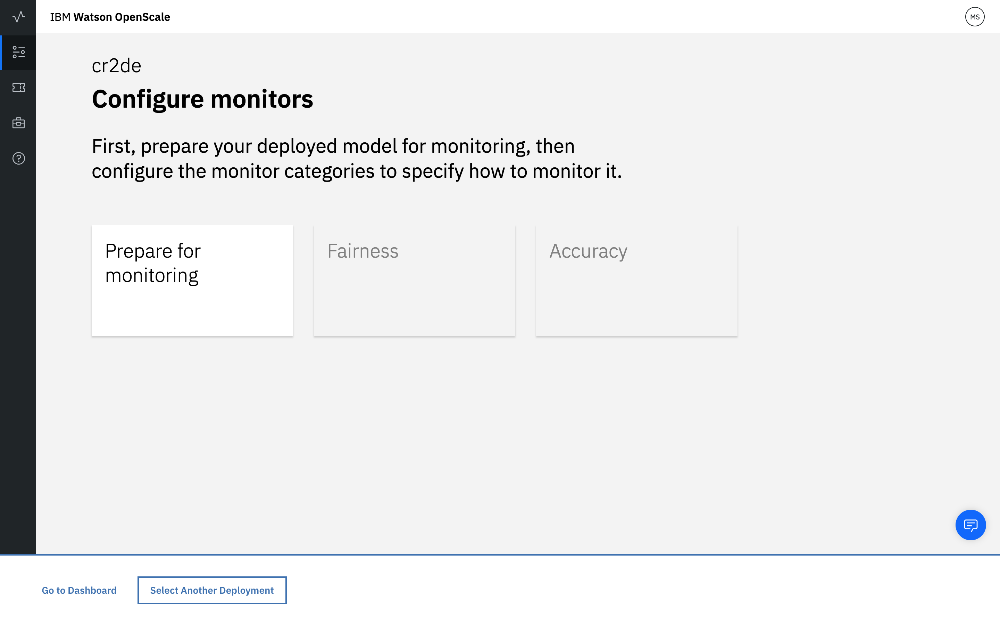

---

copyright:
  years: 2018, 2019
lastupdated: "2019-03-28"

keywords: deployment, monitors, data

subcollection: ai-openscale

---

{:shortdesc: .shortdesc}
{:new_window: target="_blank"}
{:tip: .tip}
{:important: .important}
{:note: .note}
{:pre: .pre}
{:codeblock: .codeblock}
{:screen: .screen}

# 为部署准备监视器
{: #mo-config}

为使用 {{site.data.keyword.aios_short}} 跟踪的每个部署设置和启用监视器。
{: shortdesc}

## 选择部署
{: #mo-select-deploy}

1.  首先，必须选择部署。

    如果给定模型有多个部署，那么在配置一个部署时，也会配置同一模型的所有其他部署。
    {: note}

    

1.  选择*准备监视*磁贴。

    

## 处理数据
{: #mo-work-data}

1.  现在，您将提供有关模型和训练数据的信息；单击**下一步**。

    

1.  从下拉菜单中，选择部署分析的数据类型，然后单击**下一步**。

    

### 数字/分类数据
{: #mo-nuca}

对于数字或分类数据，需要提供有关模型的训练数据的信息，以便配置监视器。

  

- **手动配置监视器** - 需要向训练数据提供连接信息。

    - 选择[算法类型](/docs/services/ai-openscale?topic=ai-openscale-acc-monitor#acc-understand)，然后单击**下一步**：

      

      请确保训练数据的格式与模型期望的格式完全相同。例如，如果模型期望特征 *Gender* 的值为 `M` 和 `F`，那么训练数据应具有 `M` 和 `F`，而不是 `Male` 和 `Female`。当前 {{site.data.keyword.aios_short}} 仅支持 Db2 数据库或 Cloud Object Storage 位置。
        {: important}

    - 指定位置（`Db2` 或 `Cloud Object Storage`），然后：

        - 对于 Db2 数据库，请完成以下操作：

            - 主机名或 IP 地址
            - 端口
            - 数据库（名称）
            - 用户名
            - 密码

            

        - 对于 Cloud Object Storage，请完成以下操作：

            - 登录 URL

              登录 URL 必须与训练数据所在的存储区的区域设置匹配。您将在下一步中指定训练数据存储区。
              {: important}

            - 资源实例（标识）
            - API 密钥

            

    - 通过单击**测试**按钮以连接到训练数据来确保有效的连接。单击**下一步**。

    - 在训练数据所在的 Db2 数据库或 Cloud Object Storage 中指定确切位置。

        - 对于 Db2 数据库，请同时选择包含模型期望的列的模式和训练表：

          

        - 对于 Cloud Object Storage，请选择存储区和数据集：

          

          单击**下一步**以继续执行下面的步骤 5。

- **上载配置文件** - 如果首选将训练数据保持专用，请选择此选项。可以使用定制 Python 笔记本为 {{site.data.keyword.aios_short}} 提供用于分析训练数据的信息而不提供对训练数据本身的访问权。

  通过运行 Python 笔记本，可以捕获模式列中的不同值以及列名。此外，还可以使用笔记本来预配置公平性监视器。

    - 下载[定制笔记本 ](https://github.com/IBM-Watson/aios-data-distribution/blob/master/training_statistics_notebook.ipynb){: new_window}，并将任何凭证替换为您自己的凭证。

    - 仔细查看笔记本，在适当情况下指定模型的数据。保存笔记本。

    - 运行笔记本以生成 JSON 格式的配置文件。

    - 上载 JSON 配置文件。

        

    - 单击**下一步**。

- {{site.data.keyword.aios_short}} 将在 WML 中从使用模型存储的元数据找到训练数据。选择训练数据中包含预测值的标签列，然后单击**下一步**。

  

- 选择用于训练模型的列 - 这些列是模型部署在请求中期望的特征。单击**下一步**。

    

- 最后，选择包含文本并已转换为整数的列。例如，如果原始训练数据针对 *Gender* 包含 `Male` 和 `Female`，并且它们现已分别映射到 `0` 和 `1`，那么训练数据现在针对 *Gender* 列包含值 `0` 和 `1`。标识此类现在包含整数但最初包含文本值的列。单击**下一步**。

    

### 图像和非结构化文本
{: #mo-imun}

- **图像**

  对于接受图像作为输入的模型，图像需要表示为 (高度) x (宽度) x (通道数) 格式，其中每个点表示每个像素的单色值或 RGB 值。

- **非结构化文本**

   对于接受文本作为输入的模型，预计模型会接受整个文本，而不是文本的向量化表示。

## 查看并保存配置
{: #mo-save}

查看您的选择的摘要，然后单击**保存**以继续。

  

### 后续步骤
{: #mo-next}

要开始配置监视器，请选择类别，然后单击**开始**。
