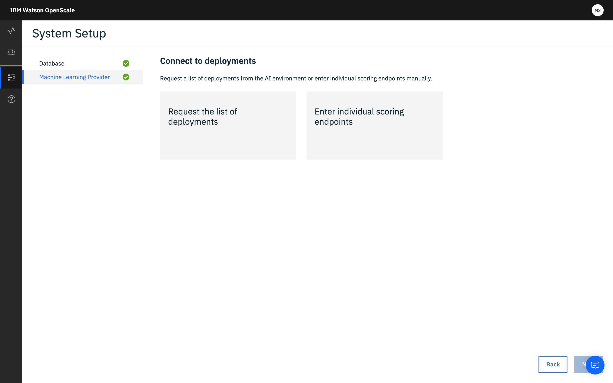

---

copyright:
  years: 2018, 2019
lastupdated: "2019-06-28"

keywords: machine learning, services, ml, custom 

subcollection: ai-openscale

---

{:shortdesc: .shortdesc}
{:external: target="_blank" .external}
{:tip: .tip}
{:important: .important}
{:note: .note}
{:pre: .pre}
{:codeblock: .codeblock}
{:download: .download}
{:screen: .screen}
{:javascript: .ph data-hd-programlang='javascript'}
{:java: .ph data-hd-programlang='java'}
{:python: .ph data-hd-programlang='python'}
{:swift: .ph data-hd-programlang='swift'}
{:faq: data-hd-content-type='faq'}

# 指定定制 ML 服务实例
{: #co-connect}

您在 {{site.data.keyword.aios_short}} 工具中的第一步是指定服务实例。服务实例是存储 AI 模型和部署的位置。
{: shortdesc}

## 连接定制服务实例
{: #co-config}

{{site.data.keyword.aios_short}} 连接到服务实例中的 AI 模型和部署。您可以连接定制服务

1. 从**配置**选项卡中，单击**机器学习提供程序**。

   

2. 选择**定制环境**磁贴。

   

3. 输入定制机器学习提供程序的名称和描述，然后单击**下一步**。 

4. 选择[通过请求列表](/docs/services/ai-openscale?topic=ai-openscale-co-connect#co-config-request-list)还是[通过输入个别评分端点](/docs/services/ai-openscale?topic=ai-openscale-co-connect#co-config-scoring-endpoints)来连接到部署。

   
    
5. 单击**下一步**。

### 请求部署列表
{: #co-config-request-list}

1. 如果选择了**请求部署列表**磁贴，请输入凭证和 API 端点，然后单击**保存**。

   

2. 保存机器学习设置后，返回到**仪表板**，单击**洞察**选项卡，然后单击**添加部署**按钮。

3. 从列表中选择部署，然后单击**配置**。

现在，您即可配置监视器。

### 提供个别评分端点
{: #co-config-scoring-endpoints}

1. 如果选择了**输入个别评分端点**磁贴，请输入 API 端点的凭证，然后单击**保存**。

2. 保存机器学习设置后，返回到**仪表板**，单击**洞察**选项卡，然后单击**添加部署**按钮。

3. 单击**添加端点**按钮。

4. 从下拉菜单中，选择定制环境，输入部署名称和 API 端点，然后单击**保存**。

现在，您即可配置监视器。

### 工作方式
{: #co-works}

以下图像显示定制环境支持：


您还可以参考以下链接：

[{{site.data.keyword.aios_short}} 有效内容日志记录 API](https://{DomainName}/apidocs/ai-openscale#publish-scoring-payload){: external}

[定制部署 API](https://aiopenscale-custom-deployement-spec.mybluemix.net/){: external}

[Python 客户机绑定 SDK](http://ai-openscale-python-client.mybluemix.net/#bindings){: external}

[使用定制机器学习引擎](https://github.com/pmservice/ai-openscale-tutorials/blob/master/notebooks/AI%20OpenScale%20and%20Custom%20ML%20Engine.ipynb){: external}

[Python SDK for IBM Watson OpenScale](https://pypi.org/project/ibm-ai-openscale/){: external}

- **模型的用于支持监视器的输入条件**

  模型应将特征向量作为输入，它本质上是命名字段及其值的集合（其中一个字段是针对偏差进行监视的字段）：

  ```bash
  {
    "fields": [
        "name",
        "age",
        "position"
    ],
    "values": [
        [
            "john",
            33,
            "engineer"
        ],
        [
            "mike",
            23,
            "student"
        ]
    ]
  }
  ```

  在此示例中，`“age”`可能是某人用于评估公平性的字段。

  如果输入是从输入特征空间变换而来的张量/矩阵（在文本或图像的深度学习中通常情况如此），那么该模型无法由当前发行版中的 {{site.data.keyword.aios_short}} 平台来处理。通过扩展，无法处理具有文本或图像输入的深度学习模型以进行偏差检测和缓解。

  此外，还应装入训练数据以支持可解释性。

  要获取文本的可解释性，其中一个特征应是全文。在当前发行版中不支持定制模型的图像的可解释性。
  {: note}

- **模型的用于支持监视器的输出条件**

  模型应将输入特征向量随该模型中各种类的预测概率一起输出。

  ```bash
  {
    "fields": [
        "name",
        "age",
        "position",
        "prediction",
        "probability"
    ],
    "labels": [
        "personal",
        "camping"
    ],
    "values": [
        [
            "john",
            33,
            "engineer",
            "personal",
            [
                0.6744664422398081,
                0.3255335577601919
            ]
        ],
        [
            "mike",
            23,
            "student"
            "camping",
            [
                0.2794765664946941,
                0.7205234335053059
            ]
        ]
    ]
  }
  ```

  在此示例中，`“personal”`和`“camping”`是可能的类，并且每个评分输出中的分数会分配给这两个类。如果缺少预测概率，那么偏差检测将起作用，但自动除偏不会起作用。

  以上评分输出应当可从 {{site.data.keyword.aios_short}} 能够通过 REST 调用的实时评分端点进行访问。对于 AzureML、SageMaker 和 {{site.data.keyword.pm_full}}，{{site.data.keyword.aios_short}} 直接连接到本机评分端点（因此您不必担心如何实施评分规范）。

### 后续步骤
{: #co-next}

{{site.data.keyword.aios_short}} 现在可供您用于[配置监视器](/docs/services/ai-openscale?topic=ai-openscale-mo-config)。
