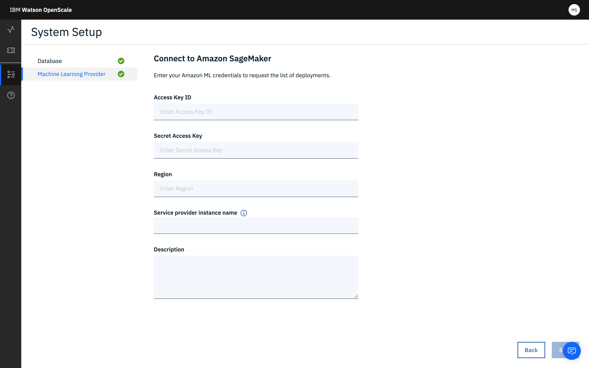

---

copyright:
  years: 2018, 2019
lastupdated: "2019-06-28"

keywords: Amazon SageMaker, machine learning, services, AWS

subcollection: ai-openscale

---

{:shortdesc: .shortdesc}
{:external: target="_blank" .external}
{:tip: .tip}
{:important: .important}
{:note: .note}
{:pre: .pre}
{:codeblock: .codeblock}
{:download: .download}
{:screen: .screen}
{:javascript: .ph data-hd-programlang='javascript'}
{:java: .ph data-hd-programlang='java'}
{:python: .ph data-hd-programlang='python'}
{:swift: .ph data-hd-programlang='swift'}
{:faq: data-hd-content-type='faq'}

# 指定 Amazon SageMaker ML 服务实例
{: #csm-connect}

您在 {{site.data.keyword.aios_short}} 工具中的第一步是指定 Amazon SageMaker 服务实例。Amazon SageMaker 服务实例是存储 AI 模型和部署的位置。
{: shortdesc}

您还可以使用 Python SDK 来添加机器学习提供程序。有关以编程方式执行此操作的更多信息，请参阅[绑定 Amazon SageMaker 机器学习引擎](/docs/services/ai-openscale?topic=ai-openscale-cml-connect#cml-smbind)。

## 连接 Amazon SageMaker 服务实例
{: #csm-config}

{{site.data.keyword.aios_short}} 连接到 Amazon SageMaker 服务实例中的 AI 模型和部署。

1. 从**配置**选项卡中，单击**机器学习提供程序**。根据您的环境，您可能看不到以下所有提供程序：

   

1.  单击 **Amazon SageMaker** 磁贴。

    

1.  输入并保存凭证：

    - 访问密钥标识：您的 AWS 访问密钥标识 `aws_access_key_id`，用于验证您的身份，并认证和授权您对 AWS 进行的呼叫。
    - 访问密钥：您的 AWS 访问密钥 `aws_secret_access_key`，需要此密钥才能验证您的身份，并认证和授权您对 AWS 进行的呼叫。
    - 区域：输入在其中创建了访问密钥标识的区域。密钥在其创建所在区域中进行存储和使用，并且不能转移到其他区域。
    - 服务提供程序实例名称：分配给此服务提供程序的特定名称。
    - 描述：（可选）此服务提供程序实例的简明语言描述。如果您具有生产和测试环境，那么这将是包含该信息的理想位置。

1.  {{site.data.keyword.aios_short}} 列出已部署模型；选择要监视的模型。

### 后续步骤
{: #csm-next}

{{site.data.keyword.aios_short}} 现在可供您用于[配置监视器](/docs/services/ai-openscale?topic=ai-openscale-mo-config)。
