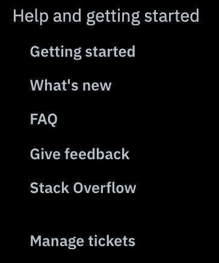

---

copyright:
  years: 2018, 2019
lastupdated: "2019-06-28"

keywords: getting help, help, release notes, what's new, developer resources 

subcollection: ai-openscale

---

{:shortdesc: .shortdesc}
{:external: target="_blank" .external}
{:tip: .tip}
{:important: .important}
{:note: .note}
{:pre: .pre}
{:codeblock: .codeblock}
{:download: .download}
{:screen: .screen}
{:javascript: .ph data-hd-programlang='javascript'}
{:java: .ph data-hd-programlang='java'}
{:python: .ph data-hd-programlang='python'}
{:swift: .ph data-hd-programlang='swift'}
{:faq: data-hd-content-type='faq'}

# 获取 {{site.data.keyword.aios_full_notm}} 的帮助和支持
{: #wos-get-help}

如果您在使用 {{site.data.keyword.aios_full}} 时有任何疑问或遇到任何问题，您可以在论坛中搜索相关信息或进行提问来获取帮助。您还可以开具支持凭单。
{: shortdesc}

## “帮助”选项卡
{: #io-help}

“帮助”选项卡 () 提供其他信息来帮助使用 {{site.data.keyword.aios_short}}。

## 提问
{: #wos-get-help-forums}

在使用论坛提问时，请给问题加上标记，以便 {{site.data.keyword.aios_short}} 开发团队能看到您的问题。

如果您有关于 {{site.data.keyword.aios_short}} 的技术问题，请在 [StackOverflow](https://stackoverflow.com/questions/tagged/watson-openscale) 上发布问题，并使用 `watson-openscale` 标记您的问题。

有关服务的问题和入门指示信息，请使用 [IBM developerWorks dW Answers](https://developer.ibm.com/?s=openscale) 论坛。包括 `openscale` 标记。 有关使用论坛的更多详细信息，请参阅[获取帮助](https://developer.ibm.com/answers/smartspace/dw-answers-help/index.html)。

有关开具 IBM 支持凭单或有关支持级别和凭单严重性的信息，请参阅[联系支持人员](https://cloud.ibm.com/unifiedsupport/supportcenter)，然后单击**创建案例**。

## 还在查找更多信息？
{: #looking}

查看[新增功能](/docs/services/ai-openscale?topic=ai-openscale-rn-relnotes)以查看按日期组织的新特征和新功能。

如果有问题，请参阅[常见问题解答](/docs/services/ai-openscale?topic=ai-openscale-wos-faqs)以获取答案。
