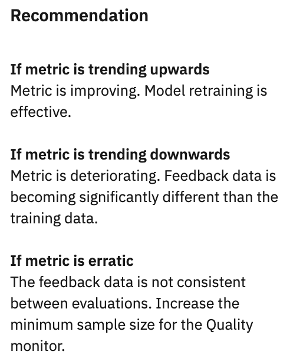

---

copyright:
  years: 2018, 2019
lastupdated: "2019-06-28"

keywords: metrics, monitoring, custom metrics, thresholds

subcollection: ai-openscale

---

{:shortdesc: .shortdesc}
{:external: target="_blank" .external}
{:tip: .tip}
{:important: .important}
{:note: .note}
{:pre: .pre}
{:codeblock: .codeblock}
{:download: .download}
{:screen: .screen}
{:javascript: .ph data-hd-programlang='javascript'}
{:java: .ph data-hd-programlang='java'}
{:python: .ph data-hd-programlang='python'}
{:swift: .ph data-hd-programlang='swift'}
{:faq: data-hd-content-type='faq'}

# 查全率
{: #quality_recall}

查全率给出正确预测在正类中的比例。
{: shortdesc}

## 查全率概览
{: #quality_recall-glance}

- **描述**：正类中正确预测的比例
- **缺省阈值**：下限 = 80%
- **缺省建议**：
   - **上升趋势**：上升趋势表明度量正在改善。这意味着，模型再训练是有效的。
   - **下降趋势**：下降趋势表明度量正在恶化。 反馈数据正在变得明显不同于训练数据。
   - **错误或不规则的变体**：错误或不规则的变体表明反馈数据在不同求值期间不一致。 此时请增大质量监视器的最小样本大小。
- **问题类型**：二元分类
- **图表值**：时间范围内的最后一个值
- **度量详细信息是否可用**：混淆矩阵

## 解释查全率度量显示
{: #quality_recall-display}


### 公平性分数
{: #quality_recall-display-fairness-score}

对于查全率度量，将显示以下公平性分数。 


### 调度
{: #quality_recall-display-schedule}

"**调度**窗格显示**上次评估**和**下次评估**时间。质量度量每小时进行评估。您可以通过单击**立即检查质量**来强制评估。您还可以通过单击**添加反馈数据**来添加反馈。


### 建议
{: #quality_recall-display-recommendations}

为帮助解释图表，**建议**窗格显示哪些趋势指示模型有效性的改善或恶化。




## 测算
{: #quality_recall-math}

查全率 (R) 定义为先计算真正 (Tp) 的数量加上假负 (Fn) 的数量之和，再用真正的数量除以和。

```
            number of true positives
Recall =   ______________________________________________________

           (number of true positives + number of false negatives)
```
