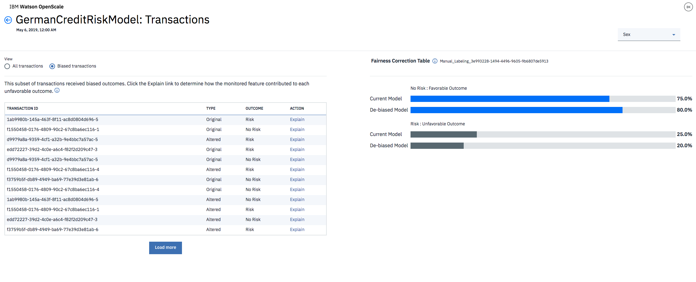
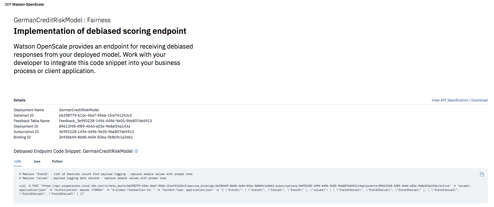

---

copyright:
  years: 2018, 2019
lastupdated: "2019-05-29"

keywords: metrics, monitoring, custom metrics, thresholds

subcollection: ai-openscale

---

{:shortdesc: .shortdesc}
{:new_window: target="_blank"}
{:tip: .tip}
{:important: .important}
{:note: .note}
{:pre: .pre}
{:codeblock: .codeblock}
{:screen: .screen}

# 分析度量及交易 
{: #anlz_metrics}

您可以使用 {{site.data.keyword.aios_full}}，透過各種方法來分析度量及交易。
{: shortdesc}

## 公平性度量
{: #anlz_metrics_fairness}

使用公平性監視來判斷您的模型所產生的輸出結果對於受監視群組是否公平。啟用公平性監視時，依預設，它會每小時產生一組度量。您可以藉由按一下**立即檢查品質**按鈕或利用 Python 用戶端，以隨需應變方式產生這些度量。

公平性度量是根據下列資訊來計算：

- 評比有效負載資料。

為了達到適當的監視目的，每個評分要求都應該記載在 {{site.data.keyword.aios_short}} 中。對於 {{site.data.keyword.pm_full}} 引擎，會自動進行有效負載資料記載。

對於其他機器學習引擎，可以使用 Python 用戶端或 REST API 來提供有效負載資料。

對於 {{site.data.keyword.pm_full}} 以外的機器學習引擎，公平性監視會在受監視部署上建立其他評分要求。
{: note}

您可以在 {{site.data.keyword.aios_short}} 儀表板上檢閱一段時間的所有度量值：

您可以檢閱相關詳細資料，例如我的最愛和不利的輸出結果：

您可以檢視詳細交易：

您可以檢視所建議之已除去偏誤的評分端點：

### 支援的公平性度量
{: #anlz_metrics_supfairmets}

{{site.data.keyword.aios_short}} 支援下列公平性度量：

#### 群組的公平性
{: #anlz_metrics_supfairmets_group}

- **說明**：模型傾向交付有利輸出結果給一個群組而高過另一個群組。
- **預設臨界值**：下限 = 80%
- **預設建議**：已除去偏誤的評分端點，可用於商業應用程式中，以便從所部署模型收到已除去偏誤的回應。
- **問題類型**：全部
- **資料類型**：結構化
- **圖表值**：時間範圍內的最後一個值
- **可用的度量詳細資料**：是

### 支援的公平性詳細資料
{: #anlz_metrics_supfairdets}

{{site.data.keyword.aios_short}} 支援公平性度量的下列詳細資料：

- 每一個群組的有利百分比
- 所有公平性群組的公平性平均值

  差異影響比例 =（受監視群組中有利輸出結果的 % ）/（參照群組中有利輸出結果的 % ）

- 每一個受監視群組的資料分佈
- 有效負載資料的分佈

<!---
BTW, I propose to use screenshots with data from FastPath.
Source monitored group or referenced group
Source of bias is also in fairness metrics
--->

## 品質度量
{: #anlz_metrics_quality}

使用品質監視來判斷模型預測輸出結果的準確程度。當啟用品質監視時，依預設，它會每小時產生一組度量。您可以藉由按一下**立即檢查品質**按鈕或利用 Python 用戶端，以隨需應變方式產生這些度量。

品質度量是根據下列資訊來計算：

- 手動標示的回饋資料
- 這些資料的受監視部署回應

為了進行適當的監視，回饋資料必須定期記載至 {{site.data.keyword.aios_short}}。您可以利用「新增回饋資料」選項或使用 Python 用戶端或 REST API 來提供回饋資料。

對於 {{site.data.keyword.aios_short}} 以外的機器學習引擎，例如 Microsoft Azure ML Studio 或 Amazon Sagemaker ML，品質監視會在受監視部署上建立其他評分要求。
{: note}

您可以在 {{site.data.keyword.aios_short}} 儀表板上檢閱一段時間的所有度量值：

如果要檢閱相關明細（例如，適用於某些度量的二進位和多類別分類混淆矩陣），請按一下圖表。

### 支援的品質度量
{: #anlz_metrics_supqualdets}

{{site.data.keyword.aios_short}} 支援下列品質度量：

#### ROC 下方的區域
{: #anlz_metrics_supqualdets_roc}

- **說明**：在查全率和誤判率曲線下方的區域
- **預設臨界值**：下限 = 80%
- **預設建議**：
   - **上升趨勢**：上升趨勢表示度量在改進中。這表示模型重新訓練有效。
   - **下跌趨勢**：下跌趨勢表示度量在惡化中。回饋資料變成與訓練資料大不相同。
   - **錯誤或不規則變異**：錯誤或不規則變異指出回饋資料的評估之間不一致。增加「品質」監視器的最小樣本大小。
- **問題類型**：二進位分類
- **圖表值**：時間範圍中的最後一個值
- **可用的度量詳細資料**：混淆矩陣

#### PR 下方的區域
{: #anlz_metrics_supqualdets_pr}

- **說明**：在查準率和查全率曲線下方的區域
- **預設臨界值**：下限 = 80%
- **預設建議**：
   - **上升趨勢**：上升趨勢表示度量在改進中。這表示模型重新訓練有效。
   - **下跌趨勢**：下跌趨勢表示度量在惡化中。回饋資料變成與訓練資料大不相同。
   - **錯誤或不規則變異**：錯誤或不規則變異指出回饋資料的評估之間不一致。增加「品質」監視器的最小樣本大小。
- **問題類型**：二進位分類
- **圖表值**：時間範圍中的最後一個值
- **可用的度量詳細資料**：混淆矩陣

#### 可解釋變異比例
{: #anlz_metrics_supqualdets_var}

- **說明**：可解釋變異比例是指可解釋變異與目標變異的比例。可解釋變異是指目標變異與預測錯誤變異之間的差異。
- **預設臨界值**：下限 = 80%
- **預設建議**：
   - **上升趨勢**：上升趨勢表示度量在改進中。這表示模型重新訓練有效。
   - **下跌趨勢**：下跌趨勢表示度量在惡化中。回饋資料變成與訓練資料大不相同。
   - **錯誤或不規則變異**：錯誤或不規則變異指出回饋資料的評估之間不一致。增加「品質」監視器的最小樣本大小。
- **問題類型**：迴歸
- **圖表值**：時間範圍中的最後一個值
- **可用的度量詳細資料**：無

#### 絕對平均值誤差
{: #anlz_metrics_supqualdets_abserror}

- **說明**：模型預測與目標值之間的絕對平均值差異
- **預設臨界值**：上限 = 80%
- **預設建議**：
   - **上升趨勢**：上升趨勢表示度量在惡化中。回饋資料變成與訓練資料大不相同。
   - **下跌趨勢**：下跌趨勢表示度量在改進中。這表示模型重新訓練有效。
   - **錯誤或不規則變異**：錯誤或不規則變異指出回饋資料的評估之間不一致。增加「品質」監視器的最小樣本大小。
- **問題類型**：迴歸
- **圖表值**：時間範圍中的最後一個值
- **可用的度量詳細資料**：無

#### 均方誤差
{: #anlz_metrics_supqualdets_squerror}

- **說明**：模型預測與目標值之間的均方差異
- **預設臨界值**：上限 = 80%
- **預設建議**：
   - **上升趨勢**：上升趨勢表示度量在惡化中。回饋資料變成與訓練資料大不相同。
   - **下跌趨勢**：下跌趨勢表示度量在改進中。這表示模型重新訓練有效。
   - **錯誤或不規則變異**：錯誤或不規則變異指出回饋資料的評估之間不一致。增加「品質」監視器的最小樣本大小。
- **問題類型**：迴歸
- **圖表值**：時間範圍中的最後一個值
- **可用的度量詳細資料**：無

#### R 平方
{: #anlz_metrics_supqualdets_r_squared}

- **說明**：目標變異與預測錯誤變異跟目標變異兩者之間的差異比例
- **預設臨界值**：下限 = 80%
- **預設建議**：
   - **上升趨勢**：上升趨勢表示度量在改進中。這表示模型重新訓練有效。
   - **下跌趨勢**：下跌趨勢表示度量在惡化中。回饋資料變成與訓練資料大不相同。
   - **錯誤或不規則變異**：錯誤或不規則變異指出回饋資料的評估之間不一致。增加「品質」監視器的最小樣本大小。
- **問題類型**：迴歸
- **圖表值**：時間範圍中的最後一個值
- **可用的度量詳細資料**：無

#### 均方誤差的根
{: #anlz_metrics_supqualdets_squ_errors_mean}

- **說明**：模型預測與目標值之間的均方差異的平方根
- **預設臨界值**：上限 = 80%
- **預設建議**：
   - **上升趨勢**：上升趨勢表示度量在惡化中。回饋資料變成與訓練資料大不相同。
   - **下跌趨勢**：下跌趨勢表示度量在改進中。這表示模型重新訓練有效。
   - **錯誤或不規則變異**：錯誤或不規則變異指出回饋資料的評估之間不一致。增加「品質」監視器的最小樣本大小。
- **問題類型**：迴歸
- **圖表值**：時間範圍中的最後一個值
- **可用的度量詳細資料**：無

#### 精確度
{: #anlz_metrics_supqualdets_acc}

- **說明**：正確預測的比例
- **預設臨界值**：下限 = 80%
- **預設建議**：
   - **上升趨勢**：上升趨勢表示度量在改進中。這表示模型重新訓練有效。
   - **下跌趨勢**：下跌趨勢表示度量在惡化中。回饋資料變成與訓練資料大不相同。
   - **錯誤或不規則變異**：錯誤或不規則變異指出回饋資料的評估之間不一致。增加「品質」監視器的最小樣本大小。
- **問題類型**：二進位分類及多類別分類
- **圖表值**：時間範圍中的最後一個值
- **可用的度量詳細資料**：混淆矩陣

#### 加權真肯定率 (wTPR)
{: #anlz_metrics_supqualdets_wtpr}

- **說明**：類別 TPR 的加權平均值，其加權等於類別機率
- **預設臨界值**：下限 = 80%
- **預設建議**：
   - **上升趨勢**：上升趨勢表示度量在改進中。這表示模型重新訓練有效。
   - **下跌趨勢**：下跌趨勢表示度量在惡化中。回饋資料變成與訓練資料大不相同。
   - **錯誤或不規則變異**：錯誤或不規則變異指出回饋資料的評估之間不一致。增加「品質」監視器的最小樣本大小。
- **問題類型**：多類別分類
- **圖表值**：時間範圍中的最後一個值
- **可用的度量詳細資料**：混淆矩陣

#### 真肯定率 (TPR)
{: #anlz_metrics_supqualdets_tpr}

- **說明**：在肯定類別預測中正確預測的比例
- **預設臨界值**：下限 = 80%
- **預設建議**：
   - **上升趨勢**：上升趨勢表示度量在改進中。這表示模型重新訓練有效。
   - **下跌趨勢**：下跌趨勢表示度量在惡化中。回饋資料變成與訓練資料大不相同。
   - **錯誤或不規則變異**：錯誤或不規則變異指出回饋資料的評估之間不一致。增加「品質」監視器的最小樣本大小。
- **問題類型**：二進位分類
- **圖表值**：時間範圍中的最後一個值
- **可用的度量詳細資料**：混淆矩陣

#### 加權誤判率 (wFPR)
{: #anlz_metrics_supqualdets_wfpr_weighted}

- **說明**：類別 FPR 的加權平均值，其加權等於類別機率
- **預設臨界值**：下限 = 80%
- **預設建議**：
   - **上升趨勢**：上升趨勢表示度量在改進中。這表示模型重新訓練有效。
   - **下跌趨勢**：下跌趨勢表示度量在惡化中。回饋資料變成與訓練資料大不相同。
   - **錯誤或不規則變異**：錯誤或不規則變異指出回饋資料的評估之間不一致。增加「品質」監視器的最小樣本大小。
- **問題類型**：多類別分類
- **圖表值**：時間範圍中的最後一個值
- **可用的度量詳細資料**：混淆矩陣

#### 誤判率 (FPR)
{: #anlz_metrics_supqualdets_fpr_false}

- **說明**：在肯定類別中不正確預測的比例
- **預設臨界值**：下限 = 80%
- **預設建議**：
   - **上升趨勢**：上升趨勢表示度量在改進中。這表示模型重新訓練有效。
   - **下跌趨勢**：下跌趨勢表示度量在惡化中。回饋資料變成與訓練資料大不相同。
   - **錯誤或不規則變異**：錯誤或不規則變異指出回饋資料的評估之間不一致。增加「品質」監視器的最小樣本大小。
- **問題類型**：二進位分類
- **圖表值**：時間範圍中的最後一個值
- **可用的度量詳細資料**：混淆矩陣

#### 加權查全率
{: #anlz_metrics_supqualdets_weighted_recall}

- **說明**：查全率的加權平均值，其加權等於類別機率
- **預設臨界值**：下限 = 80%
- **預設建議**：
   - **上升趨勢**：上升趨勢表示度量在改進中。這表示模型重新訓練有效。
   - **下跌趨勢**：下跌趨勢表示度量在惡化中。回饋資料變成與訓練資料大不相同。
   - **錯誤或不規則變異**：錯誤或不規則變異指出回饋資料的評估之間不一致。增加「品質」監視器的最小樣本大小。
- **問題類型**：多類別分類
- **圖表值**：時間範圍中的最後一個值
- **可用的度量詳細資料**：混淆矩陣

#### 查全率
{: #anlz_metrics_supqualdets_recall}

- **說明**：在肯定類別中正確預測的比例
- **預設臨界值**：下限 = 80%
- **預設建議**：
   - **上升趨勢**：上升趨勢表示度量在改進中。這表示模型重新訓練有效。
   - **下跌趨勢**：下跌趨勢表示度量在惡化中。回饋資料變成與訓練資料大不相同。
   - **錯誤或不規則變異**：錯誤或不規則變異指出回饋資料的評估之間不一致。增加「品質」監視器的最小樣本大小。
- **問題類型**：二進位分類
- **圖表值**：時間範圍中的最後一個值
- **可用的度量詳細資料**：混淆矩陣

#### 加權查準率
{: #anlz_metrics_supqualdets_wgth_prec}

- **說明**：查準率的加權平均值，其加權等於類別機率
- **預設臨界值**：下限 = 80%
- **預設建議**：
   - **上升趨勢**：上升趨勢表示度量在改進中。這表示模型重新訓練有效。
   - **下跌趨勢**：下跌趨勢表示度量在惡化中。回饋資料變成與訓練資料大不相同。
   - **錯誤或不規則變異**：錯誤或不規則變異指出回饋資料的評估之間不一致。增加「品質」監視器的最小樣本大小。
- **問題類型**：多類別分類
- **圖表值**：時間範圍中的最後一個值
- **可用的度量詳細資料**：混淆矩陣

#### 查準率
{: #anlz_metrics_supqualdets_precision}

- **說明**：在肯定類別預測中正確預測的比例
- **預設臨界值**：下限 = 80%
- **預設建議**：
   - **上升趨勢**：上升趨勢表示度量在改進中。這表示模型重新訓練有效。
   - **下跌趨勢**：下跌趨勢表示度量在惡化中。回饋資料變成與訓練資料大不相同。
   - **錯誤或不規則變異**：錯誤或不規則變異指出回饋資料的評估之間不一致。增加「品質」監視器的最小樣本大小。
- **問題類型**：二進位分類
- **圖表值**：時間範圍中的最後一個值
- **可用的度量詳細資料**：混淆矩陣

#### 加權 F1 測量
{: #anlz_metrics_supqualdets_wght_f1-measure}

- **說明**：F1 測量的加權平均值，其加權等於類別機率
- **預設臨界值**：下限 = 80%
- **預設建議**：
   - **上升趨勢**：上升趨勢表示度量在改進中。這表示模型重新訓練有效。
   - **下跌趨勢**：下跌趨勢表示度量在惡化中。回饋資料變成與訓練資料大不相同。
   - **錯誤或不規則變異**：錯誤或不規則變異指出回饋資料的評估之間不一致。增加「品質」監視器的最小樣本大小。
- **問題類型**：多類別分類
- **圖表值**：時間範圍中的最後一個值
- **可用的度量詳細資料**：混淆矩陣

#### F1-Measure
{: #anlz_metrics_supqualdets_f1-measr}

- **說明**：查準率及查全率的調和平均值
- **預設臨界值**：下限 = 80%
- **預設建議**：
   - **上升趨勢**：上升趨勢表示度量在改進中。這表示模型重新訓練有效。
   - **下跌趨勢**：下跌趨勢表示度量在惡化中。回饋資料變成與訓練資料大不相同。
   - **錯誤或不規則變異**：錯誤或不規則變異指出回饋資料的評估之間不一致。增加「品質」監視器的最小樣本大小。
- **問題類型**：二進位分類
- **圖表值**：時間範圍中的最後一個值
- **可用的度量詳細資料**：混淆矩陣

#### 對數損失
{: #anlz_metrics_supqualdets_log_loss}

- **說明**：對數目標類別機率（信賴性）的平均值。它也稱為 Expected log-likelihood（期望對數似然）。
- **預設臨界值**：下限 = 80%
- **預設建議**：
   - **上升趨勢**：上升趨勢表示度量在改進中。這表示模型重新訓練有效。
   - **下跌趨勢**：下跌趨勢表示度量在惡化中。回饋資料變成與訓練資料大不相同。
   - **錯誤或不規則變異**：錯誤或不規則變異指出回饋資料的評估之間不一致。增加「品質」監視器的最小樣本大小。
- **問題類型**：二進位分類及多類別分類
- **圖表值**：時間範圍中的最後一個值
- **可用的度量詳細資料**：無

### 支援的品質詳細資料
{: #anlz_metrics_supqualdets_suppr_dets}

{{site.data.keyword.aios_short}} 支援品質度量的下列詳細資料：

#### 混淆矩陣
{: #anlz_metrics_supqualdets_confusion}

混淆矩陣可協助您瞭解受監視的部署回應對於您的哪些回饋資料是正確的，哪些是不正確的。

## 效能度量
{: #anlz_metrics_performance}

使用效能監視來瞭解部署所處理的資料記錄的速度。當您選取要由 {{site.data.keyword.aios_short}} 追蹤及監視的部署時，即啟用效能監視。

效能度量是根據下列資訊來計算：

- 評比有效負載資料

為了達到適當的監視目的，每個評分要求都應該記載在 {{site.data.keyword.aios_short}} 中。對於 {{site.data.keyword.pm_full}} 引擎，會自動進行有效負載資料記載。對於其他機器學習引擎，可以使用 Python 用戶端或 REST API 來提供有效負載資料。效能監視不會在受監視部署上建立任何其他評分要求。

您可以在 {{site.data.keyword.aios_short}} 儀表板上檢閱一段時間的度量值：

### 支援的效能度量
{: #anlz_metrics_performance_supp_quality_mets}

{{site.data.keyword.aios_short}} 支援下列效能度量：

#### 傳輸量
{: #anlz_metrics_performance_supp_quality_mets_through}

- **說明**：特定時間範圍內每分鐘平均評分要求數
- **預設臨界值**：不適用
- **預設建議**：不適用
- **問題類型**：全部
- **圖表值**：時間範圍內的平均值
- **可用的度量詳細資料**：無

## 有效負載資料分析
{: #anlz_metrics_payload}

您可以利用下列一種方法來分析傳送至您的部署的所選資料範圍內的評分有效負載：

- 透過檢閱預測類別及每一個類別的信賴度分佈
   
   
   
- 透過自訂圖表（在特徵、預測類別及信賴度之間選取）
   
   

