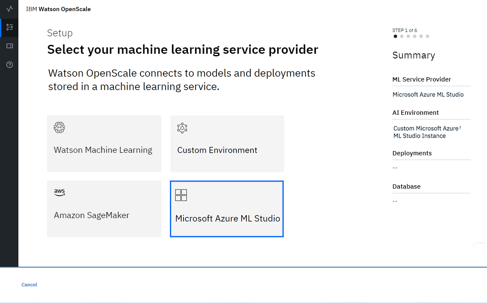

---

copyright:
  years: 2018, 2019
lastupdated: "2019-05-29"

keywords: Microsoft Azure, ml, machine learning, services

subcollection: ai-openscale

---

{:shortdesc: .shortdesc}
{:new_window: target="_blank"}
{:tip: .tip}
{:important: .important}
{:note: .note}
{:pre: .pre}
{:codeblock: .codeblock}
{:screen: .screen}

# 指定 Microsoft Azure ML Studio 實例
{: #connect-azure}

您在 {{site.data.keyword.aios_short}} 工具中的首要步驟是指定一個 Microsoft Azure ML Studio 實例。您的 Azure ML Studio 實例就是您儲存 AI 模型和部署的所在。
{: shortdesc}

## 連接 Azure ML Studio 實例
{: #ca-connect}

{{site.data.keyword.aios_short}} 會連接至 Azure ML Studio 實例中的 AI 模型和部署。

1.  從 {{site.data.keyword.aios_short}} 工具首頁，按一下**開始**。

    

1.  選取 **Microsoft Azure ML Studio** 圖磚，並按**下一步**。

    

1.  輸入您的認證：

    如需如何取得 Microsoft Azure 認證的指示，請參閱[作法：使用入口網站來建立可存取資源的 Azure AD 應用程式和服務主體 ](https://docs.microsoft.com/en-us/azure/active-directory/develop/howto-create-service-principal-portal){: new_window}。{: note}

    

1.  按**下一步**。

1.  {{site.data.keyword.aios_short}} 會列出您所部署的模型；請選取您想監視的模型

    

1.  按**下一步**。

### 後續步驟
{: #ca-next}

{{site.data.keyword.aios_short}} 現在已備妥可供您[指定資料庫](/docs/services/ai-openscale?topic=ai-openscale-connect-db#connect-db)。
