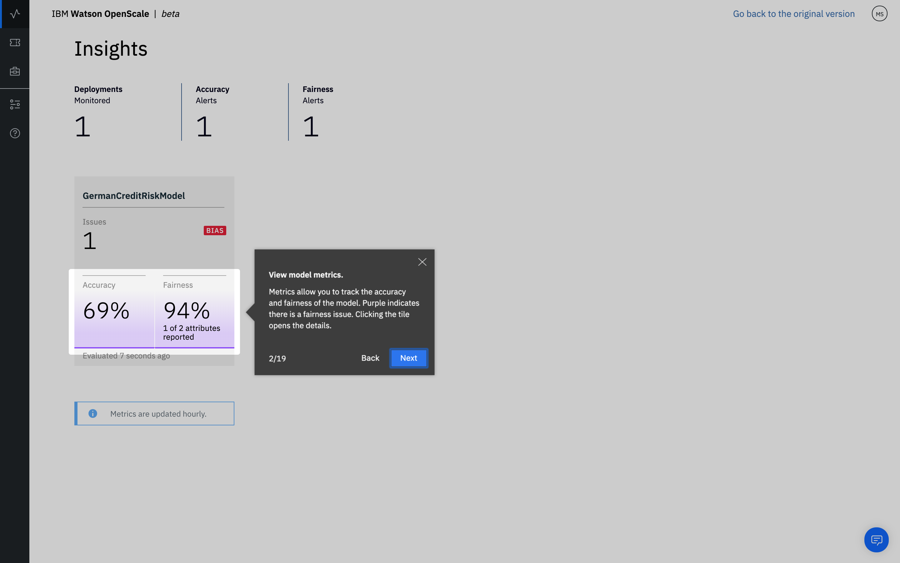

---

title: Trust and transparency for your machine learning models with {{site.data.keyword.aios_short}}
description: Monitor your machine learning deployments for bias, accuracy, and explainability
duration: 120
intro: In this tutorial, you will provision {{site.data.keyword.Bluemix}} machine learning and data services, create and deploy machine learning models in Watson studio, and configure the new IBM {{site.data.keyword.aios_full}} product to monitor your models for trust and transparency.
takeaways:
- See how {{site.data.keyword.aios_short}} provides trust and transparency for AI models
- Understand how {{site.data.keyword.Bluemix}} services and Watson Studio technologies can provide a seamless, AI-driven customer experience

copyright:
  years: 2018, 2019
lastupdated: "2019-06-11"

keywords: ai, getting started, tutorial, understanding, video

subcollection: ai-openscale

---

{:shortdesc: .shortdesc}
{:external: target="_blank" .external}
{:hide-dashboard: .hide-dashboard}
{:tip: .tip}
{:important: .important}
{:note: .note}
{:pre: .pre}
{:codeblock: .codeblock}
{:screen: .screen}
{:javascript: .ph data-hd-programlang='javascript'}
{:java: .ph data-hd-programlang='java'}
{:python: .ph data-hd-programlang='python'}
{:swift: .ph data-hd-programlang='swift'}

# 「入門」指導教學（自動設置）
{: #gettingstarted}

{{site.data.keyword.aios_full}} 可讓企業在商業應用程式中自動執行和操作 AI 生命週期，以確保 AI 模型不會偏誤、使商業使用者易於解釋及瞭解，以及可在商業交易中審核。{{site.data.keyword.aios_short}} 支援在您選擇的工具和模型處理架構中建置及執行的 AI 模型。
{: shortdesc}

## 概觀
{: #gs-view-demo}

觀看這部影片，以快速概覽 {{site.data.keyword.aios_short}}。

  

    <iframe class="embed-responsive-item" id="youtubeplayer" title="AI 具備可信任性與透明度" type="text/html" width="640" height="390" src="https://www.youtube.com/embed/6Ei8rPVtCf8" frameborder="0" webkitallowfullscreen mozallowfullscreen allowfullscreen> </iframe>
  

## {{site.data.keyword.aios_short}} 的使用案例
{: #gs-use}

傳統的貸方是在壓力之下，將其金融服務數位投資組合推廣給更大更多元的對象，這需採用新作法來為信用風險建模。他們的資料科學團隊目前仰賴標準建模技術，例如：決策樹狀結構和邏輯迴歸（這對中型資料集來說還能應付得宜），且能做出易於解釋的建議。這符合信用貸款決策必須透明且可解釋的法規需求。

為了能信用存取更廣且風險更高的族群，必須跳脫傳統信用（例如：抵押貸款和汽車貸款），來擴增申請者的信用歷程，以交替使用公用事業和行動電話方案付款歷程，外加教育和工作職稱。這些新的資料來源雖提供承諾，但也帶來風險，亦即，出現非預期相關性的可能性增加，會因為申請者的年齡、性別或其他個人特質而造成偏誤。

大多適用於這些多樣化資料集的資料科學技術（例如：梯度提升樹狀結構和神經網路）可以產生更加精確的風險模型，只是要付出代價。這類「黑盒」模型會產生不透明的預測，而必須設法變成透明，以確保能通過法規核准，例如：「一般資料保護規章 (GDPR)」第 22 條文，或「消費者金融保護局」所管理的聯邦「公平信用報告法案 (FCRA)」。

本指導教學提供的信用風險模型使用一個訓練資料集，其中含有每一個貸款申請者的 20 個相關屬性。其中兩個屬性（年齡和性別）可用來測試偏誤。在本指導教學中，焦點會放在對於性別與年齡的偏誤。如需訓練資料的相關資訊，請參閱[為何 {{site.data.keyword.aios_short}} 需要存取我的訓練資料？](/docs/services/ai-openscale?topic=ai-openscale-trainingdata#trainingdata)

{{site.data.keyword.aios_short}} 會監視所部署模型的有利輸出結果（「無風險」），是否較傾向於某一個群組（參照群組），且高過另一個群組（受監視群組）。在本指導教學中，性別的「受監視群組」是`女性`，而年齡的「受監視群組」是 `19 至 25`。

## 設置選項
{: #gs-module}

視您的喜好設定和專業程度，有幾個設置選項可選。

- [下列自動設置](/docs/services/ai-openscale?topic=ai-openscale-wos-fast-start)會引導您在背景中執行作業，以完成這項處理程序。

   使用導覽表示您可以觀看並透過點選，進入導覽的下一個部分。
   
- [互動式設置](/docs/services/ai-openscale?topic=ai-openscale-gs-obj#gs-obj)可讓您利用易於遵循的 Script 來控制。

   請使用介面，以使用範例模型和注入的資料，來執行一般作業。
   
- [進階指導教學](/docs/services/ai-openscale?topic=ai-openscale-crt-ov)可讓較為技術性的使用者安裝一個 Python 模組，以自動執行必備服務的佈建及配置。這項進階指導教學適用於熟悉編碼、Python 和「記事本」的資料科學家或使用者。這是一個範例，指出如何使用 {{site.data.keyword.aios_short}} 用戶端，以程式設計方式來執行功能。本指導教學中使用的記事本所產生的位置，與遵循[自動設置](/docs/services/ai-openscale?topic=ai-openscale-wos-fast-start)的結果是一樣的。

   這個模組需要安裝 Python 3，其中含有 PIP 套件管理系統。如需相關指示，請參閱[安裝 Python 模組以設置 {{site.data.keyword.aios_short}}](/docs/services/ai-openscale?topic=ai-openscale-as-module)。

如需其他的指導教學鏈結，請參閱[其他資源](/docs/services/ai-openscale?topic=ai-openscale-arsc-ov)。

## 自動設置
{: #wos-fast-start}

如果要快速查看 {{site.data.keyword.aios_short}} 如何監視模型，請執行您在第一次登入 {{site.data.keyword.aios_short}} 使用者介面時，所提供的示範實務選項。請參閱[「使用使用者介面」示範](#wos-work-demo)。
{: shortdesc}

## 開始之前
{: #wos-prereqs}

開始進行導覽之前，您必須已設置下列資源：

- [{{site.data.keyword.ibmid}}](/docs/account?topic=account-signup)
- [{{site.data.keyword.aios_full}}](/docs/services/ai-openscale?topic=ai-openscale-gettingstarted#crt-wos-faststart)

依照設計，自動設置導覽盡可能與使用者減少互動。它會為您自動做出下列的決策：

- 如果您設置了多個 {{site.data.keyword.pm_full}} 實例，安裝程序會執行並發出 API 呼叫，來列出實例，並在產生的清單中，選擇第一個出現的 {{site.data.keyword.pm_short}} 實例。 
- 如果要建立新的 {{site.data.keyword.pm_full}} 精簡版本，{{site.data.keyword.aios_short}} 安裝程式會使用您 {{site.data.keyword.Bluemix}} 帳戶的預設資源群組。

### 佈建 {{site.data.keyword.aios_full}} 服務
{: #crt-wos-faststart}

如果您尚未這樣做，請確定您已佈建 {{site.data.keyword.aios_full}}。 

- 如果您的帳戶尚無相關聯的實例，請[佈建一個 {{site.data.keyword.aios_short}} 實例](https://{DomainName}/catalog/services/watson-openscale){: external}：

  

1. 按一下**型錄** > **AI** > **{{site.data.keyword.aios_short}}**。
2. 為您的服務命名，選擇一種方案，並按一下**建立**按鈕。
3. 若要啟動 {{site.data.keyword.aios_short}}，請按一下**入門**按鈕。

## 「使用使用者介面」示範
{: #wos-work-demo}

1.  登入 {{site.data.keyword.Bluemix}} 上的 {{site.data.keyword.aios_short}} 實例。
1.  如果要使用示範實務，請按一下**執行示範**。

   

   在佈建 {{site.data.keyword.aios_short}} 服務時，您可以檢閱示範實務：

   

當佈建完成時，按一下**讓我們開始**按鈕，以導覽 {{site.data.keyword.aios_short}} 儀表板，然後繼續[在 {{site.data.keyword.aios_short}} 中檢視結果](#wos-open)。

   

## 在 {{site.data.keyword.aios_short}} 中檢視結果
{: #wos-open}

如果要檢視模型之公平性和精確度的相關洞察、受監視資料的明細，以及個別交易的可解釋性，請開啟 {{site.data.keyword.aios_short}} 儀表板。每一項部署各會顯示成一個磚。此導覽配置了一個稱為 `GermanCreditRiskModel` 的部署，如下列畫面擷取所示：

   

### 檢視洞察
{: #wos-insights}

「洞察」頁面會根據所配置的臨界值，顯示公平性和精確度的任何問題，並且一目瞭然。

   

### 檢視監視資料
{: #wos-monitoring}

1.  從「洞察」頁面，按一下 `GermanCreditRiskModelICP` 圖磚，以檢視受監視資料的相關明細。
1.  在圖表中按一下並拖曳標記，以檢視某一天和某個時段（這會顯示資料），然後按一下**檢視明細**鏈結。或者，您可以在圖表中按一下不同的時段，來變更您要查看的資料。

     - 例如，下列畫面顯示特定日期和時間的資料。日期和時間會因您執行模組的時間而異。

     - 如需解讀時間序列圖表的相關資訊，請參閱[監視「公平性」、「每分鐘的平均要求數」和「精確度」](/docs/services/ai-openscale-icp?topic=ai-openscale-icp-itc-timechart)。

   

1.  如果要查看 `SEX` 資料監視的相關詳細資料，請確定已從下拉功能表中選取 `SEX`。

    - 請注意，在下列畫面擷取中，有存在偏誤。
    
   

    - 如需如何解讀特定小時之資料點圖表的相關資訊，請參閱[資料視覺化](/docs/services/ai-openscale-icp?topic=ai-openscale-icp-itc-timechart#itc-data-visual)。

### 檢視可解釋性
{: #wos-explain}

如果要瞭解造成特定時段出現偏誤的因素，請從前一節所顯示的視覺化畫面中，按一下**偏誤交易**圓鈕。

   

會針對存在偏誤的那些交易，列出其過去一小時的交易 ID。對於此模組中使用的模型，可用的要求有存在偏誤。

   

如需尋找及解釋交易的相關資訊，請參閱[監視可解釋性](/docs/services/ai-openscale-icp?topic=ai-openscale-icp-ie-ov)。

   

## 完成導覽
{: #wos-done-demo}

1. 按一下**完成**按鈕。

   

2. 按一下**讓我們開始**按鈕，以開始使用 {{site.data.keyword.aios_short}}。

   

## 後續步驟
{: #gs-next}

- 進一步瞭解[檢視及解讀資料](/docs/services/ai-openscale?topic=ai-openscale-it-ov)和[監視可解釋性](/docs/services/ai-openscale?topic=ai-openscale-ie-ov)。
