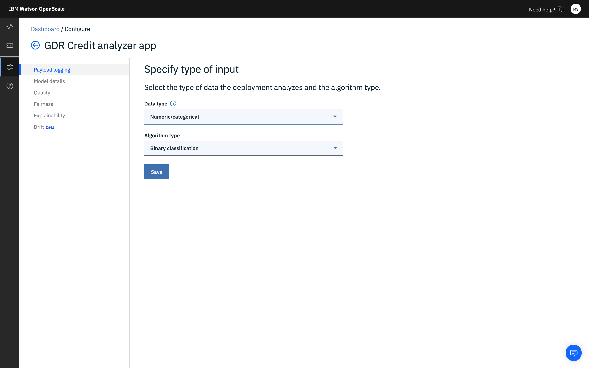
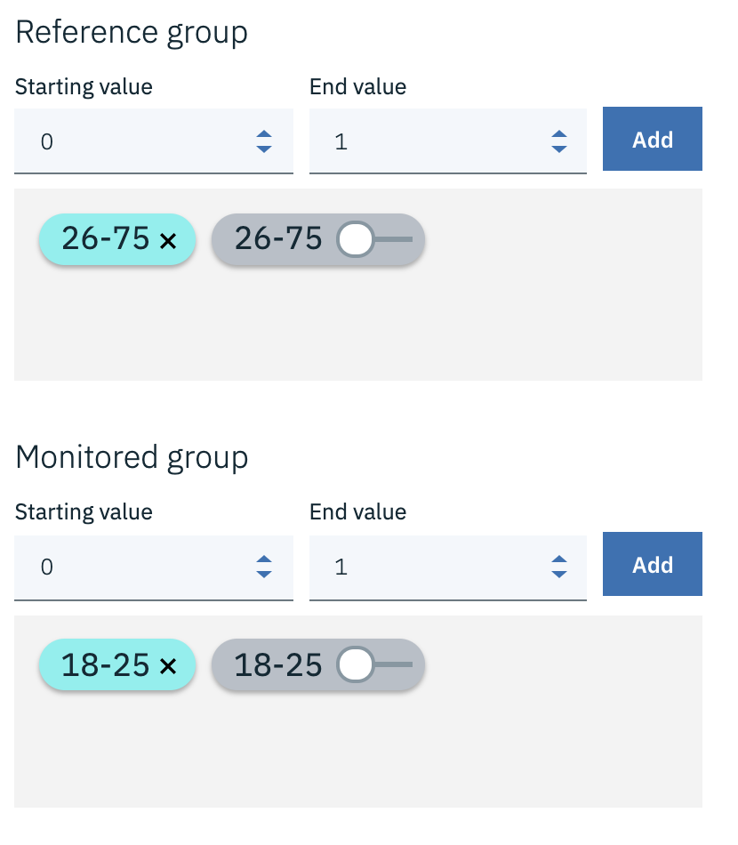

---

title: Trust and transparency for your machine learning models with {{site.data.keyword.aios_short}}
description: Monitor your machine learning deployments for bias, accuracy, and explainability
duration: 120
intro: In this tutorial, you will provision IBM Cloud machine learning and data services, create and deploy machine learning models in Watson studio, and configure the new IBM {{site.data.keyword.aios_full}} product to monitor your models for trust and transparency.
takeaways:
- See how {{site.data.keyword.aios_short}} provides trust and transparency for AI models
- Understand how IBM Cloud services and Watson Studio technologies can provide a seamless, AI-driven customer experience

copyright:
  years: 2018, 2019
lastupdated: "2019-05-06"

keywords: ai, getting started, tutorial, understanding, video

subcollection: ai-openscale

---

{:shortdesc: .shortdesc}
{:new_window: target="_blank"}
{:hide-dashboard: .hide-dashboard}
{:tip: .tip}
{:important: .important}
{:note: .note}
{:pre: .pre}
{:codeblock: .codeblock}
{:screen: .screen}
{:javascript: .ph data-hd-programlang='javascript'}
{:java: .ph data-hd-programlang='java'}
{:python: .ph data-hd-programlang='python'}
{:swift: .ph data-hd-programlang='swift'}

# 開始使用 - 指導教學（基本）
{: #gettingstarted}

{{site.data.keyword.aios_full}} 可讓企業在商業應用程式中自動執行和操作 AI 生命週期，以確保 AI 模型不會偏誤、使商業使用者易於解釋及瞭解，以及可在商業交易中審核。{{site.data.keyword.aios_short}} 支援在您選擇的工具和模型處理架構中建置及執行的 AI 模型。
{: shortdesc}

## 概觀
{: #gs-view-demo}

觀看這部影片，以快速概覽 {{site.data.keyword.aios_short}}。

  

    <iframe class="embed-responsive-item" id="youtubeplayer" title="AI 具備可信任性與透明度" type="text/html" width="640" height="390" src="https://www.youtube.com/embed/6Ei8rPVtCf8" frameborder="0" webkitallowfullscreen mozallowfullscreen allowfullscreen> </iframe>
  

## {{site.data.keyword.aios_short}} 的使用案例
{: #gs-use}

傳統的貸方是在壓力之下，將其金融服務數位投資組合推廣給更大更多元的對象，這需採用新作法來為貸方風險建模。他們的資料科學團隊目前仰賴標準建模技術，例如：決策樹狀結構和邏輯迴歸（這對中型資料集來說還能應付得宜），且能做出易於解釋的建議。這符合信用貸款決策必須透明且可解釋的法規需求。

為了能信用存取更廣且風險更高的族群，必須跳脫傳統信用（例如：抵押貸款和汽車貸款），來擴增申請者的信用歷程，以交替使用公用事業和行動電話方案付款歷程，外加教育和工作職稱。這些新的資料來源雖提供承諾，但也帶來風險，亦即，出現非預期相關性的可能性增加，會因為申請者的年齡、性別或其他個人特質而造成偏誤。

大多適用於這些多樣化資料集的資料科學技術（例如：梯度提升樹狀結構和神經網路）可以產生更加精確的風險模型，只是要付出代價。這類「黑盒」模型會產生不透明的預測，而必須設法變成透明，以確保能通過法規核准，例如：「一般資料保護規章 (GDPR)」第 22 條文，或「消費者金融保護局」所管理的聯邦「公平信用報告法案 (FCRA)」。

本指導教學提供的貸方風險模型使用一個訓練資料集，其中含有每一個貸款申請者的 20 個相關屬性。其中兩個屬性（年齡和性別）可用來測試偏誤。在本指導教學中，焦點會放在對於性別與年齡的偏誤。

{{site.data.keyword.aios_short}} 會監視所部署模型的有利輸出結果（「無風險」），是否較傾向於某一個群組（參照群組），且高過另一個群組（受監視群組）。在本指導教學中，性別的「受監視群組」是 `female`，而年齡的「受監視群組」是 `19 to 25`。

## Alternate setup option
{: #gs-module}

Instead of completing the following tutorial to explore {{site.data.keyword.aios_short}}, technical users can install a Python module that automates the provisioning and configuration of prerequisite services. This module requires that Python 3 is installed, which includes the pip package management system. For instructions, see, [Installing a Python module to set up {{site.data.keyword.aios_short}}](/docs/services/ai-openscale?topic=ai-openscale-as-module).

Additional tutorial links may be found in the [Additional resources](/docs/services/ai-openscale?topic=ai-openscale-arsc-ov) topic.

## Tutorial objectives
{: #gs-obj}

In this tutorial, you will:

- Provision {{site.data.keyword.Bluemix_notm}} machine learning and storage services
- Set up a Watson Studio project, and create, train and deploy a machine learning model
- Configure and explore trust, transparency and explainability for your model

## Provision prerequisite {{site.data.keyword.Bluemix_notm}} services
{: #gs-prps}

In addition to {{site.data.keyword.aios_short}}, to complete this tutorial, you need the following accounts and services.

**重要事項**：為取得最佳效能，建議在 {{site.data.keyword.aios_short}} 的相同地區建立必備服務。如果要檢視 {{site.data.keyword.aios_short}} 的可用位置，請參閱[服務可用性](/docs/resources?topic=resources-services_region)。
1.  使用您的 {{site.data.keyword.ibmid}} 來登入 [{{site.data.keyword.Bluemix_notm}} 帳戶 ](https://{DomainName}){: new_window}。
1.  請針對尚未與您帳戶產生關聯的下列每一項服務，各建立一個實例，作法是按一下鏈結，為您的服務命名，選取**精簡**（免費）方案，並按一下**建立**按鈕：
    - [Watson Studio ](https://{DomainName}/catalog/services/watson-studio){: new_window}

      

    - [Watson Machine Learning ](https://{DomainName}/catalog/services/machine-learning){: new_window}

      

    - [Object Storage ](https://{DomainName}/catalog/services/cloud-object-storage){: new_window}
      

## 設置 Watson Studio 專案
{: #gs-setup}

1.  登入您的 [Watson Studio 帳戶 ](https://dataplatform.ibm.com/){: new_window}，首先，請建立一個新專案。選取**建立專案**。

    

1.  選取**標準**圖磚。

    
1.  為專案提供名稱和說明，在**儲存空間**功能表中，確定已選取您在先前步驟中建立的 Object Storage 服務，並按一下**建立**。

### 使您的 {{site.data.keyword.Bluemix_notm}} 服務與 Watson 專案產生關聯
{: #gs-assoc}

1.  開啟 Watson Studio 專案，並選取**設定**標籤。向下捲動至**相關聯的服務**區段，按一下**新增服務**功能表，並選取 **Watson**。
1.  按一下**機器學習**圖磚上的**新增**鏈結，並選取**現有**標籤。從**現有服務實例**功能表中，選擇您在前一區段中建立的服務，然後按一下**選取**。<!---

- 從專案設定標籤中，再次選取「新增服務」，然後從功能表中選取 **Spark**。從「現有」標籤中，選擇您建立的 Spark 服務，然後按一下「選取」。--->

### 新增 `Credit Risk` 模型
{: #gs-addmod}

1.  在 Watson Studio 中，選取您專案的**資產**標籤，向下捲動至 **Watson Machine Learning 模型**區段，並按一下**新建 Watson Machine Learning 模型**按鈕。
1.  從**選取模型類型**區段中，選取**從樣本**和 `Credit Risk` 模型，然後按一下**建立**。

    

### 部署 `Credit Risk` 模型
{: #gs-depmod}

1.  在您的 Watson Studio 專案中，按一下**資產**標籤，捲動至 **Watson Machine Learning 模型**區段，並按一下您剛剛建立的 credit-risk 模型。
2.  在**動作**直欄中，按一下**動作**  功能表，然後按一下**部署**。
3. 從您 Watson Studio 專案的**資產**標籤，捲動至 **Watson Machine Learning 模型**區段，並按一下您剛剛建立的 `credit-risk` 模型。
1.  按一下**部署**標籤，然後按一下**新增部署**。
1.  輸入 `credit-risk-deploy` 作為部署名稱，並選取 **Web 服務**部署類型。
1.  按一下**儲存**。

## 配置 {{site.data.keyword.aios_short}}
{: #gs-confaios}

### 佈建 {{site.data.keyword.aios_short}}
{: hide-dashboard}
{: #gs-provaios}

1.  [佈建新的 {{site.data.keyword.aios_short}} 服務實例 ](https://{DomainName}/catalog/services/watson-openscale){: new_window}

2.  為您的服務命名，選取 Lite 方案，並按一下**建立**。

### 將 {{site.data.keyword.aios_short}} 連接至您的機器學習模型
{: #gs-ctmod}

到目前為止，機器學習模型已部署，您可以配置 {{site.data.keyword.aios_short}}，以確保您的模型具備信任和透明。
1.  選取您 {{site.data.keyword.aios_short}} 實例的**管理**標籤，並按一下**啟動應用程式**按鈕。會開啟「開始使用 {{site.data.keyword.aios_full}}」頁面。按一下**開始**。

1.  按一下 **Watson Machine Learning** 圖磚。

1.  對於本指導教學，請從功能表中選取 Watson Machine Learning 實例，並按**下一步**。

    也會提供選項讓您選擇不同的 Machine Learning 位置。如需相關資訊，請參閱[指定 Watson Machine Learning 服務實例](/docs/services/ai-openscale?topic=ai-openscale-wml-connect)。{: note}

    

1.  現在，您能夠選取所部署的模型，以交由 {{site.data.keyword.aios_short}} 監視。選取您所建立和部署的模型，並按**下一步**。

    

1.  接下來，您需要選擇資料庫。您有兩個選項：免費 Lite 方案資料庫，或是現有或新的資料庫。對於本指導教學，請選取**使用免費 Lite 方案資料庫**圖磚。
    請參閱[指定資料庫](/docs/services/ai-openscale?topic=ai-openscale-connect-db)主題中有關這每一個選項的完整詳細資料。現有的資料庫可以是 PostgreSQL 資料庫或 Db2 資料庫。{: tip}

    

1.  檢閱摘要資料，並按一下**儲存**。當確認並出現提示時，請按一下**繼續配置**按鈕。
    也會列出「資料集區 ID」，這等同於 {{site.data.keyword.aios_short}} 實例 ID。
    {: tip}

    

1.  您的畫面可能類似於下列畫面擷取。由於您將使用 GUI 方法來為資料評分，只需選取**配置監視器**按鈕，就能完成這項設置。
    

### 提供一組樣本資料給您的模型
{: #gs-samp}

您必須先至少針對模型產生一項評分要求，以產生可供監視器取用的有效負載記載，然後您才能配置監視器。在本節中，您將以 JSON 檔案形式提供樣本資料，來產生一項評分要求。

1.  下載 [credit_payload_data.json](https://raw.githubusercontent.com/watson-developer-cloud/doc-tutorial-downloads/master/ai-openscale/credit_payload_data.json) 檔。

1.  從 Watson Studio 專案的**部署**標籤中，按一下 **credit-risk-deploy** 鏈結，按一下**測試**標籤，並選取 JSON 輸入圖示。

    

1.  現在，開啟您所下載的 `credit_payload_data.json` 檔，將內容複製到**測試**標籤中的 JSON 欄位。按一下**預測**按鈕，為訓練有效負載評分並傳送給您的模型。

    

### 準備監視
{: #gs-prepmon}

1.  現在，在 {{site.data.keyword.aios_short}} 實例中，選取您的部署，並按一下**開始**。

    

1.  選取**準備監視**圖磚，然後按一下**開始**。

    

1.  接下來，您將提供模型及訓練資料的相關資訊。按**下一步**。

    

1.  從**資料類型**功能表中，選取**數值/種類**作為您部署分析的資料類型，然後按**下一步**。

    

1.  對於數值或種類資料，您需要提供模型訓練資料的相關資訊，才能配置監視器。請選取**手動配置監視器**，以提供您訓練資料的連線資訊。

    

1.  在監視模型度量時，演算法類型很重要，例如「精確度」。由於模型可以做出的預測是「風險」或「無風險」，請選取**二進位分類**[演算法類型](/docs/services/ai-openscale?topic=ai-openscale-acc-monitor#acc-understand)，並按**下一步**。

    

1.  在下列畫面中，會預先移入樣本資料的位置資訊。請選取**下一步**繼續。

    

1.  此外，也會預先移入綱目和表格。按**下一步**以繼續。

    

1.  現在，您必須指定含有模型所要預測之回答的特性（亦即，在您的資料庫中，表格中的哪一個直欄含有預測值（標籤））。在本例中，模型將預測貸方風險，因此請選取**風險**直欄，並按**下一步**。

    您的訓練資料庫具有一些您為了訓練模型而提供的值。{: note}

    

1.  選取用來訓練模型的直欄。這是您模型部署在要求中所預期的資料。`_training` 以外的所有資料直欄，都是模型的輸入。請選取其他所有輸入，並按**下一步**。

    

1.  對於種類資料，您必須識別現在雖含有整數但原本卻是含有文字值的那些直欄。請依這裡所示來選取值。

    

1.  檢閱您的選擇摘要，按一下**儲存**，然後按一下**確定**。

### 配置「公平性」監視
{: #gs-cfgfair}

1.  按一下**公平性**。

1.  閱讀有關公平性的說明，並按**下一步**。如需相關資訊，請參閱[公平性](/docs/services/ai-openscale?topic=ai-openscale-mf-monitor)。

1.  現在您可以針對公平性，選擇所要監視的特性。對於您選取的每一項特性，{{site.data.keyword.aios_short}} 會監視所部署模型的有利輸出結果，是否較傾向於某一個群組，而高過另一個群組。在本例中，我們將監視**性別**和**年齡**特性。

    這些特性採個別監視，但是任何的除去偏誤都會一併更正所有特性的問題。請按一下**性別**和**年齡**圖磚，並按**下一步**。

1.  {{site.data.keyword.aios_short}} 會運作，藉由比較參照群組，來偵測對於受監視群組的偏誤。對於**性別**特性，請將值 `male` 新增至**參照群組**，將值 `female` 新增至**受監視群組**，並按**下一步**。

    對於**性別**，如果受監視群組的「風險」預測比例，不同於參照群組的比例，則會將模型標示為「有偏誤」。因此，如果模型預測男性客戶當時的「風險」是 60%，女性客戶當時的「風險」是 20%，表示有偏誤。

    

1.  現在您可以指派公平性臨界值給**性別**。如果「公平性」評比低於此臨界值，您會在作業儀表板上看到警示。請將臨界值設為 90%，並按**下一步**。

1.  對於**年齡**特性，請將值 `26-74` 新增至**參照群組**，將值 `19-25` 新增至**受監視群組**，並按**下一步**。

    如同**性別**，在**年齡**方面，如果受監視群組的「風險」預測比例，不同於參照群組的比例，則會將模型標示為「有偏誤」。因此，如果 26 歲到 74 歲客戶所收到的「風險」預測比例，不同於 19 歲到 25 歲客戶的比例，表示模型有偏誤。

    

1.  請針對**年齡**，將臨界值設為 90%，並按**下一步**。

1.  將**來自訓練資料的值**欄位中的值，拖放至**有利值**和**不利值**欄位。對於本指導教學，有利值是**無風險**，不利值是**風險**。按**下一步**。

    {{site.data.keyword.aios_short}} 會自動偵測有效負載記載中哪些直欄含有預測值，並將它們呈現在**來自訓練資料的值**欄位中。請注意，儘管您的訓練資料庫具有您提供用來訓練模型的值，有效負載記載資料庫會包含在模型執行時期所收集的回饋資料，可讓您之後選擇性地用來重新訓練和重新部署您的模型。{: note}

    

1.  請使用調節器將樣本大小下限調整為 100，然後按**下一步**。

    

    對於本指導教學，樣本大小下限設為 100。一般而言，建議使用較大樣本，以確保樣本不會太小，如果太小會扭曲結果。{: note}

1.  檢閱您的選擇，按一下**儲存**，然後按一下**確定**。

    

    會出現下列視窗，其中提供一個已除去偏誤的評分端點。由於本指導教學使用 GUI 方法（而非 CLI）來對資料評分，如果要繼續，請按一下**確定**。

    

### 配置精確度監視
{: #gs-cfgac}

1.  按一下**精確度**。

1.  閱讀有關精確度的說明，並按**下一步**。如需相關資訊，請參閱[精確度](/docs/services/ai-openscale?topic=ai-openscale-acc-monitor)。

1.  將精確度警示臨界值設為 90%，並按**下一步**。

1.  請在下個畫面上，使用調節器將樣本大小下限調整為 10，然後按**下一步**。

    對於本指導教學，樣本大小下限已設為 10。一般而言，建議使用較大樣本，以確保樣本不會太小，如果太小會扭曲結果。{: note}

1.  在樣本大小上限方面，請使用 10000。按**下一步**。

1.  檢閱您的選擇，按一下**儲存**，然後按一下**確定**。

1.  最後，會呈現一個選項，讓您新增回饋資料，相關說明請見下一節。現在，請按一下**確定**來關閉視窗，而不要按一下**新增回饋資料**按鈕。

    如需詳細資料，請參閱[配置「精確度」監視器](/docs/services/ai-openscale?topic=ai-openscale-acc-monitor#acc-config)。

## 提供一組樣本回饋資料給您的模型
{: #gs-smpfeed}

為了能夠監視精確度，必須提供回饋資料給您的模型。必須完成此動作，精確度資料才會出現在儀表板中。您可以一併產生要求，作法是將樣本回饋資料新增至模型來進行評分。對於此作業，您將下載含有樣本回饋資料的 CSV 檔案。

1.  下載 [credit_feedback_data.csv](https://raw.githubusercontent.com/watson-developer-cloud/doc-tutorial-downloads/master/ai-openscale/credit_feedback_data.csv) 檔。

1.  在 {{site.data.keyword.aios_short}} 中，按一下**洞察**標籤。

    

1.  按一下所部署模型的圖磚。

    

1.  然後按一下「編輯」圖示，以編輯部署配置。

    

1.  在「摘要」側邊畫面中，按一下**新增回饋資料**按鈕，並選取 `credit_feedback_data.csv` 檔。選取**逗點 (,)** 定界字元，然後按一下**確定**。

    檔案大小目前限制為 8 MB。
    {: note}

    

    新增 CSV 檔案時，會提供回饋資料給您的模型。

    

## 檢視結果
{: #gs-viewres}

在您配置精確度監視之後，會在一個小時之後執行精確度檢查。在正式作業系統中，這樣做是合理的，如此您的儀表板就能累積回饋資料。基於本指導教學的目的，您可能希望在新增回饋資料之後手動執行精確度檢查，以便可在**洞察**儀表板中看到結果。

如果要立即檢查結果，請從**洞察**頁面中，選取一項部署，然後按一下**立即檢查公平性**或**立即檢查精確度**按鈕。

### 檢視您部署的相關洞察
{: #gs-viewin}

1. 從 [{{site.data.keyword.aios_short}} 儀表板 ](https://aiopenscale.cloud.ibm.com/aiopenscale/){: new_window}，按一下**洞察**標籤。

  

1. 檢視「洞察」頁面，以查看已部署模型的度量概觀。您很容易就可看到「公平性」或「精確度」度量的相關警示，這些度量都已低於 90% 臨界值。

  「公平性」和「精確度」度量可能需要耗費一個小時才會顯示。{: tip}

  

### 檢視您部署的監視資料
{: #gs-viewmon}

1.  按一下「洞察」頁面上的圖磚，以選取部署。會顯示該項部署的監視資料。附註：在您上傳回饋 .csv 檔之後，您可能發現「公平性」或「精確度」資料未更新。如果要立即檢查結果，請按一下**立即檢查公平性**或**立即檢查精確度**按鈕。
1.  在圖表中滑動標記，以選取您執行樣本資料和樣本回饋資料那段時間範圍的資料。然後按一下**檢視明細**。

    

1.  接下來，請檢閱您所監視之資料的圖表。就本例而言，請使用**特性**功能表來選取 `Age` 或 `Sex`，以查看受監視資料的相關明細。

    如需如何閱讀這些圖表的相關資訊，請參閱[將特定小時的資料視覺化](/docs/services/ai-openscale?topic=ai-openscale-it-ov#it-vdet)。{: tip}

    

### 檢視模型交易的可解釋性
{: #gs-viewextx}

1.  針對您所監視的資料，從圖表中按一下**檢視交易**按鈕。

    

1.  會顯示過去一小時造成偏誤的交易清單。如果要針對特定交易，檢視更詳細的解釋，請從**動作**直欄中，按一下**解釋**。

    

1.  會顯示解釋，指出模型是如何得出其結論。這項解釋包括：模型的信賴度、確信層次的造成因素，以及輸送給模型的直欄。

    

## 後續步驟
{: #gs-next}

- 進一步瞭解[檢視及解讀資料](/docs/services/ai-openscale?topic=ai-openscale-it-ov)和[監視可解釋性](/docs/services/ai-openscale?topic=ai-openscale-ie-ov)。
