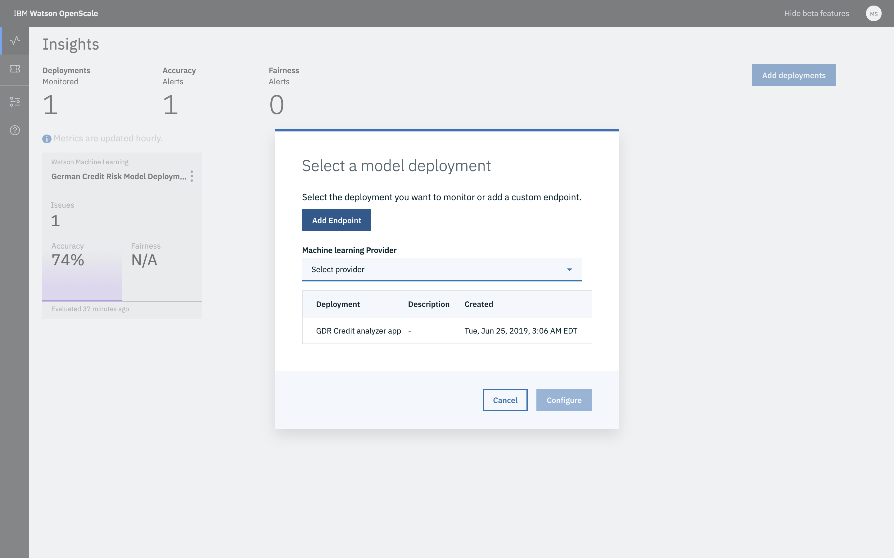

---

copyright:
  years: 2018, 2019
lastupdated: "2019-06-28"

keywords: deployment, monitoring 

subcollection: ai-openscale

---

{:shortdesc: .shortdesc}
{:external: target="_blank" .external}
{:tip: .tip}
{:important: .important}
{:note: .note}
{:pre: .pre}
{:codeblock: .codeblock}
{:download: .download}
{:screen: .screen}
{:javascript: .ph data-hd-programlang='javascript'}
{:java: .ph data-hd-programlang='java'}
{:python: .ph data-hd-programlang='python'}
{:swift: .ph data-hd-programlang='swift'}
{:faq: data-hd-content-type='faq'}

# 選取要監視的部署
{: #dpl-select}

從部署清單中選取以便監視。
{: shortdesc}

## 選擇部署
{: #dpl-config}

1.  {{site.data.keyword.aios_short}} 會檢查您的機器學習提供者，以編譯所部署的模型清單。從部署清單中，您可以選取您想監視的部署。

    

1.  按一下**配置**。

您已順利選取部署。 

## 後續步驟
{: #dpl-next}

{{site.data.keyword.aios_short}} 現在已備妥，可供您[配置監視器](/docs/services/ai-openscale?topic=ai-openscale-mo-config)。
