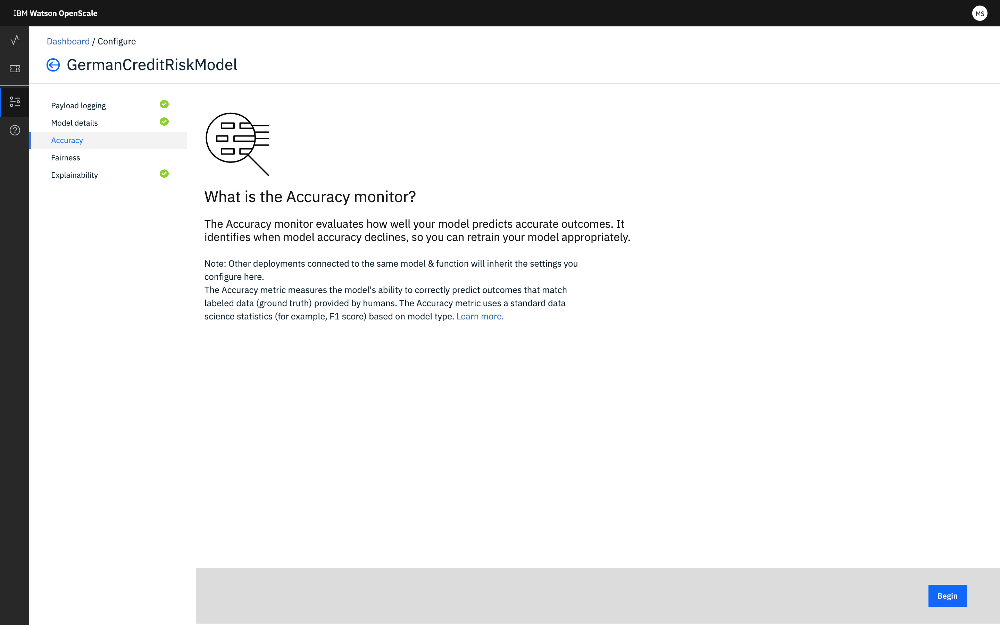

---

copyright:
  years: 2018, 2019
lastupdated: "2019-06-28"

keywords: accuracy, 

subcollection: ai-openscale

---

{:shortdesc: .shortdesc}
{:external: target="_blank" .external}
{:tip: .tip}
{:important: .important}
{:note: .note}
{:pre: .pre}
{:codeblock: .codeblock}
{:download: .download}
{:screen: .screen}
{:javascript: .ph data-hd-programlang='javascript'}
{:java: .ph data-hd-programlang='java'}
{:python: .ph data-hd-programlang='python'}
{:swift: .ph data-hd-programlang='swift'}
{:faq: data-hd-content-type='faq'}

# 配置「精確度」或「品質」監視器
{: #acc-monitor}

「品質」監視器（舊稱「精確度」監視器）可讓您知道模型預測輸出結果的精準程度。
{: shortdesc}

## 配置步驟
{: #acc-config}

從**精確度**標籤，在**何謂精確度？**頁面中，按一下**開始**，啟動配置處理程序。

在後續幾個「精確度」配置標籤上，配置下列設定：

-  設定精確度警示臨界值。選取一值，來代表可接受的精確度層次。

    精確度是一個值，並且是從每一個特定模型類型相關聯的相關資料科學度量合成而來。評分是一種正規化測量，可讓您輕鬆比較不同模型類型之間的精確度。在一般情況下，精確度評分 80 就已足夠。
    {: note}

-  設定樣本大小下限及上限。大小下限用來在評估資料集中的可用記錄數目未達下限之前，阻止測量「精確度」；這可確保樣本大小不會太小而扭曲結果。樣本大小上限有助於妥善管理評估資料集時所耗費的時間與心力；如果超過此大小，則只會評估最近的記錄。

會呈現您的選擇摘要，供您檢閱。只要您想變更，請針對該區段按一下**編輯**鏈結。否則，請按一下**儲存**，以完成配置。

### 後續步驟
{: #acc-next}

從**配置監視器**頁面，您可以選取另一個監視種類。
