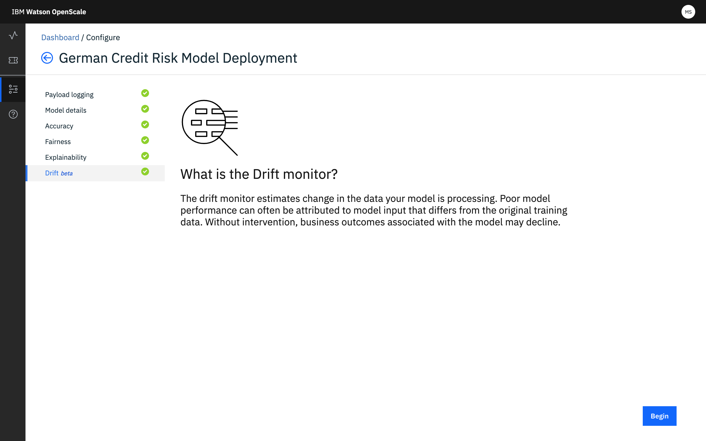
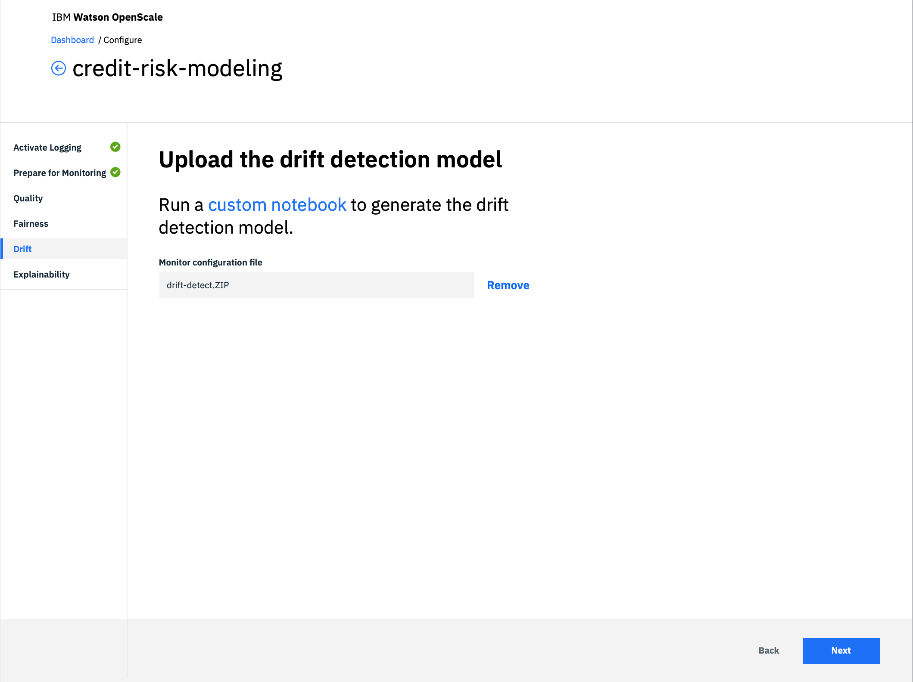

---

copyright:
  years: 2018, 2019
lastupdated: "2019-06-28"

keywords: accuracy, 

subcollection: ai-openscale

---

{:shortdesc: .shortdesc}
{:external: target="_blank" .external}
{:tip: .tip}
{:important: .important}
{:note: .note}
{:pre: .pre}
{:codeblock: .codeblock}
{:download: .download}
{:screen: .screen}
{:javascript: .ph data-hd-programlang='javascript'}
{:java: .ph data-hd-programlang='java'}
{:python: .ph data-hd-programlang='python'}
{:swift: .ph data-hd-programlang='swift'}
{:faq: data-hd-content-type='faq'}

# 配置漂移偵測監視器
{: #behavior-drift-config}

您必須先配置 {{site.data.keyword.aios_full}} 漂移監視器，它才會開始分析您的模型。您有兩個選項，看是訓練模型或者使用記事本。
{: shortdesc}

如果您使用 {{site.data.keyword.pm_full}}，且您的資料不超過 500 MB，則可以使用 {{site.data.keyword.aios_short}} 來線上訓練模型。否則，必須使用記事本來訓練模型。

## 在 {{site.data.keyword.aios_short}} 中配置漂移的步驟
{: #behavior-drift-config-steps-wos}

如果您使用 {{site.data.keyword.pm_full}}，您可以選擇使用 {{site.data.keyword.aios_short}} 使用者介面來配置漂移偵測。

1. 從**漂移**標籤，在**何謂漂移？**頁面中，按一下**開始**，啟動配置處理程序。

   

2. 按一下**在 Watson OpenScale 中訓練**圖磚。

   

3. 設定警示臨界值。

   

3. 設定樣本大小。

   
   
3. 按一下**儲存**。

## 使用記事本來配置漂移的步驟
{: #behavior-drift-config-steps-ntbk}

如果您使用的是 {{site.data.keyword.pm_full}} 以外的機器學習提供者（例如 Microsoft Azure、Amazon SageMaker 或自訂機器學習引擎），您必須使用記事本來配置漂移偵測。同樣地，也可以使用此方法來配置 {{site.data.keyword.pm_full}} 的漂移。

如果訓練資料不是儲存在 Db2 或 {{site.data.keyword.cos_full}} 中，這個選項很有幫助。使用記事本時，您必須將訓練資料讀取到資料框架中。接著，特殊化記事本（可從 {{site.data.keyword.aios_short}} 下載）會建立特殊化輸出，且您可以將它上傳至 {{site.data.keyword.aios_short}}。

1. 建立記事本，來產生漂移偵測模型。請使用 {{site.data.keyword.aios_short}} 使用者介面提供的[樣本記事本](https://github.com/IBM-Watson/aios-data-distribution/blob/master/training_statistics_notebook.ipynb)。
2. 請使用壓縮軟體，將漂移偵測模型壓縮成 .tar.gz 檔。

1. 從**漂移**標籤，在**何謂漂移？**頁面中，按一下**開始**，啟動配置處理程序。

   

2. 按一下**在記事本中訓練**圖磚。

   

3. 將壓縮後的模型檔拖曳至目標區域，或是瀏覽並選取它，並按**下一步**。

   
   
3. 上傳漂移偵測模型，並按**下一步**。

   
   
3. 設定警示臨界值。

   

3. 設定樣本大小。

   
   
3. 按一下**儲存**。

## 後續步驟
{: #behavior-drift-config-next-steps}

- 閱讀[利用 IBM Watson OpenScale 瞭解模型漂移](https://medium.com/@manish.bhide/4c5401aa8da4)，以增加您的漂移 IQ
