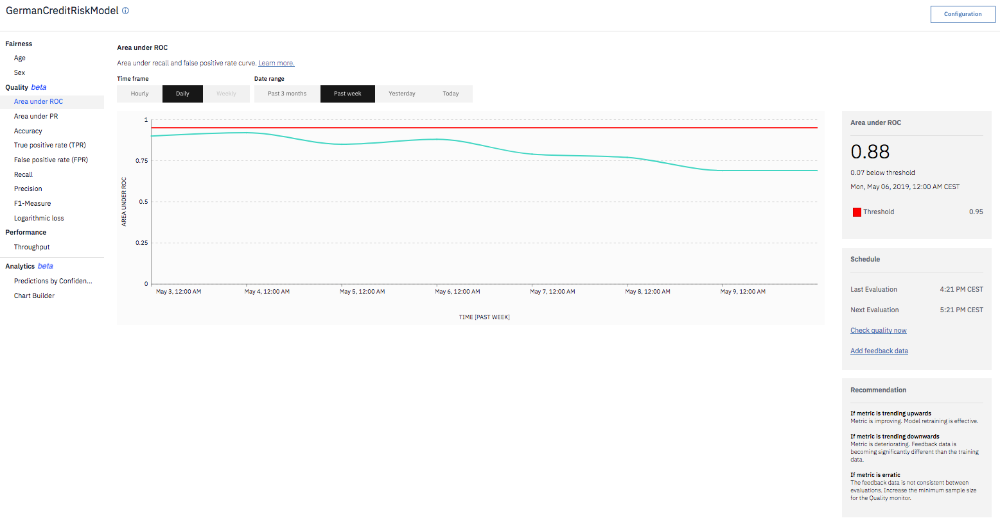

---

copyright:
  years: 2018, 2019
lastupdated: "2019-06-28"

keywords: metrics, monitoring, custom metrics, thresholds

subcollection: ai-openscale

---

{:shortdesc: .shortdesc}
{:external: target="_blank" .external}
{:tip: .tip}
{:important: .important}
{:note: .note}
{:pre: .pre}
{:codeblock: .codeblock}
{:download: .download}
{:screen: .screen}
{:javascript: .ph data-hd-programlang='javascript'}
{:java: .ph data-hd-programlang='java'}
{:python: .ph data-hd-programlang='python'}
{:swift: .ph data-hd-programlang='swift'}
{:faq: data-hd-content-type='faq'}

# 品質度量概觀
{: #anlz_metrics}

使用品質監視來判斷模型預測輸出結果的準確程度。當啟用品質監視時，依預設，它會每小時產生一組度量。您可以藉由按一下**立即檢查品質**按鈕或利用 Python 用戶端，以隨需應變方式產生這些度量。
{: shortdesc}

品質度量是根據下列資訊來計算：

- 手動標示的回饋資料
- 這些資料的受監視部署回應

為了進行適當的監視，回饋資料必須定期記載至 {{site.data.keyword.aios_short}}。您可以利用「新增回饋資料」選項或使用 Python 用戶端或 REST API 來提供回饋資料。

對於 {{site.data.keyword.aios_short}} 以外的機器學習引擎，例如 Microsoft Azure ML Studio、Microsoft Azure ML Service 或 Amazon Sagemaker ML，品質監視會在受監視部署上建立其他評分要求。
{: note}

您可以在 {{site.data.keyword.aios_short}} 儀表板上檢閱一段時間的所有度量值：

如果要檢閱相關明細（例如，適用於某些度量的二進位和多類別分類混淆矩陣），請按一下圖表。

## 支援的品質度量
{: #anlz_metrics_supqualdets}

{{site.data.keyword.aios_short}} 支援下列品質度量：

- [ROC 下方的區域](https://test.cloud.ibm.com/docs/services/ai-openscale?topic=ai-openscale-quality_roc)
- [PR 下方的區域](https://test.cloud.ibm.com/docs/services/ai-openscale?topic=ai-openscale-quality-area-pr)
- [可解釋變異比例](https://test.cloud.ibm.com/docs/services/ai-openscale?topic=ai-openscale-quality_var)
- [絕對平均值誤差](https://test.cloud.ibm.com/docs/services/ai-openscale?topic=ai-openscale-quality_abserror)
- [均方誤差](https://test.cloud.ibm.com/docs/services/ai-openscale?topic=ai-openscale-quality_squerror)
- [R 平方](https://test.cloud.ibm.com/docs/services/ai-openscale?topic=ai-openscale-quality_r_squared)
- [均方誤差的根](https://test.cloud.ibm.com/docs/services/ai-openscale?topic=ai-openscale-supqualdets_squ_errors_mean)
- [精確度](https://test.cloud.ibm.com/docs/services/ai-openscale?topic=ai-openscale-accuracy-opener)
- [加權真肯定率 (wTPR)](https://test.cloud.ibm.com/docs/services/ai-openscale?topic=ai-openscale-quality-wtpr)
- [真肯定率 (TPR)](https://test.cloud.ibm.com/docs/services/ai-openscale?topic=ai-openscale-quality_tpr)
- [加權誤肯定率 (wFPR)](https://test.cloud.ibm.com/docs/services/ai-openscale?topic=ai-openscale-quality_wfpr_weighted)
- [誤肯定率 (FPR)](https://test.cloud.ibm.com/docs/services/ai-openscale?topic=ai-openscale-quality_fpr_false)
- [加權查全率](https://test.cloud.ibm.com/docs/services/ai-openscale?topic=ai-openscale-quality_weighted_recall)
- [查全率](https://test.cloud.ibm.com/docs/services/ai-openscale?topic=ai-openscale-quality_recall)
- [加權查準率](https://test.cloud.ibm.com/docs/services/ai-openscale?topic=ai-openscale-quality_wgth_prec)
- [查準率](https://test.cloud.ibm.com/docs/services/ai-openscale?topic=ai-openscale-quality_precision)
- [加權 F1 測量](https://test.cloud.ibm.com/docs/services/ai-openscale?topic=ai-openscale-quality_wght_f1-measure)
- [F1-Measure](https://test.cloud.ibm.com/docs/services/ai-openscale?topic=ai-openscale-quality_f1-measr)
- [對數損失](https://test.cloud.ibm.com/docs/services/ai-openscale?topic=ai-openscale-quality_log_loss)

## 支援的品質詳細資料
{: #anlz_metrics_supqualdets_suppr_dets}

{{site.data.keyword.aios_short}} 支援品質度量的下列詳細資料：

### 混淆矩陣
{: #anlz_metrics_supqualdets_confusion-quickovr}

混淆矩陣可協助您瞭解受監視的部署回應對於您的哪些回饋資料是正確的，哪些是不正確的。

如需相關資訊，請參閱[混淆矩陣](/docs/services/ai-openscale?topic=ai-openscale-it-conf-mtx)。

## 後續步驟

- 在 {{site.data.keyword.aios_short}} 偵測到品質方面的問題（例如：精確度臨界值違規）之後，您必須建置新版本的模型，來修正問題。在回饋表格中使用手動標示的資料時，除了原始的訓練資料，還必須重新訓練模型。

