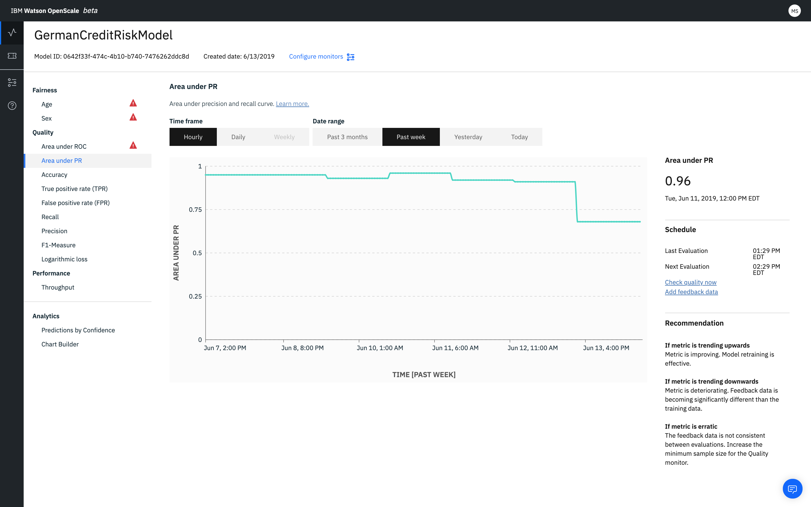

---

copyright:
  years: 2018, 2019
lastupdated: "2019-06-24"

keywords: metrics, monitoring, custom metrics, thresholds, Area under PR

subcollection: ai-openscale

---

{:shortdesc: .shortdesc}
{:external: target="_blank" .external}
{:tip: .tip}
{:important: .important}
{:note: .note}
{:pre: .pre}
{:codeblock: .codeblock}
{:download: .download}
{:screen: .screen}
{:javascript: .ph data-hd-programlang='javascript'}
{:java: .ph data-hd-programlang='java'}
{:python: .ph data-hd-programlang='python'}
{:swift: .ph data-hd-programlang='swift'}
{:faq: data-hd-content-type='faq'}

# Area under PR 
{: #quality-area-pr}

Area under Precision Recall gives the area under the precision and recall curve, which can be useful when classes are particularly imbalanced.
{: shortdesc}

## Area under PR at a glance
{: #quality-area-pr-glance}

- **Description**: Area under precision and recall curve
- **Default thresholds**: Lower limit = 80%
- **Default recommendation**:
   - **Upward trend**: An upward trend indicates that the metric is improving. This means that model retraining is effective.
   - **Downward trend**: A downward trend indicates that the metric is deteriorating. Feedback data is becoming significantly different than the training data.
   - **Erratic or irregular variation**: An erratic or irregular variation indicates that the feedback data is not consistent between evaluations. Increase the minimum sample size for the Quality monitor.
- **Problem type**: Binary classification
- **Chart values**: Last value in the time frame
- **Metrics details available**: Confusion matrix

## Interpreting the display
{: #quality-area-pr-display}




## Do the math
{: #quality-area-pr-math}

Area under Precision Recall gives the total for both `Precision + Recall`.

Precision (P) is defined as the number of true positives (Tp) over the number of true positives plus the number of false positives (Fp).

```
               number of true positives
Precision =   ______________________________________________________

              (number of true positives + number of false positives)
```

Recall (R) is defined as the number of true positives (Tp) over the number of true positives plus the number of false negatives (Fn).

```
            number of true positives
Recall =   ______________________________________________________

           (number of true positives + number of false negatives)
```
