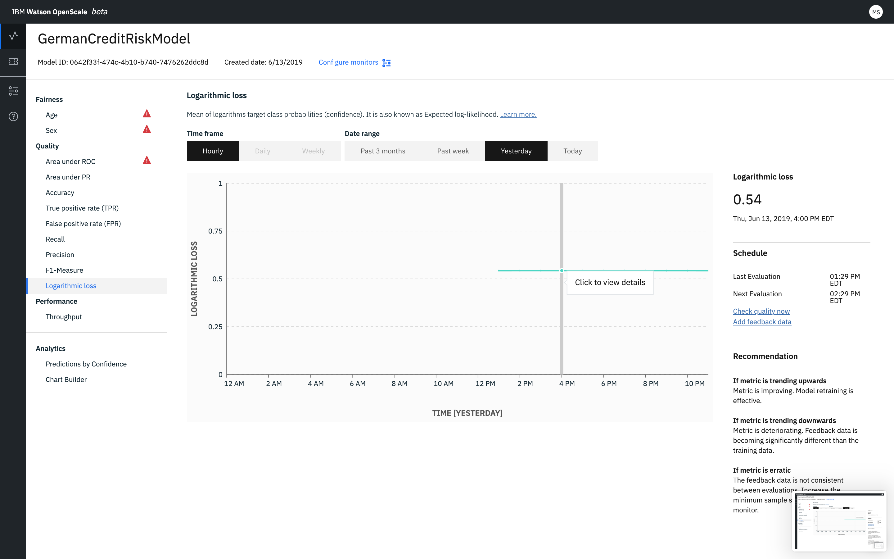

---

copyright:
  years: 2018, 2019
lastupdated: "2019-06-24"

keywords: fairness, fairness monitor, payload, perturbation, training data, debiased, Logarithmic loss

subcollection: ai-openscale

---

{:shortdesc: .shortdesc}
{:external: target="_blank" .external}
{:tip: .tip}
{:important: .important}
{:note: .note}
{:pre: .pre}
{:codeblock: .codeblock}
{:download: .download}
{:screen: .screen}
{:javascript: .ph data-hd-programlang='javascript'}
{:java: .ph data-hd-programlang='java'}
{:python: .ph data-hd-programlang='python'}
{:swift: .ph data-hd-programlang='swift'}
{:faq: data-hd-content-type='faq'}

# Logarithmic loss 
{: #quality_log_loss}

Logarithmic loss gives the mean of logarithms target class probabilities (confidence). It is also known as Expected log-likelihood and is an effective measure of model performance.
{: shortdesc}

## Logarithmic loss at a glance
{: #quality_log_loss-glance}

- **Description**: Mean of logarithms target class probabilities (confidence). It is also known as Expected log-likelihood.
- **Default thresholds**: Lower limit = 80%
- **Default recommendation**:
   - **Upward trend**: An upward trend indicates that the metric is improving. This means that model retraining is effective.
   - **Downward trend**: A downward trend indicates that the metric is deteriorating. Feedback data is becoming significantly different than the training data.
   - **Erratic or irregular variation**: An erratic or irregular variation indicates that t The feedback data is not consistent between evaluations. Increase the minimum sample size for the Quality monitor.
- **Problem type**: Binary classification and multiclass classification
- **Chart values**: Last value in the time frame
- **Metrics details available**: None

## Interpreting the display
{: #quality_log_loss-display}



## Do the math
{: #quality_log_loss-math}

For a binary model, Logarithmic loss is calculated by using the following formula:

```
-(y log(p) + (1-y)log(1-p))
```

where p = true label and y = predicted probability

For a multi-class model, Logarithmic loss is calculated by using the following formula:

```
  M
-SUM Yo,c log(Po,c)
 c=1 
```

where M > 2, p = true label, and y = predicted probability
