---

title: Trust and transparency for your machine learning models with AI OpenScale
description: Monitor your machine learning deployments for bias, accuracy, and explainability
duration: 120
intro: In this extended tutorial, you will provision IBM Cloud machine learning and data services, create and deploy machine learning models in Watson studio, and configure the new IBM AI OpenScale product to monitor your models for trust and transparency.
takeaways:
- See how AI OpenScale provides trust and transparency for AI models
- Understand how IBM Cloud services and Watson Studio technologies can provide a seamless, AI-driven customer experience

copyright:
  years: 2018
lastupdated: "2018-10-10"

---

# Tutorial

## Prerequisites

To complete this tutorial, you will need:

- A [Watson Studio](https://dataplatform.ibm.com/) account.
- An [{{site.data.keyword.Bluemix_notm}}](https://console.bluemix.net/) account

During the tutorial, you will provision the following Lite (free) {{site.data.keyword.Bluemix_notm}} Services:

- Machine Learning
- Apache Spark
- Object Storage
- You will also provision the following **paid** {{site.data.keyword.Bluemix_notm}} Services:
    - Db2 Warehouse
    - PostgreSQL

## Introduction

In this tutorial, you will:

- Provision {{site.data.keyword.Bluemix_notm}} machine learning and storage services, and upload sample data
- Set up a Watson Studio project, and run a Python notebook to create, train and deploy a machine learning model
- Run Python notebooks to create data to monitor
- Configure and explore trust, transparency and explainability monitoring for your model

## Provision {{site.data.keyword.Bluemix_notm}} Services

Login to your [{{site.data.keyword.Bluemix_notm}} account](https://console.bluemix.net) with your IBM ID.

### Provision a Machine Learning service

- If you do not already have a Machine Learning service associated with your account, click the **Create Resource** button or the **Catalog** menu item, then filter on "Machine Learning" and click the **Machine Learning** tile:

  
  
- Give your service a name, choose the Lite (free) plan, and click the **Create** button.

- Make note of the Machine Learning service credentials. In your machine learning instance, click on the **Service credentials** link on the left-hand side of the page. Name the credential and click **Add**. Then, from the list of credentials, click **View credential** and copy the JSON object for later use.

### Provision a Spark service

- If you do not already have a Spark service associated with your account, click the **Catalog** button from the top menu, filter on "Spark", and click the **Apache Spark** tile:

  
  
- Assign your service a name, choose the Lite (free) plan, and click the **Create** button.

- Make note of the service credentials for your Spark instance. Open your Spark instance and click on **Service credentials** in the left-hand menu. Click the **New credential** button, name your credentials, and click **Add**. Then, click the **View credentials** link next to the set you just created, and copy this JSON object for later use.

### Provision an Object Storage service

- If you do not already have an Object Storage service associated with your account, click the **Catalog** button from the top menu, filter on "object storage", and click the **Object Storage** tile:

  
  
- Give your service a name, choose the Lite (free) plan, and click the **Create** button.

### Provision a paid PostgreSQL service

- If you do not already have a PostgreSQL service associated with your account, click the **Catalog** button from the top menu, filter on "postgres", and click the **Compose for PostgreSQL** tile:

  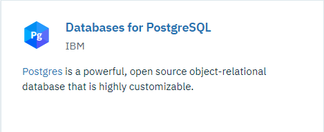
  
- Give your service a name, choose the Standard plan, and click the **Create** button.

- Make note of the service credentials for your PostgreSQL instance. Open your existing (or newly-created) PostgreSQL instance and click on **Service credentials** in the left-hand menu. Click the **New credential** button, name your credentials, and click **Add**. Then, click the **View credentials** link next to the set you just created, and copy this JSON object for later use.

### Provision a paid Db2 Warehouse service

- If you do not already have a Db2 Warehouse service associated with your account, click the **Catalog** button from the top menu, filter on "db2", and click the **Db2 Warehouse** tile:

  
  
- Give your service a name, choose the Entry plan, and click the **Create** button.

- Make note of the service credentials for your Db2 Warehouse instance. Open your existing (or newly-created) Db2 Warehouse instance and click on **Service credentials** in the left-hand menu. Click the **New credential** button, name your credentials, and click **Add**. Then, click the **View credentials** link next to the set you just created, and copy this JSON object for later use.

### Upload training and feedback data to Db2 Warehouse

- Download the [car_rental_feedback_data.csv](https://raw.githubusercontent.com/watson-developer-cloud/doc-tutorial-downloads/master/ai-openscale/car_rental_feedback_data.csv) and [car_rental_training_data.csv](https://raw.githubusercontent.com/watson-developer-cloud/doc-tutorial-downloads/master/ai-openscale/car_rental_training_data.csv) files.

- Open your existing (or newly-created) Db2 Warehouse from the [IBM Cloud console](https://console.bluemix.net), click **Manage** from the left side panel, and then click the green **Open** button.

- Once Db2 Warehouse has opened, click the **Menu** button and select **Load** from the dropdown:

  
  
- Browse to the feedback data file, or drag and drop it into the appropriate area on the form. Click **Next**. Select a Schema from the list of load targets; this is usually in a format like `DASH12345`. Then click **New Table** on the right:

  
  
- Name your table CAR\_RENTAL\_FEEDBACK, and click the **Create** button:

  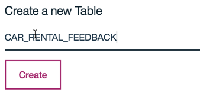
  
- Click **Next** to preview the data. On the preview screen, set the **Separator** field to a semicolon (;) and make sure the **Header in first row** option is checked:

  

  **NOTE**: By default, the **Detect data types** option is selected.
  
  

  When selected, for columns set with the `VARCHAR` data type, the maximum number of characters allowed for that column is automatically determined by the largest data point uploaded for that column. If you expect that future data for a table column may exceed the automatically-determined maximum, simply unselect the **Detect data types** option, and edit the maximum column value manually.

  

- The feedback data should now be displaying correctly in columns. Click **Next** to continue, and then click **Begin Load** to load the data.

- When the data has finished loading, repeat the same steps to load the training data file, naming it CAR\_RENTAL\_TRAINING.

### Provision {{site.data.keyword.aios_short}}

- Click the **Catalog** link and filter on "OpenScale". Select the tile for {{site.data.keyword.aios_short}}:

  
  
- Give your service a name, select the Lite plan, and click **Create**. You will configure {{site.data.keyword.aios_short}} after setting up models for it to monitor.

## Set up a Watson Studio project

- Login to your [Watson Studio account](https://dataplatform.ibm.com/). Click the account avatar icon in the upper right and verify that the account you are using is the same account you used to create your {{site.data.keyword.Bluemix_notm}} services:

  

- In Watson Studio, begin by creating a new project. Select the **Complete** tile and click **Create**:

  
  
- Give your project a name and description, make sure the Object Storage service you created in the previous step is selected in the **Storage** dropdown, and click **Create**.

### Associate your {{site.data.keyword.Bluemix_notm}} Services with your Watson project

- Open your Watson Studio project and select the **Settings** tab. In the **Associated Services** section, click the **Add service** dropdown and select **Watson**:

  
  
- Click the **Add** link on the **Machine Learning** tile and select the **Existing** tab. Choose the service you created in the previous section from the **Existing Service Instance** dropdown and click **Select**.

- From the project settings tab, select **Add service** again and choose **Spark** from the dropdown. From the **Existing** tab, choose the Spark service you created and click **Select**.

### Add the Spark notebook to your Watson Studio project

- Download the following file:

    - [CARS4U-Action-Recommendation-Spark.ipynb](https://raw.githubusercontent.com/watson-developer-cloud/doc-tutorial-downloads/master/ai-openscale/CARS4U-Action-Recommendation-Spark.ipynb)

- In Watson Studio, select the **Assets** tab of your project, scroll down to the **Notebooks** section, and click the **New Notebook** button:

  
  
- Select the **From file** tab of the menu, and give your notebook a name:

  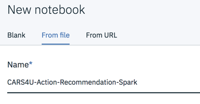
  
- In the **Select runtime** section, choose the Spark instance you created earlier from the dropdown list:

  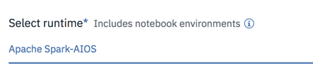
  
- Click **Create Notebook**.

### Edit and run the Action Recommendation Spark Notebook

- From the **Assets** tab in your Watson Studio project, click the **Edit** icon next to the `CARS4U-Action-Recommendation-Spark` notebook to edit it. In section 2 and section 4.2, replace the Db2 Warehouse credentials with the ones you created in the previous section, and ensure that the table name for the training data matches the one you created when loading the .CSV files.

- In section 4, replace the Watson Machine Learning credentials with the ones you created in the previous section.

- In section 6.1, replace the Spark credentials with the ones you created in the previous section.

- Once you have entered your credentials, your notebook is ready to run. Click the **Kernel** menu item, and select **Restart and Run All** from the menu:

  
  
  This will create, train and deploy the **CARS4U - Action Recommendation Model** in your project.

## Configure {{site.data.keyword.aios_short}}

### Connect {{site.data.keyword.aios_short}} to your machine learning model

Now that the machine learning model has been deployed, you can configure {{site.data.keyword.aios_short}} to ensure trust and transparency with your models.

- From the [{{site.data.keyword.Bluemix_notm}} Dashboard](https://console.bluemix.net/dashboard/apps), scroll down to the **Services** section and click on the instance of {{site.data.keyword.aios_short}} you provisioned. Select the **Manage** tab and click the **Get Started** button. The {{site.data.keyword.aios_full}} Getting Started page opens; click **Begin**.

- {{site.data.keyword.aios_short}} will ask for a connection to a PostgreSQL deployment. Select the one you created earlier from the **Database** dropdown, and choose the **public** schema:

  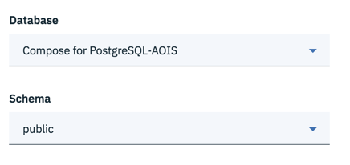
  
- Click **Next**. You will now select your instance of Watson Machine Learning from the dropdown, and click **Next** again.

- You are now able to select which deployed models will be monitored by {{site.data.keyword.aios_short}}. Check the model you created and deployed; click **Next** to accept this:

  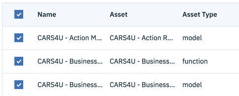
  
- Save the configuration and, when prompted, click the **Continue with Configuration** button.

### Configure Fairness monitoring

- Select your Action model tile and click **Begin**:

  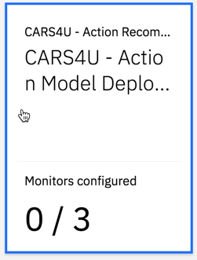
  
- There are three areas to configure. Begin by selecting **Fairness** and clicking **Begin**. You can read a description of Fairness before clicking **Next** to continue.

<!---
- Specify the location of the model training data by selecting **Db2** from the **Location** dropdown and filling out the remaining fields with the Db2 credentials created earlier before clicking **Next**.

- Once the database is connected, select your schema and the training data table in the dropdowns, then click **Next**. Note that the data in the table should be in the format expected by the scoring endpoint, with an additional column containing the prediction values:

  

--->

- Now, you must specify which column from the table contains prediction values. In this case, it's the **Action** column, so select that one and click **Next**.

- You may now choose which features to monitor. In this example, we'll monitor the **Gender** feature for bias. Click on the **Gender** tile and click **Next**.

- {{site.data.keyword.aios_short}} works to detect bias against a protected group in comparison to a reference group. For this example, add the value "Male" to the **Reference group**, and the value "Female" to the **Protected group**, and click **Next**:

  
  
- You may now assign a fairness threshold. You will see an alert on your operations dashboard if the fairness rating falls below this threshold. Click **Next** to leave it set at the default of 80%.

- You will now select favorable and unfavorable prediction values from the payload logging database. {{site.data.keyword.aios_short}} has automatically detected which column in the payload logging data contains the prediction values; those values are 0 (for no customer service action taken) or 1 - 3 (corresponding to follow-up actions, vouchers or discounts). Add these values to the form and click **Next**:

  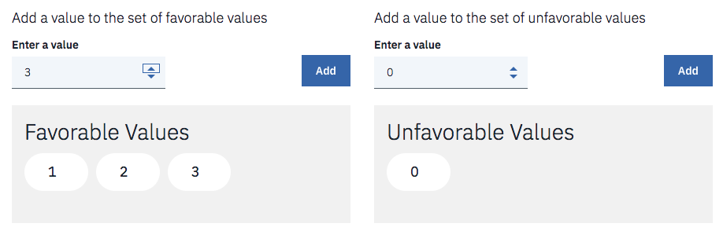
  
- Use the slider to adjust the minimum sample size to 400, then click  **Next**. Review your choices, and then click **Save**.

### Configure accuracy monitoring

- Continue to **Accuracy** and click **Begin**. You can read a description of Accuracy before clicking **Next** to continue.

- Select the Spark instance that you configured in a previous step from the dropdown list and click **Next**.

- Next, select the model type. There are four possible outcomes from the model, so select **Multiclass Classification** from the dropdown and click **Next**:

  
  
- Next, set the accuracy threshold. Click **Next** to leave it at the default 80%. Use the slider to adjust the minimum sample size to 400, then click  **Next**.

- You can review your choices before clicking **Save** to finalize them.

### Configure explainability monitoring

- Continue to **Explainability** and click **Begin**. You can read a description of Explainability before clicking **Next** to continue.

- First, select the type of data the deployment analyzes. The model receives numeric/categorical data, so select that option from the dropdown and click **Next**.

<!---
- The training data is located in the Db2 Warehouse instance created earlier. Add the credentials in the form, **Test** the connection, and then click **Next**.

- To identify the location of the training table, set the schema to your Db2 Warehouse username, set the table to **CAR\_RENTAL\_TRAINING**, and click **Next**:

  

--->

- Next, select the **Action** column, as it contains the prediction values from the machine learning service, and click **Next**.

- All of the data columns are inputs to the model. Select all inputs and click **Next**:

  
  
- For categorical features, neither **ID**, **Children**, **Age**, nor **Satisfaction** contained text, so click **Next** without selecting any. Review your input and click **Save**.

- You have finished configuring {{site.data.keyword.aios_short}}. It will now monitor your models and provide real-time bias detection, accuracy, and explainability. In the next steps, you will provide sample data for it to analyze.

## Connect your databases to Watson Studio

- From the **Assets** tab in your Watson Studio project, click the **Add to project** button and select **Connection** from the dropdown:

  
  
- A list of your {{site.data.keyword.Bluemix_notm}} Services will appear. Select the Db2 instance you created earlier, and the click **Create**. You can now add the data from this database to your project. Click **Add to project** again, and selected **Connected assets**:

  
  
- Click the **Select source** link and choose your Db2 Warehouse instance, schema, and the CAR\_RENTAL\_FEEDBACK table, then click **Select**.
  
  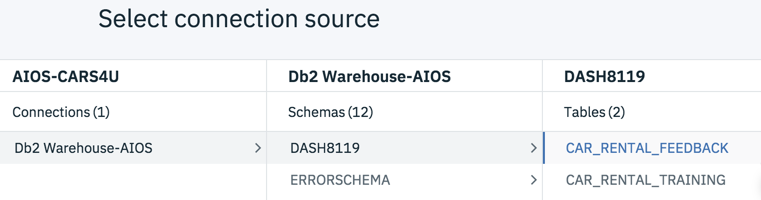

- Give your asset a name, then click **Create**. Repeat the same steps to add the CAR\_RENTAL\_TRAINING table as well.

- Now add the PostgreSQL database. In your Watson Studio project, click **Add to project** and select **Connection**.

- Select your PostgreSQL instance by connecting to the **Compose for PostgreSQL** service option, and providing the credentials to your service:

  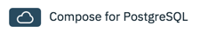
  
- Now add the payload logging table from PostgreSQL to Watson Studio.  First, find the deployment ID for your Action model. From the **Deployments** tab of your Watson Studio project, click the **CARS4U - Action Model Deployment** link. On the **Overview** tab, scroll down and make note of the model ID:

  

- From the **Assets** tab of your Watson Studio project, click **Add to project** and select **Connected assets** from the dropdown. Click the **Select source** button and choose your PostgreSQL instance and the **public** schema.

- The payload logs are named _Payload\_\<model id\>_. Locate the one that matches the Action Model Deployment. Click **Select**, give the table a memorable name like "Action Model Payload", and click **Create**:

  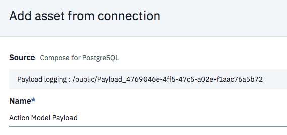
  
- With the action model payload added as a data asset within Watson Studio, it's now easy to share, visualize and analyze. The payload table is currently empty. Next, you will provide some data for your model to analyze.

## Provide a set of sample data to your model

- When configuring {{site.data.keyword.aios_short}}, you set the threshold for fairness and accuracy monitoring to 400 requests. No data will appear in the dashboard until this threshold is met. You can generate these requests all at once by feeding the training data back to the model for scoring.

- To do this, you will need the scoring endpoint URL for your Action Model. From the **Deployments** tab of your Watson Studio project, click the **CARS4U - Action Model Deployment** link, click the **Implementation** tab, and then copy the Scoring End-point for your model:

  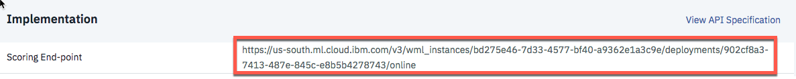

- Next, download [this sample data iPython notebook](https://raw.githubusercontent.com/watson-developer-cloud/doc-tutorial-downloads/master/ai-openscale/CARS4U-Sample-Data-Generation.ipynb) to your machine, and then add it to your Watson Studio project by clicking the **New notebook** link from the **Notebook** section of the **Assets** tab.

- Select **From file**, choose the "CARS4U-Sample-Data-Generation.ipynb" file, and select the **Default Python 3.5 Free** runtime from the dropdown. Click **Create Notebook**.

- Once the notebook has opened, update the first code cell with your Db2 Warehouse **dsn** and **username** credentials. Then update the second code cell with your WML credentials, and the scoring end-point URL for the Action Model deployment.

- Run both code cells of the notebook. Each time you run the second code cell, nearly 500 payloads will be sent to your model for scoring. Run this cell enough to exceed the threshold you set for monitoring.

## Provide a set of sample feedback data to your model

- To enable monitoring for accuracy, you must retrain and redeploy your model with feedback data; no accuracy data will appear in the dashboard until this is done. You can generate these requests all at once by feeding sample feedback data to the model for scoring.

- To do this, you will need your {{site.data.keyword.aios_short}} credentials. Perform the following steps using the {{site.data.keyword.Bluemix_notm}} [command console](https://console.bluemix.net/docs/cli/index.html#overview):

    - Get your API key

      ```curl
      bx login --sso
      bx iam api-key-create 'my_key'
      ```
    - Get your {{site.data.keyword.aios_short}} instance ID

      ```curl
      bx resource service-instance '<Your_AI_OpenScale_instance_name>'
      ```
      **Note**: If you are using the {{site.data.keyword.Bluemix_notm}} command console on Windows, replace the single quotes (') in the above commands with double quotes (").

- Download [this sample feedback data iPython notebook](https://raw.githubusercontent.com/watson-developer-cloud/doc-tutorial-downloads/master/ai-openscale/CARS4U-Sample-Feedback-Generation.ipynb) to your machine, and then add it to your Watson Studio project by clicking the **New notebook** link from the **Notebook** section of the **Assets** tab.

- Select **From file**, choose the "CARS4U-Sample-Feedback-Generation.ipynb" file, and select the **Default Python 3.5 Free** runtime from the dropdown. Click **Create Notebook**.

- Once the notebook has opened, update the fourth code cell with your {{site.data.keyword.aios_short}} credentials. Proceed through the notebook and, for all items marked as **ACTION:**, enter the appropriate data for your {{site.data.keyword.Bluemix_notm}} services and credentials.

- Once you have entered all your services and credentials, your notebook is ready to run. Click the **Kernel** menu item, and select **Restart and Run All** from the menu:

  
  
  This will retrain and provide feedback data to your model.

## View the explainability for a model transaction

From the **Assets** tab of your Watson Studio project, click on the **Action Model Payload** link in the **Data Assets** section. There should now be at least 482 rows of payload data. Expand the _scoring\_id_ column horizontally, and copy one of the identifiers to your clipboard:

  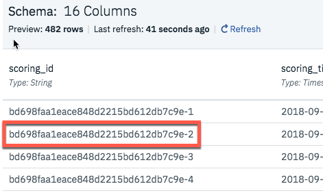
  
Using the [AI OpenScale dashboard](https://aiopenscale.cloud.ibm.com/aiopenscale/), click on the **Explainability** button:
  
  
  
Paste the value you copied from the _scoring\_id_ column into the search box and press **Return** on your keyboard:

  
  
You will now see an explanation of how the model arrived at its conclusion, including how confident the model was, the factors that contributed to the confidence level, and the attributes fed to the model.

  
