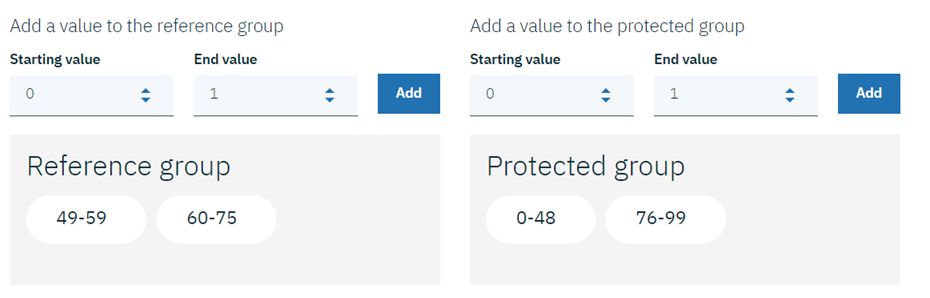
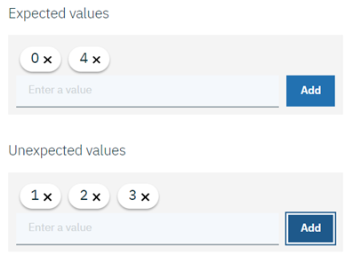

---

title: Trust and transparency for your machine learning models with AI OpenScale
description: Monitor your machine learning deployments for bias, accuracy, and explainability
duration: 120
intro: In this extended tutorial, you will provision IBM Cloud machine learning and data services, create and deploy machine learning models in Watson studio, and configure the new IBM AI OpenScale product to monitor your models for trust and transparency.
takeaways:
- See how AI OpenScale provides trust and transparency for AI models
- Understand how IBM Cloud services and Watson Studio technologies can provide a seamless, AI-driven customer experience

copyright:
  years: 2018
lastupdated: "2018-10-22"

---

# Tutorial

## Scenario
A biomedical company that produces heart drugs has collected data about a set of patients, all of whom suffered from the same illness. During their course of treatment, each patient responded to one of five medications. The presented model uses this data to predict the drug it believes to be the best choice for the patient.

## Prerequisites

To complete this tutorial, you will need:

- A [Watson Studio](https://dataplatform.ibm.com/) account.
- An [{{site.data.keyword.Bluemix_notm}}](https://console.bluemix.net/) account

During the tutorial, you will provision the following Lite (free) {{site.data.keyword.Bluemix_notm}} Services:

- Machine Learning
- Apache Spark
- Object Storage
- Db2 Warehouse

You will also provision the following **paid** {{site.data.keyword.Bluemix_notm}} Service:

- PostgreSQL

  **Note**: A $200 {{site.data.keyword.Bluemix_notm}} credit can be obtained by converting to a paid account with a credit card.

**Important**: The PostgreSQL database and Watson Machine Learning instance must be deployed in the same {{site.data.keyword.Bluemix_notm}} account.

If you have already provisioned the necessary services, proceed to [Upload training data to Db2 Warehouse](tutorial.html#upload-training-data-to-db2-warehouse) below.

## Introduction

In this tutorial, you will:

- Provision {{site.data.keyword.Bluemix_notm}} machine learning and storage services, and upload sample data
- Set up a Watson Studio project, and create, train and deploy a machine learning model
- Configure and explore trust, transparency and explainability monitoring for your model

## Provision {{site.data.keyword.Bluemix_notm}} Services

Login to your [{{site.data.keyword.Bluemix_notm}} account](https://console.bluemix.net) with your IBM ID.

### Create a Watson Studio account

- If you do not already have a Watson Studio instance associated with your account, click the **Create Resource** button or the **Catalog** menu item, then filter on "Watson Studio" and click the **Watson Studio** tile:

  
  
- Give your service a name, choose the Lite (free) plan, and click the **Create** button.

### Provision a Machine Learning service

- If you do not already have a Machine Learning service associated with your account, click the **Create Resource** button or the **Catalog** menu item, then filter on "Machine Learning" and click the **Machine Learning** tile:

  
  
- Give your service a name, choose the Lite (free) plan, and click the **Create** button.

### Provision a Spark service

- If you do not already have a Spark service associated with your account, click the **Catalog** button from the top menu, filter on "Spark", and click the **Apache Spark** tile:

  
  
- Assign your service a name, choose the Lite (free) plan, and click the **Create** button.

### Provision an Object Storage service

- If you do not already have an Object Storage service associated with your account, click the **Catalog** button from the top menu, filter on "object storage", and click the **Object Storage** tile:

  
  
- Give your service a name, choose the Lite (free) plan, and click the **Create** button.

### Provision a paid PostgreSQL service

- If you do not already have a PostgreSQL service associated with your account, click the **Catalog** button from the top menu, filter on "postgres", and click the **Compose for PostgreSQL** tile:

  
  
- Give your service a name, choose the Standard plan, and click the **Create** button.

  **Note**: A $200 {{site.data.keyword.Bluemix_notm}} credit can be obtained by converting to a paid account with a credit card.

### Provision a Db2 Warehouse service

- If you do not already have a Db2 Warehouse service associated with your account, click the **Catalog** button from the top menu, filter on "db2 warehouse", and click the **Db2 Warehouse** tile:

  
  
- Give your service a name, choose the Entry plan, and click the **Create** button.

### Upload training data to Db2 Warehouse

- Download the [drug_train_data_updated.csv](https://raw.githubusercontent.com/watson-developer-cloud/doc-tutorial-downloads/master/ai-openscale/drug_train_data_updated.csv) file. Be sure to save the file download as a .CSV file.

- Open your existing (or newly-created) Db2 Warehouse from the [IBM Cloud console](https://console.bluemix.net), click **Manage** from the left side panel, and then click the green **Open** button.

- Once Db2 Warehouse has opened, click the **Menu** button and select **Load** from the dropdown:

  
  
- Browse to the training data file, or drag and drop it into the appropriate area on the form. Click **Next**. Select a Schema from the list of load targets; this is usually in a format like `DASH12345`. Then click **New Table** on the right:

  
  
- Name your table HEART\_DRUG\_TRAINING, and click the **Create** button:

  
  
- Click **Next** to preview the data. On the preview screen, set the **Separator** field to a semicolon (;) and make sure the **Header in first row** option is checked:

  
  
- The training data should now be displaying correctly in columns. Click **Next** to continue, and then click **Begin Load** to load the data.

## Set up a Watson Studio project

- Login to your [Watson Studio account](https://dataplatform.ibm.com/). Click the account avatar icon in the upper right and verify that the account you are using is the same account you used to create your {{site.data.keyword.Bluemix_notm}} services:

  

- In Watson Studio, begin by creating a new project. Select the "New project" icon, select the **Complete** tile, and click **Create**:

  
  
- Give your project a name and description, make sure the Object Storage service you created in the previous step is selected in the **Storage** dropdown, and click **Create**.

### Associate your {{site.data.keyword.Bluemix_notm}} Services with your Watson project

- Open your Watson Studio project and select the **Settings** tab. Scroll down to the **Associated Services** section, click the **Add service** dropdown and select **Watson**:

  
  
- Click the **Add** link on the **Machine Learning** tile and select the **Existing** tab. Choose the service you created in the previous section from the **Existing Service Instance** dropdown and click **Select**.

- From the project settings tab, select **Add service** again and choose **Spark** from the dropdown. From the **Existing** tab, choose the Spark service you created and click **Select**.

### Add the `Best Heart Drug Selection` model

- In Watson Studio, select the **Assets** tab of your project, scroll down to the **Watson Machine Learning Models** section, and click the **New Watson Machine Learning model** button.
  
- Select the **From sample** button of the *Select model type* menu, and select the `Best Heart Drug Selection` model:

  
  
- Click **Create**.

### Deploy the `Best Heart Drug Selection` model

- From the **Assets** tab in your Watson Studio project, click the `drug-selection` model you just created.

- Click the *Deployments* tab, then select **Add deployment**.

- Enter `drug-select-deploy` as the name for your deployment, and select the **Web service** deployment type.

- Click **Save**.

## Configure {{site.data.keyword.aios_short}}

### Provision {{site.data.keyword.aios_short}}

- If you have not already provisioned an instance of {{site.data.keyword.aios_short}}, click the **Catalog** link from your {{site.data.keyword.Bluemix_notm}} account, and filter on "OpenScale". Select the tile for {{site.data.keyword.aios_short}}:

  
  
- Give your service a name, select the Lite plan, and click **Create**.

### Connect {{site.data.keyword.aios_short}} to your machine learning model

Now that the machine learning model has been deployed, you can configure {{site.data.keyword.aios_short}} to ensure trust and transparency with your models.

- From the [{{site.data.keyword.Bluemix_notm}} Dashboard](https://console.bluemix.net/dashboard/apps), scroll down to the **Services** section and click on the instance of {{site.data.keyword.aios_short}} you provisioned. Select the **Manage** tab and click the **Get Started** button. The {{site.data.keyword.aios_full}} Getting Started page opens; click **Begin**.

- {{site.data.keyword.aios_short}} will ask for a connection to a PostgreSQL deployment. Select the one you created earlier from the **Database** dropdown, and choose the **public** schema:

  

- Click **Next**. You will now select your instance of Watson Machine Learning from the dropdown, and click **Next** again.

- You are now able to select which deployed models will be monitored by {{site.data.keyword.aios_short}}. Check the model you created and deployed; click **Next** to accept this:

  
  
- Save the configuration and, when prompted, click the **Continue with Configuration** button.

### Configure Fairness monitoring

- Select your model tile and click **Begin**:

  
  
- There are three areas to configure. Begin by selecting **Fairness** and clicking **Begin**. You can read a description of Fairness before clicking **Next** to continue.

<!---
- Specify the location of the model training data by selecting **Db2** from the **Location** dropdown and filling out the remaining fields with the Db2 credentials created earlier before clicking **Next**.

- Once the database is connected, select your schema and the training data table in the dropdowns, then click **Next**. Note that the data in the table should be in the format expected by the scoring endpoint, with an additional column containing the prediction values:

  

--->

- Now, you must specify which column from the table contains prediction values. In this case, it's the **Drug** column, so select that one and click **Next**.

- You may now choose which features to monitor. In this example, we'll monitor the **Age** and **Sex** features for bias. Click on the **Age** and **Sex** tiles, and click **Next**.

- {{site.data.keyword.aios_short}} works to detect bias against a protected group in comparison to a reference group. For the current **Age** example, add the values "49-59" and "60-75" to the **Reference group**, and the values "0-48" and "76-99" to the **Protected group**, and click **Next**:

  

- You may now assign a fairness threshold for **Age**. You will see an alert on your operations dashboard if the fairness rating falls below this threshold. Click **Next** to leave it set at the default of 80%.

- Now, add the value "M" (male) to the **Reference group**, and the value "F" (female) to the **Protected group**, and click **Next**:

  
  
- Click **Next** to leave the threshold for **Sex** at the default of 80%.

- You will now select favorable and unfavorable prediction values from the payload logging database. {{site.data.keyword.aios_short}} has automatically detected which column in the payload logging data contains the prediction values; those values are 0-4 (each number corresponding to one of five drugs the model predicts). Add these values to the form and click **Next**:

  
  
- Use the slider to adjust the minimum sample size to 100, then click  **Next**. Review your choices, and then click **Save**.

  **Note**: For purposes of this tutorial, the minimum sample size has been set to 100. Normally, a larger sample size is recommended to ensure the sample size is not too small to skew results.

### Configure accuracy monitoring

- Continue to **Accuracy** and click **Begin**. You can read a description of Accuracy before clicking **Next** to continue.

- Select the Spark instance that you configured in a previous step from the dropdown list and click **Next**.

- Next, select the model type. There are four possible outcomes from the model, so select **Multiclass Classification** from the dropdown and click **Next**:

  
  
- Next, set the accuracy threshold. Click **Next** to leave it at the default 80%. Use the slider to adjust the minimum sample size to 40, then click  **Next**.

  **Note**: For purposes of this tutorial, the minimum sample size has been set to 40. Normally, a larger sample size is recommended to ensure the sample size is not too small to skew results.

- You can review your choices before clicking **Save** to finalize them.

### Configure explainability monitoring

- Continue to **Explainability** and click **Begin**. You can read a description of Explainability before clicking **Next** to continue.

- First, select the type of data the deployment analyzes. The model receives numeric/categorical data, so select that option from the dropdown and click **Next**.

<!---
- The training data is located in the Db2 Warehouse instance created earlier. Add the credentials in the form, **Test** the connection, and then click **Next**.

- To identify the location of the training table, set the schema to your Db2 Warehouse username, set the table to **CAR\_RENTAL\_TRAINING**, and click **Next**:

  

- Next, select the **Action** column, as it contains the prediction values from the machine learning service, and click **Next**.

--->

- All of the data columns, except "DRUG", are inputs to the model. Select all inputs except "DRUG" and click **Next**:

  
  
- For categorical features, neither **Age**, **NA**, nor **K** contained text, so click **Next** without selecting any. Review your input and click **Save**.

- You have finished configuring {{site.data.keyword.aios_short}}. It will now monitor your models and provide real-time bias detection, accuracy, and explainability. In the next steps, you will provide sample data for it to analyze.

## Connect your databases to Watson Studio

- From the **Assets** tab in your Watson Studio project, click the **Add to project** button and select **Connection** from the dropdown:

  
  
- A list of your {{site.data.keyword.Bluemix_notm}} Services will appear. Select the Db2 instance you created earlier, and the click **Create**. You can now add the data from this database to your project. Click **Add to project** again, and selected **Connected assets**:

  
  
- Click the **Select source** link and choose your Db2 Warehouse instance, schema, and the HEART\_DRUG\_TRAINING table, then click **Select**.
  
  

- Give your asset a name, then click **Create**.

- Now add the PostgreSQL database. In your Watson Studio project, click **Add to project** and select **Connection**.

- Select the PostgreSQL instance you created earlier and click **Create**.
  
- Now add the payload logging table from PostgreSQL to Watson Studio.  First, find the deployment ID for your model. From the **Deployments** tab of your Watson Studio project, click the **drug-select-deploy** link. On the **Overview** tab, scroll down and make note of the model ID:

  

- From the **Assets** tab of your Watson Studio project, click **Add to project** and select **Connected assets** from the dropdown. Click the **Select source** button and choose your PostgreSQL instance and the **public** schema.

- The payload logs are named _Payload\_\<model id\>_. Locate the one that matches the drug-selection model. Click **Select**, give the table a name, and click **Create**:

  
  
- With the model payload added as a data asset within Watson Studio, it's now easy to share, visualize and analyze. The payload table is currently empty. Next, you will provide some data for your model to analyze.

## Provide a set of sample data to your model

- When configuring {{site.data.keyword.aios_short}}, you set the threshold for fairness and accuracy monitoring to 100 requests. No data will appear in the dashboard until this threshold is met. You can generate these requests all at once by feeding the training data back to the model for scoring.

- To do this, download the [drug_train_data.json](https://raw.githubusercontent.com/watson-developer-cloud/doc-tutorial-downloads/master/ai-openscale/drug_train_data.json) file.

- From the **Deployments** tab of your Watson Studio project, click the **drug-select-deploy** link, click the **Test** tab, and select the JSON input icon.

  

- Now, open the `drug_train_data.json` file you downloaded, and copy the contents to the JSON field in the **Test** tab. Click the **Predict** button to send and score training payloads to your model.

  

## Provide a set of sample feedback data to your model

- To enable monitoring for accuracy, you must retrain and redeploy your model with feedback data; no accuracy data will appear in the dashboard until this is done. You can generate these requests all at once by feeding sample feedback data to the model for scoring.

- Download the [drug_feedback_data.csv](https://raw.githubusercontent.com/watson-developer-cloud/doc-tutorial-downloads/master/ai-openscale/drug_feedback_data.csv) file.

- In Watson Studio, select the **Assets** tab, then scroll down and select the "drug-selection" model under the **Watson Machine Learning** section.

- Select the **Evaluation** tab. Scroll down to the "Performance Monitoring" section, and select **Edit configuration**.

- Set the value for both "Auto retrain" and "Auto deploy" to `Always`, and click **Save**.

  
  
- Now, click the **Add feedback data** button, and select the `drug_feedback_data.csv` you downloaded. Click the **New evaluation** button when prompted.

  

  This will retrain and provide feedback data to your model.

## View the explainability for a model transaction

From the **Assets** tab of your Watson Studio project, click on the model payload link in the **Data Assets** section. There should now be at least 181 rows of payload data. Expand the _scoring\_id_ column horizontally, and copy one of the identifiers to your clipboard:

  
  
Using the [AI OpenScale dashboard](https://aiopenscale.cloud.ibm.com/aiopenscale/), click on the **Explainability** button:
  
  
  
Paste the value you copied from the _scoring\_id_ column into the search box and press **Return** on your keyboard:

  
  
You will now see an explanation of how the model arrived at its conclusion, including how confident the model was, the factors that contributed to the confidence level, and the attributes fed to the model.

  

## Next steps

- Change the **Age** and **Sex** values of the Fairness monitor, or add additional parameters such as **Cholesterol** (Reference Group="Normal", Protected Group="Low" and "High"). Then provide the sample data and sample feedback again to see how this may change the Fairness and Accuracy measurements.

- See the [Working with monitored data](insight-timechart.html) topic for more information.
