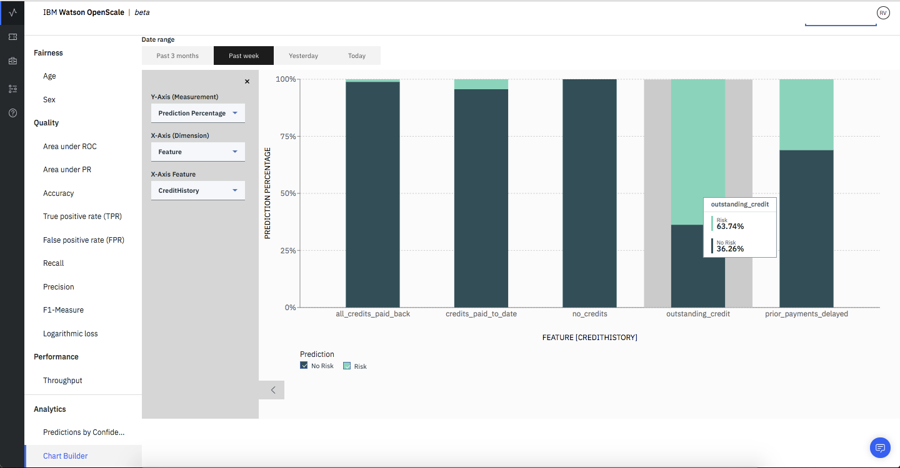

---

copyright:
  years: 2018, 2019
lastupdated: "2019-09-09"

keywords: fairness, fairness monitor, payload, perturbation, training data, debiased

subcollection: ai-openscale

---

{:shortdesc: .shortdesc}
{:external: target="_blank" .external}
{:tip: .tip}
{:important: .important}
{:note: .note}
{:pre: .pre}
{:codeblock: .codeblock}
{:download: .download}
{:screen: .screen}
{:javascript: .ph data-hd-programlang='javascript'}
{:java: .ph data-hd-programlang='java'}
{:python: .ph data-hd-programlang='python'}
{:swift: .ph data-hd-programlang='swift'}
{:faq: data-hd-content-type='faq'}

# Chart builder 
{: #chart_builder}

Use the {{site.data.keyword.aios_short}} chart builder to create custom visualizations, so you can better understand model predictions and inputs at runtime. The chart builder provides an ability to view the output of the model’s prediction against the features or data ranges that a business considers important. It helps uncover new trends in the data which may prompt the business and data science teams to consider changes to the AI model. 
{: shortdesc}

For example, if you're familiar with our credit risk model from the tutorials, you can see the split in predicted classes for different ranges of the attribute Credit History. 

   
      
   You can also see how confident the model is, when predicting for these ranges of Credit History. You can analyze the scoring payload that is sent to your deployment in the selected data range by custom chart (selecting between features, prediction classes and confidence).

   
   
