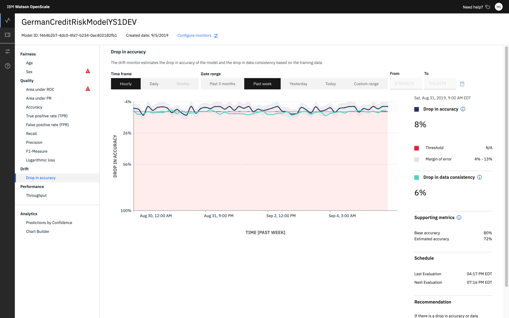
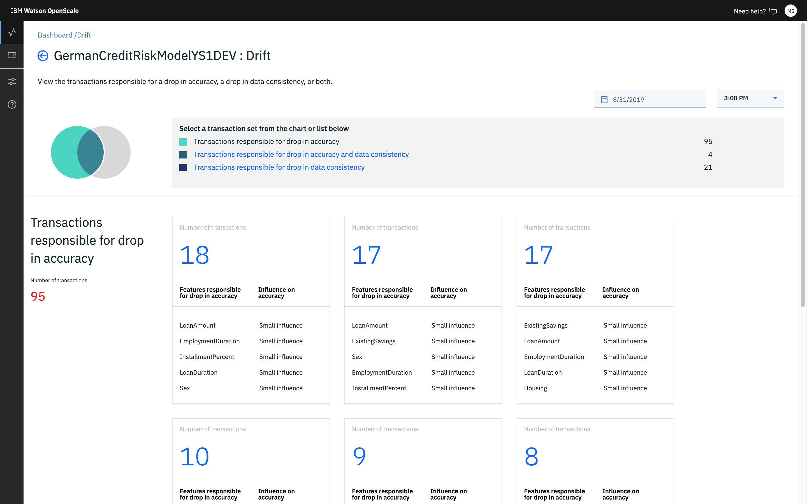
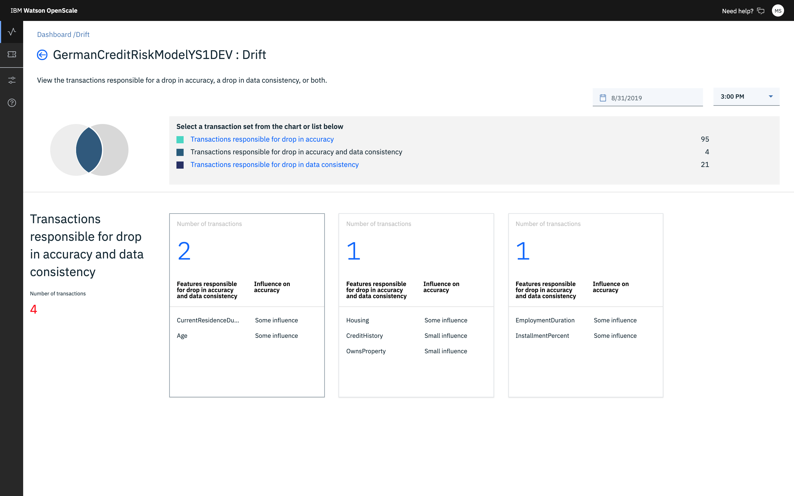
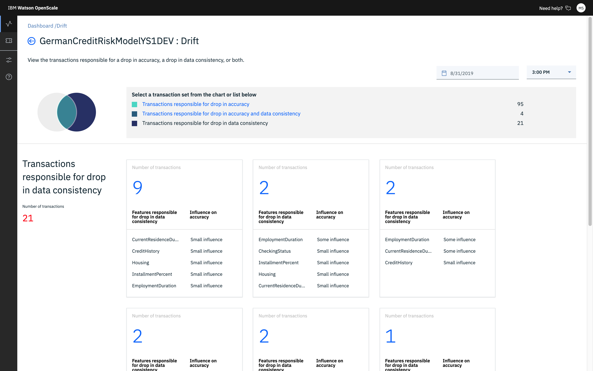

---

copyright:
  years: 2018, 2019
lastupdated: "2019-09-09"

keywords: drift, behavior, metrics

subcollection: ai-openscale

---

{:shortdesc: .shortdesc}
{:external: target="_blank" .external}
{:tip: .tip}
{:important: .important}
{:note: .note}
{:pre: .pre}
{:codeblock: .codeblock}
{:download: .download}
{:screen: .screen}
{:javascript: .ph data-hd-programlang='javascript'}
{:java: .ph data-hd-programlang='java'}
{:python: .ph data-hd-programlang='python'}
{:swift: .ph data-hd-programlang='swift'}
{:faq: data-hd-content-type='faq'}

# Drift in accuracy
{: #behavior-drift-ovr}

Over time, the importance and impact of certain features in a model change. This affects the associated applications and resulting business outcomes. Through the drift detection, {{site.data.keyword.aios_short}} provides a way to track model metrics, model performance, and the way in which feature weights change over time. As data changes, the ability of your model to make accurate predictions may deteriorate. Drift magnitude is the extent of the degradation of predictive performance over time. Use the information about drift to take corrective action.
{: shortdesc}

## Understanding drift detection
{: #behavior-drift-understand}

Drift is the degradation of predictive performance over time because of hidden context. As your data changes over time, the ability of your model to make accurate predictions may deteriorate. {{site.data.keyword.aios_short}} both detects and highlights drift so that you can take corrective action. Watch the following video to see drift detection in action:

  

<iframe class="embed-responsive-item" id="WOS-ibm-drift-vid" title="Watch Watson OpenScale detect and mitigate drift" type="text/html" src="https://cdnapisec.kaltura.com/p/1773841/sp/177384100/embedIframeJs/uiconf_id/27941801/partner_id/1773841?iframeembed=true&playerId=ibm-dynid-1_playercontainer&entry_id=1_8tp11bp7&flashvars[streamerType]=auto" width="560" height="395" allowfullscreen webkitallowfullscreen mozAllowFullScreen allow="autoplay *; fullscreen *; encrypted-media *" frameborder="0"></iframe>

  

&nbsp;

### How it works
{: #behavior-drift-works}

{{site.data.keyword.aios_short}} analyzes all transactions to find the ones that contribute to accuracy drift. It then groups the transactions based on the similarity of each feature's contribution to the drift in accuracy.

### Do the math
{: #behavior-drift-math}

Every three hours, {{site.data.keyword.aios_short}} analyzes each transaction to estimate if the model prediction is accurate. If the model prediction is inaccurate, the transaction is marked as drifted. The Estimated accuracy is then calculated as the fraction of non-drifted transactions to the total number of transactions analyzed. The Base accuracy is the accuracy of the model on the training data. {{site.data.keyword.aios_short}} calculates the extent of the drift in accuracy as the difference between Base accuracy and Estimated accuracy. Further, {{site.data.keyword.aios_short}} analyzes all the drifted transactions; and then, groups transactions based on the similarity of each feature's contribution to the drift in accuracy. In each cluster, {{site.data.keyword.aios_short}} also estimates the important features that played a major role in the drift in accuracy and classifies their feature impact as large, some, and small. 

### Drift visualization
{: #behavior-drift-display}

The drift visualization includes both graphical and numeric statistical data:

By clicking the chart, you can display specific transactions that contribute to drift. The top reasons for detected drift display and includes a natural-language description of the observation as well as a list of unexpected values.

Specifically, from the **Select a transaction set from the chart or list below** section, you can choose the following views:

- Transactions responsible for drop in accuracy
  
  The following example shows transactions that are responsible for drop in accuracy and data consistency for the German Credit Risk sample model:
  
  

- Transactions responsible for drop in accuracy and data consistency
   
  The following example shows transactions that are responsible for drop in accuracy and data consistency for the German Credit Risk sample model:
  
  
  
- Transactions responsible for drop in data consistency
  
  The following example shows transactions that are responsible for drop in accuracy and data consistency for the German Credit Risk sample model:
  
  

The following example shows transactions that are responsible for drop in accuracy and data consistency for the German Credit Risk sample model:

Drift transactions are available in the transaction details screen, where you can click **Explain** to understand how a specific transaction has made it into the drift category:

## Next steps

- For information on how to set up drift detection, see [Configuring the drift detection monitor](/docs/services/ai-openscale?topic=ai-openscale-behavior-drift-config).
- To mitigate drift, after it has been detected by Watson OpenScale, you must build a new version of the model that fixes the problem. A good place to start is with the data points that are highlighted as reasons for the drift. Introduce the new data to the predictive model after you have manually labeled the drifted transactions and use them to re-train the model.

