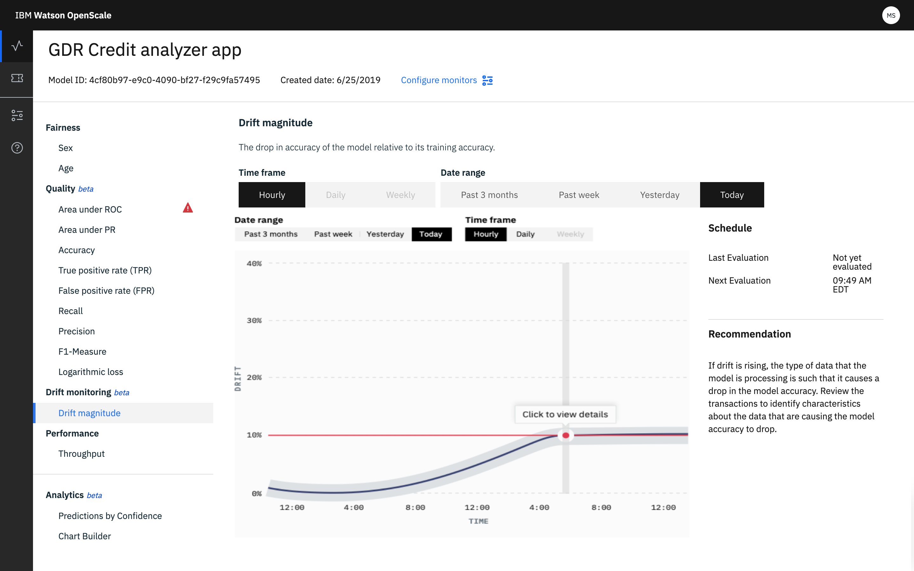

---

copyright:
  years: 2018, 2019
lastupdated: "2019-06-28"

keywords: drift, behavior, metrics

subcollection: ai-openscale

---

{:shortdesc: .shortdesc}
{:external: target="_blank" .external}
{:tip: .tip}
{:important: .important}
{:note: .note}
{:pre: .pre}
{:codeblock: .codeblock}
{:download: .download}
{:screen: .screen}
{:javascript: .ph data-hd-programlang='javascript'}
{:java: .ph data-hd-programlang='java'}
{:python: .ph data-hd-programlang='python'}
{:swift: .ph data-hd-programlang='swift'}
{:faq: data-hd-content-type='faq'}

# Drift magnitude 
{: #behavior-drift-ovr}

Over time, the importance and impact of certain features in a model change. This affects the associated applications and resulting business outcomes. Through drift detection, {{site.data.keyword.aios_short}} provides a way to track model metrics, model performance, and the way in which feature weights change over time. 
{: shortdesc}

## Understanding drift detection
{: #behavior-drift-understand}

Drift is the degradation of predictive performance over time because of hidden context. As your data changes over time, the ability of your model to make accurate predictions may deteriorate. {{site.data.keyword.aios_short}} both detects and highlights drift so that you can take corrective action.

### How it works
{: #behavior-drift-works}

{{site.data.keyword.aios_short}} analyzes all transactions to find the ones that contribute to drift. It then groups the records based on the attribute values that were significant in contributing to drift.

### Do the math
{: #behavior-drift-math}

Every three hours, {{site.data.keyword.aios_short}} calculates drift by analyzing the same training data that has already been analyzed by your predictive model. It then compares the results to the model's predictions. Where there are changes or discrepancies, {{site.data.keyword.aios_short}} calculates the extent of the drift and, based on the threshold that you set, alerts you to the occurrence. 

### Drift visualization
{: #behavior-drift-display}

The drift visualization includes both graphical and numeric statistical data:

By clicking the chart, you can display specific transactions that contribute to drift. The top reasons for detected drift display and includes a natural-language description of the observation as well as a list of unexpected values.

Drift transactions are available in the transaction details screen, where you can click **Explain** to understand how a specific transaction has made it into the drift category:

## Next steps

- For information on how to interpret drift, see [Configuring the drift detection monitor](/docs/services/ai-openscale?topic=ai-openscale-behavior-drift-config)
- Increase your drift IQ by reading [Understanding Model Drift with IBM Watson OpenScale](https://medium.com/@manish.bhide/4c5401aa8da4)