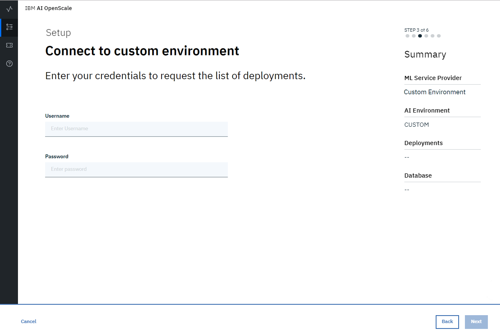

---

copyright:
  years: 2018, 2019
lastupdated: "2019-06-28"

keywords: machine learning, services, ml, custom 

subcollection: ai-openscale

---

{:shortdesc: .shortdesc}
{:external: target="_blank" .external}
{:tip: .tip}
{:important: .important}
{:note: .note}
{:pre: .pre}
{:codeblock: .codeblock}
{:download: .download}
{:screen: .screen}
{:javascript: .ph data-hd-programlang='javascript'}
{:java: .ph data-hd-programlang='java'}
{:python: .ph data-hd-programlang='python'}
{:swift: .ph data-hd-programlang='swift'}
{:faq: data-hd-content-type='faq'}

# Specifying a Custom ML service instance
{: #co-connect}

Your first step in the {{site.data.keyword.aios_short}} tool is to specify a service instance. Your service instance is where you store your AI models and deployments.
{: shortdesc}

## Connect your Custom service instance
{: #co-config}

{{site.data.keyword.aios_short}} connects to AI models and deployments in a service instance. You can connect a custom service

1. From the **Configure** tab, click **Machine learning provider**.

   

2. Select the **Custom environment** tile.

   

3. Enter a name and description for your custom machine learning provider and click **Next**. 

4. Choose whether to connect to your deployments [by requesting a list](/docs/services/ai-openscale?topic=ai-openscale-co-connect#co-config-request-list) or [by entering individual scoring endpoints](/docs/services/ai-openscale?topic=ai-openscale-co-connect#co-config-scoring-endpoints).

   
    
5. Click **Next**.

### Requesting the list of deployments
{: #co-config-request-list}

1. If you selected the **Request the list of deployments** tile, enter your credentials and API Endpoint, then click **Save**.

   

2. After you save your machine learning setup, return to the **Dashboard**, click the **Insights** tab, and then click the **Add deployments** button.

3. Select a deployment from the list and click **Configure**.

You are now ready to configure monitors.

### Providing individual scoring endpoints
{: #co-config-scoring-endpoints}

1. If you selected the **Enter individual scoring endpoints** tile, enter your credentials for the API Endpoint, then click **Save**.

2. After you save your machine learning setup, return to the **Dashboard**, click the **Insights** tab, and then click the **Add deployments** button.

3. Click the **Add Endpoint** button.

4. From the drop-down menu, select the custom environment, type the deployment name and API endpoint, then click **Save**.

You are now ready to configure monitors.

### How it works
{: #co-works}

The following image shows the Custom environment support:


You can also reference the following links:

[{{site.data.keyword.aios_short}} payload logging API](https://{DomainName}/apidocs/ai-openscale#publish-scoring-payload){: external}

[Custom deployment API](https://aiopenscale-custom-deployement-spec.mybluemix.net/){: external}

[Python client binding SDK](http://ai-openscale-python-client.mybluemix.net/#bindings){: external}

[Working with Custom machine Learning engine](https://github.com/pmservice/ai-openscale-tutorials/blob/master/notebooks/AI%20OpenScale%20and%20Custom%20ML%20Engine.ipynb){: external}

[Python SDK for IBM Watson OpenScale](https://pypi.org/project/ibm-ai-openscale/){: external}

- **Input criteria for model to support monitors**

  Your model should take as input a feature vector, which is essentially a collection of named fields and their values (the fields being monitored for bias being one of those fields):

  ```bash
  {
    "fields": [
        "name",
        "age",
        "position"
    ],
    "values": [
        [
            "john",
            33,
            "engineer"
        ],
        [
            "mike",
            23,
            "student"
        ]
    ]
  }
  ```

  In this example, `“age”` could be a field someone is evaluating for fairness.

  If the input is a tensor/matrix, which is transformed from the input feature space (which is often the case in deep learning from text or images), that model cannot be handled by the {{site.data.keyword.aios_short}} platform in the current release. By extension, deep learning models with text or image inputs cannot be handled for bias detection and mitigation.

  Additionally, training data should be loaded to support Explainability.

  For explainability on text, the full text should be one of the features. Explainability on images for a Custom model is not supported in the current release.
  {: note}

- **Output criteria for model to support monitors**

  Your model should output the input feature vector alongside the prediction probabilities of various classes in that model.

  ```bash
  {
    "fields": [
        "name",
        "age",
        "position",
        "prediction",
        "probability"
    ],
    "labels": [
        "personal",
        "camping"
    ],
    "values": [
        [
            "john",
            33,
            "engineer",
            "personal",
            [
                0.6744664422398081,
                0.3255335577601919
            ]
        ],
        [
            "mike",
            23,
            "student"
            "camping",
            [
                0.2794765664946941,
                0.7205234335053059
            ]
        ]
    ]
  }
  ```

  In this example, `"personal”` and `“camping”` are the possible classes, and the scores in each scoring output are assigned to both classes. If the prediction probabilities are missing, bias detection will work, but auto-debias will not.

  The preceding scoring output should be accessible from a live scoring endpoint which {{site.data.keyword.aios_short}} could call over REST. For AzureML, SageMaker, and {{site.data.keyword.pm_full}}, {{site.data.keyword.aios_short}} directly connects to the native scoring endpoints, (so you don’t have to worry about implementing the scoring spec).

### Next steps
{: #co-next}

{{site.data.keyword.aios_short}} is now ready for you to [configure monitors](/docs/services/ai-openscale?topic=ai-openscale-mo-config).
