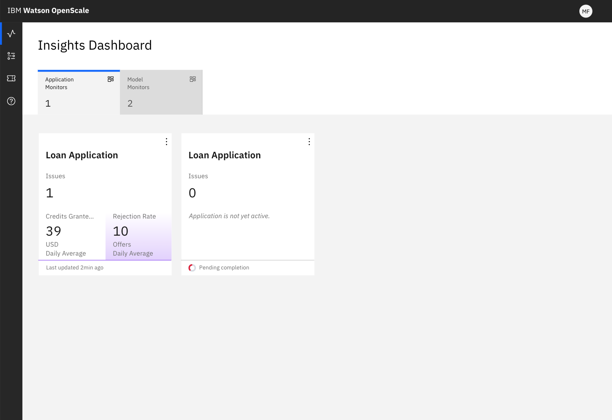

---

copyright:
  years: 2018, 2019
lastupdated: "2019-09-09"

keywords: dashboard, navigating, navigation, insights

subcollection: ai-openscale

---

{:shortdesc: .shortdesc}
{:external: target="_blank" .external}
{:tip: .tip}
{:important: .important}
{:note: .note}
{:pre: .pre}
{:codeblock: .codeblock}
{:download: .download}
{:screen: .screen}
{:javascript: .ph data-hd-programlang='javascript'}
{:java: .ph data-hd-programlang='java'}
{:python: .ph data-hd-programlang='python'}
{:swift: .ph data-hd-programlang='swift'}
{:faq: data-hd-content-type='faq'}

# Getting application insights with {{site.data.keyword.aios_short}} 
{: #io-app-ov}

You can track all the business processes and applications that you are monitoring through the **Applications monitor** tab of the {{site.data.keyword.aios_full}} dashboard.
{: shortdesc}

## Insights
{: #io-app-ins}

The **Applications monitor** tab provides a high-level view of your applications monitors and the associated business key performance indicators.

  

Each tile provides a summary of business KPIs for that application. Note that some application tiles show no values yet, perhaps because either configuration is not finalized yet or business KPI evaluation has not been completed.

## Key performance indicators (KPI) insights
{: #it-ap-ov}

To view details about a KPI, click the application tile, which displays the following information:

- Correlation discovered by {{site.data.keyword.aios_short}} between this KPI and the associated model metrics. Note that for the beta version, only the **Drop in accuracy** metric is supported for model drift monitoring.
- Performance presented as a time series chart

## Next steps
{: #io-app-next}

Get more insights by performing the following tasks:

- [View correlation charts](/docs/services/ai-openscale?topic=ai-openscale-app-perform-vdet).
- [View KPI performance](/docs/services/ai-openscale?topic=ai-openscale-it-appkpi-vdet).

