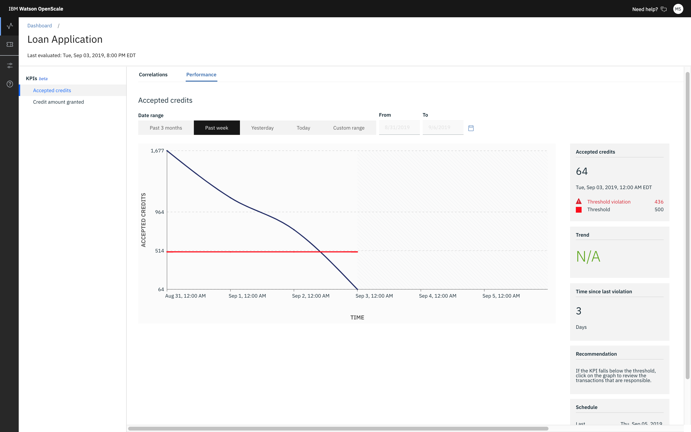
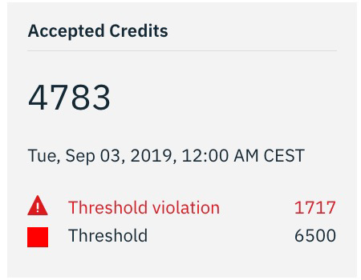
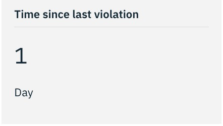
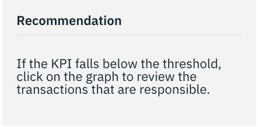
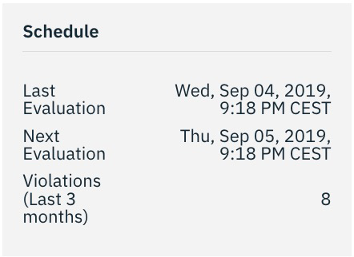
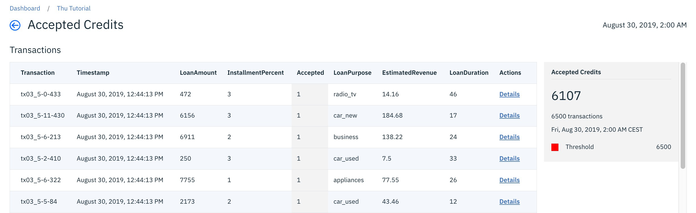
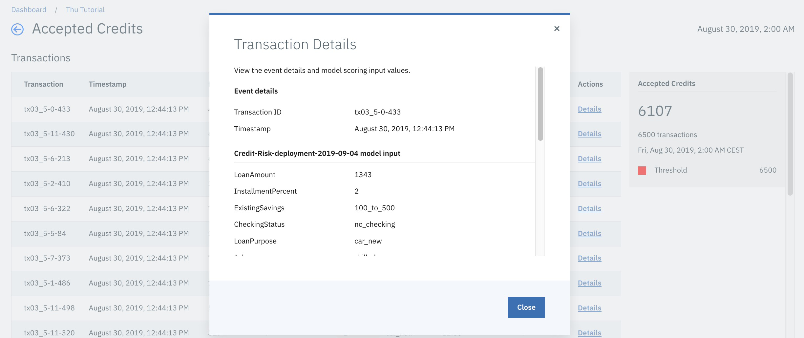

---

copyright:
  years: 2018, 2019
lastupdated: "2019-09-09"

keywords: fairness, monitoring, charts, de-biasing, bias, accuracy

subcollection: ai-openscale

---

{:shortdesc: .shortdesc}
{:external: target="_blank" .external}
{:tip: .tip}
{:important: .important}
{:note: .note}
{:pre: .pre}
{:codeblock: .codeblock}
{:download: .download}
{:screen: .screen}
{:javascript: .ph data-hd-programlang='javascript'}
{:java: .ph data-hd-programlang='java'}
{:python: .ph data-hd-programlang='python'}
{:swift: .ph data-hd-programlang='swift'}
{:faq: data-hd-content-type='faq'}

# KPI performance 
{: #it-appkpi-vdet}

{{site.data.keyword.aios_short}} provides you the ability to explore business KPI performance. Depending on KPI configuration, evaluation happens one time a day, week, or month. KPI evaluation is also triggered each time you upload business event data.
{: shortdesc}

## Step
{: #it-appkpi-vdet-steps-kpi-charts}

From the **Insights** dashboard, on the **Applications monitor** tab, click an application tile to see business KPIs performance and their correlation with that application monitor.
 
## Interpreting the chart
{: #it-appkpi-intp}

On the **Performance** tab, for each business KPI, a chart displays how KPI values change over time. For example, in the following chart you can see that **Number Accepted** and **Daily Revenue** performance indicators display.

Evaluation only includes business event data from a completed time period, such as a day, week, or month, which was not previously evaluated. For this reason business event data must be uploaded in chronological order. If a KPI measurement for a specific point of time is already calculated, it's impossible to recalculate it. It would also be impossible to calculate any KPI measurement for a previous timeframe.   
{: note}

Business events time has to be provided in the timestamp column.

To examine business events included in the KPI measurement at the specific point of time click this point of the chart.  

The following additional information is provided on the chart:

- KPI measurement compared to KPI threshold value

  

  Similar to other metrics, the threshold violation is calculated dynamically based on the selected date and time. For a lower threshold, it is the amount that the value has fallen under the lower threshold. For an upper threshold, it is the amount that the value has risen above the threshold. There is no relation to the count of violations.

- Time since last violation

  

- Recommendation

  

- Schedule

  

## View detail transactions
{: #it-appkpi-intp-details}

View all business events that are included in a specific KPI measurement calculation, which appears in the KPI panel following the list of transactions.

### Step
{: #it-appkpi-intp-details-steps}

To drill down from a business event to related scoring payload, click **Details**. 

## Next steps
{: #it-appkpi-next-steps-done}

- [View correlation charts](/docs/services/ai-openscale?topic=ai-openscale-app-perform-vdet).
